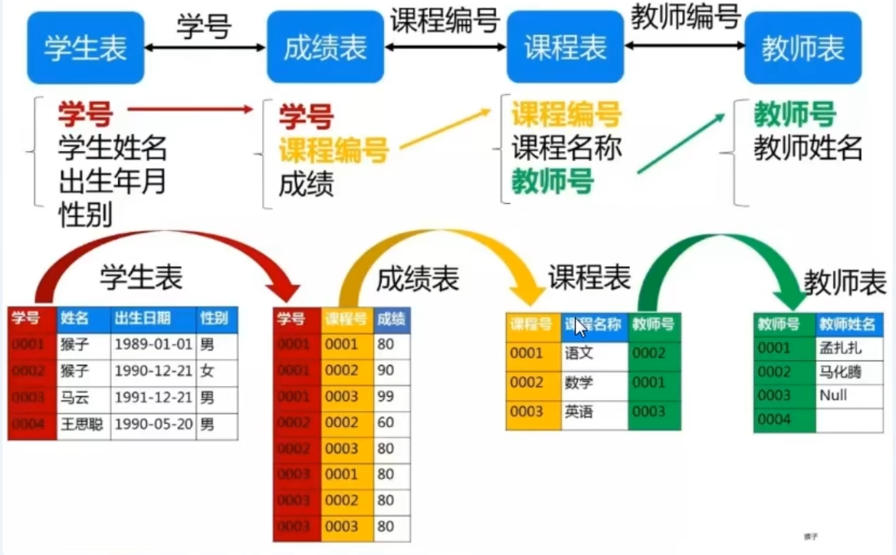
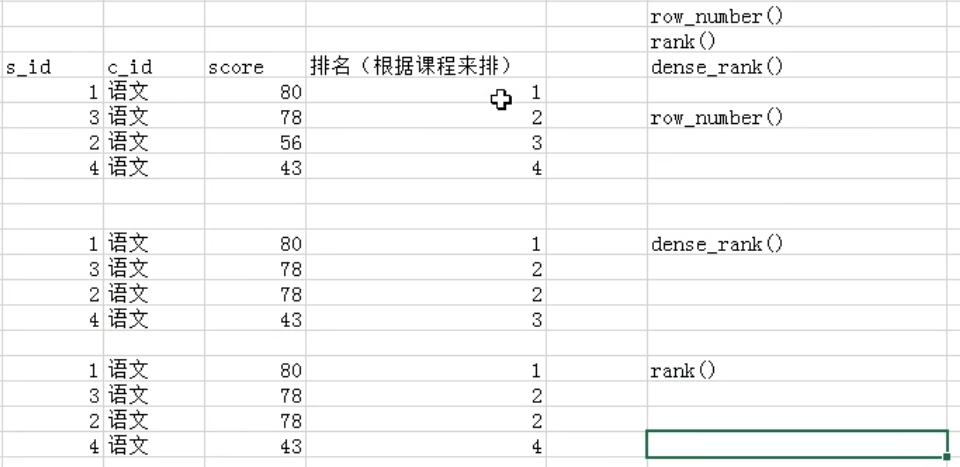

### 一、

#### 查询课程编号为01的课程比02的课程成绩高的所有学生的学号（重要）

```sql

SELECT
	a.* 
FROM
	( SELECT s_id, s_score FROM score WHERE c_id = '01' ) a
	JOIN ( SELECT s_id, s_score FROM score WHERE c_id = '02' ) b ON a.s_id = b.s_id 
WHERE
	a.s_score > b.s_score
	
#自连接
SELECT
	s1.学号 
FROM
	score s1
	JOIN score s2 ON s1.学号 = s2.学号 
WHERE
	s1.课程号 = '01' 
	AND s2.课程号 = '02' 
	AND s1.成绩 > s2.成绩

```

### 二、

#### 查询平均成绩大于60分的学生的学号和平均成绩（重点）

```sql
#1
SELECT
	t.s_id,
	t.avgScore 
FROM
	( SELECT s_id, avg( s_score ) AS avgScore FROM score GROUP BY s_id ) AS t 
WHERE
	t.avgScore > 60
#2
SELECT
	s_id,
	avg( s_score ) 
FROM
	score 
GROUP BY
	s_id 
HAVING
	avg( s_score ) > 60
```

### 三、

#### 查询所有学生的学号、姓名、选课数、总成绩（不重要）

```sql
#1
SELECT
	student.s_id,
	student.s_name,
	IFNULL(t.courseNum,0),
	IFNULL(t.scoreSum,0)
FROM
	student
	LEFT JOIN ( SELECT score.s_id, count( c_id ) AS courseNum, sum( s_score ) AS scoreSum 
               FROM score 
               GROUP BY score.s_id ) AS t 
               ON student.s_id = t.s_id
#2               
SELECT
	a.s_id,
	a.s_name,
	IFNULL( count( b.c_id ), 0 ),
	IFNULL( sum( b.s_score ), 0 ) 
FROM
	student AS a
	LEFT JOIN score AS b 
	ON a.s_id = b.s_id 
GROUP BY
	a.s_id
```

### 四、

#### 查询姓张的老师的个数（不重要）

```sql
select count(t_id) from teacher where t_name like "张%"

#查询老师中有几种姓氏
select count(DISTINCT t_name) from teacher 
```

### 五、

#### 查询没学过张三老师课的学生的学号和姓名(重要)

```sql
SELECT
	student.s_id,
	student.s_name 
FROM
	student 
WHERE
	s_id NOT IN (
	SELECT
		score.s_id 
	FROM
		score
	WHERE
		score.c_id = ( SELECT a.c_id FROM course AS a JOIN teacher AS b ON a.t_id = b.t_id WHERE b.t_name = "张三" ))
```

### 六、

#### 查询学过"张三"老师所教的所有课的同学的学号、姓名（重要）

```sql
#创建张三所代课程的课程号视图 mc
DROP VIEW
IF
	EXISTS mc;
CREATE VIEW mc AS ( SELECT c.c_id FROM course c JOIN teacher t ON c.t_id = t.t_id WHERE t.t_name = '张三' );

#查询选过mc中所有课程的学生学号、姓名
SELECT
	a.s_id,
	st.s_name 
FROM
	( 
		SELECT s_id, count(*) cnt FROM score WHERE c_id IN ( SELECT c_id FROM mc ) GROUP BY s_id 
	) a
	JOIN student st ON a.s_id = st.s_id 
WHERE
	a.cnt = 
	(
		SELECT
			count(*) 
		FROM
			mc
	)
```

### 七、

#### 查询学过编号为"01”的课程并且也学过编号为"02"的课程的学生的学号、姓名（重要）

```sql
SELECT
	st.s_id,
	st.s_name 
FROM
	student st
	JOIN score s 
	ON st.s_id = s.s_id 
WHERE
	s.c_id = "02" 
	AND s.s_id IN 
	(
		SELECT
			s_id 
		FROM
			score 
		WHERE
			c_id = "01"
    )
#自连接 
SELECT
	s1.学号,姓名 
FROM
	score s1
	JOIN score s2 ON s1.学号 = s2.学号
	JOIN student s ON s.学号 = s2.学号 
WHERE
	s1.课程号 = '01' AND s2.课程号 = '02';
```

### 八、

#### 查询课程编号为“02”的总成绩

```sql
select c_id,sum(s_score) from score GROUP BY c_id having c_id = "02"
```

### 九、

#### 查询  所有课程  的成绩都小于60分的学生的学号、姓名

```sql
#1
SELECT
	t1.s_id,
	st.s_name 
FROM
	( SELECT s_id, count( c_id ) cnt1 FROM score WHERE s_score < 60 GROUP BY s_id ) t1
	JOIN ( SELECT s_id, count( c_id ) cnt2 FROM score GROUP BY s_id ) t2 ON t1.s_id = t2.s_id
	JOIN student st ON st.s_id = t1.s_id 
WHERE
	t1.cnt1 = t2.cnt2

#2
SELECT
	st.s_id,
	st.s_name 
FROM
	student st
	JOIN score s ON st.s_id = s.s_id 
GROUP BY
	s_id 
HAVING
	max( s_score ) < 60
```

### 十、

#### 查询没有学全所有课的学生的学号、姓名(重点)

```sql
#注意左连接，因为有 没有选课的学生
SELECT
	st.s_id,
	st.s_name 
FROM
	student as st
	LEFT JOIN score as sc ON st.s_id = sc.s_id 
GROUP BY
	st.s_id 
HAVING
	count( DISTINCT sc.c_id ) < ( SELECT count( c_id ) FROM course )
```

### 十一、

#### 查询至少有一门课与学号为“01”的学生所学课程相同的学生的学号和姓名（重点）

```sql
SELECT
	DISTINCT st.s_id,
	st.s_name	 
FROM
	score sc
	JOIN student st ON sc.s_id = st.s_id 
WHERE
	sc.s_id != "01" 
	AND sc.c_id IN 
	(
		SELECT
			c_id 
		FROM
			score 
		WHERE
			s_id = "01"
    )
```

### 十二、

#### 查询和“01”号同学所学课程完全相同的其他同学的学号(重点，和六相似)

```sql
DROP VIEW IF EXISTS v;
CREATE VIEW v AS ( SELECT c_id FROM score WHERE s_id = "01" );

SELECT
	st.s_id,
	st.s_name 
FROM
	( 
		SELECT s_id, count( DISTINCT c_id ) cnt FROM score WHERE c_id IN ( SELECT c_id FROM v ) GROUP BY s_id 
	) temp
	JOIN student st ON st.s_id = temp.s_id 
WHERE
	temp.cnt = ( SELECT count(*) FROM v ) 
	AND st.s_id != "01"
```

完全相同 / 所有 ，先分组，进行数量统计，然后对数量进行等值判断

### 十三、

#### 查询两门及其以上不及格课程的同学的学号，姓名及其平均成绩（重点）

```sql
SELECT
	sc.s_id,
	st.s_name,
	avg( s_score ) 
FROM
	student st
	JOIN score sc ON st.s_id = sc.s_id 
WHERE
	st.s_id IN ( SELECT s_id FROM score WHERE s_score < 60 GROUP BY s_id HAVING count( DISTINCT c_id )>= 2 ) 
GROUP BY
	s_id
```

### 十四、

#### 检索"01"课程分数小于60，按分数降序排列的学生信息

```sql
SELECT
	st.*,
	sc.s_score 
FROM
	score sc
	JOIN student st ON sc.s_id = st.s_id 
WHERE
	sc.c_id = "01" 
	AND sc.s_score < 60 
ORDER BY
	sc.s_score DESC
```

### 十五、

#### 按平均成绩从高到低显示所有学生的所有课程的成绩以及平均成绩(重点)

```sql
#1
SELECT
	a.s_id,
	a.c_id,
	a.s_score,
	b.avg_score 
FROM
	score a
	JOIN ( SELECT s_id, avg( s_score ) avg_score FROM score GROUP BY s_id ) b ON a.s_id = b.s_id 
ORDER BY
	b.avg_score DESC

#2
SELECT
	s_id "学号",
	max( CASE WHEN c_id = "01" THEN s_score ELSE NULL END ) "语文",
	max( CASE WHEN c_id = "02" THEN s_score ELSE NULL END ) "数学",
	max( CASE WHEN c_id = "03" THEN s_score ELSE NULL END ) "英语",
	max( CASE WHEN c_id = "04" THEN s_score ELSE NULL END ) "化学",
	max( CASE WHEN c_id = "05" THEN s_score ELSE NULL END ) "生物",
	avg( s_score ) "平均成绩" 
FROM
	score 
GROUP BY
	s_id 
ORDER BY
	avg( s_score ) DESC
```

### 十六、

#### 按各科成绩进行排序，并显示排名(重点row_number)

```sql
#窗口函数MySQL8支持
select s_id,c_id,s_score,row_number() over(order by s_score desc) from score
```



### 十七、

#### 查询学生的总成绩并进行排名

```sql
SELECT
	st.s_id,
	st.s_name,
	sum( sc.s_score ) 
FROM
	student st
	JOIN score sc ON st.s_id = sc.s_id 
GROUP BY
	s_id 
ORDER BY
	sum( sc.s_score ) DESC
```

### 十八、

#### 查询不同老师所教不同课程平均分  从高到低显示

```sql
SELECT
	c.c_id,
	t.t_name,
	c.c_name,
	avg( sc.s_score ) 
FROM
	score sc
	JOIN course c ON sc.c_id = c.c_id
	JOIN teacher t ON t.t_id = c.t_id 
GROUP BY
	c.c_id,c.c_name
ORDER BY
	avg( s_score ) DESC
```

