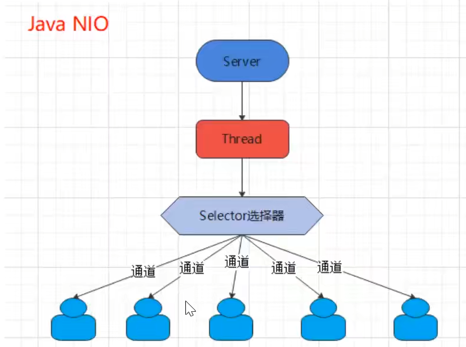
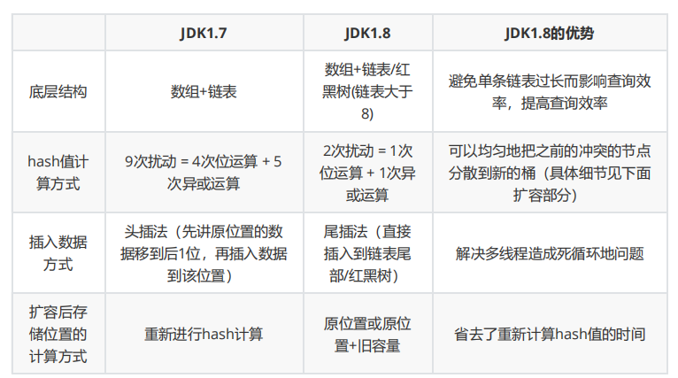
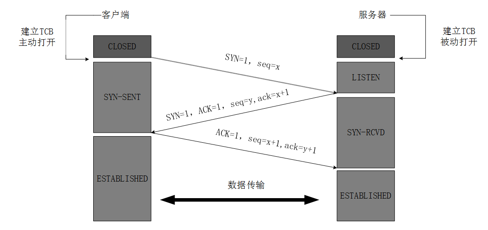
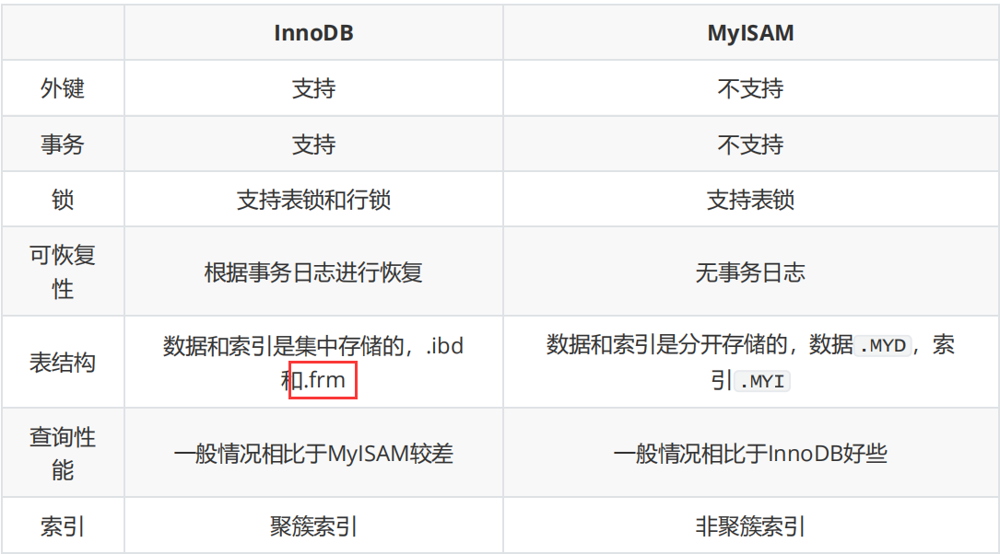

面试官您好，我叫侯程元，来自湖南科技大学的计算机科学与技术专业，目前大三，专业成绩排名前20%，在校期间我自学了Java以及后端技术栈，像Spring、SpringBoot、关系型数据库MySQL、NoSQL数据库Redis，对JVM也有一定的了解。在大学中也通过了软考中级和英语四六级考试。在成都的新希望六和公司有一段Java开发的实习经历，主要负责日常需求的开发和线上问题的排查。

项目经历有三个，第一个是校园交流论坛，基于springboot搭建的一个平台，是类似于CSDN模式的，主要功能就是用户可以在平台上发帖、评论、点赞关注这些功能，我主要负责三个模块，登录注册模块、帖子搜索模块、关注点赞模块。

第二个项目是即刻点评，是餐饮点评软件，能够实现用户点餐、评价、优惠券抢购、社交、签到等功能。我主要负责的是商户信息模块、优惠券抢购模块、博主关注模块。

## Java基础

### jdk，jre，jvm

 简单来说就是JDK是Java的开发工具，JRE是Java程序运行所需的环境，JVM是Java虚拟机．它们之间的关系是JDK包含JRE和JVM，JRE包含JVM.

 JVM是Java运行时虚拟机，主要用来运行字节码文件

 jre是java运行环境，包括类库，命令等

 JDK除了有jre外，还有编译器和一些工具

### 面向对象的理解

面向过程把问题分解成一个一个步骤，每个步骤用函数实现，依次调用即可

面向对象就是将具体的事务抽象出他的属性、行为，然后组装实现具体的功能

面向对象有三个特性，封装、继承、多态

**封装**：就是将对象的属性和行为封装成一个整体，并对外隐藏具体的细节，外部访问可以使用定义的方法来按照设定的规则访问，这样做能够保护对象信息的完整性，也能提高程序的安全性

**继承**：就是子类继承父类，子类拥有父类的所有属性和方法，并对其进行扩展和改造，能够提高代码的复用性

**多态**：就是说一个对象具有多种的状态，具体表现为父类的引用指向子类的实例

分为**编译时多态**和**运行时多态**

​	编译时多态具体表现就是方法的重载，它是根据参数列表的不同来区分不同的函数，通过编译之后会变成两个不同的函数；

​	运行时多态则是指在程序运行期间，才能知道引用类型变量发出的方法调用的到底是哪个类中的方法，具体显示就是父类引用指向子类的实例，父类可以调用子类重写的方法

### 多态

#### 是什么

多态就是指**程序中定义的引用变量所指向的具体类型和通过该引用变量发出的方法调用在编程时并不确定，而是在程序运行期间才确定**，即一个引用变量倒底会指向哪个类的实例对象，该引用变量发出的方法调用到底是哪个类中实现的方法，必须在由程序运行期间才能决定。

#### 多态存在的的三个必要条件：

1.  要有继承（两个类之间存在继承关系，子类继承父类）；
2.  要有重写（在子类里面重写从父类继承下来的方法）；
3.  父类引用指向子类对象

#### 多态有哪些具体实现方式

+   重载（Overload）：同一个类中拥有相同的方法名，参数和返回值不相同。（静态/编译时多态）
+   重写（Override）：子类继承父类，覆盖父类方法，方法名和参数都要相同。（运行时多态）
    +   **方法重写和向上转型在编译时是不能判断调用哪个方法的**。
    +   向上转型中，对象调用的方法涉及到了方法重写（向上转型说明有继承，继承就可以重写父类的方法）。
    +   向上转型的方法调用的判断机制简单来说是，先根据调用的方法的方法签名到父类中找到这个方法，再看子类中是否重写了这个方法，如果子类重写了，就调用子类的，没有重写就还是调用父类的。

#### 为什么说重载和重写是多态的实现


### 面向对象和面向过程的区别

两者的主要区别在于解决问题的方式不同：

-   面向过程把解决问题的过程拆成一个个方法，通过一个个方法的执行解决问题。
-   面向对象会先抽象出对象，然后用对象执行方法的方式解决问题。

另外，面向对象开发的程序一般更易维护、易复用、易扩展。

### 面向对象五大基本原则

+   单一职责、开放封闭、里式替换、依赖倒置、接口隔离  （单开你一姐）

### Java权限修饰符

 public 、protected、default、 private

 类：public、default

 方法 / 变量：public 、protected、default、 private

 private：只能在本类中进行访问

 default：同一个包下可以访问

 protected：不同包的子类可以访问 / 对同一包内的类和所有子类可见。

 public：同一个工程下都可以访问

### Java创建对象的方式

 有五种

+   使用new关键字
     - 可以调用任意的构造函数


+   使用Class类的`newInstance`方法

     - 可以调用无参的构造函数来进行创建


```java
Employee emp2 = (Employee) Class.forName("org.programming.mitra.exercises.Employee").newInstance();
```


+   使用Constructor类的`newInstance`方法

     - 可以调用有参数的和私有的构造函数


```java
Constructor<Employee> constructor = Employee.class.getConstructor();
Employee emp3 = constructor.newInstance();
```


+    使用clone方法

     - 需要先实现`Cloneable`接口并实现其定义的clone方法。


```java
Employee emp4 = (Employee) emp3.clone();
```


+    使用反序列化

     - 需要让类实现`Serializable`接口


```java
ObjectInputStream in = new ObjectInputStream(new FileInputStream("data.obj"));
Employee emp5 = (Employee) in.readObject();
```


### Java基本数据类型

byte(1)、short(2)、int(4)、long(8)、float(4)、 double(8)、 boolean(1)、 char(2)

### BigDecimal和BigInteger

BigDecimal是将浮点数转为整数，存到了BigInteger中

BIgInteger是用int数组来存放大数，int数组里的int数值本质上也是通过二进制数位来实现的。

BigInteger的底层是利用一个int的数组（称为mag）存储大整数，也就是说，当要存放的整数大于32位时，就会被分割成32位为一组的形式，每一组就作为底层数组的一个元素。并且，BigInteger的底层数组mag时大端存放的，也就是说mag[0]、mag[1]...mag[mag.length - 1]分别代表整数的最高32位、次高32位...最低32位。


### 重载和重写的区别

+   重载：发生在同一个类中，只有参数列表不同才能认为是正确的重载（返回类型和访问修饰符可以不同，但并不意味着重载）
+   重写：发生在父子类中，
    +   **方法名和参数列表必须相同**
    +   **返回值小于等于父类**
    +   **抛出的异常小于等于父类**
    +   **访问修饰符大于等于父类**（**父类方法为private则子类中不算是重写**）

### 自动拆箱和装箱

+   自动拆箱和装箱是在jdk1.5以后才有的

+   装箱：将基本类型用包装器类型包装起来

+   拆箱：将包装类型转换成基本类型

+   自动装箱时会（自动）调用xxx.valueOf()

    +   Integer.valueOf()

    +   ```java
        /*
        Byte,Short,Integer,Long 这 4 种包装类默认创建了数值 [-128，127] 的相应类型的缓存数据，Character 创建了数值在 [0,127] 范围的缓存数据，Boolean 直接返回 True or False。
        Float、Double并没有实现缓存机制。
        */
        
        public static Integer valueOf(int i) {
            if (i >= IntegerCache.low && i <= IntegerCache.high)
                return IntegerCache.cache[i + (-IntegerCache.low)];
            return new Integer(i); 
        }
        
        public static Boolean valueOf(boolean b) {
            return (b ? TRUE : FALSE);
        }
        ```

+   自动拆箱时会（自动）调用xxxValue()

    +   new Integer(1).intValue()

### 反射

JAVA反射机制是指在**运行状态**中，对于任意一个类，都能够知道这个类的所有属性和方法；对于任意一个对象，都能够调用它的任意一个方法和属性；这种动态获取的信息以及动态调用对象的方法的功能称为java语言的反射机制。
注意：这里特别强调的是**运行状态**。

### 泛型

#### 什么是泛型，有什么用

泛型是JDK5引入的一个新特性

使用泛型参数，可以**增强代码的可读性以及稳定性，通用性 / 复用**

编译器可以对泛型参数进行检测，并且通过泛型参数可以指定传入的对象类型。如果传入的对象类型和指定的不一致，就会报错。

泛型一般有三种使用方式:**泛型类**、**泛型接口**、**泛型方法**。 

#### 如何理解Java中的泛型是伪泛型？

泛型中类型擦除 Java泛型这个特性是从JDK 1.5才开始加入的，因此**为了兼容之前的版本，Java泛型的实现采取了“伪泛型”的策略**，即Java在语法上支持泛型，但是**在编译阶段会进行所谓的“类型擦除”**（Type Erasure），**将所有的泛型表示（尖括号中的内容）都替换为具体的类型，就像完全没有泛型一样**。

```java
List<Integer>--->List
```

在生成的class文件中有一个类型字段会指明实际泛型的类型

#### 项目中哪里用到了泛型？

-   使用各种集合的时候就自然用到了
-   自定义接口通用返回结果 `CommonResult<T>` 通过参数 `T` 可根据具体的返回类型动态指定结果的数据类型
-   定义 `Excel` 处理类 `ExcelUtil<T>` 用于动态指定 `Excel` 导出的数据类型
-   构建集合工具类（参考 `Collections` 中的 `sort`, `binarySearch` 方法）。

### String为什么要设置成引用类型而不是基本类型

字符串这一数据类型常进行拼接、比较、截取等操作，如果是引用类型的话，字符串对象是存储在堆中的，变量只是一个指向堆中对象的引用。这使得字符串更灵活，可以方便地传递和操作字符串，不需担心复制整个字符串的内存开销。

设置为引用类型的话，同一个对象可以被多个引用变量所指向（共享），这样可以减少内存的使用，因为字符串经常会用来存储大长度、大内容的数据。如果是基本类型，那么每个字符串都需要单独存储，内存开销大，且用完就被弹出栈，无法重复利用。

### String的不可变性

#### String为什么是不可变的

如何理解String的不可变 https://www.zhihu.com/question/20618891/answer/114125846

```java
public final class String implements java.io.Serializable, Comparable<String>, CharSequence {
    private final char value[];//private的私有访问权限的作用都比final大
	//...
}
```

##### 原因

+   `String`的底层是`char`类型数组（java9将char[]改为byte[]，见补充），该数组被**final修饰**且为**私有（private）**，并且`String`类没有提供/暴露改变这个数组元素的方法/代码。
+   设计师很小心地把整个`String`设成`final`禁止继承，避免被子类继承后破坏。

##### 补充

+   新版的 `String `其实支持两个编码方案： Latin-1 和 UTF-16。如果字符串中包含的汉字没有超过 Latin-1 可表示范围内的字符，那就会使用 Latin-1 作为编码方案。Latin-1 编码方案下，`byte` 占一个字节(8 位)，`char` 占用 2 个字节（16），`byte` 相较 `char` 节省一半的内存空间。JDK 官方就说了绝大部分字符串对象只包含 Latin-1 可表示的字符。

+   `String`类里的`value`用`final`修饰，只是说栈里面这个叫`value`的引用地址不可变，并不是说堆中数组本身的数据不可变。

    ```java
    final int[] value = {1,2,3};
    int[] another = {4,5,6};
    value = another;//编译器报错，因为final不可变
    ```

    ``` java
    final int[] value = {1,2,3};
    value[0] = 5;//value里面的值已变成{5,2,3}
    ```

#### String不可变的好处

+   线程安全

    +   `String`不可变性天生具备线程安全，可以在多个线程中安全的使用

+   字符串常量池的需要：

    +   只有当字符串是不可变的，字符串池才有可能实现

    +   字面量创建的字符串对象，会在字符串常量池中进行缓存，如果下次创建同样的对象，会直接返回缓存中的引用。这样在大量使用字符串的情况下，可以节省内存空间，提高效率

    +   ```java
        String one = "abc";
        String two = "abc";
        ```

        

+   可以缓存`hash`值

    +   因为`String`的`hash`值经常被使用，如`String`常作为`HashMap`的`key`。不可变的特性可以使`hash`值不变，因此只需要计算一次。

    +   ```java
        /*
        把变量sb3指向sb1的地址，再改变sb3的值，因为StringBuilderi没有不可变性的保护，sb3直接在原先"aaa"的地址上改。导致sb1的值也变了。
        这时候，HashSet上就出现了两个相等的键值"aaabbb"，破坏了HashSet键值的唯一性。
        所以千万不要用可变类型做HashMap和HashSet键值。
        */
        public static void main(String[] args) {
            HashSet<StringBuilder> set = new HashSet<>();
            StringBuilder sb1 = new StringBuilder("aaa");
            StringBuilder sb2 = new StringBuilder("aaabbb");
            set.add(sb1);
            set.add(sb2);
        
            StringBuilder sb3 = sb1;
            sb3.append("bbb");
            System.out.println(sb1);//aaabbb
            System.out.println(set);//[aaabbb, aaabbb]
        }
        ```

### String、StringBuilder、StringBuffer的区别

|               | 是否可变 |   是否线程安全   | 性能 |
| :-----------: | :------: | :--------------: | :--: |
|    String     |  不可变  | 是（对象不可变） |  低  |
| StringBuilder |   可变   |        否        |  高  |
| StringBuffer  |   可变   |   是（加了锁）   | 较高 |

+   操作少量的数据: 适用 `String`
+   单线程操作字符串缓冲区下操作大量数据: 适用 `StringBuilder`
+   多线程操作字符串缓冲区下操作大量数据: 适用 `StringBuffer`

### StringBuilder为什么比String拼接字符串速度要快?

StringBuilder的append方法原理  https://blog.csdn.net/m0_60256757/article/details/124194421

#### 结论

多次拼接字符串时，`StringBuilder`的`append`方法的复杂度是O(n)，`String`类的 + 拼接方法复杂度是O(n+m)

String 的 + 相比于 StringBuilder 的 append ，还少了两次new对象的操作（new StringBuilder、new String）

#### 用append进行字符串拼接

`StirngBuilder`的`append()`调用了`System.arrayCopy()`，这是一个本地方法，具体作用就是从源数组`src`取元素，范围为下标`srcPos`到`srcPos+length-1`，取出共`length`个元素，存放到目标数组中，存放位置为下标`destPos`到`destPos+length-1`，简单来说就是数组复制。

所以我们可以知道`StringBuilder`类的`append`方法底层是调用了`System.arraycopy()`完成字符串的拼接，其复杂度是O(n)，n是要拼接字符串的长度。

#### 用+号进行字符串拼接

假如现在有这样一条语句 `str1+=str2`；我们编译器在遇到这条语句时会调用`new StringBuilder(str1)`产生一个`StringBuilder`对象，然后再调用这个对象的`append(str2)`方法对字符串进行拼接，最后调用`toString()`方法返回拼接好的字符串。所以`+`号的底层原理还是`StringBuilder`的`append`方法，但它的效率却低了不少，因为调用了两次`append`方法，还有一次是`new StringBuilder(str1)`这里调用了一次``append(str1)``方法。

且最后还有一个`toString()`操作，频繁的新建对象要耗费很多时间，还会造成内存资源的浪费。

```java
public StringBuilder(String str) {
    super(str.length() + 16);
    append(str);
}
```

### 为什么不建议在for循环中使用 + 进行字符串拼接

+   纠正自己以前的错误理解
+   
+   字符串对象通过`+`的字符串拼接方式，实际上每次循环都先`new`一个`StringBuilder`对象，通过 `StringBuilder` 调用 `append()` 方法实现的，拼接完成之后调用 `toString()` 得到一个 `String` 对象 。
+   频繁的新建对象要耗费很多时间，还会造成内存资源的浪费。
+   但是，要强调的是：
    +   如果不是在循环体中进行字符串拼接的话，直接使用 `+` 就好了。（最好不要，看上一条）
    +   如果在并发场景中进行字符串拼接的话，要使用`StringBuffer`来代替`StringBuilder`。

###  intern 方法有什么作用?

`String.intern()` 是一个 native（本地）方法，其作用是将指定的字符串对象的引用保存在字符串常量池中，可以简单分为两种情况：

-   如果字符串常量池中保存了对应的字符串对象的引用，就直接返回该引用。

-   如果字符串常量池中没有保存了对应的字符串对象的引用，那就在常量池中创建一个指向该字符串对象的引用并返回。

    JDK1.6 会拷贝字符串至字符串常量池，返回这个对象

+   ```java
    // 在堆中创建字符串对象”Java“
    // 将字符串对象”Java“的引用保存在字符串常量池中
    String s1 = "Java";
    // 直接返回字符串常量池中字符串对象”Java“对应的引用
    String s2 = s1.intern();
    // 会在堆中在单独创建一个字符串对象
    String s3 = new String("Java");
    // 直接返回字符串常量池中字符串对象”Java“对应的引用
    String s4 = s3.intern();
    // s1 和 s2 指向的是堆中的同一个对象
    System.out.println(s1 == s2); // true
    // s3 和 s4 指向的是堆中不同的对象
    System.out.println(s3 == s4); // false
    // s1 和 s4 指向的是堆中的同一个对象
    System.out.println(s1 == s4); //true
    ```

### String的equals方法

对char数组每个元素比较

```java
public boolean equals(Object anObject) {
    if (this == anObject) {
        return true;
    }
    if (anObject instanceof String) {
        String anotherString = (String)anObject;
        int n = value.length;
        if (n == anotherString.value.length) {
            char v1[] = value;
            char v2[] = anotherString.value;
            int i = 0;
            while (n-- != 0) {
                if (v1[i] != v2[i])
                    return false;
                i++;
            }
            return true;
        }
    }
    return false;
}
```

### Object常见方法9

+   getClass()、hashCode()、equals()、clone()浅拷贝、toString()、wait()、notify()、notifyAll()、finalize()

###  == 和 equals() 的区别

+   **`==`** 对于基本类型和引用类型的作用效果是不同的：

    -   对于基本数据类型来说，`==` 比较的是值。

    -   对于引用数据类型来说，`==` 比较的是对象的内存地址。

    +   因为 Java 只有值传递，所以，对于 == 来说，不管是比较基本数据类型，还是引用数据类型的变量，其本质比较的都是值，只是引用类型变量存的值是对象的地址。

+   `equals()` 方法存在两种使用情况：

    -   **类没有重写 `equals()`方法** ：通过`equals()`比较该类的两个对象时，等价于通过“==”比较这两个对象，使用的默认是 `Object`类`equals()`方法。
    -   **类重写了 `equals()`方法** ：一般我们都重写 `equals()`方法来比较两个对象中的属性是否相等；若它们的属性相等，则返回 true(即，认为这两个对象相等)。

+ ```java
  public boolean equals(Object obj) {
       return (this == obj);
  }
  ```
  

### 以 HashSet如何检查重复 为例子来说明为什么要有 hashCode

>   当你把对象加入 `HashSet` 时，`HashSet` 会先计算对象的 `hashCode` 值来判断对象加入的位置，同时也会与其他已经加入的对象的 `hashCode` 值作比较，如果没有相符的 `hashCode`，`HashSet` 会假设对象没有重复出现。但是如果发现有相同 `hashCode` 值的对象，这时会调用 `equals()` 方法来检查 `hashCode` 相等的对象是否真的相同。如果两者相同，`HashSet` 就不会让其加入操作成功。如果不同的话，就会重新散列到其他位置。这样我们就大大减少了 `equals` 的次数，相应就大大提高了执行速度。

### hashCode() 和 equals() 的关系

[hashCode() 和 equals()的若干问题解答]: https://www.cnblogs.com/skywang12345/p/3324958.html

+   **第一种 不会创建“类对应的散列表”**
    +   这里所说的“不会创建类对应的散列表”是说：我们不会在HashSet, Hashtable, HashMap等等这些本质是散列表的数据结构中，用到该类。例如，不会创建该类的HashSet集合。
    +   在这种情况下，该类的“hashCode() 和 equals() ”没有半毛钱关系
    +   这种情况下，equals() 用来比较该类的两个对象是否相等。而hashCode() 则根本没有任何作用，所以，不用理会hashCode()。
+   **第二种 会创建“类对应的散列表”**
    +   这里所说的“会创建类对应的散列表”是说：我们会在HashSet, Hashtable, HashMap等等这些本质是散列表的数据结构中，用到该类。例如，会创建该类的HashSet集合。
    +   在这种情况下，该类的“hashCode() 和 equals() ”是有关系的：
        +   如果两个对象相等，那么它们的hashCode()值一定相同。这里的相等是指，通过equals()比较两个对象时返回true。
        +   如果两个对象hashCode()相等，它们并不一定相等。因为在散列表中，hashCode()相等，即两个键值对的哈希值相等。然而哈希值相等，并不一定能得出键值对相等。补充说一句：“两个不同的键值对，哈希值相等”，这就是哈希冲突。
        +   此外，在这种情况下。若要判断两个对象是否相等，除了要覆盖equals()之外，也要覆盖hashCode()函数。否则，equals()无效。例如，创建Person类的HashSet集合，必须同时覆盖Person类的equals() 和 hashCode()方法。如果单单只是覆盖equals()方法。我们会发现，equals()方法没有达到我们想要的效果。
+   只重写equals()
    +   HashSet中仍会有重复元素，这是因为**两个内容相同的对象p1、p2，他们的hashCode仍可能不等（因为是new出来的不同对象，hashCode自然不同）**，根据HashSet存放元素的原理来看，HashSet就会认为这两个对象不等，因此HashSet中会出现很多重复元素。
+   只重写hashCode()
    +   会发现明明是内容不同的元素，却无法都存入HashSet，这是因为出现了**哈希碰撞**，两个对象有相同的 `hashCode` 值，他们也不一定是相等的。

### 常见哈希散列算法  

+   拉链法 / 链地址法：数组+链表。先调用这个元素的 hashCode 方法，然后根据所得到的值计算出元素应该在数组的位置，如果这个位置上没有元素，那么直接将它存储在这个位置上；如果这个位置上已经有元素了，那么调用它的equals方法与新元素进行比较：相同的话就不存了，否则，将其存在这个位置对应的链表中

+   开放地址法：使用散列函数计算位置，冲突时顺位到下一个位置。

+   建立一个公共溢出区

+   再哈希法：将哈希表分为基本表和溢出表两部分，凡是和基本表发生冲突的元素，一律填入溢出表。

    ​					查找时，先在散列表中查找，如果为空，则查找失败；如果非空且关键字不相等，则到公共溢出区中查找，如果仍未找到，则查找失败。

### static块初始化顺序

+   静态变量和静态语句块优先于实例变量和普通语句块，静态变量和静态语句块的初始化顺序取决于它们在代码中的顺序。如果存在继承关系的话，初始化顺序为**父类中的静态变量和静态代码块一一子类中的静态变量和静态代码块一一父类中的实例变量和普通代码块一一父类的构造函数一一子类的实例变量和普通代码块一一子类的构造函数**

### 接口和抽象类有什么共同点和区别？

**共同点** 

-   都不能被实例化。

-   都可以包含抽象方法。

-   都可以有默认实现的方法（Java8中接口中引入**默认方法**（default）和**静态方法**）

    ```java
    interface Animal {
        int a = 0;
        default void fun() {
            System.out.println("fun");
        }
        static void function() {
            System.out.println("function");
            return;
        }
    }
    ```

**区别** 

-   接口主要用于对类的行为进行约束，你实现了某个接口就具有了对应的行为。抽象类主要用于代码复用，强调的是所属关系。
-   一个类只能继承一个类，但是可以实现多个接口。
-   接口中的成员变量只能是 `public static final` 类型的，不能被修改且必须有初始值，而抽象类的成员变量默认`default`，可在子类中被重新定义，也可被重新赋值。

### 深拷贝和浅拷贝

+   **浅拷贝**：浅拷贝会在堆上创建一个新的对象（区别于引用拷贝的一点），不过，如果原对象内部的属性是引用类型的话，浅拷贝会直接复制内部对象的引用地址，也就是说拷贝对象和原对象共用同一个内部对象。

+   **深拷贝** ：深拷贝会完全复制整个对象，包括这个对象所包含的内部对象。

+   

+   ```java
    class Address{
        private String name; 
    }
    class Person{
        private Address address;
    }
    ```

### IO

#### IO流分类

+   按照流的流向分：输入流和输出流
+   按照操作单元分：字节流和字符流
+   按照流的角色分：节点流和处理流
+   
+   以File开头的文件流用于访问文件
+   以ByteArray / CharArray开头的流用于访问内存中的数组
+   以Piped开头的管道流用于访问管道，实现进程之间的通信
+   以String开头的流用于访问内存中的字符串
+   以Buffered开头的缓冲流，用于在读写数据时对数据进行缓存，以减少IO此时
+   InputStreamReader，InpStreamWriter 是转换流，用于将字节流转换为字符流
+   以Object开头的流是对象流，用于实现对象的序列化
+   以Print开头的流是打印流，用于简化打印操作

#### IO流基类

+   `InputStream`/`Reader`：所有输入流的基类，前者字节输入流，后者字符输入流
+   `OutputStream`/`Writer`：所有输出流的基类，前者字节输出流，后者字符输出流

#### 详细分类


#### 为什么有了字节流还要有字符流

字符流是由Java虚拟机将字节转换得到的，而这个转换的过程是非常耗时的，并且，如果不知道编码类型就很容易出现乱码问题。

因此，IO流提供了一个直接操作字符的接口，方便对字符进行流操作。如果音频文件、图片等媒体文件用字节流比较好，如果涉及到字符的话使用字符流比较好。

#### NIO和BIO有什么区别

+   BIO：Block IO 同步阻塞式IO，就是平常使用的传统IO。该模式下，**数据的读写必须阻塞在一个线程内等待其完成**。对于低负载、低并发的应用程序，可以使用BIO来提高开发速率和带来更好的维护性。对于数十万/百万级连接的时候，就该用NIO了。

    

+   NIO：Non-blocking IO 同步非阻塞IO。它是**支持面向缓冲的，基于通道的 I/O 操作方法**。 客户端和服务端通过Channel（通道）通讯，实现了多路复用。对于高负载、高并发的网络应用，应适用NIO来开发。

    

+   AIO：异步非阻塞式IO，NIO的升级。

#### IO流的理解

IO说的就是计算机系统和外部设备之间通信的过程

常见的IO模型有五种，**同步阻塞**，**同步非阻塞**，**IO多路复用**，**异步IO**，**信号驱动（本质是NIO）**

**同步阻塞**也就是我们说的BIO(Blocking IO)，在应用程序发起读取数据时，内核会进行数据准备和把数据拷贝到内核缓冲区中的操作，在这个过程中，应用程序是一直阻塞着的。

**同步非阻塞**就是NIO，在应用程序发起读取数据的时候，如果内核还没有完成数据的拷贝，就会返回一个异常，应用拿到异常后会进行重试，直到拿到数据，虽然通过轮询的操作避免了一直阻塞，但是**不断的去轮询**是非常消耗CPU资源的

**IO多路复用**中，线程首先通过select查询内核数据是否准备好，等到内核把数据准备好了，用户线程才会发起用内核拷贝数据到用户的请求，具体的实现就是一个线程能够处理多个请求，每个客户端发送的请求都会注册到多路复用器上，多路复用器轮询到有IO请求，就让这个线程进行处理

**AIO**就是在应用操作完成之后直接返回，不会阻塞，等到内核数据完成拷贝，会通知相应的线程进行后续的操作

### 异常

#### 异常类结构图

+   

#### Checked Exception 和 Unchecked Exception

+   **Checked Exception** (非运行时异常)即 **受检查异常** ，Java 代码在编译过程中，如果受检查异常没有被 `catch`或者`throws` 关键字处理的话，就没办法通过编译。
+   **Unchecked Exception**(`RuntimeException`) 即 **不受检查异常** ，Java 代码在编译过程中 ，我们即使不处理不受检查异常也可以正常通过编译。

---


## Java集合

### 集合框架

+   
+   
+   集合主要是由两大接口派生而来：一个是 `Collection`接口，主要用于存放单一元素，下面有三个主要的子接口：`List`、`Set` 和 `Queue`；另一个是 `Map` 接口，主要用于存放键值对。

###  集合底层数据结构

**TODO：说底层结构的时候要具体，如链表--->双向链表**

#### List

-   `ArrayList`： `Object[]` 数组
-   `Vector`：`Object[]` 数组
-   `LinkedList`： 双向链表(JDK1.6 之前为循环链表，JDK1.7 取消了循环)

#### Set

-   `HashSet`(无序，唯一): 基于 `HashMap` 实现的，底层采用 `HashMap` 来保存元素
-   `LinkedHashSet`: `LinkedHashSet` 是 `HashSet` 的子类，并且其内部是通过 `LinkedHashMap` 来实现的
-   `TreeSet`(有序，唯一): 红黑树(自平衡的排序二叉树)

#### Queue（单端队列）

-   `PriorityQueue`: `Object[]` 数组来实现二叉堆
-   `ArrayQueue`: `Object[]` 数组 + 双指针
-   `Deque`:双端队列

#### Map

-   `HashMap`： JDK1.8 之前 `HashMap` 由**数组+链表**组成的，数组是 `HashMap` 的主体，链表则是主要为了解决哈希冲突而存在的（“拉链法”解决冲突）。JDK1.8 以后为**数组+链表/红黑树**在解决哈希冲突时有了较大的变化，当**链表长度大于阈值（默认为 8）**（将链表转换成红黑树前会判断`treeifyBin()`，如果当前数组的长度小于 64，那么会选择先进行数组扩容，而不是转换为红黑树）时，将链表转化为红黑树，以减少搜索时间；当**长度小于6时**，从红黑树转为链表
-   `LinkedHashMap`： `LinkedHashMap` 继承自 `HashMap`，所以它的底层仍然是基于拉链式散列结构即由数组和链表或红黑树组成。另外，`LinkedHashMap` 在上面结构的基础上，增加了一条双向链表，使得上面的结构可以保持键值对的插入顺序。同时通过对链表进行相应的操作，实现了访问顺序相关逻辑。详细查看：[《LinkedHashMap 源码详细分析（JDK1.8）》open in new window](https://www.imooc.com/article/22931)
-   `Hashtable`： 数组+链表组成的，数组是 `Hashtable` 的主体，链表则是主要为了解决哈希冲突而存在的
-   `TreeMap`： 红黑树（自平衡的排序二叉树）

### 线程安全问题

#### 线程安全的集合

+   `Vector`、`Stack`、`HashTable`、`ConcurrentHashMap`

#### 线程不安全的集合

+   `Hashmap`、`Arraylist`、`LinkedList`、`HashSet`、`TreeSet`、`TreeMap`

### 怎么确保一个集合不能被修改？

+   可以使用 **Collections. unmodifiableCollection(Collection c) **方法来创建一个只读集合，这样改变集合的任何操作都会抛出 `Java. lang. UnsupportedOperationException` 异常。

+   ```java
    List list = new ArrayList<>();
    list.add("x");
    Collection clist = Collections.unmodifiableCollection(list);
    clist.add("y"); // 运行时此行报错
    ```

### fast-fail机制

什么是fail-fast   https://www.cnblogs.com/54chensongxia/p/12470446.html

#### fast-fail是什么

+   首先，`fast-fail`机制并不是Java集合中特有的，它是一个通用的系统设计思想。是一种错误检测机制，一旦检测到可能发生的错误，就立马抛出异常，程序不继续往下执行。

    ```java
    //开发中常用
    public UserDomain queryUserById(String userId){
        if(userId == null || "".equals(userId)){
            throw new RuntimeException("error params...");
        }
        //do something
    }
    ```

#### fast-fail在集合中的应用

+   当多个线程同时对集合中的内容进行修改时，可能就会抛出`ConcurrentModificationException`异常。说是有可能，是因为要满足一个线程遍历，一个线程修改集合的结构（如，一个线程遍历集合，另一个线程remove）

    其实不仅仅是在多线程状态下，在单线程中用增强`for`循环中一边遍历集合一边**修改集合的元素**也会抛出`ConcurrentModificationException`异常。

##### 单线程

+   ```java
    ArrayList<Integer> list = new ArrayList<>();
    list.add(1);list.add(2);list.add(3);list.add(4);list.add(5);
    for (Integer integer : list) {
        list.remove(integer);
    }
    
    Exception in thread "main" java.util.ConcurrentModificationException
    	at java.util.ArrayList$Itr.checkForComodification(ArrayList.java:901)
    	at java.util.ArrayList$Itr.next(ArrayList.java:851)
    	at com.hcy.a.main(ListNode.java:114)
        
    List<String> userNames = new ArrayList<String>() {{
        add("Hollis");
        add("hollis");
        add("HollisChuang");
        add("H");
    }};
    for (String userName : userNames) {
        if (userName.equals("Hollis")) {
            userNames.remove(userName);
        }
    }
    System.out.println(userNames);
    ```
    
    以上代码，使用增强`for`循环删除`list`中的元素，就会抛出`ConcurrentModificationException`异常（虽然本例中没有出现多线程并发）。
    
+   **异常产生的原因**：

    ```java
    /*
    增强for循环是Java提供的一个语法糖，将代码反编译后可以看到增强for循环其实是用的是Iterator迭代器。
    
    同样，在增强for循环中使用add方法添加元素，结果也会同样抛出该异常。
    */
    
    public static void main(String[] args) {
        // 使用ImmutableList初始化一个List
        List<String> userNames = new ArrayList<String>() {{
            add("Hollis");
            add("hollis");
            add("HollisChuang");
            add("H");
        }};
    
        Iterator iterator = userNames.iterator();
        do
        {
            if(!iterator.hasNext())
                break;
            String userName = (String)iterator.next();
            if(userName.equals("Hollis"))
                userNames.remove(userName);
        } while(true);
        System.out.println(userNames);
    }
    ```

    异常是由`iterator.next()`调用`checkForComodification()`而产生的，每次迭代都会比较`modCount`和`expectedModCount`的值是否相等

    ```java
    final void checkForComodification() {
        if (modCount != expectedModCount)
            throw new ConcurrentModificationException();
    }
    ```

    在该方法中对`modCount`和`expectedModCount`进行了比较，如果二者不相等，则抛出`CMException`。
    
    +   **那么，modCount和expectedModCount是什么？是什么原因导致他们的值不相等的呢？**
    +   `modCount`是`AbstractList`中的一个成员变量。它表示该集合实际被修改的次数。
    +   `expectedModCount `是 `ArrayList`中的一个内部类——`Itr`中的成员变量。`expectedModCount`表示这个迭代器预期该集合被修改的次数。其值随着`Itr`被创建而初始化，只有通过迭代器对集合进行操作，该值才会改变。
    + `list.remove(Object o)`中调用了`fastRemove(int index)`
    
        ```java
        private void fastRemove(int index) {
            modCount++;
            int numMoved = size - index - 1;
            if (numMoved > 0)
                System.arraycopy(elementData, index+1, elementData, index,
                                 numMoved);
            elementData[--size] = null; // clear to let GC do its work
        }
        ```
    
        可以看到只修改了`modCount`，没有对`exceptedModCount`做任何操作。
    
        **所以导致产生异常的原因是：**`remove`和`add`操作会导致`modCount`和迭代器中的`expectedModCount`不一致。
    

##### 多线程

+   多线程的情况下即使用了迭代器调用`remove()`方法，还是会报`ConcurrentModificationException`异常，这又是为什么呢？
+   当多个线程对同一个集合进行操作的时候，某线程访问集合的过程中，该集合的内容被其他线程所改变(即其它线程通过add、remove、clear等方法，改变了modCount的值)；这时，就会抛出ConcurrentModificationException异常，产生fail-fast事件
+   以下好像有误：
+   还是要从`expectedModCount`和`modcount`这两个变量入手分析，刚刚说了`modCount`在`AbstractList`类中定义，而`expectedModCount`在`ArrayList`内部类`Itr`中定义，所以`modcount`是个共享变量而`expectedModcount`是属于线程各自的。
+   简单说，线程1更新了`modcount`和属于自己的`expectedModCount`，而在线程2看来只有`modCount`更新了，`expectedModCount`并未更新，所以会抛出`ConcurrentModificationException`异常。

#### 异常解决方法

+   **直接使用`Iterator`进行操作**

    ```java
    while (iterator.hasNext()) {
        if (iterator.next().equals("Hollis")) {
            iterator.remove();
        }
    }
    
    ListIterator<Integer> iterator = list.listIterator();
    	while (iterator.hasNext()) {
        	iterator.next();
        	iterator.add(2);
    	}
    ```

    `Iterator`提供的`remove`方法：

    ```java
    public void remove() {
    	if (lastRet < 0)
    		throw new IllegalStateException();
    		checkForComodification();
    	try {
    		ArrayList.this.remove(lastRet);
    		cursor = lastRet;
    		lastRet = -1;
    		expectedModCount = modCount;//保证了modCount和expectedModCount一致
    	} catch (IndexOutOfBoundsException ex) {
    		throw new ConcurrentModificationException();
    	}
    }
    ```

+   **直接使用fail-safe的集合类**

    在Java中，除了一些普通的集合类以外，还有一些采用了fail-safe机制的集合类。这样的集合容器在遍历时不是直接在集合内容上访问的，而是先复制原有集合内容，在拷贝的集合上进行遍历。

    由于迭代时是对原集合的拷贝进行遍历，所以在遍历过程中对原集合所作的修改并不能被迭代器检测到，所以不会触发`ConcurrentModificationException`。

    **即，使用`CopyOnWriteArrayList`替换`ArrayList`**
    
    CopyOnWriteArrayList特点：**在对其实例进行修改操作（add/remove等）会新建一个数组并修改，修改完毕之后，再将原来的引用指向新的数组**

#### 补充

+   `ArrayList`中的`remove()`方法有重载形式，根据循环变量是否为包装类来选择使用哪个方法。
+   `public E remove(int index)`
    +   普通`for`循环---`for(int i = 0; i < loop; i++){}`，循环变量是`int`基本数据类型
    
    +   ```Java
        public static void main(String[] args) {
                ArrayList<Integer> list = new ArrayList<>();
                list.add(1);
                list.add(2);
                list.add(3);
                list.add(4);
                list.add(5);
                for (int i = 0; i < list.size(); i++) {
                    System.out.println(list.size());
                    list.remove(i);
                    //list.remove(i--);正确
                }
                System.out.println(list);
            /*
            5
        	4
        	3
        	[2, 4]
        	List调用remove()方法后，会移除index位置上的元素，index之后的元素就全部依次左移，即索引依次-1
        	若想要保证能操作所有的数据，需要把index-1，否则原来索引为index+1的元素就无法遍历到(因为原来索引为index+1的数据，在执行移除操作后，索引变成index了，如果没有index-1的操作，就不会遍历到该元素，而是遍历该元素的下一个元素)。
            */
        }
        ```
    
+   ``public boolean remove(Object o)`
    +   普通`for`循环---`for(Integer i = 0; i < loop; i++){}`，循环变量是`Integer`包装类型
    +   增强`for`循环---`for(Integer i : list){}`，循环变量是`Integer`包装类型
    
+   ```java
    public static void main(String[] args) {
    	List<Integer> list = new ArrayList<>();
    	list.add(1);
    	list.add(2);
    	list.add(3);
    	Iterator<Integer> it = list.iterator();
    	while (it.hasNext()) {
        //如果没有调用next()来使迭代器进展到下一个元素，则该方法将抛出IllegalStateException
        //remove()会对lastRet进行判断，小于0则抛出异常，而lastRet成员变量初始值为-1，在next()中被重新赋值
    	it.remove();
    	}
    }
    ```


### fail-safe机制

+   采用安全失败机制的集合容器，在遍历时不是直接在集合内容上访问的，而是**先复制原有集合内容，在拷贝的集合上进行遍历**。所以在遍历过程中对原集合所作的修改并不能被迭代器检测到，所以不会抛出`ConcurrentModificationException`异常。
+   缺点是迭代器遍历的是开始遍历那一刻拿到的集合拷贝，在遍历期间原集合发生了修改，迭代器是无法访问到修改后的内容.
+   `java.util.concurrent`包下的容器都是安全失败，可以在多线程下并发使用

### Array和ArrayList有何区别

+   `Array`可以包含基本类型和对象类型，`ArrayList`只能包含对象类型
+   `Array`大小是固定的，`ArrayList`的大小是动态变化的。(`ArrayList`的扩容)
+   相比于`Array`，`ArrayList`有着更多的`API`
+   对于基本类型数据，`ArrayList`使用自动装箱来减少编码工作量；而当处理固定大小的基本数据类型的时候，这种方式相对比较慢，这时候应该使用`Array`。（主要前三点）

### 对于List的三种遍历方式该如何选择？

+   在Java集合框架中，提供了一个`RandomAccess`接口，该接口没有方法，只是一个标记。通常用来标记`List`的实现是否支持`RandomAccess`（只要List集合实现这个接口，就能支持快速随机访问）。所以在遍历时，可以先判断是否支持`RandomAccess(List instance of RandomAccess)`，如果支持可用for循环遍历，否则建议用`Iterator`或`foreach`遍历。
+   `ArrayList`基于数组实现，天然带下标，可以实现常量级的随机访问，复杂度为O(1)
+   `LinkedList`基于链表实现，随机访问需要依靠遍历实现，复杂度为O(n)

### Comparable 和 Comparator的区别？

+   `Comparable `接口实际上是出自`java.lang`包，它有一个 `compareTo(Object obj)`方法用来排序

+   `Comparator`接口实际上是出自 `java.util` 包，它有一个`compare(Object obj1, Object obj2)`方法用来排序

+   `Comparable`是排序接口，若一个类实现了`Comparable`接口，就意味着“该类支持排序”，像`Integer`、`String`等 ，所以可以直接调用`Collections.sort()`

+   而`Comparator`是比较器，通过一个类实现这个接口来作为一个比较器来进行排序。

+   `Comparable`相当于“内部比较器”，而`Comparator`相当于“外部比较器”。

+   各自的优劣

    +   用`Comparable `简单， 只要实现`Comparable `接口的对象直接就成为一个可以比较的对象，但是需要修改源代码。
    +   用`Comparator `的好处是不需要修改源代码， 而是另外实现一个比较器， 当某个自定义的对象需要作比较的时候，把比较器和对象一起传递过去就可以比大小了， 并且在`Comparator `里面用户可以自己实现复杂的可以通用的逻辑，使其可以匹配一些比较简单的对象，那样就可以节省很多重复劳动了。

+   ```java
    //数组排序
    String[] str = new String[5];
    Arrays.sort(str, new Comparator<String>() {
        @Override
        public int compare(String o1, String o2) {
            // TODO Auto-generated method stub
            return 0;
        }
    });
    //List集合排序
    ArrayList<String> list = new ArrayList<String>();
    Collections.sort(list, new Comparator<String>() {
        @Override
        public int compare(String o1, String o2) {
            // TODO Auto-generated method stub
            return 0;
        }
    });
    /*
    Collections.sort()
    1、要求传入的待排序容器中存放的对象必须实现 Comparable 接口，该接口提供了比较元素的compareTo()方法，当插入元素时会调用该方法比较元素的大小
    2、可以传入集合中的元素没有实现Comparable接口的对象，但是要求传入第二个参数，参数是Comparator 接口的子类型（需要重写 compare 方法实现元素的比较），也就是你需要定义一个比较器，然后sort()方法比较实际上就是调用这个比较器的 compare 方法来进行比较
    */
    List<Dog> list = new ArrayList<>();
    	list.add(new Dog(1));
    	list.add(new Dog(2));
    	Collections.sort(list, new Comparator<Dog>() {
        	@Override
        	public int compare(Dog o1, Dog o2) {
            	return 0;
        	}
    	});
    
    class Dog {
        private int age;
        
        public Dog() {
        }
        
        public Dog(int age) {
            this.age = age;
        }
        
        @Override
        public boolean equals(Object o) {
            if (this == o) return true;
            if (o == null || getClass() != o.getClass()) return false;
            Dog dog = (Dog) o;
            return age == dog.age;
        }
        
        @Override
        public int hashCode() {
            return Objects.hash(age);
        }
    }
    
    /*
    现在假如上面的Dog类没有实现Comparable接口，该如何比较大小呢？
    我们可以新建一个类，让其实现Comparator接口，从而构造一个“比较器"。
    */
    
    public class PersonCompartor implements Comparator<Person>
    {
        @Override
        public int compare(Dog o1, Dog o2){
            return o1.getAge()-o2.getAge();
        }
    }
    ```

### ArrayList扩容机制

一步一步分析ArrayList扩容机制 https://javaguide.cn/java/collection/arraylist-source-code.html

+   扩容是一种懒加载（无参构造时），当add()的时候才会进行一个初始化容量分配

+   ArrayList的默认初始容量为10，扩容时对是旧的容量值加上旧的容量数值进行右移一位（位运算，相当于除以2，位运算的效率更高），所以每次扩容都是旧的容量的1.5倍。

+   以无参数构造方法创建 `ArrayList` 时，实际上初始化赋值的是一个空数组。当真正对数组进行添加元素操作时，才真正分配容量。即向数组中添加第一个元素时（`minCapacity = Math.max(DEFAULT_CAPACITY, minCapacity);`），数组容量扩为 10。

+   如果使用的是指定大小的构造器，则初始elementData容量为指定大小（必须是非负数，0相当于无参构造，负数抛异常），如果需要扩容，则直接扩容为elementData的1.5倍

+   当一次性的增长值超过将要扩容的新容量时（且未超过最大容量），就会把**增长值+原容量**作为新容量。

    如，此时容量是10，一次性addAll加入了6个元素，经过比较（10+5）< 16，则此时新容量就会是16
    
    ```java
    private void grow(int minCapacity) {//minCapacity为最小需要容量
            // overflow-conscious code
            int oldCapacity = elementData.length;
            int newCapacity = oldCapacity + (oldCapacity >> 1);
            if (newCapacity - minCapacity < 0)
                newCapacity = minCapacity;//一次性的增长值超过新的容量newCapacity时的情况
            if (newCapacity - MAX_ARRAY_SIZE > 0)//最新容量（注意是最新）大于最大容量的情况
                newCapacity = hugeCapacity(minCapacity);
            // minCapacity is usually close to size, so this is a win:
            elementData = Arrays.copyOf(elementData, newCapacity);
        }
    ```
    
    grow：
    
    +   如果此时容量大于数组容量，则进行扩容，执行grow
    +   一次性的增长值加上原容量超过新容量newCapacity时，就会把**增长值+原容量**作为新容量。
    +   新容量超过规定的最大容量时，那这个新容量就肯定不能用了，此时就要看最小需要容量，若 > 最大容量，就把Integer.MAX_VALUE作为新容量，否则新容量就是最大容量（Integer.MAX_VALUE - 8）

### System.arraycopy() 和 Arrays.copyOf()

**联系：**

看两者源代码可以发现 `Arrays.copyOf()`内部实际调用了 `System.arraycopy()` 方法

**区别：**

`System.arraycopy()` 需要目标数组，将原数组拷贝到自己定义的数组里或者原数组，而且可以选择拷贝的起点和长度以及放入新数组中的位置。 `Arrays.copyOf()` 是系统自动在内部新建一个数组，并返回该数组。

### Set

#### HashSet实现原理

+   `HashSet`底层是`HashMap`，默认构造函数是构建一个初始容量为16，负载因子为0.75的`HashMap`。
+   `HashSet`的值存放于`HashMap`的`key`上，`HashMap`的`value`统一为`Object对象PRESENT`。

#### HashSet如何检查重复

+   见上面**以 HashSet如何检查重复 为例子来说明为什么要有 hashCode**

#### HashSet和HashMap的区别

+   

### Map

[HashMap实现原理及扩容机制详解]: https://blog.csdn.net/lkforce/article/details/89521318

[JDK1.7中HashMap在多线程环境的并发问题源码分析]: https://blog.csdn.net/Guyui233/article/details/125326512

[看这个]: https://blog.csdn.net/yueaini10000/article/details/108992951

扩容时，头插法带来的死链

在 resize()中调用transfer()时发生（transfer：将旧数组的链表转移到新数组，1.7中它使用的是**头插法**来插入新节点）

#### HashMap的k,v都可以为null

```java
new HashMap().put(null,null);
public V put(K key, V value) {
    return putVal(hash(key), key, value, false, true);
}

static final int hash(Object key) {
    int h;
    return (key == null) ? 0 : (h = key.hashCode()) ^ (h >>> 16);
}
```

HashTable不可以，ConcurrentHashMap也不可以 `if(key == null || value == null) throw new NPE;`：

当`Hashtable`存入的`value`为`null`时，抛出`NullPointerException`异常。如果`value`不为`null`，而`key`为空，在执行到

`int hash = key.hashCode()`时同样会抛出`NullPointerException`异常


为什么？

一般来讲，HashMap不是线程安全的，一般只用于单线程中；而HashTable则往往用于多线程中；

在允许key - value为null的情况下，考虑下面一个场景：

map.get(key) 的返回结果是null，那么是因为不存在对应的key是null呢，还是key对应的value就是null；

对于单线程来讲，这个问题是可以解决的，通过map.containsKey / Value(key / value)就可以判断，但是对于多线程来讲，要解决这个问题就很复杂了，必须由外部保证contains 与 get操作的原子性，正是出于对这个问题考虑，所以不允许value为null；（实际上HashTable中并没有提供contains方法，也是因为这个原因）

那么为什么key也不能是null呢？

由于null不是对象，因此不能在其上调用.equals（）或 hashCode（），因此Hashtable无法将其计算哈希值以用作键。但是HashMap对此做了特殊处理；

#### jdk1.7中并发问题

+   多线程下数组扩容头插法导致循环死链

    +   ```java
        while(e!=null) {
        	next = e.next;//保存下一个值
            e.next = head;
            head = e;//将元素插到头部
            e = next;
        }
        ```

    +   假设一二两个线程，二线程率先完成了扩容中的transfer操作，此时b.next为a（b--->a）

        但是一中的 e 和 next 还保持着原来的引用，e为a，next为b。

        一开始transfer，将a 插到头部，e移动到它的next，即 b。此时由于二的缘故，b的next指向了a ，这样就出现了 

        a.next 为 b，b.next为a，形成了循环死链。
        
    +   线程1先执行后，在newHashMap1中因为采用的是头插法，执行结果就是a，b位置对调了一下；
    
        此时b在前，a在后，生成了b->a
    
        轮到线程2执行，根据线程2被挂起前的状态，先对a进行头插法，此时的场景就是对单链表的最后
    
        一个元素进行头插法，又生成了a->b

#### jdk1.8中并发问题

+   元素覆盖
    +   

#### HashMap求桶的位置

##### HashMap求桶的位置一共分为三个过程（1.8）

+   1、求key的hashcode

+   2、调用hash函数得到hash值，将hashcode的高16位和低16位进行异或操作。

    ```java
    static final int hash(Object key) {
        int h;
        return (key == null) ? 0 : (h = key.hashCode()) ^ (h >>> 16);
    }
    ```

+  3、通过(length- 1) & hash ，将hash值与length-1进行与操作，求桶的位置（其中hash值是上面hash函数得到的值，length是table数组的长度，为了提高运算效率，将取余操作替换成位运算）
   
    ```java
    if ((p = tab[i = (n - 1) & hash]) == null)
    	tab[i] = newNode(hash, key, value, null);
    ```
    
    注意：不是得到hash值就知道把元素存在数组中的哪个位置，而是还要经过(length- 1) & hash之后才可以得到数组的位置，这样是为了减少hash冲突

#### 为什么HashMap使用高16位异或低16位计算Hash值？

[为什么HashMap使用高16位异或低16位计算Hash值]: https://zhuanlan.zhihu.com/p/458305988

##### 原因

hash值是一个int类型，二进制为32位。HashMap的table数组初始化size为16，取余操作为`hashCode & 15 ---> hashCode & 1111`。

这样就会存在一个问题，**1111只会与hashCode的低四位进行与操作**，也就是说hashcode的高位并没有参与运算，会**导致很多hash值低位相同而高位不同的数，最后算出来的索引是一样的**。

##### 举例

假设hashCode为1111110001，那么`1111110001 & 1111 = 0001`，高位发生变化时`1011110001 & 1111 = 0001`，

`1000110001 & 1111 = 0001`，尽管hash值不同（高位不同），但最后算出来的索引都一样，就会导致很多数据被放到同一个数组位置上，造成性能退化。

因此，为了避免这种情况，**HashMap将高16位与低16位进行异或，这样可以保证高位的数据也参与进来，以增加索引的散列程度，让数据分布得更均匀**。

>为什么用异或，不用 & 或者 | 操作，因为异或可以保证两个数值的特性，
>
>& 运算使得结果向0靠近，| 运算使得结果向1靠近

##### 结论

保留高位与低位的数据特性，增大散列程度。

#### HashMap在JDK1.7和1.8有什么不同

+   

+   hash函数：Java 1.7 做了四次移位和五次异或，但Java 1.8 只做了一次移位和一次异或。

+   底层结构：1.7为数组+链表；1.8为数组+链表/红黑树，为了防止链表过长，将时间复杂度由O(n)降为O(logn)

+   链表的插入方式：1.7为头插法，1.8为尾插法。
    +   简单来说，就是插入时，如果数据位置上已经有元素，1.7将新元素放到数组中，原始节点作为新节点的后继节点。

    +   1.8遍历链表，将元素放置到链表的最后。

    +   1.7头插法扩容时，头插法会使链表发生反转，多线程并发下会产生环，产生死链。

+   扩容的时候：
    +   1.7中是只要大于阈值就直接扩容2倍；而1.8的扩容策略会更优化，如果某个桶中的链表长度大于等于8了，则会判断当前的hashmap的容量是否大于64，如果小于64，则会进行2倍扩容；如果大于64，则将链表转为红黑树。

    +   Java 1.7 需要对原数组中的元素进行重新 hash 定位在新数组的位置。Java 1.8 采用更简单的判断逻辑，位置不变或索引+旧容量大小；

    +   ```java
        //JDK1.7的计算下标方法
        static int indexFor(int h, int length) {
        	// assert Integer.bitCount(length) == 1 : "length must be a non-zero power of 2";
        	return h & (length-1);
        }
        //使用length-1的意义在于，length是2的倍数，所以length-1在二进制来说每位都是1，这样可以保证最大的程度的散列hash值，否则，当有一位是0时，不管hash值对应位是1还是0，按位与后的结果都是0，会造成散列结果的重复。
        ```
    
+   在插入时
    +   Java 1.7 先判断是否需要扩容，再插入。

    +   Java 1.8先进行插入，插入完成再判断是否需要扩容。

    +   在1.7的时候是先扩容后插入的，这样就会导致无论这一次插入是不是发生hash冲突都需要进行扩容，如果这次插入的并没有发生Hash冲突的话，那么就会造成一次无效扩容，但是在1.8的时候是先插入再扩容的，优点其实是因为为了减少这一次无效的扩容，原因就是如果这次插入没有发生Hash冲突的话，那么其实就不会造成扩容，但是在1.7的时候就会造成扩容。
    
    +   ```java
        //jdk8：是++size
        if (++size > threshold)
            resize();
        //jdk7:直接size（大概是这样，未考证）
        if (size > threshold)
            resize();
        ```
    
        


#### HashMap在JDK1.8前后对解决冲突的区别

+   1.8之前
    +   JDK1.8 之前 HashMap 底层是 **数组和链表** 结合在一起使用也就是 **链表散列**。
    +   `HashMap `通过 `key ` 的 `hashCode `经过扰动函数处理过后得到 `hash `值，然后通过 `(n - 1) & hash` 判断当前元素存放的位置（这里的 n 指的是数组的长度），如果当前位置存在元素的话，就判断该元素与要存入的元素的 `hash `值以及 `key `是否相同，如果相同的话，直接覆盖，不相同就通过拉链法解决冲突。
+   1.8之后
    +   当链表长度大于阈值（默认为 8）时，会首先调用 `treeifyBin()`方法。这个方法会根据 `HashMap `数组来决定是否转换为红黑树。只有当数组长度大于或者等于 64 的情况下，才会执行转换红黑树操作，以减少搜索时间。否则，就是只是执行 `resize()` 方法对数组扩容。
+   **为什么要这么改？**
    +   我们知道链表的查找效率为O(n)，而红黑树的查找效率为O（logn），查找效率变高了。
    
+   **为什么不直接用红黑树？**
    +   因为红黑树的节点所占的空间是普通链表节点的两倍，但查找的时间复杂度低，所以只有当节点特别多时，红黑树的优点才能体现出来。
    +   因为红黑树的查找效率虽然变高了，但是插入效率变低了，如果从一开始就用红黑树并不合适。从概率学的角度选了一个合适的临界值为8。

#### 通常hash冲突的四种解决方法

+   链地址法：将哈希表的每个单元作为链表的头结点，所有哈希地址为 i 的元素构成一个同义词链表。即发生冲突时就把该关键字链在以该单元为头结点的链表的尾部。
+   开放定址法：发生冲突时，去寻找下一个空的哈希地址，只要哈希表足够大，总能找到空的哈希地址
+   再哈希法：发生冲突时，由其他的函数再去计算一次哈希值
+   建立公共溢出区：将哈希表分为基本表和溢出表，发生冲突时，将冲突的元素放入溢出表。

#### HashMap是怎么解决哈希冲突的？

+   哈希冲突：hashMap在存储元素时会先计算key的hash值来确定存储位置，因为key的hash值计算最后有个对数组长度取余的操作，所以即使不同的key也可能计算出相同的hash值，这样就引起了hash冲突。
+   HashMap中的哈希冲突解决方式可以主要从三方面考虑（以JDK1.8为背景）
    +   拉链法
        +   HasMap中的数据结构为数组+链表/红黑树，当不同的key计算出的hash值相同时，就用链表的形
            式将Node结点（冲突的key及key对应的value)挂在数组后面。
    +   hash函数
        +   key的hash值经过两次扰动，key的hashCode值与key的hashcode值的右移16位进行异或，然后对数组的长度取余（实际为了提高性能用的是位运算，但目的和取余一样），这样做可以让hashCode取值出的高位也参与运算，进一步降低hash冲突的概率，使得数据分布更平均。
    +   红黑树
        +   在拉链法中，如果hash冲突特别严重，则会导致数组上挂的裢表长度过长，性能变差，因此在链表长度大于8时，将链表转化为红黑树，可以提高遍历链表的速度。

#### 为什么选用红黑树，而不是二叉树、二叉搜索树或其他

之所以选择红黑树就是为了解决二叉搜索树的缺陷，二叉搜索树（左树小于根，右树大于根）在特殊情况下会变成一条线性结构（这就和链表一样了，会导致树很深），遍历查找会很慢。

而红黑树是一个自平衡二叉树，红黑树在插入新数据后可能需要通过左旋，右旋，变色这些操作来保持平衡，引入红黑树就是为了查找数据快，解决链表查询深度的问题。虽然红黑树为了保持平衡是需要付出代价的，但该代价锁损耗的资源要比遍历线性链表要少。

所以当长度大于8的时候，会使用红黑树，如果链表长度很短的话，根本不需要引入红黑树，引入反而会带来空间负担（红黑树的结点大小是一般的2倍），且速度没有明显改善。

#### HashMap 的长度为什么是 2 的幂次方

+   总结：1、为了采用`hash&(length-1)`这一优化后的公式    2、长度为偶数时采用公式会使得更散列
+   为了能让 HashMap 存取高效，尽量较少碰撞，也就是要尽量把数据分配均匀。我们上面也讲到了过了，Hash 值的范围值-2147483648 到 2147483647，前后加起来大概 40 亿的映射空间，只要哈希函数映射得比较均匀松散，一般应用是很难出现碰撞的。但问题是一个 40 亿长度的数组，内存是放不下的。所以这个散列值是不能直接拿来用的。用之前还要先做对数组的长度取模运算，得到的余数才能用来要存放的位置也就是对应的数组下标。这个数组下标的计算方法是“ `(n - 1) & hash`”。（n 代表数组长度）。这也就解释了 HashMap 的长度为什么是 2 的幂次方。
+   我们首先可能会想到采用%取余的操作来实现。但是，重点来了：**“取余(%)操作中如果除数是 2 的幂次则等价于与其除数减一的与(&)操作（也就是说 hash%length==hash&(length-1)的前提是 length 是 2 的 n 次方；）。”** 并且 **采用二进制位操作 &，相对于%能够提高运算效率**，这就解释了 HashMap 的长度为什么是 2 的幂次方。
+   假设现在数组的长度 length 可能是偶数也可能是奇数
   +   length 为偶数时，length-1 为奇数，奇数的二进制最后一位是 1，这样便保证了 hash &(length-1) 的最后一位可能为 0，也可能为 1（这取决于 h 的值），即 & 运算后的结果可能为偶数，也可能为奇数，这样便可以保证散列的均匀性
        +   例如 length = 4，length - 1 = 3, 3 的 二进制是 11
            若此时的 hash 是 2，也就是 10，那么 10 & 11 = 10（偶数位置）
            hash = 3，即 11 & 11 = 11 （奇数位置）
    +   如果 length 为奇数的话，很明显 length-1 为偶数，它的最后一位是 0，这样 hash & (length-1) 的最后一位肯定为 0，即只能为偶数，这样任何 hash 值都只会被散列到数组的偶数下标位置上，这便浪费了近一半的空间
       +   length = 3， 3 - 1 = 2，他的二进制是 10
           10 无论与什么数进行 & 运算，结果都是偶数
   +   因此，length 取 2 的整数次幂，是为了使不同 hash 值发生碰撞的概率较小，这样就能使元素在哈希表中均匀地散列
   

#### 为什么HashMap中String、Integer这样的包装类适合作为Key?

+   这些包装类都是final修饰，是不可变性的，保证了key的不可更改性，不会出现放入和获取时哈希值不同的情况，且它们内部已经重写过`hashCode()`，`equals()`等方法。

#### 为什么说java包装类是不可变的

[为什么java包装类是不可变的？]: https://java.dovov.com/11437/%E4%B8%BA%E4%BB%80%E4%B9%88java%E5%8C%85%E8%A3%85%E7%B1%BB%E6%98%AF%E4%B8%8D%E5%8F%AF%E5%8F%98%E7%9A%84%EF%BC%9F.html

```java
    public static void main(String[] args) {
        Integer i = new Integer(20); //initialize a object of Integer class with value as 20.
        System.out.println(i);
        operate(i);// method to change value of object.
        System.out.println(i); //value doesn't change shows that object is immutable.
    }
    
    private static void operate(Integer i) {
        i = i + 1;
    }
//20
//20
```

#### **loadFactor 加载因子**

+   **threshold = capacity \* loadFactor**，**当 Size>=threshold**的时候，那么就要考虑对数组的扩增了

    每次初始化或扩容完都会用 大小 * 负载因子得到下次扩容的阈值

+   loadFactor 加载因子是**控制数组存放数据的疏密程度**，loadFactor 越趋近于 1，那么 数组中存放的数据(entry)也就越多，也就越密，也就是会让链表的长度增加，loadFactor 越小，也就是趋近于 0，数组中存放的数据(entry)也就越少，也就越稀疏。

+   **loadFactor 太大导致查找元素效率低，太小导致数组的利用率低，存放的数据会很分散。loadFactor 的默认值为 0.75f 是官方给出的一个比较好的临界值**。

+   给定的默认容量为 16，负载因子为 0.75。Map 在使用过程中不断的往里面存放数据，当数量达到了 `16 * 0.75 = 12` 就需要将当前 16 的容量进行扩容，而扩容这个过程涉及到 rehash、复制数据等操作，所以非常消耗性能。

#### put方法

+   1.7
    
    +   
    
+   1.8
    
    +   HashMap 只提供了 put 用于添加元素，putVal 方法只是给 put 方法调用的一个方法，并没有提供给用户使用。
    +   **对 putVal 方法添加元素的分析如下：**
        +   获取key并且通过hash扰动函数计算出hash值
        +   通过hash和数组长度减一做与运算得到下标值，判断数组下标的位置是否为空
        +   如果定位到的数组位置没有元素 就直接插入。
        +   如果定位到的数组位置有元素（首个链表元素）就和要插入的 key 比较，如果 key 相同就直接覆盖，如果 key 不相同，就判断 p 是否是一个树节点，如果是就调用`e = ((TreeNode<K,V>)p).putTreeVal(this, tab, hash, key, value)`将元素添加进入。如果不是就遍历链表插入(插入的是链表尾部)，插入后若链表长度大于8，就会去尝试树化，即判断数组大小是否大于64,若大于就树化。
    
+   ①判断数组table是否为空或length=0，是的话就执行resize()进行扩容；

    ②根据键值key计算hash值得到插入的数组索引i，如果table[i]==null，直接新建节点添加，转向⑥，如果table[i]不为空，转向③

    ③判断table[i]的首个元素是否和key一样，如果相同直接覆盖value，否则转向④，这里的相同指的是hashCode以及equals；

    ④判断table[i] 是否为treeNode，即table[i] 是否是红黑树，如果是红黑树，则直接在树中插入键值对，否则转向⑤；

    ⑤遍历table[i]，判断链表长度是否大于8，大于8的话把链表转换为红黑树，在红黑树中 执行插入操作，否则进行链表的插入操作；遍历过程中若发现key已经存在直接覆盖value 即可；

    ⑥插入成功后，判断实际存在的键值对数量size是否超过了最大容量threshold，如果超过，进行扩容。
    

#### HashMap的put流程

>   获取key并且通过hash扰动函数计算出hash值
>
>   通过hash和数组长度减一做与运算得到下标值，判断数组下标的位置是否为空
>
>   -   如果为空，就直接放入
>   -   对于JDK7来说，会先判断是否需要扩容，如果需要扩容就会先扩容，不需要扩容判断当前key是否存在，如果存在就更新value值，不存在就使用头插法插入当前的链表中
>   -   对于JDK8来说，会首先判断节点类型是链表还是红黑树
>       -   如果是红黑树，就会将节点放入红黑树中，存在key就更新节点
>       -   如果是链表节点，会将key和value封装成链表节点使⽤尾插法插⼊到当前槽位的链表中，在遍 历的过程中会判断当前key是否存在，如果存在就会更新value，当数组⻓度达到64以及链表长度达到8，链表会变为红黑树来提升查询效率
>       -   最后判断是否需要扩容，如果需要扩容就进⾏扩容

#### HashMap新增元素的时间复杂度

 put操作的流程：

第一步：key.hashcode()，时间复杂度O(1)。

第二步：找到桶以后，判断桶里是否有元素，如果没有，直接new一个entey节点插入到数组中。时间复杂度O(1)。

第三步：如果桶里有元素，并且元素个数小于6，则调用equals方法，比较是否存在相同名字的key，不存在则new一个entry插入都链表尾部。时间复杂度O(1)+O(n)=O(n)。

第四步：如果桶里有元素，并且元素个数大于6，则调用equals方法，比较是否存在相同名字的key，不存在则new一个entry插入到链表尾部。时间复杂度O(1)+O(logn)=O(logn)。红黑树查询的时间复杂度是logn。 

HashMap新增元素的时间复杂度是不固定的（参考put流程），可能的值有：

O(1)（理想情况下，即没有哈希碰撞发生时）、O(logn)、O(n)

#### HashMap扩容操作

##### JDK1.7扩容

当HashMap中的元素超过 `数组大小（length） * loadFactor`时，就会进行数组扩容（扩大一倍），然后重新计算每个元素在数组中的位置。

一次扩容可划分为两个步骤：

+   resize()：创建一个新的Entry空数组，长度是原数组的2倍
+   transfer()：旧数组中元素往新数组中迁移（头插法）

Java 1.7 需要对原数组中的元素进行重新 hash ，定位在新数组的位置。

```java
//JDK1.7的计算下标方法
static int indexFor(int h, int length) {
	// assert Integer.bitCount(length) == 1 : "length must be a non-zero power of 2";
	return h & (length-1);
}
```

##### JDK1.8扩容

[1.8扩容]: https://blog.csdn.net/lkforce/article/details/89521318

懒加载，并不是一开始就把容量为16的数组创建好，而是调用put，添加元素时才会创建数组

论是JDK7还是JDK8，HashMap的扩容都是每次扩容为原来的两倍，即会产生一个新的数组newtable，JDK1.8和1.7的扩容其实差不多，只是把原来数组中的元素全部放到新的数组，只不过元素**求桶的位置**的方法不太一样

当前桶位的链表中只有一个元素的时候（e.next == null），直接将e放入新table，e.hash & (**newCap** - 1)计算e在新table中的位置，和JDK1.7中的indexFor()方法一回事。

`e.hash & oldCap`（oldCap，记录了原table的长度），只要其结果是0，则新散列下标就等于原散列下标，否则新散列坐标要在原散列坐标的基础上加上原table长度。

```basic
正常情况下，计算节点在table中的下标的方法是：hash&(oldTable.length-1)，扩容之后，table长度翻倍，计算table下标的方法是hash&(newTable.length-1)，也就是hash&(oldTable.length*2-1)，于是我们有了这样的结论：这新旧两次计算下标的结果，要不然就相同，要不然就是新下标等于旧下标加上旧数组的长度。

假设table原长度是16，扩容后长度32，那么一个hash值在扩容前后的table下标是这么计算的：
原table,16-1=15：        1 1 1 1
hash值：             a b c d e f 
新table,32-1=31：      1 1 1 1 1

hash值的每个二进制位用abcde来表示，那么，hash和新旧table按位与的结果，最后4位显然是相同的，唯一可能出现的区别就在第5位，也就是hash值的b所在的那一位，如果b所在的那一位是0，那么新table按位与的结果和旧table的结果就相同，反之如果b所在的那一位是1，则新table按位与的结果就比旧table的结果多了10000（二进制），而这个二进制10000就是旧table的长度16。

换言之，hash值的新散列下标是不是需要加上旧table长度，只需要看看hash值第5位是不是1就行了，位运算的方法就是hash值和10000（也就是旧table长度）来按位与，其结果只可能是10000或者00000。

所以，e.hash & oldCap，就是用于计算位置b到底是0还是1用的，只要其结果是0，则新散列下标就等于原散列下标，否则新散列坐标要在原散列坐标的基础上加上原table长度。
```

在进行扩容时，如果是链表他会生成低位节点和高位节点，然后分别去指向链表中不同的节点，最终遍历完会拆分成两条链表，一条放到新数组的旧位置，一条放到新位置。

```basic
loHead，下标不变情况下的链表头
loTail，下标不变情况下的链表尾
hiHead，下标改变情况下的链表头
hiTail，下标改变情况下的链表尾
```

进行扩容时，如果是树节点，也是去遍历他分别有个高位节点和低位节点去指向，最后生成高位链表和低位链表，如果有个链表为null，那么直接把原来的treeNode移动过去;如果不是则分开移动超过8会生成新的treeNode，小于等于6就退化回链表(退化是很简单的，treeNode变node只是少了3个属性，原本的next还是在的)

#### 如何决定使用 HashMap 还是 TreeMap？

+   `TreeMap<K,V>`的`Key`值是要求实现`java.lang.Comparable`，所以迭代的时候`TreeMap`默认是按照`Key`值升序排序的；TreeMap的实现是基于红黑树结构。适用于按自然顺序或自定义顺序遍历键（`key`）。
+   `HashMap<K,V>`的`Key`值实现散列`hashCode()`，分布是散列的、均匀的，不支持排序；数据结构主要是桶(数组)，链表或红黑树。适用于在`Map`中插入、删除和定位元素。

##### 结论

+   如果需要保持`map`中的数据有序，那就用`TreeMap`，其他时候用`HashMap`，因为它的插入、删除等操作性能更高

## 操作系统

### 进程和线程的区别和联系


从JVM内存结构中可以看出，一个进程中可以有多个线程，多个线程共享进程的堆和方法区资源，但是每个线程都有自己的程序计数器、虚拟机栈、本地方法栈

线程是进程划分成的更小的运行单位，一个进程再其执行的过程中可以产生多个线程。线程和进程最大的不同在于：基本上各进程是独立的，而各线程则不一定，因为同一进程中的线程极有可能相互影响。

线程执行开销小，但不利于资源的管理和保护；而进程正相反。

### 进程间通信方式（七种）

+   管道 / 匿名管道
+   有名管道
+   信号
+   信号量
+   消息队列
+   共享内存
+   套接字

### 线程通信

共享内存和消息传递

## 计网

### OSI与TCP/IP各层的结构与功能,都有哪些协议?

+   OSI七层：
    +   **应用层**：通过应用进程之间的交互来完成特定的网络作用。HTTP、FTP、Telnet、DNS、SMTP。消息/报文
    +   **表示层**：
    +   **会话层**
    +   **运输层**：主要负责向两台主机进程之间的通信提供数据传输服务。TCP、UDP。段
    +   **网络层**：主要作用是选择合适的网间路由和交换节点，确保数据及时送到。IP、ARP、ICMP。包
    +   **数据链路层**：在物理层提供比特流服务的基础上，建立相邻节点之间的数据链路，通过差错控制提供的数据帧在信道上无差错的传输。SDLC、HDLC、PPP。帧
    +   **物理层**：实现相邻计算机结点之间比特流的透明传输，并尽量屏蔽具体传输介质和物理设备的差异。
+   TCP/IP四层：
    +   **应用层**
    +   **运输层**（TCP / UDP）
    +   **网际层IP**
    +   **网络接口层**
+   五层：
    +   **应用层**
    +   **运输层**
    +   **网络层**
    +   **数据链路层**
    +   **物理层**

### TCP和UDP

|      | 是否面向连接 | 传输可靠性 | 传输形式   | 传输效率 | 所需资源 |
| ---- | ------------ | ---------- | ---------- | -------- | -------- |
| TCP  | 面向连接     | 可靠       | 字节流     | 慢       | 多       |
| UDP  | 无连接       | 不可靠     | 数据报文段 | 快       | 少       |

TCP一定是「一对一」才能连接，不能像 UDP 协议可以一个主机同时向多个主机发送消息

TCP 保证可靠传输的手段，流量控制、超时重传、拥塞控制、三握手四挥手等

+   流量控制：通信双方各声明一个窗口（缓存大小），标识自己当前能够的处理能力，别发送的太快，撑死我，也别发的太慢，饿死我。
+   拥塞控制：控制发送的速度

TCP：文件传输、发送和接收邮件、远程登录

UCP：语音、视频、直播

### GET和POST区别

+   作用

    +   GET用于获取资源，POST用于传输实体主体

+  参数位置
    +   GET的参数放在URL中，POST的参数存储在实体主体中，并且GET方法提交的请求的URL中的数据做多是2048字节（2048B，2KB），POST请求没有大小限制。
    
+ 安全性
    
    +   安全是指请求方法不会 破坏 服务器上的资源
    
    +   **GET**是安全的，因为他是 只读 操作，无论操作多少次，服务器上的数据都是安全的，且每次的结果都相同。
    
        所以，**可以对 GET 请求的数据做缓存**
    
    +   **POST** 因为是「新增或提交数据」的操作，会修改服务器上的资源，所以是**不安全**的，且多次提交数据就会创建多个资源，所以**不是幂等**的
    
        所以，**浏览器一般不会缓存 POST 请求，也不能把 POST 请求保存为书签**。
    
+   幂等性
     +   GET方法是具有幂等性的，而POST方法不具有幂等性。这里幂等性指客户连续发出多次请求，收到的结果都是一样的
     +   GET方法用于获取资源，不应有副作用，所以是幂等的。比如: GET http://www.bank.comlaccount123456，不会改变资源的状态，不论调用一次还是N次都没有副作用。请注意，**这里强调的是一次和N次具有相同的副作用，而不是每次GET的结果相同**。GEThttp://www.news.comlatest-news。**这个HTTP请求可能会每次得到不同的结果，但它本身并没有产生任何副作用，因而是满足幂等性的**


### 在浏览器输入url地址到页面显示的过程

+   对输入到浏览器的URL进行DNS解析，将域名转换为IP地址。

    DNS解析，就是寻找哪台机器上有你需要的资源的过程，会首先从缓存中去寻找，浏览器缓存、操作系统缓存、hosts缓存等。如果没有就递归查询，依次去本地域名服务器、根域名服务器、顶级域名服务器、权威 DNS 服务器查找，并把结果缓存到本地

+   TCP连接，通过三次握手建立连接

+   发送Http请求，报文包含三个部份，请求行，请求头和请求正文；请求行包括请求方法，请求的url和Http协议以及版本，例如 `POST /index.html http/1.1`。请求头里面存放客户端向服务端传递请求的附加信息，比如常用的Accept、Accept-Charset、Authorization、Cookie等。请求体放请求的参数，比如使用POST、PUT方法的时候，就需要向服务端传递参数

+   服务端处理请求并返回HTTP报文，主要由三部分组成：状态码，响应报头和响应报文；状态码由三位数组成，主要用来表示响应的状态。响应报头和请求头类似添加一些附加信息；响应报文，服务器响应给浏览器的文本信息，通常HTML、CSS、JS、图片等就放在这一部分

+   浏览器渲染解析界面

+   TCP通过四次挥手断开连接，现在都是不断开，保持长链接，关闭浏览器的时候才断开

### TCP三次握手

#### 如何唯一确定一个 TCP 连接

TCP 四元组可以唯一的确定一个连接，四元组包括如下：

-   源地址
-   源端口
-   目的地址
-   目的端口

#### 流程

三次握手最主要的目的就是**双方确认自己与对方的发送与接收能力是正常的**



+   一开始，客户端和服务端都处于 CLOSED 状态。先是服务端主动监听某个端口，处于 LISTEN 状态。

+   客户端主动发起链接，向服务器发送的报文SYN=1，ACK=0，然后选择了一个初始序号：seq=x。

    +   SYN是干什么用的？
        +   在链接的时候创建一个同步序号，当SYN=1同时ACK=0的时候，表明这是一个连接请求的报文段。如果对方有意链接，返回的报文里面SYN=1，ACK=1,。从这个意义上来说，SYN=1的时候，就表明这是一个‘请求’或者‘接受请求’的报文。SYN=1的报文段不能携带数据，但是要消耗掉一个序号
    
    +   ACK是干什么用的？
        +   仅当ACK=1的时候，确认字号（期望收到对方下一个报文段的第一个数据字节的编号）才有效。因此，TCP规定，当链接建立之后，所有往来的报文里面的ACK都应该是1（事实上，也只有客户端发起的链接请求报文的ACK没有置1）。

    
    现在的状态：客户端进入 SYN-SEND 状态；
    
+    服务器接收到了SYN=1，ACK=0的请求报文之后，返回一个SYN=1，ACK=1的确认报文。同时，确认应答号ack=x+1，同时也为自己选择一个初始序号 seq=y

    现在的状态：服务器进入 SYN-REVD 状态；

+   客户端接收到了服务器的返回信息之后，还要给服务器返回最后一条确认，ACK=1，确认号ack=y+1；

    现在的状态：客户端进入 ESTABLISHED 状态，因为它一发一收成功了
    
+   服务端收到 ACK 的 ACK 之后，处于 ESTABLISHED 状态，因为它也一发一收了

+   三次握手目的是**保证双方都有发送和接收的能力**。

#### 为什么TCP客户端最后还要发送一次确认呢

主要**防止已经失效的连接请求报文突然又传送到了服务器，从而产生错误**

如果使用的是两次握手建立连接，假设这样一种场景，客户端发送了第一个请求连接并没有丢失，只是因为在网络结点中滞留的时间太长了，由于TCP的客户端迟迟没有收到确认报文，以为服务器没有收到，此时重新向服务器发送这条报文(重传的 SYN 的序列号是一样的)，此后客户端和服务器经过两次握手完成连接，传输数据，然后关闭连接。此时此前滞留的那一次请求连接，网络通畅到达了服务器，这个报文本该是失效的，但是，两次握手的机制将会使客户端和服务器再次建立连接，这将导致不必要的错误和资源的浪费。

如果采用的是三次握手，就算是那一次失效的报文传送过来了，服务端接受到了那条失效报文并且回复了确认报文，但是客户端不会再次发出确认。由于服务器收不到确认，就知道客户端并没有请求连接。


#### 为什么不是两次

两个方面。1、三次握手才能保证双方具有接收和发送的能力。2、下面三个原因

+   **阻止重复历史连接的初始化**

    +   为什么能阻止

        客户端先发送了 SYN（seq = 90）报文，然后客户端宕机了，而且这个 SYN 报文还被网络阻塞了，服务端并没有收到，接着客户端重启后，又重新向服务端建立连接，发送了 SYN（seq = 100）报文（*注意！不是重传 SYN，重传的 SYN 的序列号是一样的*）

        +   旧SYN=90，新SYN=100
        +   一个「旧 SYN 报文」比「最新的 SYN」 报文早到达了服务端，那么此时服务端就会回一个 `SYN + ACK` 报文给客户端，此报文中的确认号是 91（90+1）。
        +   客户端收到后，发现自己期望收到的确认号应该是 100 + 1，而不是 90 + 1，于是就会回 RST 报文。
        +   服务端收到 RST 报文后，就会释放连接。
        +   后续最新的 SYN 抵达了服务端后，客户端与服务端就可以正常的完成三次握手了

    +   二次握手为什么不能阻止

        +   只有两次握手的话，**服务端没有中间状态去接受RST**，进而去使连接中止
        +   因为两次握手，当服务端在收到 SYN 报文后（第一次握手），就进入了 ESTABLISHED 状态，此时已经建立连接了。若是三次握手，此时还未建立连接，服务端收到RST后，就可以直接释放连接了

+   三次握手才可以同步双方的初始序列号

    +   序列号的作用：
        +   接收方可以去除重复的数据；
        +   接收方可以根据数据包的序列号按序接收；
        +   可以标识发送出去的数据包中， 哪些是已经被对方收到的（通过 ACK 报文中的序列号知道）
    +   客户端发送携带「初始序列号」的 `SYN` 报文的时候，需要服务端回一个 `ACK` 应答报文，表示客户端的 SYN 报文已被服务端成功接收，那当服务端发送「初始序列号」给客户端的时候，依然也要得到客户端的应答回应，**这样一来一回，才能确保双方的初始序列号能被可靠的同步。**
    +   而两次握手只保证了一方的初始序列号能被对方成功接收，没办法保证双方的初始序列号都能被确认接收。

+   三次握手才可以**避免资源浪费**

    +   当客户端发生的 `SYN` 报文在网络中阻塞，客户端没有接收到 `ACK` 报文，就会重新发送 `SYN` ，**由于没有第三次握手，服务端不清楚客户端是否收到了自己回复的 `ACK` 报文，所以服务端每收到一个 `SYN` 就只能先主动建立一个连接**。如果客户端发送的 `SYN` 报文在网络中阻塞了，重复发送多次 `SYN` 报文，那么服务端在收到请求后就会**建立多个冗余的无效链接，造成不必要的资源浪费**

    +   很多人问，两次握手不是也可以根据上下文信息丢弃 syn 历史报文吗？

        我这里两次握手是假设「由于没有第三次握手，服务端不清楚客户端是否收到了自己发送的建立连接的 `ACK` 确认报文，所以每收到一个 `SYN` 就只能先主动建立一个连接」这个场景。

        当然你要实现成类似三次握手那样，根据上下文丢弃 syn 历史报文也是可以的，两次握手没有具体的实现，怎么假设都行。

#### 为什么不是四次

三次握手就已经理论上最少可靠连接建立，所以不需要使用更多的通信次数

#### 为什么每次建立 TCP 连接时，初始化的序列号都要求不一样

-   为了防止历史报文被下一个相同四元组的连接接收（主要方面）
    -   **如果每次建立连接，客户端和服务端的初始化序列号都是一样的话，很容易出现历史报文被下一个相同四元组的连接接收的问题**
    -   每次建立连接客户端和服务端的初始化序列号都「不一样」，就有大概率因为**历史报文的序列号「不在」对方接收窗口范围内**，从而很大程度上避免了历史报文。
-   为了安全性，防止黑客伪造的相同序列号的 TCP 报文被对方接收

#### 第一次握手丢失

如果客户端迟迟收不到服务端的 SYN-ACK 报文（第二次握手），就会触发「超时重传」机制，重传 SYN 报文，而且**重传的 SYN 报文的序列号都是一样的**。

当客户端超时重传 3 次 SYN 报文后（假设重试参数为3），已达到最大重传次数，于是再等待一段时间（时间为上一次超时时间的 2 倍），如果还是没能收到服务端的第二次握手（SYN-ACK 报文），那么客户端就会断开连接。

#### 第二次握手丢失

因为第二次握手报文里是包含对客户端的第一次握手的 ACK 确认报文，所以，如果客户端迟迟没有收到第二次握手，那么客户端就觉得可能自己的 SYN 报文（第一次握手）丢失了，于是**客户端就会触发超时重传机制，重传 SYN 报文**。

然后，因为第二次握手中包含服务端的 SYN 报文，所以当客户端收到后，需要给服务端发送 ACK 确认报文（第三次握手），服务端才会认为该 SYN 报文被客户端收到了。

那么，如果第二次握手丢失了，服务端就收不到第三次握手，于是**服务端这边会触发超时重传机制，重传 SYN-ACK 报文**。

**当到达最大超时次数后，再等待一段时间（时间为上一次超时时间的 2 倍），如果还是没能收到 {服务端的第二次握手（SYN-ACK 报文）} / {客户端的第三次握手（ACK 报文）} ，那么 {客户端} / {服务端} 就会断开连接**

#### 第三次握手丢失

因为这个第三次握手的 ACK 是对第二次握手的 SYN 的确认报文，所以当第三次握手丢失了，如果服务端那一方迟迟收不到这个确认报文，就会触发超时重传机制，服务端重传 SYN-ACK 报文，直到收到第三次握手，或者达到最大重传次数。

注意，**ACK 报文是不会有重传的，当 ACK 丢失了，就由对方重传对应的报文**。

达到最大重传次数，再等待一段时间（时间为上一次超时时间的 2 倍），如果还是没能收到客户端的第三次握手（ACK 报文），那么服务端就会断开连接

### 四次挥手


A 和 B 打电话，通话即将结束后，A 说“我没啥要说的了”，B回答“我知道了”，但是 B可能还会有要说的话，A 不能要求 B 跟着⾃⼰的节奏结束通话，于是 B 可能⼜巴拉巴拉说了⼀通，最后 B 说“我说完了”，A 回答“知道了”，这样通话才算结束。

+   客户端进程发出连接释放报文，并停止发送数据。发送一个 TCP 首部 `FIN` 标志位被置为 `1` 的报文，其序列号为seq=u。

    此时客户端进入FIN-WAIT-1（终止等待1）状态

+   服务器收到连接释放报文，发出应答报文，ACK=1，ack=u+1，并且带上自己的序列号seq=v

    此时服务端进入了CLOSE-WAIT（关闭等待）状态。客户端向服务器的方向就释放了，此时处于半关闭状态，即客户端已经没有数据要发送了，但是服务器若发送数据，客户端依然要接受

+   客户端收到服务器的应答报文后，此时，客户端进入FIN-WAIT-2（终止等待2）状态，等待服务器发送连接释放报文。

+   服务器将最后的数据发送完毕后，就向客户端发送连接释放报文，FIN=1，ack=u+1。由于在半关闭状态，服务器很可能又发送了一些数据，假设此时的序列号为seq=w。

    此时，服务器进入LAST-ACK（最后确认）状态，等待客户端的确认

+   客户端收到服务器的连接释放报文后，必须发出确认，ACK=1，ack=w+1，而自己的序列号是seq=u+1，此时，客户端进入TIME-WAIT（时间等待）状态。**注意此时TCP连接还没有释放，必须经过2*MSL的时间后，当客户端撤销相应的TCB后，才进入CLOSED状态。**

+   服务器收到了客户端发出的ACK报文后，就进入 close 状态，至此服务端完成连接的关闭

+   客户端经过 2MSL 后，自动进入 close 状态，至此客户端也完成连接的关闭

#### 为什么挥手需要四次

再来回顾下四次挥手双方发 `FIN` 包的过程，就能理解为什么需要四次了。

-   关闭连接时，客户端向服务端发送 `FIN` 时，仅仅表示客户端不再发送数据了但是还能接收数据。
-   服务端收到客户端的 `FIN` 报文时，先回一个 `ACK` 应答报文，而服务端可能还有数据需要处理和发送，等服务端不再发送数据时，才发送 `FIN` 报文给客户端来表示同意现在关闭连接。

从上面过程可知，服务端通常需要等待完成数据的发送和处理，所以服务端的 `ACK` 和 `FIN` 一般都会分开发送，因此是需要四次挥手。

#### 为什么客户端最后还要等待2MSL？

看第一点

+   **保证客户端发送的最后一个ACK报文能够到达服务器，因为这个ACK报文可能丢失**。

    之所以是2个，是因为涉及到来回，第一个MSL中是回信在路上的最大时间，第二个MSL是万一回信没到服务端，服务端重发的FIN确认在路上的时间。

    **可以看到 2MSL时长 这其实是相当于至少允许报文丢失一次。比如，若 ACK 在一个 MSL 内丢失，这样被动方重发的 FIN 会在第 2 个 MSL 内到达，TIME_WAIT 状态的连接可以应对**。

+   **防止**类似于“三次握手”中提到的“**已经失效的连接请求报文段**”**出现在本连接中**（不然会影响下一次）。客户端发送完最后一个确认报文后，在这个2MSL时间中，就可以使本连接持续的时间内所产生的所有报文段都从网络中消失。这样新的连接（下一个TCP）中不会出现旧连接的请求报文。

+   为什么不是 4 或者 8 MSL 的时长呢？你可以想象一个丢包率达到百分之一的糟糕网络，连续两次丢包的概率只有万分之一，这个概率实在是太小了，忽略它比解决它更具性价比。

#### 如果已经建立了连接，但是服务端的进程崩溃怎么办

TCP 的连接信息是由内核维护的，所以当服务端的进程崩溃后，内核需要回收该进程的所有 TCP 连接资源，于是内核会发送第一次挥手 FIN 报文，后续的挥手过程也都是在内核完成，并不需要进程的参与，所以即使服务端的进程退出了，还是能与客户端完成 TCP 四次挥手的过程。

### HTTP

#### 状态码

`2xx` 类状态码表示服务器**成功**处理了客户端的请求，也是我们最愿意看到的状态。

-   「**200 OK**」是最常见的成功状态码，表示一切正常。如果是非 `HEAD` 请求，服务器返回的响应头都会有 body 数据。
-   「**204 No Content**」也是常见的成功状态码，与 200 OK 基本相同，但响应头没有 body 数据。
-   「**206 Partial Content**」是应用于 HTTP 分块下载或断点续传，表示响应返回的 body 数据并不是资源的全部，而是其中的一部分，也是服务器处理成功的状态。

`3xx` 类状态码表示客户端请求的资源发生了变动，需要客户端用新的 URL 重新发送请求获取资源，也就是**重定向**。

-   「**301 Moved Permanently**」表示永久重定向，说明请求的资源已经不存在了，需改用新的 URL 再次访问。
-   「**302 Found**」表示临时重定向，说明请求的资源还在，但暂时需要用另一个 URL 来访问。

301 和 302 都会在响应头里使用字段 `Location`，指明后续要跳转的 URL，浏览器会自动重定向新的 URL。

-   「**304 Not Modified**」不具有跳转的含义，表示资源未修改，重定向已存在的缓冲文件，也称缓存重定向，也就是告诉客户端可以继续使用缓存资源，用于缓存控制。

`4xx` 类状态码表示客户端发送的**报文有误**，服务器无法处理，也就是错误码的含义。

-   「**400 Bad Request**」表示客户端请求的报文有错误，但只是个笼统的错误。
-   「**403 Forbidden**」表示服务器禁止访问资源，并不是客户端的请求出错。
-   「**404 Not Found**」表示请求的资源在服务器上不存在或未找到，所以无法提供给客户端。

`5xx` 类状态码表示客户端请求报文正确，但是**服务器处理时内部发生了错误**，属于服务器端的错误码。

-   「**500 Internal Server Error**」与 400 类型，是个笼统通用的错误码，服务器发生了什么错误，我们并不知道。
-   「**501 Not Implemented**」表示客户端请求的功能还不支持，类似“即将开业，敬请期待”的意思。
-   「**502 Bad Gateway**」通常是服务器作为网关或代理时返回的错误码，表示服务器自身工作正常，访问后端服务器发生了错误。
-   「**503 Service Unavailable**」表示服务器当前很忙，暂时无法响应客户端，类似“网络服务正忙，请稍后重试”的意思

#### HTTP和HTTPS

+   **端口 **：HTTP的URL由`http://`起始且默认使⽤端⼝**80**，⽽HTTPS的URL由`https://`起始且默认使⽤端⼝**443**

+   HTTP 连接建立相对简单， TCP 三次握手之后便可进行 HTTP 的报文传输。

    HTTPS 在 TCP 三次握手之后，还需进行 SSL/TLS 的握手过程，才可进入加密报文传输

+   **安全性和资源消耗：** HTTP 是超文本传输协议，信息是明文传输，存在安全风险的问题。HTTPS 则解决 HTTP 不安全的缺陷，在 TCP 和 HTTP 网络层之间加入了 SSL/TLS 安全协议，使得报文能够加密传输。所有传输的内容都经过加密，加密采用对称加密，但对称加密的密钥用服务器方的证书进行了非对称加密。所以说，HTTP 安全性没有 HTTPS高，但是 HTTPS 比HTTP耗费更多服务器资源。
    
    +   对称加密：密钥只有⼀个，加密解密为同一个密码，且加解密速度快，典型的对称加密算法有DES、AES等；
    +   非对称加密：密钥成对出现（且根据公钥⽆法推知私钥，根据私钥也⽆法推知公钥），加密解密使用不同密钥（公钥加密需要私钥解密，私钥加密需要公钥解密），相对对称加密速度较慢，典型的非对称加密算法有RSA、DSA等。

#### HTTP1.0和HTTP1.1的区别

+   1.0只支持短连接，1.1支持长连接

    +   1.0规定浏览器和服务器只保持短暂的连接，浏览器的每次请求都需要和服务器建立一个TCP连接，服务器完成请求处理后立即断开TCP连接。如：一个包含有许多图像的网页文件中并没有包含真正的图像数据内容，而只是指明了这些图像的URL地址，当WEB浏览器访问这个网页文件时，浏览器首先要发出针对该网页文件的请求，当浏览器解析WEB服务器返回的该网页文档中的HTML内容时，发现其中的图像标签后，浏览器将根据标签中的src属性所指定的URL地址再次向服务器发出下载图像数据的请求

    +   1.1支持持久连接，在一个TCP连接上可以传送多个HTTP请求和响应，减少了建立和关闭连接的消耗的延迟，

        当Connection请求头（1.1新增的）的值为 Keep-Alive 时，继续保持连接，为close时，客户端通知服务器返回本次请求结果后关闭连接

+   1.1在请求头中新增了Host

    +   1.0中认为每台服务器都绑定一个唯一的IP地址，因此，请求消息中的URL并没有传递主机名（hostname）。但**随着虚拟主机技术的发展，在一台物理服务器上可以存在多个虚拟主机（Multi-homed Web Servers），并且它们共享一个IP地址。**

+   1.0中有三种请求方法：get、post、head

    1.1新增了五种：put、delete、options、trace、connect

+   新增一个状态码 100 ，以节约带宽

    +   存在一种浪费带宽的情况是请求消息中如果包含比较大的实体内容，但不确定服务器是否能够接收该请求（如是否有权限），此时**若贸然发出带实体的请求，如果被拒绝也会浪费带宽**。
    +   1.1加入了一个新的状态码100（Continue）。客户端事先发送一个只带头域的请求，如果服务器因为权限拒绝了请求，就回送响应码401（Unauthorized）；如果服务器接收此请求就回送响应码100（Continue），客户端就可以继续发送带实体的完整请求了。
    +   100 状态代码的使用，允许客户端在发request消息body之前先用request header试探一下server，看server要不要接收request body，再决定要不要发request body。

### TCP

#### 如何解决粘包

TCP是面向字节流的，也就是一大堆 **01 串**。纯裸 TCP 收发的这些 01 串之间是**没有任何边界**，不知道边界在哪里，因此会有粘包问题。

一般有三种方式分包的方式：

-   **固定长度的消息**：每个用户消息都是固定长度的，比如规定一个消息的长度是 64 个字节，当接收方接满 64 个字节，就认为这个内容是一个完整且有效的消息（很少用）
-   **特殊字符作为边界**：在两个用户消息之间插入一个特殊的字符串，这样接收方在接收数据时，读到了这个特殊字符，就把认为已经读完一个完整的消息（如果刚好消息内容里有这个特殊字符，要对这个字符转义）
-   **自定义消息结构** / 加入**消息头**：自定义一个消息结构，由包头和数据组成，其中包头包是固定大小的，而且包头里有一个字段来说明紧随其后的数据有多大

## MySQL

### 数据库三大范式是什么？

+   第一范式：确保每列的原子性，每个列都不可以再拆分。
+   第二范式：在第一范式的基础上，属性完全依赖于主键，而不能是依赖于主键的一部分。
+   第三范式：在第二范式的基础上，属性不依赖于其它非主属性，属性直接依赖于主键，
+   第三范式确保没有传递函数依赖关系，也就是消除传递依赖，数据不能存在传递关系，即每个属性都跟主键有直接关系而不是间接关系

### MySQL常用引擎有哪些？区别？

MyISAM中`.frm`存储表结构，`.myi`存储索引，`.myd`存储数据

InnoDB的idb文件是存储数据和索引的，文件中的存储从大到小分为段、区、页，一个段里面有连续的区，一个区里面又有连续的64个数据页，每个数据页大小16k。数据页中存储了行记录




### MySQL提供的两种日期类型

+   DATETIME
    +   能够**保存从 1001 年到 9999 年**的日期和时间，精度为秒，使用 **8 字节**的存储空间。
    +   **与时区无关**。
+   TIMESTAMP
    +   保存从 1970 年 1 月 1 日午夜(格林威治时间)以来的秒数，使用 **4 字节**，**只能表示从 1970 年 到 2038 年**。
    +   **和时区有关**，也就是说一个时间戳在不同的时区所代表的具体时间是不同的。

### DDL、DML、DQL、DCL

+   DDL：`Data Definition Language`，即数据定义语言，定义语言就是定义关系模式、删除关系、修改关系模式以及创建数据库中的各种对象，比如表、索引、视图、函数、存储过程和触发器，

    由`CREATE`、`ALTER`、`DROP`和`TRUNCATE`四个语法组成

+   DML：`Data Manipulation Language`，数据操纵语言，主要是进行插入元组、删除元组、修改元组的操作。

    主要有`insert`、`update`、`delete`、`alter`语法组成。

+   DQL：`Data Query Language`，数据查询语言，用来进行数据库中数据的查询，

    即`select`语句

+   DCL：`Data Control Language`，用来授权或回收数据库的某种权限，

    比如常见的授权`grant`、取消授权`revoke`、`rollback`、`commit`、`show grants for 用户名`、`drop user 用户名`

### delete、drop和truncate的用法与区别

+   `delete`：每次从表中删除一行，同时将该行的删除操作作为事务记录在日志中保存以便进行进行回滚操作。

    

    ```SQL
    – 删除表中全部数据
    delete from 表名
    – 按条件删除
    delete from 表名 where 条件
    ```

+   `drop`：表示删除表， 也可以用来删除数据库

    `drop`是`DDL`，会隐式提交，所以，不能回滚

    `drop`语句删除表结构及所有数据，并将表所占用的空间全部释放

    ```sql
    – 删除 表
    drop table 表名
    – 删除数据库
    drop database 数据库名
    ```

+   `truncate`：清空一个表的内容，相当于`delete from table`。只能对table，执行速度快

    ```sql
    – 删除表中所有数据且不可恢复
    truncate table 表名;
    ```

区别：

+   当表被`truncate`后，这个表和索引所占用的空间会

+   恢复到初始大小，

    `delete`操作不会减少表或索引所占用的空间

    `drop`语句将表所占用的空间全释放掉

+   `delete`是`DML`操作，`truncate`是`DDL`操作；因此，用`delete`删除整个表的数据时，会产生大量的`roolback`，占用很多的`rollback segments`， 而`truncate`不会。

+   `truncate`和`delete`只删除数据， `drop`则删除整个表（结构和数据）

### char和varchar的区别

+   char存储的是固定字符串，不足补空格，varchar是可变字符串，存多少占多少

    +   abc  char(10)，存储值为：abc___________________（abc+7个空格）

+   char类型最多可存放255个字符，并且和编码类型无关
    varchar的最大长度为65535个字节，varchar可存放的字符数因编码类型不同而异

+   同等限制长度下，varchar占用的空间比char少

+   char的存取速度比varchar快，因为其长度固定，方便存储于查找
    +   char是定长存储，创建的时候MySQL就知道其长度了，查询的时候按部就班寻找就行，不用中途计算这个数据段的长度
    +   varchar在数据段的开头要额外存储（1~2个字节）这个数据段的长度，结尾要标记这个字段的节数。也就是说，MySQL在读取一个数据段的时候，首先要读开头，比如读到了3，说明数据段的长度是3，之后就不多不少，只读3个字节。所以MySQL在遍历数据的时候，磁针要比char类型的列多读很多次磁盘来获取字段的真实长度。
    +   

    场景：

+   varchar适合存储变长的字符串，只占用必要的存储空间。存储很短的信息，比如门牌号码101，201……这样很短的信息应该用char，因为varchar还要占1个byte用于存储信息长度，本来打算节约存储的现在得不偿失。

+   固定长度的。比如使用uuid作为主键，那用char应该更合适。因为他固定长度，varchar动态根据长度的特性就消失了，而且还要占1个长度信息。

+   十分频繁改变的column。因为varchar每次存储都要有额外的计算去得到长度，如果一个非常频繁改变的，那就要有很多的精力用于计算，而这些对于char来说是不需要的

### union和union all的区别

union去重并排序，union all直接返回合并后的结果，不去重也不排序

### in 和 exists 的区别

`in`和`exists`一般用于子查询

+   查询方式

    +   使用`exists`时会先进行外表查询，将查询到的每行数据带入到内表查询中看是否满足条件
    +   使用`in`一般会进行内表查询获取结果集，然后对外表查询匹配结果集，返回数据
    +   `in`是把外表和内表做`hash`连接，先查询内表，再把内表结果与外表匹配，对外表使用索引（外表效率高，可用大表），而内表多大都需要查询，不可避免，故外表大的使用in，可加快效率。
    +   `exists`是对外表做`loop`循环，每次loop循环再对内表（子查询）进行查询，那么因为对内表的查询使用的索引（内表效率高，故可用大表），而外表有多大都需要遍历，不可避免（尽量用小表），故内表大的使用exists，可加快效率；

+   索引

    +   `in`在内表查询或外表查询时都会用到索引
    +   `exists`仅在内表查询时会用到索引

+   效率

    +   在外表大的时用`in`效率更快，内表大用`exists`更快。

    +   **根据小表驱动大表原则，且由于in是先进行内查询获取结果集，作为驱动表去匹配外表，故in后面应该跟小表**。

    +   小表驱动大表：A表10000条数据，B表20条数据

        +   循环B表的20条数据
        +   去A表的10000条数据匹配， 这个**匹配过程是B+树的查找过程，比循环取数要快的多**

        ```sql
        for 20条数据
        	匹配10000条数据 （根据 on a.bid = b.aid的连接条件，进行B+树查找）
        	20+20*10000
        查找次数20+log10000
        ```

    +  大表驱动小表：

       ```java
       for 10000条数据
       	匹配20条数据 （根据 on a.bid = b.aid的连接条件，进行B+树查找）
       	10000+10000*20
       查找次数10000+log20
       ```
       

### count(1)、count(*)、count(列名)

`count(*)`：包括了所有的列，相当于行数，在统计结果时，列值为null也会被统计。

`count(1)`：包括了所有列，用 1 代表代码行，在统计结果时，列值为null也会被统计。

`count(列名)`：只包括列名那一列，在统计结果的时候，列值为null不会被统计。

`count(*) ≈ count(1) > count(主键) > count(字段)`

### SQL注入


### SQL优化

+   表的设计优化
    +   字符串类型选择：char定长效率高，varchar变长效率较低
    +   日期类型：data可存储时间长，占用空间大8字节，与时区无关；timestamp只能存储1970~2038，占用4字节，与时区有关
    
+   索引优化：参考 索引创建原则 + 索引失效场景

+   SQL语句优化
    +   避免 select * ，不能走覆盖索引
    
    +   SQL语句避免索引失效的写法
    
    +   使用 union all 代替 union ，union 会进行去重并排序，效率低
    
    +   left join 或 right join 时要遵循小表驱动大表原则，inner join 会自动优化为小表驱动大表
    
        +   进行关联查询时，MySQL会将驱动表的数据加载到内存join_buffer中（多表join时MySQL为线程分配的空间，默认大小是256K），然后逐行与被驱动表进行匹配
    
            加载小表到内存明显比加载大表消耗的内存少
    
        +   **驱动表**(小表)的**连接字段无论建立没建立索引都需要全表扫描的**。**被驱动表**(大表)如果**在连接字段建立了索引，则可以走索引**
    
    +   group by 、order by 用索引（file sort，FileSort 排序则一般在 内存中 进行排序，占用 CPU较多 。如果待排结果较大，会产生临时文件去 I/O 到磁盘进行排序的情况，效率较低）
    
    +   深度分页：
    
        ```sql
        #MySQL会排序前2000010条记录，然后只返回2000000 ~ 2000010的记录
        SELECT * FROM student LIMIT 2000000,10;
        
        #优化1：通过覆盖索引 + 子查询来优化
        #1.1
        SELECT * FROM
        	student a,
        	( SELECT id FROM student ORDER BY id LIMIT 2000000, 10 ) b 
        WHERE
        	a.id = b.id;
        #1.2
        select * FROM account where id >= (select a.id from student a limit 100000, 1) LIMIT 10;
        
        #优化2：适用于主键自增的表，把Limit查询转换成某个位置的查询
        SELECT * FROM student WHERE id > 2000000 LIMIT 10;
        
        #优化3：类似feed流，从上次分页查询的最小id开始
        ```
        
        
    
+   主从复制、读写分离

+   分库分表

### SQL执行流程

+   **1、连接器**
    +   与客户端进行TCP三握手建立连接
        +   短连接
        +   长连接（推荐，但可能会导致内存占用增多）
            +   解决1：定期断开长连接，断开后就会释放连接占用的内存资源
            +   解决2：客户端主动重置连接。调用mysql_reset_connection函数，也是释放内存的效果
    +   校验客户端的用户名和密码，错误则报错
    +   正确，则读取该用户的权限，保存权限，后面的权限逻辑判断都基于此时读取到的权限
+   **2、查询缓存**（是service层的query cache，不是InnoDB的buffer pool）（MySQL 8.0 将这个步骤删除了）
    +   如果 SQL 是查询语句（select 语句），MySQL 就会先去查询缓存（ Query Cache ）里查找缓存数据，看看之前有没有执行过这一条命令
    +   如果查询的语句命中查询缓存，那么就会直接返回 value 给客户端。如果查询的语句没有命中查询缓存中，那么就要往下继续执行，等执行完后，查询的结果就会被存入查询缓存中。
    +   **鸡肋：**对于更新比较频繁的表，查询缓存的命中率很低的，因为只要一个表有更新操作，那么这个表的查询缓存就会被清空。如果刚缓存了一个查询结果很大的数据，还没被使用的时候，刚好这个表有更新操作，查询缓冲就被清空了
+   解析器（**3、解析SQL**）
    +   词法分析：构建SQL语法树，方便后续模块获取SQL类型、表名、字段名、where条件等
    +   语法分析：根据词法分析的结果，语法解析器根据语法规则，判断SQL是否满足MySQL语法
+   **4、执行SQL**
    +   预处理阶段：检查查询语句中的表或字段是否存在；将 `select *` 中的 `*` 符号扩展为表上的所有列
    +   优化阶段：优化器。基于查询成本的考虑，选择查询成本最小的执行计划
        +   比如在表里面有多个索引的时候，优化器会基于查询成本的考虑，来决定选择使用哪个索引。
        +   联合索引时，要想满足最左匹配，and连接时不用严格按照顺序，优化器会优化
        +   使用explain查看执行计划
    +   执行阶段：执行器与存储引擎交互，根据执行计划执行 SQL 查询语句，从存储引擎读取记录，返回给客户端

### select语句执行顺序

+   `from` 子句组装数据
+   `where `进行条件筛选
+   `group by` 分组
+   使用聚合函数进行计算
+   `having` 筛选分组，再过滤
+   计算所有表达式
+   `select` 的字段
+   `order by` 排序
+   `limit `筛选

### 索引

索引是一种用于快速查询和检索的数据结构，其本质可以看成是一种排序好的数据结构。

#### 分类

从**数据结构的角度**对索引进行分类

-   B+tree
-   Hash
-   Full-texts索引

从**物理存储的角度**对索引进行分类

-   聚簇索引
-   二级索引(辅助索引)

从**索引字段特性角度**分类

-   主键索引

-   唯一索引

-   普通索引

-   前缀索引：

    ```sql
    CREATE INDEX index_name ON table_name(column_name(length)); 
    ```

从**组成索引的字段个数角度**分类

-   单列索引
-   联合索引（复合索引）

#### 索引的优缺点

+   优点

    +   使用索引可以大大加快数据检索的速度（将随机IO变为了顺序IO，b+树的叶子结点是双向链表）
    +   创建唯一性索引可以保证，数据库表中每一行数据的唯一性
    +   补充：磁盘IO时间 = 寻道时间 + 旋转延迟 + 传输时间
        +   寻道：磁臂移动到指定磁道
        +   旋转：磁盘转速
        +   传输：将数据读出或写入，与前面相比，可忽略
        +   考虑到磁盘IO是非常高昂的操作，计算机操作系统做了一些优化，**当一次IO时，不光把当前磁盘地址的数据，而是把相邻的数据也都读取到内存缓冲区内**，因为局部预读性原理告诉我们，当计算机访问一个地址的数据的时候，与其相邻的数据也会很快被访问到。每一次IO读取的数据我们称之为一页(page)。具体一页有多大数据跟操作系统有关，一般为4k或8k，也就是我们读取一页内的数据时候，实际上才发生了一次IO

+   缺点

    +   索引需要使用物理文件存储，会占用一定的空间
    +   创建和维护索引都需要花费时间，这种时间随着数据量的增加而增大
    +   降低表的增删改的效率，如对表中数据进行增删改查的时候，若数据有索引，B+ 树为了维护索引有序性，都需要进行动态维护
    +   并不是创建了索引，就一定会加快检索速度，若表中数据本身不多，则使用索引可能比不使用更慢/没多少提升

#### 对于B+树，为什么说一般查找行记录，最多只需1~3次磁盘IO

>   一个页的大小是16kb，主键的类型一般为int(4字节)或者bigint(8字节)，而指针的大小也是4字节或者8字节，所以一个页中大概能存储 16kb/(8+8)b =1k 个键值，(为了方便计算，这里k取10^3,并假设一个页中能存储 10 ^ 3条记录),那么当B+树的高度为3时，最多能存储 (10 ^ 3 * 10 ^ 3 * 10 ^ 3 =10亿条记录)
>
>   但是在实际情况中每一个数据页可能不会存满（隐藏字段），所以在数据库中，树的高度可能为2~4层，但是由于根节点是常驻内存的，所有我们查询一条行记录，最大只需要1 ~ 3 次的磁盘IO

#### 索引的数据结构

##### 为什么不使用哈希索引

+   Hash索引若进行范围查找，时间复杂度会退化为O(n)，而树形的有序特性，仍可以保持O(log2N)
+   Hash索引的数据存储是无序的，若要进行顺序查找，则Hash索引还要重新排序

##### B 树& B+树两者有何异同呢？

-   1、B 树的所有节点既存放键(key) 也存放 数据(data)，而 B+树只有叶子节点存放 key 和 data，其他内节点只存放 key。
-   2、B 树的叶子节点都是独立的；B+树的叶子节点有一条引用链指向与它相邻的叶子节点（双向链表）。
-   3、B 树的检索的过程相当于对范围内的每个节点的关键字做二分查找，可能还没有到达叶子节点，检索就结束了。而 B+树的检索效率就很稳定了，任何查找都是从根节点到叶子节点的过程，叶子节点的顺序检索很明显。
-   概括：
    -   B+树查询效率更稳定（见3）
    -   B+树更矮胖（见1）
    -   在范围查找上，B+树效率更高（见2，双向链表+递增数据，而B树需要中序遍历）

##### 为什么不使用红黑树

https://blog.csdn.net/Yetao1996/article/details/124561783

+   红黑树基本都是存储在内存中才会使用的数据结构。在**大规模数据存储**的时候，**红黑树往往出现由于树的深度过大而造成磁盘IO读写过于频繁**，进而导致效率低下的情况。
+   B+树的高度一般为2~4，也就是说在最坏的条件下，也最多进行1到3次磁盘IO（根结点常驻内存），这在实际中性能时非常不错的
+   补充：首先,红黑树是一种近似平衡二叉树（不完全平衡），结点非黑即红的树,它的树高最高不会超过 2*log(n),因此查找的时间复杂度为 O(log(n))，无论是增删改查,它的性能都十分稳定； 但是，**红黑树本质还是二叉树**,在数据量非常大时，需要访问+判断的节点数还是会比较多，同时数据是存在磁盘上的,访问需要进行磁盘IO，导致效率较低； 而B+树是多叉的，可以有效减少磁盘IO次数；同时B+树增加了叶子结点间的连接,能保证范围查询时找到起点和终点后快速取出需要的数据

#### 索引覆盖

如果一个索引包含（或者说覆盖）所有需要查询的字段的值，我们就称之为“覆盖索引”。

我在 InnoDB 存储引擎中，如果不是主键索引，叶子节点存储的是主键+列值。最终还是要“回表”，也就是要通过主键再查找一次。这样就会比较慢，覆盖索引就是把要查询出的列和索引是对应的，不做回表操作

#### 联合索引

+   联合索引指在多个字段上创建的索引，只有在**查询条件中使用了创建索引时的第一个字段**，索引才会被使用。使用联合索引时**遵循最左前缀原则**。
+   **联合索引的最左匹配原则，在遇到范围查询（如 >、<）的时候，就会停止匹配，也就是范围查询的字段可以用到联合索引，但是在范围查询字段后面的字段无法用到联合索引。但是，对于 >=、<=、BETWEEN、like 前缀匹配**这四种范围查询，并不会停止匹配。

#### 最左匹配原则

[最左匹配原则]: https://mp.weixin.qq.com/s/8qemhRg5MgXs1So5YCv0fQ

最左前缀匹配原则指的是，在**使用联合索引**时，MySQL 会根据联合索引中的字段顺序，从左到右依次到查询条件中去匹配，如果**查询条件中存在与联合索引中最左侧字段相匹配的字段**，则就会**使用该字段过滤一批数据**，直至联合索引中全部字段匹配完成，或者在执行过程中遇到范围查询（如 **`>`**、**`<`**）才会停止匹配。对于 **`>=`**、**`<=`**、**`BETWEEN`**、**`like`** 前缀匹配的范围查询，并不会停止匹配。所以，我们在使用联合索引时，**可以将区分度高的字段放在最左边**，这也可以过滤更多数据。

总之**只要存在等值条件，那就可以走索引**（between是左闭右闭的）

`select * from t_table where a > 1 and b = 2`，联合索引（a, b）哪一个字段用到了联合索引的 B+Tree？

答：a ，在符合 a > 1 条件的二级索引记录的范围里，b 字段的值是无序的

 `select * from t_table where a >= 1 and b = 2`，联合索引（a, b）哪一个字段用到了联合索引的 B+Tree？

答：a和b，在符合 a>= 1 条件的二级索引记录的范围里，b 字段的值是无序的，**但是对于符合 a = 1 的二级索引记录的范围里，b 字段的值是「有序」的**。因此会从符合 a = 1 and b = 2 条件的第一条记录开始扫描，而不需要从第一个 a 字段值为 1 的记录开始扫描。

“X%”，也是一样的道理，扫描的范围包括X

#### 索引下推/索引条件下推

+   新版本的MySQL（5.6以上）中引入了索引下推的机制：可以在索引遍历过程中，对**索引中包含的字段**先做判断，直接过滤掉不满足条件的记录，减少回表次数。（哪怕联合索引中只有第一条索引被使用到，剩下的索引列也可以被下推到）https://xiaolincoding.com/mysql/base/how_select.html#%E6%89%A7%E8%A1%8C%E5%99%A8

+   例如例如一个包含了用户姓名和年龄的的数据表，假设主键是用户ID，针对表中的(name, age)做联合索引，正常情况下的查询逻辑：
    +   通过name找到对应的主键ID
    +   根据id记录的列匹配age条件
+   这种做法会导致很多不必要的回表，例如表中存在(张三, 10)和(张三, 15)两条记录，此刻要查询(张三, 20)的记录。查询时先通过张三定位到所有符合条件的主键ID，然后在聚簇索引中遍历满足条件的行，看是否有符合age = 20的记录。实际情况是没有满足条件的记录的，这个回表过程也相当于是在做无用之功。

+   索引下推的主要功能就是改善这一点，**在联合索引中，先通过姓名和年龄过滤掉不用回表的记录，然后再回表查询索引，减少回表次数。**

#### 索引区分度

建立联合索引时的字段顺序，对索引效率也有很大影响。越靠前的字段被用于索引过滤的概率越高，实际开发工作中**建立联合索引时，要把区分度大的字段排在前面，这样区分度大的字段越有可能被更多的 SQL 使用到**。

比如，性别的区分度就很小，不适合建立索引或不适合排在联合索引列的靠前的位置，而 UUID 这类字段就比较适合做索引或排在联合索引列的靠前的位置。

因为如果索引的区分度很小，假设字段的值分布均匀，那么无论搜索哪个值都可能得到一半的数据。在这些情况下，还不如不要索引，因为 MySQL 还有一个查询优化器，查询优化器发现某个值出现在表的数据行中的百分比（惯用的百分比界线是"30%"）很高的时候，它一般会忽略索引，进行全表扫描。

#### 联合索引进行排序

针对针对下面这条 SQL，你怎么通过索引来提高查询效率呢？

```sql
select * from order where status = 1 order by create_time asc
```

给 status 和 create_time 列建立一个联合索引，这样根据 status 筛选后的数据就是按照 create_time 排好序的，避免在文件排序，提高了查询效率。

因为在查询时，如果只用到 status 的索引，但是这条语句还要对 create_time 排序，这时就要用文件排序 file sort，也就是在 SQL 执行计划中，Extra 列会出现 Using filesort。

#### 什么时候适用索引？

-   字段有唯一性限制的，比如商品编码
-   经常用于 `WHERE` 查询条件的字段，这样能够提高整个表的查询速度，如果查询条件不是一个字段，可以建立联合索引。
-   经常用于 `GROUP BY` 和 `ORDER BY` 的字段，这样在查询的时候就不需要再去做一次排序了，因为建立索引之后在 B+Tree 中的记录都是排序好的。

#### 什么时候不需要创建索引？

-   `WHERE` 条件，`GROUP BY`，`ORDER BY` 里用不到的字段
-   字段中存在大量重复数据，不需要创建索引，比如性别字段，只有男女，如果数据库表中，男女的记录分布均匀，那么无论搜索哪个值都可能得到一半的数据。在这些情况下，还不如不要索引，因为 MySQL 还有一个查询优化器，查询优化器发现某个值出现在表的数据行中的百分比很高的时候，它一般会忽略索引，进行全表扫描。
-   表数据太少的时候，不需要创建索引
-   经常更新的字段不用创建索引，比如不要对电商项目的用户余额建立索引，因为索引字段频繁修改，由于要维护 B+Tree的有序性，那么就需要频繁的重建索引，这个过程是会影响数据库性能的。

#### 优化索引的方法

+   使用前缀索引：使用某个字段中字符串的前几个字符建立索引

+   使用覆盖索引：避免回表。假设只需要查询商品的名称、价格，有什么方式可以避免回表呢？

    建立「商品ID、名称、价格」作为一个联合索引

+   主键索引最好是自增的

#### 索引失效

[]: https://cloud.tencent.com/developer/article/1992920

+   union_idx：id_no、username、age

+   create_time_idx：create_time

+   age_username_idx：age、username

+   **联合索引where后面的条件不满足最左匹配原则**

    +   ```sql
        explain select * from t_user where username = 'Tom1' and id_no = '1001';
        #key=union_idx  len=206 (下同)  尽管where后面的条件顺序与索引实际顺序不一致，但底层会做优化，仍可用索引
        
        explain select * from t_user where username = 'Tom1'
        #key=null len=null 索引失效
        ```
        
    +   联合索引的最左匹配原则，在**遇到范围查询（如 >、<）的时候，就会停止匹配**，也就是范围查询的字段可以用到联合索引，但是在**范围查询字段后面的字段无法用到联合索引**。但是，**对于 >=、<=、BETWEEN、like 前缀匹配这四种范围查询，并不会停止匹配。**

        select * from t_table where a >= 1 and b = 2，联合索引（a, b）哪一个字段用到了联合索引的 B+Tree？

         **a 和 b 字段都用到了联合索引进行索引查询**

        虽然在符合 a>= 1 条件的二级索引记录的范围里，b 字段的值是「无序」的，**但是对于符合 a = 1 的二级索引记录的范围里，b 字段的值是「有序」的**（因为对于联合索引，是先按照 a 字段的值排序，然后在 a 字段的值相同的情况下，再按照 b 字段的值进行排序）。

        于是，在确定需要扫描的二级索引的范围时，当二级索引记录的 a 字段值为 1 时，可以通过 b = 2 条件减少需要扫描的二级索引记录范围（b 字段可以利用联合索引进行索引查询的意思）。也就是说，从符合 a = 1 and b = 2 条件的第一条记录开始扫描，而不需要从第一个 a 字段值为 1 的记录开始扫描。

 +   **不满足覆盖索引**

     +   ```sql
         explain select id_no, username, age from t_user where username = 'Tom2';
         #key=union_idx  len=211
         
         explain select * from t_user where username = 'Tom2';
         #索引失效
         ```

 +    **索引列参与运算会导致全表扫描，索引失效**

     +   ```sql
         explain select * from t_user where id + 1 = 2 ;
         #索引失效  数据库需要全表扫描出所有的id字段值，然后对其计算，计算之后再与参数值进行比较
         
         explain select * from t_user where id = 1 ;
         #key=primary  len=4  内存计算，得知要查询的id为1
         
         explain select * from t_user where id = 2 - 1 ;
         #key=primary  len=4  SQL语句条件的右侧进行参数值的计算。
         ```


+   **索引列使用了函数会导致全表扫描**

    +   ```sql
        explain select * from t_user where SUBSTR(id_no,1,3) = '100';
        explain select * from t_user where length(name)=6;
        #索引失效  数据库要先进行全表扫描，获得数据之后再进行截取、计算，导致索引失效。同时，还伴随着性能问题。
        #优化方法和上一条一样，可以考虑先通过内存计算得出具体的值
        ```
        
    +   因为**索引保存的是索引字段的原始值**，而不是经过函数计算后的值，自然就没办法走索引了。
        
        不过，从 MySQL 8.0 开始，索引特性增加了函数索引，即可以针对函数计算后的值建立一个索引，也就是说该索引的值是函数计算后的值，所以就可以通过扫描索引来查询数据。如下：
        
        ```sql
        alter table t_user add key idx_name_length ((length(name)));
        ```

+   **左模糊查询 %like**（若满足覆盖索引，优化器还是会选择走索引）

    +   ```sql
        explain select * from t_user where id_no like '%0';
        explain select * from t_user where id_no like '%0%';
        #上面两条都发生了索引失效  解释：索引本身就相当于目录，从左到右逐个排序。而条件的左侧使用了占位符，导致无法按照正常的目录进行匹配，导致索引失效就很正常了。
        
        explain select * from t_user where id_no like '0%';
        #key=union_idx  len=75
        ```

+   **类型隐式转换**

    +   ```sql
        explain select * from t_user where id_no = 1002;
        #索引失效  id_no字段类型为varchar，但在SQL语句中使用了int类型，导致全表扫描。
        #出现索引失效的原因是：varchar和int是两个种不同的类型。解决方案就是将参数1002添加上单引号或双引号。
        
        explain select * from t_user where id = '1';
        #key=primary  len=4  这是一个特例，如果字段类型为int类型，而查询条件添加了单引号或双引号，则Mysql会参数转化为int类型，虽然使用了单引号或双引号，仍会走索引
        ```
        
    +   隐式类型转换是通过 CAST 函数实现的，等同于对索引列使用了函数

+   **最左匹配范围条件右边的列索引失效（此条要与最左匹配相联系）**

    +   ```sql
        explain select * from t_user where age>1000 and username = 'Tom1';
        #key=age_username_idx  len=5  age走了联合索引，而username没有走联合索引
        
        explain select * from t_user where age>=1000 and username = 'Tom1';
        #key=age_username_idx  len=136  两者都走了联合索引
        # >=、<=、between、like（非左模糊）同理
        ```

+   **查询条件使用or关键字，其中一个字段没有创建索引，则会导致整个查询语句索引失效； or两边为“>”和“<”范围查询时，索引失效**。

    +   ```sql
        explain select * from t_user where id = 1 or username = 'Tom1';
        #索引失效  id有索引，username无索引，故失效
        
        explain select * from t_user where id = 1 or age >= 10000;
        #key=age_username_idx,PRIMARY  len=5,4  两个字段都有索引
        ```

+   **不等于比较（<>、is not null）（若满足索引覆盖则仍可以走索引？？？）**

    +   ```sql
        explain select * from t_user where id_no <> '1002';
        #索引失效
        explain select id_no from t_user where id_no <> '1002';
        #key=union_idx  len=211  满足覆盖索引
        ```

+   **当查询条件为大于等于、in等范围查询时，根据查询结果占全表数据比例的不同，优化器有可能会放弃索引，进行全表扫描。**

+   **当发现没有走索引时，可能是优化器认为此时全表扫描比走索引快，这时就会导致索引失效**

### 事务

#### 事物的四大特性(ACID)介绍一下?

https://juejin.cn/post/6884024949703442445

+   A，原子性： 事务是最小的执行单位，不允许分割。事务的原子性确保动作要么全部完成，要么完全不起作用（通过**undo log**来实现的）

+   C，一致性： 执行事务前后，数据完整性保持一致，例如转账业务中，无论事务是否成功，转账者和收款人的总额应该是不变的

+   I，隔离性： 并发访问数据库时，一个用户的事务不被其他事务所干扰，各并发事务之间数据库是独立的（**锁机制、MVCC**）

    InnoDB默认的隔离级别是RR，RR又主要基于锁机制、数据的隐藏列、`undo log`以及`next-key lock`机制

+   D，持久性： 一个事务被提交之后，对数据的修改就是永久的，即便系统故障也不会丢失（**redo log**）

+   补充：**只有保证了事务的持久性、原子性、隔离性之后，一致性才能得到保障。也就是说 A、I、D 是手段，C 是目的！** 

#### 数据并发问题

脏写、脏读、不可重复读（强调不能重复读到同一数据）、幻读（读到了之前没读到的数据）

#### 四种隔离级别

+   读未提交
+   读已提交
+   可重复读
    +   RR和RC的区别：
        +   快照读下两者生成readview的策略不同。RC是每次快照读都会生成一个新的readview，它会结合可见性算法返回undolog版本链中新的记录，所以导致了不可重复读。而RR只会在第一次快照读的时候生成readview，之后的快照读获取的都是同一个。
        +   RC下的行锁只有记录锁，RR多了间隙锁和临键锁，是为了解决幻读，在当前读的情况下，进行范围查询的时候，RR会通过这三种锁把这个范围锁住，不让其他事务去插入幻影数据

+   可串行化


### MVCC

乐观锁、悲观锁、MVCC https://blog.csdn.net/cmm0401/article/details/115816459

#### 什么是MVCC

+   MVCC，即多版本并发控制
+   MVCC在MySQL InnoDB中的实现主要是为了提高数据库的并发能力，用更好的方式去处理读-写冲突，做到即使有读写冲突的时候，也能不加锁，非阻塞并发读

#### 快照读和当前读

+   若执行以下语句，就是当前读（锁定读）
    +   `select ... lock in share mode`
    +   `select ... for update`
    +   `insert`、`update`、`delete` 操作
    +   在当前读下，读取到的是数据的最新版本，当前读会对读取到的记录加锁
        +   `select ... lock in share mode`：对记录加S锁，其他事务也可加S锁，若加X锁则会被阻塞
        +   `select ... for update`、`update`、`insert`、`delete`：对记录加X锁，且其他事务不能加锁
+   快照读。像不加锁的`select`操作就是快照读，即不加锁的非阻塞读；
+   说白了**MVCC就是为了实现读-写冲突不加锁**，而这个读指的就是**快照读**, 而非当前读，**当前读实际上是一种加锁的操作，是悲观锁的实现**。

#### 当前读、快照读和MVCC之间的关系

+   MVCC多版本并发控制指的是”维持一个数据的多个版本，是的读写操作没有冲突“这样一个概念（理想概念）
+   在MySQL中要实现这么一个理想概念，需要MySQL提供具体的功能去实现它，快照读就是MySQL为实现MVCC的其中一个具体的非阻塞功能。

#### MVCC的好处

MVCC是一种用来**解决读-写冲突**（通过当前读）的无锁并发控制，也就是为事务分配单向增长的时间戳，为每个修改保存一个版本，版本与事务时间戳关联，**读操作只读该事务前的数据库的快照**。这样在  读操作 的时候不用阻塞写操作，写操作不用阻塞读操作  的同时，避免了脏读和不可重复读，但不能解决更新丢失问题（应该是指写-写冲突，可以结合乐观锁并发控制来解决写-写冲突）。

##### 小结

总之，MVCC就是因为大牛们，不满意只让数据库采用悲观锁这样性能不佳的形式去解决读-写冲突问题，而提出的解决方案，所以在数据库中，因为有了MVCC，所以我们可以形成两个组合：

-   **MVCC + 悲观锁** ，MVCC解决读写冲突，悲观锁解决写写冲突
-   **MVCC + 乐观锁** ，MVCC解决读写冲突，乐观锁解决写写冲突

这种组合的方式就可以最大程度的提高数据库并发性能，并解决读写冲突，和写写冲突导致的问题

#### MVCC实现原理

##### 概况

MVCC实现原理主要依赖  **表记录中的3（或4，delete flag）个隐式字段、undo日志、read view**来实现的

##### 隐式字段

+   DB_ROW_ID：隐含的自增ID，若没有设置主键且没有唯一非空索引时，InnoDB会使用该id来生成聚簇索引
+   DB_TRX_ID：表示最后一次（最近）插入（创建）/修改该行的事务id。
+   DB_ROLL_PTR：回滚指针，指向该行的 undo log / 指向这条记录的上一个版本（存储于rollback segment里）
+   

+   如上图，DB_ROW_ID是数据库默认为该行记录生成的唯一隐式主键；DB_TRX_ID是当前操作该记录的事务ID； 而DB_ROLL_PTR是一个回滚指针，用于配合undo日志，指向上一个旧版本；delete flag没有展示出来。

##### undo日志

undo log主要有两个作用：

+   保证数据的原子性，当事务回滚时用于将数据恢复到修改前的样子
+   另一个作用是`MVCC`，当读取记录时，若该记录被其他事务占用或当前版本对该事务不可见，则可以通过`undo log`读取之前的版本数据，以此实现快照读（配合MVCC实现RR和RC）

注意：由于`select`操作不会修改任何用户记录，所以在`select`操作执行时，并不需要记录相应的`undo log`.

``undo log ``主要分3种：

+   Insert undo log：插入一条记录时，至少把这条记录的主键值记下来，之后回滚的时候只需要把这个主键值对应的记录删除就好了。
+   Update undo log：修改一条记录时，至少把**这条记录前的旧值都记录下来**，之后回滚的时候把这条记录更新为旧值即可。
+   Delete undo log：删除一条记录时，至少把这条记录的内容都记下来，之后回滚的时候再把这些内容组成的记录插入表中即可。

对MVCC有帮助的实质是**update undo log** ，undo log实际上就是存在rollback segment中旧记录链，它的执行流程如下：

https://www.pdai.tech/md/db/sql-mysql/sql-mysql-mvcc.html#undo%E6%97%A5%E5%BF%97 

[MVCC-undo log]: https://www.pdai.tech/md/db/sql-mysql/sql-mysql-mvcc.html#undo%E6%97%A5%E5%BF%97

##### read view

主要是用来做可见性判断（**看看这个快照读能读到哪个版本的数据**），里面保存了 “**系统中当前不应该被本事务看到的其他事务 ID 列表**”。**当某个事务执行快照读的时候，对该记录创建一个`Read View`读视图**

Read View遵循一个可见性算法，主要是将要被修改的数据的最新记录中的`DB_TRX_ID`（即最新修改该行的事务的ID）取出来，与系统当前其他活跃事务的ID去对比（由Read View维护），如果`DB_TRX_ID`跟Read View的属性做了某些比较，不符合可见性，那就通过DB_ROLL_PTR回滚指针去取出Undo Log中的DB_TRX_ID再比较，即遍历链表的DB_TRX_ID（从链首到链尾，即从最近的一次修改查起），直到找到满足特定条件的DB_TRX_ID, 那么这个DB_TRX_ID所在的旧记录就是当前事务能看见的最新老版本

+   `m_ids`：**`Read View` 创建时其他未提交的活跃事务 ID 列表**。创建 `Read View`时，将当前未提交事务 ID 记录下来，后续即使它们修改了记录行的值，对于当前事务也是不可见的。`m_ids` 不包括当前事务自己和已提交的事务（正在内存中）

    注意是一个列表，**“活跃事务”指的就是，启动了但还没提交的事务**。

+   min_trx_id ：指的是在创建 Read View 时，当前数据库中「活跃事务」中事务 **id 最小的事务**，也就是 m_ids 的最小值。**小于**这个 ID 的数据版本均**可见**

+   max_trx_id ：这个并不是 m_ids 的最大值，而是**创建 Read View 时当前数据库中应该给下一个事务的 id 值**，也就是全局事务中最大的事务 id 值 + 1；**大于等于**这个 ID 的数据版本均**不可见**

+   creator_trx_id ：指的是**创建该 Read View 的事务的事务 id**。


一个事务去访问记录（查询操作）的时候，除了自己的更新记录总是可见之外，还有这几种情况：

-   一个版本的记录是在创建 Read View **前**已经提交的事务生成的，所以该版本的记录对当前事务**可见**。
-   一个版本的记录是在创建 Read View **后**才启动的事务生成的，所以该版本的记录对当前事务**不可见**。
-   生成该版本记录的活跃事务依然活跃着（还没提交事务），所以该版本的记录对当前事务**不可见**。
-   生成该版本记录的活跃事务已经被提交，所以该版本的记录对当前事务**可见**。

###### 可见性判断流程：

DB_TRX_ID为当前事务ID

+   0、**DB_TRX_ID == m_creator_trx_id** ，若等于，说明数据是当前这个事务修改的，**可见**

+   1、首先比较**DB_TRX_ID < up_limit_id**, 如果小于，则表明最新修改该行的事务（DB_TRX_ID）在当前事务创建快照之前就提交了，所以该记录行的值对当前事务（即DB_TRX_ID）是**可见**的，如果大于等于进入下一个判断
+   2、接下来判断 **DB_TRX_ID >= low_limit_id** , 如果大于等于则代表DB_TRX_ID 所在的记录在Read View生成后才出现的，那对当前事务肯定**不可见**，如果小于则进入下一个判断
+   3、**m_ids 为空**，则表明在当前事务创建快照之前，修改该行的事务就已经提交了，所以该记录行的值对当前事务是**可见的**
+   4、如果 **m_up_limit_id <= DB_TRX_ID < m_low_limit_id**，表明最新修改该行的事务（DB_TRX_ID）在当前事务创建快照的时候可能处于“活动状态”或者“已提交状态”；所以就要对活跃事务列表 m_ids 进行查找（源码中是用的二分查找，因为是有序的）
    -   如果在活跃事务列表 **m_ids 中能找到 DB_TRX_ID**，表明：① 在当前事务创建快照前，该记录行的值被事务 ID 为 DB_TRX_ID 的事务修改了，但没有提交；或者 ② 在当前事务创建快照后，该记录行的值被事务 ID 为 DB_TRX_ID 的事务修改了。这些情况下，这个记录行的值对当前事务都是**不可见**的。跳到步骤 5
    -   **在活跃事务列表中找不到**，则表明“id 为 trx_id 的事务”在修改“该记录行的值”后，在“当前事务”创建快照前就已经提交了，所以记录行对当前事务**可见**
+   5、在该记录行的 DB_ROLL_PTR 指针所指向的 `undo log` 取出快照记录，用快照记录的 DB_TRX_ID 跳到步骤 1 重新开始判断，直到找到满足的快照版本或返回空（**此步骤好像不存在**）
+   

###### 举例

当事务2对某行数据执行了快照读，数据库为该行数据生成一个Read View读视图，假设当前事务ID为2，此时还有事务1和事务3在活跃中，事务4在事务2快照读前一刻提交更新了，所以Read View记录了系统当前活跃事务1，3的ID，维护在一个列表上，假设我们称为trx_list


Read View不仅仅会通过一个列表trx_list来维护事务2执行快照读那刻系统正活跃的事务ID，还会有两个属性up_limit_id（记录trx_list列表中事务ID最小的ID），low_limit_id(记录trx_list列表中下一个事务ID，也就是目前已出现过的事务ID的最大值+1)；所以在这里例子中up_limit_id就是1，low_limit_id就是4 + 1 = 5，trx_list集合的值是1,3，Read View如下图


我们的例子中，只有事务4修改过该行记录，并在事务2执行快照读前，就提交了事务，所以当前该行当前数据的undo log如下图所示；我们的事务2在快照读该行记录的时候，就会拿该行记录的DB_TRX_ID去跟up_limit_id,low_limit_id和活跃事务ID列表(trx_list)进行比较，判断当前事务2能看到该记录的版本是哪个。


所以先拿该记录DB_TRX_ID字段记录的事务ID 4去跟Read View的的up_limit_id比较，看4是否小于up_limit_id(1)，所以不符合条件，继续判断 4 是否大于等于 low_limit_id(5)，也不符合条件，最后判断4是否处于trx_list中的活跃事务, 最后发现事务ID为4的事务不在当前活跃事务列表中, 符合可见性条件，所以事务4修改后提交的最新结果对事务2快照读时是可见的，所以事务2能读到的最新数据记录是事务4所提交的版本，而事务4提交的版本也是全局角度上最新的版本

#### RC 和 RR 隔离级别下 MVCC 的差异（`RR`在`RC`基础上可以解决不可重复读的原因）

在事务隔离级别 `RC` 和 `RR` （InnoDB 存储引擎的默认事务隔离级别）下，`InnoDB` 存储引擎使用 `MVCC`，但它们生成 `Read View` 的时机却不同。

+   `RR` ：只在**事务开始后在第一次执行查询语句（第一个快照读）**时生成一个 `ReadView` ，之后的查询就不会重复生成了， 之后的快照读获取的都是同一个`ReadView`。这也是`RR`在`RC`基础上可以解决不可重复读的原因
+   `RC` ：每次读取数据（每个快照读）前都生成一个`ReadView`。

#### RR下是如何防止幻读的

`InnoDB`在`RR`级别下通过`MVCC`+`Next-key Lock`（前开后闭）来解决幻读

在 `RR `隔离级别下，`MVCC `解决了在快照读的情况下的幻读，而当前读下的幻读需要`Next-key Lock`来解决

+   1、执行普通`select`，此时会以`MVCC`快照读的方式读取数据
    +   在快照读的情况下，`RR`级别只会在事务开启后的第一次查询生成 `Read View`，并使用，直至事务提交。所以在生成 `Read View`之后其他事务所做的更新、插入对当前事务并不可见，由此防止了幻读。
+   2、执行`select ... for udpate`、`select ... lock in share mode`、`insert`、`update`、`delete`等当前读操作
    +   在当前读下，读取的都是最新的数据，如果其它事务有插入新的记录，并且刚好在当前事务查询范围内，就会产生幻
        读。`InnoDB`使用`Next-key Lock`来防止这种情况。当执行当前读时，会锁定读取到的记录的同时，锁定它们的间
        隙，防止其它事务在查询范围内插入数据。只要我不让你插入，就不会发生幻读

#### RR有什么缺陷

+   重点：使用长事物导致，undolog链很长，占用大量的存储空间（当事务提交之后，undolog并不能立马被删除，而是放入待清理的链表，由purge线程判断是否有其他事务在使用undo段中表的上一个事务之前的版本信息，决定是否可以清理undolog）
+   效率会稍微低一些，锁的力度会比RC大一些
+   RR只是很大程度上解决了幻读，没有完全解决

#### MVCC解决了什么

+   解决读-写冲突的**无锁并发**控制（通过快照读，可以做到读操作不阻塞写操作，同时写操作也不会阻塞读操作），需要配合乐观锁解决写-写冲突的**无锁并发**控制
+   解决了`RR`级别下，快照读下的幻读，需要配合`Next-key Lock`解决当前读下的幻读
+   `RR`级别下，通过`MVCC`解决了不可重复读（快照读）

#### Next-key Locks

+   Records Locks

    +   锁定一个记录上的索引，而不是记录本身
    +   如果表没有设置索引，`InnoDB`会自动在主键上创建聚簇索引，`Records Locks`仍可以用

+   Gap Locks

    +   锁定索引之间的间隙，但是不包含索引本身。例如当一个事务执行以下语句，其它事务就不能在 t.c 中插入 15。

    +   ```sql
        #事务1
        set autocommit = off;
        begin
        SELECT * FROM aaatest WHERE id BETWEEN 10 and 20 FOR UPDATE;
        
        #事务2
        set autocommit = off;
        begin;
        INSERT into aaatest values(11,11,11,11);#阻塞
        ```

+   Next-key Locks

    +   [MySQL next-key lock 加锁范围是什么？]: https://segmentfault.com/a/1190000040129107	"还有相关文章，共三篇"

    +   `Record Lock+Gap Lock`，**锁定一个范围，包含记录本身**，主要目的是为了解决幻读问题。记录锁只能锁住已经存在的记录，为了避免插入新记录，需要依赖间隙锁。

    +   在 `InnoDB `默认的隔离级别 `RR `下，行锁默认使用的是 `Next-Key Lock`。但是，如果操作的索引是唯一索引或主键，`InnoDB `会对 `Next-Key Lock` 进行优化，将其降级为 `Record Lock`，即仅锁住索引本身，而不是范围。

#### MySQL 的隔离级别是基于锁实现的吗？

`MySQL` 的隔离级别基于锁和 `MVCC `机制共同实现的。

对于`RU`来说，因为可以读到未提交事务修改的数据，所以直接读取最新数据就好。没有锁的实现

`ERIALIZABLE `隔离级别是通过加读写锁来实现的，`READ-COMMITTED` 和 `REPEATABLE-READ` 隔离级别是基于 `MVCC `实现的。不过， `SERIALIZABLE `之外的其他隔离级别可能也需要用到锁机制，就比如 `REPEATABLE-READ` 在当前读情况下需要使用加锁读来保证不会出现幻读。

### 锁

#### 分类

+   从数据操作的类型划分：读锁、写锁
+   从数据操作的粒度划分：全局锁、表锁、行锁、页级锁（InnoDB不支持）
    +   全局锁：开启之后，整个数据库就会处于只读状态，一般是在进行数据库备份的时候开启
    +   表级锁：S锁、X锁、意向锁（IS，IX）（意向锁之间相互兼容）
    +   行级锁：记录锁、间隙锁、临键锁
    

#### select for update加了行锁还是表锁

select for update加了行锁还是表锁？ https://blog.csdn.net/BASK2311/article/details/128640197 

MYSQL RR 隔离级别下的间隙锁 https://zhuanlan.zhihu.com/p/544517217?utm_id=0

##### **在RC隔离级别下**

-   如果查询条件是**唯一索引**，会加**`IX`意向排他锁**（表级别的锁，不影响插入）、**两把`X`排他锁**（行锁，**分别对应唯一索引，主键索引**）
-   如果查询条件是**主键**，会加**`IX`意向排他锁**（表级别的锁，不影响插入）、一把**对应主键的`X`排他锁**（行锁，会锁住主键索引那一行）。
-   如果查询条件是**普通索引**，**如果查询命中记录**，会加**`IX`意向排他锁**（表锁）、**两把`X`排他锁**（行锁，**分别对应普通索引的`X`锁，对应主键的`X`锁**）;**如果没有命中数据库表的记录**，只加了**一把`IX`意向排他锁**（表锁，不影响插入）
-   如果查询条件是**无索引**，会加两把锁，**IX意向排他锁**（表锁）、一把**X排他锁**（行锁，**对应主键**的X锁）。

>   查询条件是无索引，为什么不锁表呢？MySQL会走聚簇(主键)索引进行全表扫描过滤。每条记录都会加上X锁。但是，为了效率考虑，MySQL在这方面进行了改进，在扫描过程中，若记录不满足过滤条件，会进行解锁操作。同时优化违背了2PL原则。

##### **在RR隔离级别**

-   如果查询条件是**唯一索引**，命中数据库表记录时，一共会加三把锁：一把**IX意向排他锁** （表锁，不影响插入），一把**对应主键的X排他锁**（行锁），一把**对应唯一索引的X排他锁 **（行锁）。（若是in share mode，且满足覆盖索引，则不会对主键加锁）
-   如果查询条件是**主键**，会加**`IX`意向排他锁**（表级别的锁，不影响插入）、一把**对应主键的`X`排他锁**（行锁，会锁住主键索引那一行）。
-   如果查询条件是**普通索引**，命中查询记录的话，除了会加**X锁**（行锁），**IX锁**（表锁，不影响插入），还会加**Gap 锁**（间隙锁，会影响插入）。
-   如果查询条件是**无索引**，会加**一个IX锁**（表锁，不影响插入），**每一行实际记录行的X锁**，还有对应于supremum pseudo-record的**虚拟全表行锁**（**相当于比索引中所有值都大，但却不存在索引中，相当于最后一行之后的间隙锁**。我理解就是如果查询条件没有索引的话，类似于一个（索引最大值，+无穷）的虚拟间隙锁）。这种场景，通俗点讲，其实就是锁表了。

#### RR隔离级别下的加锁规则是怎么样的？

首先MySQL的版本，是`5.x 系列 <=5.7.24，8.0 系列 <=8.0.13`。加锁规则一共包括：两个原则、两个优化和一个bug。

-   原则1：加锁的基本单位都是`next-key lock`。临键锁是前开后闭区间。
-   原则2：查找过程中访问到的对象才会加锁。
-   优化1：索引上的等值查询，给唯一索引加锁的时候，`next-key lock`退化为`Record lock`。
-   优化 2：索引上的等值查询（如：**select * from t_student where teacher_id = 1**，等值查询存在多结果），向右遍历时且最后一个值不满足等值条件的时候，`next-key lock`退化为间隙锁`（Gap lock）`。
-   一个 bug：唯一索引上的范围查询会访问到不满足条件的第一个值为止。

#### insert时会加哪些锁

+   插入意向锁（特殊的间隙锁）先

    +   一个事务在插入一条记录的时候，需要判断插入位置是否已被其他事务加了间隙锁。

        如果有的话，插入操作就会发生**阻塞**，直到拥有间隙锁的那个事务提交为止（释放间隙锁的时刻），在此期间会生成一个**插入意向锁**，表明有事务想在某个区间插入新记录，但是现在处于等待状态。

+   独占写锁（行锁）后

+   当遇到唯一键冲突时，

    +   如果**主键索引重复**，插入新记录的事务会给已存在的主键值重复的聚簇索引记录**添加 S 型记录锁**。
    +   如果**唯一二级索引重复**，插入新记录的事务都会给已存在的二级索引列值重复的二级索引记录**添加 S 型 next-key 锁**

+   auto-inc锁（表锁）/轻量级锁：**当主键设置为自增时**

    +   5.8之前：在插入数据时，会加`auto-inc`锁，然后给被`AUTO_INCREMENT`修饰的字段赋值递增的值，等插入语句执行完之后再释放锁（不是等事务提交后才释放）
    +   5.8之后：在插入数据时，给被`AUTO_INCREMENT`修饰的字段加一个`轻量级锁`，等赋完递增的值以后，就把轻量级锁释放

#### 谈谈你对MySQL中锁的理解

首先MySQL中的锁**根据粒度大小，可以分为三种**：

+   **全局锁**：针对（锁住）数据库中的所有表，一般用在数据备份的时候

+   **表级锁**：
    +   **表锁**：使用lock指令显式的加锁，会锁住整张表。lock table 表名 read / write
    +   **元数据锁**：防止DML和DDL冲突，隐式加的锁
    +   **意向锁**： 避免加表锁时一行一行去查看行锁的加锁情况，为解决这种低效行为而引入的，也是隐式的加锁

+   **行级锁**：
    +   **行锁** / 记录锁：对单个记录加锁。RC和RR下都支持
    
    +   **间隙锁**：锁的是记录间的间隙。RR下才有（不同事务间的间隙锁可以共存）
    
    +   **临键锁**：前两者的结合，**锁的是当前记录和记录前的间隙**。RR下才有
    
        +   **间隙锁和临键锁是为了解决幻读才出现的**
    
    +   **插入意向锁**：一个事务在插入一条记录的时候，需要判断插入位置是否已**被其他事务**加了间隙锁 / 临键锁
    
        如果有的话，插入操作就会发生**阻塞**，直到拥有间隙锁的那个事务提交为止（释放间隙锁的时刻），在阻塞期间会生成一个**插入意向锁**，**表明有事务想在某个区间插入新记录，但是现在处于等待状态**

其次，根据**性质**又划分为 **共享读锁** 和 **独占写锁**（上述的各个锁都可以又细分为读锁和写锁）

再根据锁的思想进行划分：乐观锁和悲观锁

+   上面的都属于悲观锁。
+   乐观锁：数据库层面增加一个version字段，或编码时使用时间戳。

开始细嗦：

+   **意向锁**： 避免加表锁时一行一行去查看行锁的加锁情况。**为了快速判断表里是否有记录被加锁**

    比如事务一对某行记录正在进行update，另一个事务二进来了准备去加表锁，在加表锁之前就要看看能不能加（如果有记录加了写锁就不能加了），即一行一行去查看有没有记录被加了写锁，以此来决定能否加表锁成功。

    而有了意向锁，事务一去update，会对该行记录加一个行锁（排他）和在表上加一个意向锁（排他），这个意向锁就是一个标识，当事务二想加表锁的时候，会先查看这个表有没有意向锁，若没有，则直接加表锁；若有，则查看该意向锁的性质（排他 / 共享），与要加的表锁 （read / write）是否兼容，若兼容，则可以加表锁；若不兼容，则不可以加表锁。

    而若事务一是select ... lock in share mode，则会对该记录加一个行锁（共享）和对表加一个意向锁（共享）......

+   **间隙锁和临键锁**

    在SQL规范中，RR下是有幻读问题的，但在MySQL的RR下，使用间隙锁和临键锁在很大程度上解决了幻读问题。（之所以说是很大程度，是因为有特例：两次快照读之间插入一次当前读。就会有幻读）

    如何解决的？

    

**补充：**

一、当前读和快照读

+   快照读：和MVCC相关，无任何锁的东西

    ```sql
    select ... from ...
    ```

+   当前读（锁）：当前读中执行的SQL语句，都会加锁

    +   共享读锁性质：select ... from ... lock in share mode
    +   独占写锁性质：insert ... 、update ... 、delete ... 、select ... from ... for update

二、读锁和写锁的兼容性问题（意向锁之间全部兼容）


#### MySQL如何加锁

https://xiaolincoding.com/mysql/lock/how_to_lock.html

查看加了什么锁：select * from performance_schema.data_locks\G;

**加锁的对象是索引，加锁的基本单位是 next-key lock**，它是由记录锁和间隙锁组合而成的，**next-key lock 是前开后闭区间，而间隙锁是前开后开区间**。

但是，next-key lock 在一些场景下会退化成记录锁或间隙锁。

那到底是什么场景呢？总结一句，**在能使用记录锁或者间隙锁就能避免幻读现象的场景下， next-key lock 就会退化成记录锁或间隙锁**。

小总结：当问一条SQL的加锁范围时，从能否避免幻读这一角度来想

##### 唯一索引等值查询

+   当查询的记录是「**存在**」的，在索引树上定位到这一条记录后，将该记录的索引中的 next-key lock 会**退化成「记录锁」**。
    +   为什么会退化：在**唯一索引等值查询并且查询记录存在**的场景下，仅靠记录锁也能避免幻读的问题。
        +   由于主键具有唯一性，所以**其他事务插入 id = 1 的时候，会因为主键冲突，导致无法插入 id = 1 的新记录**。这样事务 A 在多次查询 id = 1 的记录的时候，不会出现前后两次查询的结果集不同，也就避免了幻读的问题。
        +   由于对 id = 1 加了记录锁，**其他事务无法删除该记录**，这样事务 A 在多次查询 id = 1 的记录的时候，不会出现前后两次查询的结果集不同，也就避免了幻读的问题。
+   当查询的记录是「**不存在**」的，在索引树找到第一条大于该查询记录的记录后，将该记录的索引中的 next-key lock 会**退化成「间隙锁」**。
    +   为什么会退化：在**唯一索引等值查询并且查询记录不存在**的场景下，仅靠间隙锁就能避免幻读的问题

##### 唯一索引范围查询

+   针对「大于」条件的唯一索引范围查询的情况下，仍然是 next-key 锁

    +   id: 1  5  10  15  20
    +   select * from user where id > 15 for update;
    +   next-key lock:(15,20]  next-key lock:(20,+无穷]

+   针对「大于等于」条件的唯一索引范围查询的情况下， 如果条件值的记录**存在**于表中，那么由于查询该条件值的记录是包含一个等值查询的操作，所以该记录的索引中的 next-key 锁会**退化成记录锁**。

    +   id: 1  5  10  15  20
    +   select * from user where id >= 15 for update;
    +   record lock: 15   next-key lock:(15,20]   next-key lock:(20,+无穷]

+   在针对「小于或者小于等于」的唯一索引（主键索引）范围查询时，存在这两种情况会将索引的 next-key 锁会退化成间隙锁的：

    -   当条件值的记录「不在」表中时，那么不管是「小于」还是「小于等于」条件的范围查询，扫描到终止范围查询的记录时，该记录的主键索引中的 next-key 锁会**退化成间隙锁**，其他扫描到的记录，都是在这些记录的主键索引上加 next-key 锁。
    -   当条件值的记录「在」表中时：
        -   如果是「小于」条件的范围查询，扫描到终止范围查询的记录时，该记录的主键索引中的 next-key 锁会**退化成间隙锁**，其他扫描到的记录，都是在这些记录的主键索引上，加 next-key 锁。
        -   如果是「小于等于」条件的范围查询，扫描到终止范围查询的记录时，该记录的主键索引中的 next-key 锁「不会」退化成间隙锁，其他扫描到的记录，都是在这些记录的主键索引上加 next-key 锁。

    +   id: 1  5  10  15  20
    +   select * from user where id < 6 for update;
    +   next-key lock:  (-无穷, 1]   next-key lock:(1, 5]   gap lock: (5, 10) 

##### 非唯一索引等值查询

当用非唯一索引进行等值查询的时候，**因为存在两个索引，一个是主键索引，一个是非唯一索引（二级索引），所以在加锁时，同时会对这两个索引都加锁，但是对主键索引加锁的时候，只有满足查询条件的记录才会对它们的主键索引加锁**

-   当查询的记录「存在」时，由于不是唯一索引，所以肯定存在索引值相同的记录，正因为存在相同的记录，因此非唯一索引等值查询的过程是一个扫描的过程。

    直到扫描到第一个不符合条件的二级索引记录就停止扫描，然后在扫描的过程中，对扫描到的二级索引记录加的是 next-key 锁，而**对于第一个不符合条件的二级索引记录，该二级索引的 next-key 锁会退化成间隙锁**。同时，**在符合查询条件的记录的主键索引上加记录锁。**

    -   age: 19  20  21  22  39
    -   id:     1   15   5   10  20
    -   select * from user where age = 22 for update;
    -   next key lock: (21,22]   gap lock: (22,39)   record lock: id=10（ age = 22 符合查询条件，于是对 age = 22 的记录的**主键索引加上记录锁**）

-   当查询的记录「不存在」时，**扫描到第一条不符合条件的二级索引记录，该二级索引的 next-key 锁会退化成间隙锁。因为不存在满足查询条件的记录，所以不会对主键索引加锁**。

    -   age: 19  20  21  22  39
    -   select * from user where age = 25 for update;
    -   gap lock: (22, 39)    (在 age = 39 记录的二级索引上加锁)

##### 非唯一索引范围查询

**非唯一索引范围查询，索引的 next-key lock 不会有退化为间隙锁和记录锁的情况**，也就是非唯一索引进行范围查询时，对二级索引记录**加锁都是加 next-key 锁**。

##### 没有加索引的查询

在线上在执行 update、delete、select ... for update 等具有加锁性质的语句，一定要检查语句是否走了索引，如果 where 条件没有使用索引，就会全表扫描，会对**所有记录加 next-key 锁**，相当于把整个表锁住了

#### 如何避免死锁？

死锁的四个必要条件：**互斥、占有且等待、不可强占用、循环等待**。只要系统发生死锁，这些条件必然成立，但是只要破坏任意一个条件就死锁就不会成立。

在数据库层面，有两种策略通过「打破循环等待条件」来解除死锁状态：

-   **设置事务等待锁的超时时间**。**当一个事务的等待时间超过该值后，就对这个事务进行回滚**，于是锁就释放了，另一个事务就可以继续执行了。在 InnoDB 中，参数 `innodb_lock_wait_timeout` 是用来设置超时时间的，默认值时 50 秒。

    当发生超时后，就出现下面这个提示：


-   **开启主动死锁检测**。**主动死锁检测在发现死锁后**，**主动回滚死锁链条中的某一个事务**，让其他事务得以继续执行。将参数 `innodb_deadlock_detect` 设置为 on，表示开启这个逻辑，默认就开启。

    当检测到死锁后，就会出现下面这个提示：


上面这个两种策略是「当有死锁发生时」的避免方式。

#### 死锁举例

id：15  18  20  30  37  49  50


事务 A 和事务 B 在执行完后 update 语句后都持有范围为 (20, 30）的间隙锁，而接下来的 insert 为了获取到插入意向锁，都在等待对方事务的间隙锁释放，于是就造成了循环等待，满足了死锁的四个条件：**互斥、占有且等待、不可强占用、循环等待**，因此发生了死锁

**插入意向锁**：一个事务在插入一条记录的时候，需要判断插入位置是否已**被其他事务**加了间隙锁 / 临键锁

### 日志

[Buffer Pool及三大日志]: https://www.pdai.tech/md/db/sql-mysql/sql-mysql-execute.html#buffer-pool

#### Buffer Pool

-   当读取数据时，如果数据存在于 Buffer Pool 中，客户端就会直接读取 Buffer Pool 中的数据，否则再去磁盘中读取。

-   当修改数据时，如果数据存在于 Buffer Pool 中，那直接修改 Buffer Pool 中数据所在的页，然后将其页设置为脏页（该页的内存数据和磁盘上的数据已经不一致），为了减少磁盘I/O，不会立即将脏页写入磁盘，后续由后台线程选择一个合适的时机将脏页写入到磁盘

##### 什么时候脏页刷盘

-   当 redo log 日志满了的情况下，会主动触发脏页刷新到磁盘；
-   Buffer Pool 空间不足时，需要将一部分数据页淘汰掉，如果淘汰的是脏页，需要先将脏页同步到磁盘；
-   MySQL 认为空闲时，后台线程会定期将适量的脏页刷入到磁盘；
-   MySQL 正常关闭之前，会把所有的脏页刷入到磁盘

此时`SQL `语句的执行步骤大致是这样子的

-   `innodb `存储引擎会在缓冲池中查找 id=1 的这条数据是否存在
-   发现不存在，那么就会去磁盘中加载，并将其存放在缓冲池中
-   该条记录会被加上一个独占锁（总不能你在修改的时候别人也在修改）

#### undo日志（记录文件被修改前的样子）（InnoDB特有的）

上文（`Buffer Pool`）中提到，在准备更新一条记录的时候，该记录已经被加载到`Buffer Pool`中了，实际上，在该记录加载到`Buffer Pool`中的时候会往`undo`日志中插入一条日志，也就是将id = 1这条记录原来的值记录下来。  

##### **这样做的目的是什么？**

Innodb 存储引擎的最大特点就是支持事务，如果本次更新失败，也就是事务提交失败，那么该事务中的所有的操作都必须回滚到执行前的样子，也就是说当事务失败的时候，也不会对原始数据有影响


到这一步，我们的执行的 SQL 语句已经被加载到 Buffer Pool 中了，然后开始更新这条语句，更新的操作实际是在Buffer Pool中执行的，那问题来了，按照我们平时开发的一套理论缓冲池中的数据和数据库中的数据不一致时候，我们就认为缓存中的数据是脏数据，那此时 Buffer Pool 中的数据岂不是成了脏数据？没错，目前这条数据就是脏数据，Buffer Pool 中的记录是 小强 ，数据库中的记录是 旺财 ，这种情况 MySQL是怎么处理的呢，继续往下看。

##### undo log 两大作用：

-   **实现事务回滚，保障事务的原子性**。事务处理过程中，如果出现了错误或者用户执 行了 ROLLBACK 语句，MySQL 可以利用 undo log 中的历史数据将数据恢复到事务开始之前的状态。
-   **实现 MVCC（多版本并发控制）关键因素之一**。MVCC 是通过 ReadView + undo log 实现的。undo log 为每条记录保存多份历史数据，MySQL 在执行快照读（普通 select 语句）的时候，会根据事务的 Read View 里的信息，顺着 undo log 的版本链找到满足其可见性的记录。

##### undo log 是如何刷盘（持久化到磁盘）的？

undo log 和数据页的刷盘策略是一样的，都需要通过 redo log 保证持久化。

buffer pool 中有 undo 页，对 undo 页的修改也都会记录到 redo log。redo log 会每秒刷盘，提交事务时也会刷盘，数据页和 undo 页都是靠这个机制保证持久化的

#### redo日志（记录数据被修改后的样子）（InnoDB特有的）

##### 介绍

Buffer Pool 是提高了读写效率没错，但是问题来了，Buffer Pool 是基于内存的，而内存总是不可靠，万一断电重启，还没来得及落盘的脏页数据就会丢失。

为了防止断电导致数据丢失的问题，当有一条记录需要更新的时候，InnoDB 引擎就会先更新内存（同时标记为脏页），然后将本次对这个页的修改以 redo log 的形式记录下来，**这个时候更新就算完成了**。redo log 是为了防止 Buffer Pool 中的脏页丢失

后续，InnoDB 引擎会在适当的时候，由后台线程将缓存在 Buffer Pool 的脏页刷新到磁盘里，这就是 **WAL （Write-Ahead Logging）技术**。

**redo记录的是数据修改之后的值，不管事务是否提交都会记录下来**，例如，此时将要做的是`update students set stuName = '小强' where id = 1;`那么这条记录就会被记录到**`redo log buffer`**中（MySQL为了提高效率，将这些操作都先放到内存中去完成，然后会在某个时机将其持久化到磁盘中）。


##### 	目前为止的SQL执行流程（1）：

+   准备更新一条 SQL 语句
+   `MySQL`（`Innodb`）会先去`BufferPool`中去查找这条数据，没找到就会去磁盘中查找，如果查找到就会将这条数据加载到`BufferPool`中
+   在加载到 `Buffer Pool` 的同时，会将这条数据的原始记录保存到 undo 日志文件中
+   `Innodb `会在 `Buffer Pool `中执行更新操作
+   更新后的数据会记录在 `redo log buffer` 中

此时，如果 MySQL 宕机了，那么没关系的，因为**MySQL 会认为本次事务是失败的，所以数据依旧是更新前的样子**，并不会有任何的影响。

语句也更新好了，那么需要将更新的值提交，也就是需要提交本次的事务了，因为只要事务成功提交了，才会将最后的变更保存到数据库，**在提交事务前**仍然会具有相关的其他操作。

将 `redo Log Buffer` 中的数据持久化到磁盘中，就是**将 `redo log buffer` 中的数据写入到 `redo log` 磁盘文件**中，一般情况下，`redo log Buffer` 数据写入磁盘的策略是**立即刷入磁盘**。

##### redo刷盘策略

redo刷盘策略相关`innodb_flush_log_at_trx_commit` 参数：

+   **0** ：设置为 0 的时候，表示每次事务提交时不进行刷盘操作（因为是1s刷盘一次，如果`MySQL`挂了或宕机可能会有`1`秒数据的丢失。）
+   **1** ：设置为 1 的时候，表示每次事务提交时都将进行刷盘操作（默认值，只要事务提交成功，`redo log`记录就一定在硬盘里，不会有任何数据丢失。）
+   **2** ：设置为 2 的时候，表示每次事务提交时都**只**把 `redo log buffer` 内容写入 `page cache`（只要事务提交成功，`redo log buffer`中的内容只写入文件系统缓存（`page cache`），如果仅仅只是`MySQL`挂了不会有任何数据丢失，但是宕机可能会有`1`秒数据的丢失）
+   默认情况下，当事务提交时会调用 `fsync` 对`redo log `进行刷盘
+   `InnoDB` 存储引擎有一个后台线程，每隔`1` 秒，就会把 `redo log buffer` 中的内容写到文件系统缓存（`page cache`），然后调用 `fsync` 刷盘，也就是说，**一个没有提交事务的`redo log` 记录，也可能会刷盘**
+   


若`redo log buffer`刷入磁盘后，数据库**服务器** 宕机了，此时更新的数据是在内存中的，岂不是会丢失？

答案是否定的，因为`redo log buffer`中的数据已经被写入到磁盘了（持久化），下次重启的时候`MySQL`会将`redo`日志文件的内容恢复到`Buffer Pool`中。

##### 目前为止的SQL执行流程（2）：

+   准备更新一条 SQL 语句

+   MySQL（innodb）会先去缓冲池（BufferPool）中去查找这条数据，没找到就会去磁盘中查找，如果查找到就会将这条数据加载到缓冲池（BufferPool）中

+   在加载到 Buffer Pool 的同时，会将这条数据的原始记录保存到 undo 日志文件中

+   innodb 会在 Buffer Pool 中执行更新操作

+   更新后的数据会记录在 redo log buffer 中

+   MySQL 提交事务的时候，会将 redo log buffer 中的数据写入到 redo 日志文件中 刷磁盘可以通过 innodb_flush_log_at_trx_commit 参数来设置 

    -   值为 0 表示不刷入磁盘

    -   值为 1 表示立即刷入磁盘

    -   值为 2 表示先刷到 os page cache

+   myslq 重启的时候会将 redo 日志恢复到缓冲池中

##### 补充

重做日志文件组（redo log Group）由有 2 个 redo log 文件组成

https://javaguide.cn/database/mysql/mysql-logs.html#%E6%97%A5%E5%BF%97%E6%96%87%E4%BB%B6%E7%BB%84

重做日志文件组是以**循环写**的方式工作的，从头开始写，写到末尾就又回到开头，相当于一个环形

##### 思考

 只要每次把修改后的**数据页**直接刷盘不就好了，还有 `redo log` 什么事？

写入 redo log 的方式使用了追加操作， 所以磁盘操作是**顺序写**，而写入数据需要先找到写入位置，然后才写到磁盘，所以磁盘操作是**随机写**


##### 为什么需要 redo log 

-   **实现事务的持久性，让 MySQL 有 crash-safe 的能力**，能够保证 MySQL 在任何时间段突然崩溃，重启后之前已提交的记录都不会丢失；
-   **将写操作从「随机写」变成了「顺序写」**，提升 MySQL 写入磁盘的性能

#### bin log日志（记录整个操作过程）

`binlog`会**记录所有涉及更新数据的逻辑操作，并且是顺序写**。

##### 为什么有了 binlog， 还要有 redo log？

跟 MySQL 的时间线有关系

一开始MySQL中没有redo log，只有用于归档的bin log，只依靠 binlog 是没有 crash-safe 能力的，因此后来 InnoDB 使用 redo log 来实现 crash-safe 能力

##### 与redo log的对比

+   redo log是 InnoDB 特有的日志文件，而bin log属于是 MySQL 级别的日志（保存的是全量的日志，保存了所有数据变更的情况）
+   redo log是物理日志，如：“在某个数据页上做了什么修改”。bin log记录内容是语句的原始逻辑的，类似于：“对 students 表中的 id 为 1 的记录做了更新操作” 
+   

##### bin log日志格式

在 MySQL 5.7.7 之前，默认的格式是 STATEMENT ， MySQL 5.7.7 之后，默认值是 ROW

-   **STATMENT格式（某些场景下会出现问题）**

    -   基于 SQL 语句的复制，**每一条会修改数据的 SQL 语句会记录到 bin log 中**

    -   优点：不需要记录每一行的变化，减少了 bin log 日志量，节约了 IO , 从而提高了性能

    -   缺点：在某些情况下会导致主从数据不一致，比如`update T set update_time=now() where id=1`，记录内容如下

        同步数据时，会执行记录的`SQL`语句，`update_time=now()`这里会获取当前系统时间，直接执行会导致与原库的数据不一致。因此需要指定为 **ROW**

-   **ROW格式**

    -   记录的内容不再是简单的`SQL`语句了，还包含操作的具体数据

    -   

        `row`格式记录的内容看不到详细信息，要通过`mysqlbinlog`工具解析出来。

        `update_time=now()`变成了具体的时间`update_time=1627112756247`，条件后面的@1、@2、@3 都是该行数据第 1 个~3 个字段的原始值（**假设这张表只有 3 个字段**）。

        这样就能保证同步数据的一致性，**通常情况下都是指定为`row`**，这样可以为数据库的恢复与同步带来更好的可靠性。

    -   优点：不会出现某些特定情况下的存储过程、或 function、或 trigger 的调用和触发无法被正确复制的问题

    -   缺点：会产生大量的日志，恢复与同步时会更消耗`IO`资源

-   **MIXED**
    
    -   基于 STATMENT 和 ROW 两种模式的混合复制，一般的复制使用 STATEMENT 模式保存 bin log ，对于 STATEMENT 模式无法复制的操作使用 ROW 模式保存 bin log。**`MySQL`会判断这条`SQL`语句是否可能引起数据不一致，如果是，就用`row`格式，否则就用`statement`格式。**

##### bin log写入机制

**事务执行过程中，先把日志写入binlog cache，事务提交的时候，再把binlog cache写的到binlog文件中。**

（因为一个事务的`binlog`不能被拆开，无论这个事务有多大，都要确保一次性写入，所以系统会给每个线程分配给一块内存--`binlog cache`，可以通过`binlog_cache_size`参数控制单个线程 binlog cache 大小，如果存储内容超过了这个参数，就要暂存到磁盘。）


+   `write`，指把日志写入到文件系统的`page cache`中，并没有持久化到磁盘，速度较快
+   `fsync`，把数据持久化到磁盘
+   `write`和`fsync`的时机，可以由参数`sync_binlog`控制，默认是`0`。
    +   0，每次提交事务都只write，由系统自行判断什么时候执行fsync。机器宕机会丢失binlog
    +   1，每次提交都执行fsync，和redo log一样
    +   N（N>1），表示每次提交事务都`write`，但累积`N`个事务后才`fsync`。机器宕机，会丢失最近`N`个事务的`binlog`日志

##### 两阶段提交

在执行更新语句过程，会记录`redo log`与`binlog`两块日志，以基本的事务为单位，`redo log`在事务执行过程中可以不断写入（有后台线程，每隔一秒进行操作），同时会在事务提交时写入，而`binlog`只有在提交事务时才写入，所以`redo log`与`binlog`的写入时机不一样。

###### 存在问题

而正**因为`redo log`与`binlog`的写入时机不一样，导致了两份日志的逻辑不一致，在主从MySQL间会出现问题**。**如下**：

以`update`语句为例，假设`id=2`的记录，字段`c`值是`0`，把字段`c`值更新成`1`，`SQL`语句为`update T set c=1 where id=2`。

假设执行过程中写完`redo log`日志后（已刷盘），`binlog`日志写期间发生了异常，会出现什么情况呢？


由于`binlog`没写完就异常，这时候`binlog`里面没有对应的修改记录。因此，之后用`binlog`日志恢复数据时，就会少这一次更新，恢复出来的这一行`c`值是`0`，而原库因为`redo log`日志恢复，这一行`c`值是`1`，最终数据不一致。


###### 解决方案

为了解决两份日志之间的逻辑一致问题，`InnoDB`存储引擎使用**两阶段提交**方案，保证多个逻辑操作要不全部成功，要不全部失败，不会出现半成功的状态。

**将 redo log 的写入拆成了两个步骤：prepare 和 commit，中间再穿插写入binlog**。

-   **prepare 阶段**：将 XID（内部 XA 事务的 ID） 写入到 redo log，同时将 redo log 对应的事务状态设置为 prepare，然后将 redo log 刷新到硬盘，但没有真正的落盘，不会立马落盘；
-   **commit 阶段**：把 XID 写入到 binlog，然后将 binlog 刷新到磁盘，接着调用引擎的提交事务接口，将 redo log 状态设置为 commit（将事务设置为 commit 状态后，刷入到磁盘 redo log 文件）；


###### 两阶段提交如何保证数据一致性：

+   情况一：一阶段提交之后崩溃了，即 写入 redo log，处于 prepare 状态 的时候崩溃了，

    此时：由于 binlog 还没写，redo log 处于 prepare 状态还没提交，事务也没提交，所以崩溃恢复的时候，这个事务会回滚，此时 binlog 还没写，所以也不会传到备库。

+   情况二：假设写完 binlog 之后崩溃了，

    此时：redo log 中的日志是不完整的，处于 prepare 状态，还没有提交，那么恢复的时候，首先检查 binlog 中的事务是否存在并且完整，如果存在且完整，则直接提交事务，如果不存在或者不完整，则回滚事务。

+   情况三：假设 redo log 处于 commit 状态的时候崩溃了，那么重启后的处理方案同情况二

    此时：不会回滚事务，虽然`redo log`是处于`prepare`阶段，但是能通过事务`id`找到对应的`binlog`日志，所以`MySQL`认为是完整的，就会提交事务恢复数据。

    

## Redis

### 简单介绍一下Redis

简单来说，Redis是一个使用C语言开发的数据库，与传统数据库不同的是，Redis的数据是存在内存中的，是内存数据库，所以它的读写速度非常快，因此被广泛应用于缓存场景。

除了缓存，也经常用来做分布式锁，消息队列。

Redis提供了多种数据类型，String、Set、Sorted Set、Hash、List，还支持事务、持久化、Lua脚本、多种集群方案

缓存层、消息队列、分布式微服务下作为一个锁

### Redis优缺点

#### 优点

+   Redis 存储的是 KV 键值对数据（特点）
+   Redis 的数据是存在内存中的，读写速度非常快
+   Redis的所有操作都是原子性的，同时Redis还支持对几个操作全并后的原子性执行。
+   支持数据持久化，AOF、RDB
+   支持事务，Redis的所有操作都是原子性的，同时Redis还支持对几个操作合并后的原子性执行
+   数据结构丰富，string、list、hash、set、zset
+   支持集群，支持主从复制，主机会自动将数据同步到从机，可以进行读写分离

#### 缺点

+   容量受内存的限制，不能作海量数据的高性能读写
+   不具备自动容错和恢复功能，主机从机的宕机都会导致前端部分读写请求失败，需要等待机器重启或者手动切换前端的IP才能恢复

### Redis数据结构及其应用场景

+   String
    +   需要存储常规数据的场景
        +   缓存token、图片地址、序列化后的对象（相较于Hash存储更节省内存）
    +   需要计数的场景
        +   用户单位时间的请求数（简单限流可以用到）、生成全局唯一ID
    +   分布式锁（TODO）
        +   set key value nx实现一个简易的分布式锁（存在缺陷）
+   List
    +   信息流展示
        +   最新文章、最新动态
    +   消息队列（Redis5新增的Stream更适合一些，但仍和专业的消息队列有很大差距）
+   Hash
    +   用户信息、商品信息、购物车信息......
+   Set
    +   需要存放的数据不能重复的场景
        +   网站UV统计（数据量巨大时使用HyperLogLog）、点赞
        +   `SCARD`（获取集合数量）
    +   需要获取多个数据源交集、并集和差集的场景
        +   共同好友(交集)、共同粉丝(交集)、共同关注(交集)、好友推荐（差集）、音乐推荐（差集） 、订阅号推荐（差集+交集） 等场景。
        +   `SINTER`、`SINTERSTORE`、`SUNION`、`SUNIONSTORE`、`SDIFF`、`SDIFFSTORE`
        +   `SINTER key1 key2 ...`（获取给定所有集合的交集）
        +   `SINTERSTORE destination key1 key2 ...` （将给定所有集合的交集存储在 destination 中）
    +   需要随机获取数据源中的元素的场景
        +   抽奖系统、随机
        +   `SPOP`（随机获取集合中的元素并移除，适合不允许重复中奖的场景）、`SRANDMEMBER`（随机获取集合中的元素，适合允许重复中奖的场景）
        +   `SPOP key count`（随机移除并获取指定集合中一个或多个元素）
        +   `SRANDMEMBER key count`（随机获取指定集合中指定数量的元素）
+   Sorted Set
    +   需要随机获取数据源中的元素根据某个权重进行排序的场景
        +   各种排行榜
        +   `ZRANGE` (从小到大排序) 、 `ZREVRANGE` （从大到小排序）、`ZREVRANK` (指定元素排名)。
    +   需要存储的数据有优先级或者重要程度的场景
        +   优先级任务队列
        +   `ZRANGE` (从小到大排序) 、 `ZREVRANGE` （从大到小排序）、`ZREVRANK` (指定元素排名)。

### Redis底层数据结构

简单动态字符串（SDS）、LinkedList（双向链表）、Hash Table（哈希表）、SkipList（跳跃表）、Intset（整数集合）、ZipList（压缩列表）、QuickList（快速列表）


+   SDS：len（字符串长度）、alloc（分配的空间大小）、flags（sds类型）、buf[]（字符数组）

    Redis 的 SDS 结构在原本字符数组之上，增加了三个元数据：len、alloc、flags，用来解决 C 语言字符串的缺陷。

    +   获取字符串长度的时间复杂度为O（1）

    +   支持动态扩容

    +   减少内存分配次数：追加字符串时，会进行空间预分配

    +   二进制安全：使用len来标识字符串长度，不是靠 \0，因此可以存储 '\0' 了。

        SDS 的 API 都是以处理二进制的方式来处理 SDS 存放在 buf[] 里的数据，程序不会对其中的数据做任何限制，数据写入的时候时什么样的，它被读取时就是什么样的。

        通过使用二进制安全的 SDS，使得 Redis 不仅可以保存文本数据，也可以保存任意格式的二进制数据

+   Zset 类型的底层数据结构是由**压缩列表或跳表**实现的：

    -   如果有序集合的元素个数小于 `128` 个，并且每个元素的值小于 `64` 字节时，Redis 会使用**压缩列表**作为 Zset 类型的底层数据结构；
    -   如果有序集合的元素不满足上面的条件，Redis 会使用**跳表**作为 Zset 类型的底层数据结构；

+   SkipList：是对链表的一种改进。普通的链表在查找元素时，尤其是中间的元素时，需要逐一遍历，效率很低。

    ​	跳表在链表的基础上，实现了一种**多层的有序链表**。

    ​	每个链表节点都可以包含多层指针，层数是1到32间的随机数，不同层指针到下一个节点的跨度不同，层级越高，跨度越大。

    ​	这个查找过程就是在多个层级上跳来跳去，最后定位到元素。当数据量很大时，跳表的查找复杂度就是 O(logN)。

    +   为什么用跳表而不用平衡树
        +   **从实现难度上来比较，跳表比平衡树要简单得多**。平衡树的插入和删除操作可能引发子树的调整，逻辑复杂，而跳表的插入和删除只需要修改相邻节点的指针，操作简单又快速。
        +   **从内存占用上来比较，跳表比平衡树更灵活一些**。平衡树每个节点包含 2 个指针（分别指向左右子树），而 Redis里跳表的平均每个节点包含 1.33 个指针，比平衡树更有优势。
        +   **在做范围查找的时候，跳表比平衡树操作要简单**。在平衡树上，我们找到指定范围的小值之后，还需要以中序遍历的顺序继续寻找其它不超过大值的节点。如果不对平衡树进行一定的改造，这里的中序遍历并不容易实现。而在跳表上进行范围查找就非常简单，只需要在找到小值之后，对第 1 层的链表进行遍历就可以实现。

### String 还是 Hash 存储对象数据更好呢？

-   看实际需求
-   String 存储的是序列化后的对象数据，存放的是整个对象。Hash 是对对象的每个字段单独存储，可以获取部分字段的信息，也可以修改或者添加部分字段，节省网络流量。**如果对象中某些字段需要经常变动或者经常需要单独查询对象中的个别字段信息，Hash 就非常适合**。
-   String 存储相对来说更加节省内存，**缓存相同数量的对象数据，String 消耗的内存约是 Hash 的一半**。并且，**存储具有多层嵌套的对象时也方便很多**。如果系统对性能和资源消耗非常敏感的话，String 就非常适合。

在绝大部分情况，我们建议使用 String 来存储对象数据即可

### setnx实现分布式锁存在的问题

Redis使用setnx实现分布式锁及其问题、优化

https://blog.csdn.net/Raven_csdn/article/details/110358734

### Map做缓存

ConcurrentHashMap+Timer做本地缓存

### Redis为什么这么快

+   完全基于内存。Redis 绝大部分请求是纯粹的内存操作，非常快速。数据存在内存中，类似于 HashMap，查找和操作的时间复杂度都是 O(1)
+   数据结构简单，Redis中的数据结构是经过优化后的实现，性能非常高
+   Redis是单线程的（redis6后引入了多线程）。省去了很多**上下文切换**线程的时间，而且多线程必然会出现线程安全问题，因而必然**要使用锁去解决线程安全**。
    +   单线程并不只是说redis只有一个线程，单线程是指**所有的执行命令在一个线程中进行**，它还存在其他后台线程，如关闭文件后台线程、AOF日志同步写回后台线程、惰性删除执行内存释放后台线程。

+   采用了IO多路复用技术，epoll+自己实现的简单的事件框架。Redis中的读、写、关闭、连接都转化成了事件，然后利用epoll的多路复用特性，不在IO上浪费一点时间
    +   在 Redis 只运行单线程的情况下，该机制（IO多路复用）允许内核中，同时存在多个监听 Socket 和已连接 Socket。内核会一直监听这些 Socket 上的连接请求或数据请求。一旦有请求到达，就会交给 Redis 线程处理，这就实现了一个 Redis 线程处理多个 IO 流的效果

+   Redis 的瓶颈主要**受限于内存和网络**

### Redis网络模型


I/O多路复用是指利用单个线程来同时监听多个Socket，并在某个Socket可读、可写时得到通知，从而避免无效的等待，充分利用CPU资源。

目前的I/O多路复用都是采用的epoll模式实现，它会在通知用户进程Socket就绪的同时，把已就绪的Socket写入用户空间，不需要挨个遍历Socket来判断是否就绪，提升了性能。

其中Redis的网络模型就是使用I/O多路复用结合事件的处理器来应对多个Socket请求，比如，提供了连接应答处理器、命令回复处理器，命令请求处理器

在Redis6.0之后，为了提升更好的性能，在命令回复处理器使用了多线程来处理回复事件，在命令请求处理器中，将命令的转换使用了多线程，增加命令转换速度，但是在命令执行的时候，依然是单线程


Redis 高性能之 IO 多路复用 https://zhuanlan.zhihu.com/p/504949067

`select`-->`poll`-->`epoll`

windows操作系统上只支持`select`，这就是为啥windows发挥不出redis的最大性能的一个原因。

简单理解就是：一个服务端进程可以同时处理多个套接字描述符

+   多路：多个客户端连接（连接就是套接字描述符）
+   复用：使用单进程就能够实现同时处理多个客户端的连接

**差异：**

+   select和poll只会通知用户进程有Socket就绪，但不确定具体是哪个Socket，需要用户进程逐个遍历Socket来确认
+   epoll则会在通知用户进程Socket就绪的同时，把已就绪的Socket写入用户空间

举例说明select、poll、epoll：假设有一个老师，让30个学生解答一道题目，然后检查学生做的是否正确

+   select：按顺序挨个检查，先检查A，然后B，之后是C、D......中间如果有一个学生卡住，其他学生只能等着
+   poll：老师创建了30个分身，每个分身对应一个学生去检查。类似于为每一个用户创建一个进程或线程去处理连接。
+   epoll：站在讲台上等，谁举手，去检查谁。检查完再回讲台上，等待其他学生举手。（二维码点餐）
+   注意：select、poll只会告诉你有人举手，但不会告诉你哪个学生举的手，需要逐个遍历

### Redis6.0之后为什么引入了多线程

**Redis6.0** **引⼊多线程主要是为了提高网络** **IO** **读写性能**，因为这个算是 Redis 中的⼀个性能瓶颈（Redis 的瓶颈主要受限于内存和⽹络）

Redis6.0 引⼊了多线程，但是 Redis 的多线程只是在网络数据的读写这类耗时操作上使用了， 执行命令仍然是单线程顺序执⾏

### Redis内存管理

#### 过期数据的删除策略

当对一个 key 设置了过期时间时，Redis 会把该 key 带上过期时间存储到一个**过期字典**（expires dict）中，也就是说「过期字典」保存了数据库中所有 key 的过期时间。

当查询一个 key 时，Redis 首先检查该 key 是否存在于过期字典中：

-   如果不在，则正常读取键值；
-   如果存在，则会获取该 key 的过期时间，然后与当前系统时间进行比对，如果比系统时间大，那就没有过期，否则判定该 key 已过期。

常用的过期数据删除策略：

+   **惰性删除**（请求时删除，和lazy - free不一样）
    +   **不主动删除过期键，每次从Redis访问 key 时，都检测 key 是否过期，如果过期则删除该 key。**
    +   因为每次访问时，才会检查 key 是否过期，所以此策略只会使用很少的系统资源，因此，惰性删除策略对 CPU 时间最友好。
    +   只要这个过期 key 一直没有被访问，它所占用的内存就不会释放，造成了一定的内存空间浪费
+   **定期删除**
    +   **每隔一段时间「随机」从数据库中取出一定数量的 key 进行检查，并删除其中的过期key**
        +   从过期字典中随机抽取 20 个 key；检查这 20 个 key 是否过期，并删除已过期的 key；
        +   如果本轮检查的已过期 key 的数量，超过 5 个（20/4），也就是「已过期 key 的数量」占比「随机抽取 key 的数量」大于 25%，则继续重复步骤 1；如果已过期的 key 比例小于 25%，则停止继续删除过期 key，然后等待下一轮再检查。
        +   可以看到，定期删除是一个循环的流程。那 Redis 为了保证定期删除不会出现循环过度，导致线程卡死现象，为此**增加了定期删除循环流程的时间上限，默认不会超过 25ms**

两者各有千秋，故redis采用的是 **定期删除+惰性/懒汉式删除**

但是，仅仅通过给key设置过期时间还是会有问题的。因为可能存在定期删除和惰性删除漏掉很多过期key的情况，这样就导致大量过期的key堆积在内存里，最后OOM。

如何解决呢？**Redis内存淘汰机制**

#### 如何保证Redis中的数据都是热点数据

可以使用Redis的内存淘汰策略来实现，可以使用**`allkeys-lru`**淘汰策略，该策略是 **当内存不⾜以容纳新写⼊数据时，从Redis的数据中挑选最近最少使用的数据删除，这样频繁被访问的数据就保留下来了**。

#### Redis内存淘汰策略

​		在设置了过期时间的数据中进行淘汰：

1.   **volatile-lru**（`least recently used`）：挑选最近最少使⽤的数据淘汰

2.   **volatile-ttl**：挑选将要过期的数据淘汰

3.   **volatile-random**：任意选择数据淘汰

4.   **volatile-lfu**（`least frequently used`）：挑选最不经常使⽤的数据淘汰

     在所有数据范围内进行淘汰：

5.   **allkeys-lru**（`least recently used`）：移除最近最少使用的 key（**最常用**）

6.   **allkeys-random**：从数据集中任意选择数据淘汰

7.   **allkeys-lfu**（`least frequently used`）：移除最少使用的 key

     不进行数据淘汰的策略

8.   **no-eviction**：禁止驱逐数据，也就是说当内存不足以容纳新写⼊数据时，新写入操作会报错。

### Redis持久化机制

Redis持久化之写时复制技术的应用https://blog.csdn.net/weixin_48380416/article/details/124308809

#### RDB和AOF的区别

最大的区别，RDB是保存了二进制的实际内存数据，AOF是记录了写命令。在Redis恢复数据时，RDB 恢复数据的效率会比 AOF 高些，因为直接将 RDB 文件读入内存就可以，不需要像 AOF 那样还需要额外执行操作命令的步骤才能恢复数据。

还有一个，由于RDB是全量数据的记录，必然不能频繁执行，否则影响性能，而AOF是秒级的方式记录写命令。当发生意外，相对来说AOF丢失的数据更少。

#### RDB（快照）

##### 什么是RDB？

RDB持久化是**把当前进程数据生成快照保存到磁盘上的过程**，由于是某一时刻的快照，那么快照中的值要早于或者等于内存中的值。

Redis创建快照后，可以对快照进行备份，可以将快照复制到其他服务器从而创建具有相同数据的服务器副本（Redis主从结构），还可以将快照留在原地以便重启Redis实例的时候使用。

**RDB是Redis默认采用的持久化方式**

dump.rdb

##### 触发方式

+   手动触发
    +   手动执行save、bgsave命令
    +   `save`：在主线程生成 RDB 文件，阻塞当前Redis服务器，这个过程中其他命令都会被阻塞，直到RDB完成为止。
    +   `bdsave`：Redis主进程执行fork操作创建子进程，RDB由子进程负责，完成后自动结束。阻塞只发生在`fork`阶段。流程如下
        +   `redis`客户端执行`bgsave`命令或自动触发`bgsave`命令
        +   主进程判断当前是否已经存在正在执行的子进程，如果存在，主进程直接返回
        +   如果不存在正在执行的子进程，则`fork`一个新的子进程进行`RDB`操作，`fork`完成后主进程即可执行其他操作
        +   子进程先将数据写入到临时的`rdb`文件中，将快照数据写入完成后再**原子替换**旧的`rdb`文件。
        +   与此同时发送信号给主进程，通知`rdb`持久化完成，主进程更新相关统计信息。
+   自动触发
    +   `redis.conf`中配置`save m n`，即在m秒内有n次修改时，自动触发bgsave生成rdb文件
    +   主从复制时，从结点要从主节点进行**全量复制时**会触发bgsave，生成当时的快照发送到从结点
    +   执行debug reload / redis停机 / 执行shutdown命令 时，也会触发bgsave

##### RDB原理

核心思路是Copy-On-Write。子进程刚产生时，和父进程共享内存里面的代码段和数据段，也就是说，父子进程的虚拟空间不同，但对应的物理空间（内存区）是同一个。

如果主进程需要修改某块数据，那么**这块数据就会被复制一份到内存，生成该数据的副本**，**主进程在该副本上进行修改操作**。所以即使对某个数据进行了修改，**Redis持久化到RDB中的数据也是未修改的数据**，这也是把RDB文件称为“快照”的原因，子进程所看到的数据在它被创建的一瞬间就固定下来，父进程修改的某个数据只是该数据的复制品。（待修改完成后，RDB持久化结束后，该复制品会覆盖原数据，等下次RDB的时候再持久化）（极端情况下，**如果所有的共享内存都被修改，则此时的内存占用是原先的 2 倍。**）


**深入**：Redis内存中的全量数据由一个个的"数据段页面"组成，每个数据段页面的大小为4K，客户端要修改的数据在哪个页面中，就会复制一份这个页面到内存中，这个复制的过程称为"**页面分离**”，在持久化过程中，随着分离出的页面越来越多，内存就会持续增长，但是不会超过原内存的2倍，因为在一次持久化的过程中，几乎不会出现所有的页面都会分离的情况，读写请求针对的只是原数据中的小部分，大部分Redis数据还是"冷数据"。
	正因为修改的部分数据会被额外的复制一份，所以会占用额外的内存，当在进行RDB持久化操作的过程中，与此同时如果持续往
Redis中写入的数据量越多，就会导致占用的额外内存消耗越大。

##### **在进行快照操作的这段时间，如果发生服务崩溃怎么办**？

很简单，在没有将数据全部写入到磁盘前，这次快照操作都不算成功。如果出现了服务崩溃的情况，将**以上一次完整的RDB快照文件作为恢复内存数据的参考**。也就是说，在快照操作过程中不能影响上一次的备份数据。Redis服务会在磁盘上创建一个临时文件进行数据操作，待操作成功后才会用这个临时文件替换掉上一次的备份。

##### 优缺点

+   优点
    +   RDB文件默认使用LZF算法进行压缩，压缩后的文件体积远远小于内存大小，适用于备份、全量复制等
    +   Redis加载RDB文件恢复数据要远远快于AOF
+   缺点
    +   RDB方式实时性不够，无法做到秒级的持久化
    +   每次调用bgsave都需要fork子进程，fork子进程属于重量级操作，频繁执行成本较高
    +   RDB文件是二进制的，没有可读性，AOF文件在了解其结构的情况下可以手动修改或补全
    +   版本兼容RDB文件问题

#### AOF

##### 特点

+   AOF采用**写后日志**，即**先写内存，后写日志**
+   主线程写日志
+   AOF日志记录Redis的**每个写命令**
+   默认关闭
+   appendonly.aof

##### 为什么采用写后日志

+   Redis要求高性能
+   **避免了额外的检查开销**：Redis在向AOF里面记录日志的时候，并不会先对这些命令进行语法检查。所以，若是先记日志再执行命令的话，日志中就有可能记录了错误的命令，Redis在使用日志恢复数据时，就可能会出错。（MySQL因为有了数据库表的信息，所以不需要执行就可以发现语法是不是正确的）
+   **不会阻塞当前的写操作**，因为当写操作命令执行成功后，才会将命令记录到 AOF 日志。**可能会给下一个命令带来阻塞风险**
+   对比MySQL：

    +   MySQL实现了这个WAL（**预写式日志（Write-Ahead Logging**）技术，来保证原子性和持久性。两个数据库的侧重点不同，MySQL更侧重于持久化，Redis更侧重于高性能读写
        WAL的核心思想是:在数据写入到数据库之前，先写入到日志，这一**定程度上也可以提高效率，因为不需要每次都和磁盘交互，可以先记录下来，等到下次IO的时候再一次性页写入**。
    
    +   第一个是因为redis的aof的文件比较大，如果每次都记录日志，可能会有很多错误的指令进入日志，所以先通过执行指令，同时执行的时候就可以检查语句是不是有语法错误，没有错误就可以写入日志。而db因为有了数据库表的信息，所以不需要执行就可以发现语法是不是正确的。


##### 写后日志风险

+   如果命令执行完成，写日志的时候 / 之前宕机，会丢失数据
+   主线程写磁盘压力大，导致写盘慢，阻塞后续操作

##### 如何实现AOF

AOF日志记录Redis的**每个写命令**，步骤分为：命令追加（append）、文件写入（write）和文件同步（sync）

+   命令追加：服务器执行完一个写命令后，会将命令追加到`aof_buf`缓冲区
+   文件写入：然后通过 write() 系统调用，将 aof_buf 缓冲区的数据写入到 AOF 文件，此时数据并没有写入到硬盘，而是拷贝到了内核缓冲区 page cache，等待内核将数据写入硬盘；
+   文件同步：缓冲区的数据什么时候写入到硬盘，由内核决定， 3 种写回硬盘的策略
    +   `Always`：同步写回，每个写命令执行完，立马同步地将AOF日志写回磁盘；
    +   `Everysec`：每秒写回，每个写命令执行完，只是先把日志写到AOF文件的内核缓冲区，每隔一秒把缓冲区中的内容写入磁盘；
    +   `No`：**操作系统控制**的写回，每个写命令执行完，只是先把日志写到AOF文件的内核缓冲区，由操作系统决定何时将缓冲区内容写回磁盘。
+   文件重写：随着 AOF 文件越来越大，需要定期对 AOF 文件进行重写，达到压缩的目的。
+   重启加载：当 Redis 重启时，可以加载 AOF 文件进行数据恢复。

##### AOF重写

因为是记录写命令，AOF会比RDB文件大很多。而且**AOF会记录对同一个key的多次写操作，但只有最后一次写操作才有意义**。

通过`bgrewriteaof`命令，可以让AOF文件执行重写功能，用最少的命令达到相同效果


如图，AOF原本有三个命令，但是`set num 123 和 set num 666`都是对num的操作，第二次会覆盖第一次的值，因此第一个命令记录下来没有意义。

所以重写命令后，AOF文件内容就是：`mset name jack num 666`

AOF 重写机制是在重写时，读取当前数据库中的所有键值对，然后将每一个键值对用一条命令**记录到「新的 AOF 文件」**，等到全部记录完后，就将新的 AOF 文件**替换掉现有的 AOF 文件**

+   为什么不直接复用现有的 AOF 文件，而是先写到新的 AOF 文件再覆盖过去？

    因为如果 AOF 重写过程中失败了，现有的 AOF 文件就会造成污染，可能无法用于恢复使用。（可能校验和就出错了）

    所以 AOF 重写过程，先重写到新的 AOF 文件，重写失败的话，就直接删除这个文件就好，不会对现有的 AOF 文件造成影响

+   开启 AOF 重写功能，可以**调用 BGREWRITEAOF 命令手动执行**，也可以设置下面两个配置项，让程序自动决定触发时机：

    -   `auto-aof-rewrite-min-size`：**设置指定大小**。如果 AOF 文件大小小于该值，则不会触发 AOF 重写。默认值为 64 MB;
    -   `auto-aof-rewrite-percentage`：**设置指定百分比，比较当前AOF和上次重写时AOF的大小**。执行 AOF 重写时，当前 AOF 大小和上一次重写时 AOF 大小的比值。如果当前 AOF 文件大小增加了这个百分比值，将触发 AOF 重写。

##### AOF后台重写

+   Redis 的**重写 AOF 过程是由后台子进程 bgrewriteaof 来完成的**，这么做可以达到两个好处：
    -   子进程进行 AOF 重写期间，主进程可以继续处理命令请求，从而**避免阻塞主进程**；
    -   子进程带有主进程的数据副本，这里使用子进程而不是线程，因为如果是使用线程，多线程之间会共享内存，那么在修改共享内存数据的时候，需要通过加锁来保证数据的安全，而这样就会降低性能。而使用子进程，创建子进程时，父子进程是共享内存数据的，不过这个共享的内存只能以只读的方式，而当父子进程任意一方修改了该共享内存，就会发生「写时复制」，于是父子进程就有了独立的数据副本，就不用加锁来保证数据安全。

+   **子进程是怎么拥有主进程一样的数据副本的呢？**

    主进程在通过 `fork` 系统调用生成 `bgrewriteaof `子进程时，操作系统会把主进程的「**页表**」复制一份给子进程，这个页表记录着虚拟地址和物理地址映射关系，而不会复制物理内存，也就是说，两者的虚拟空间不同，但其对应的物理空间是同一个。

    

+   **AOF重写会阻塞吗**？

    +   `AOF`重写过程是由后台进程`bgrewriteaof`来完成的。主线程`fork`出后台的`bgrewriteaof`子进程，`fork`会把主线程的页表等数据结构拷贝一份给`bgrewriteaof`子进程。

        所以`AOF`在重写时，**在`fork`进程时是会阻塞住主线程**的，主进程的页表越大，阻塞时间越久

    +   创建完子进程后，如果子进程或者父进程修改了共享数据，就会发生写时复制，这期间会拷贝物理内存，如果内存越大，自然阻塞的时间也越长；

+   **写时复制**

+   **AOF重写大致过程**

    在 bgrewriteaof 子进程执行 AOF 重写期间，主进程将执行后的写命令追加到 「AOF 重写缓冲区」

​	在执行 `BGREWRITEAOF` 命令时，Redis 服务器会维护一个 **AOF 重写缓冲区**，主进程会在**子进程执行 AOF 重写期间，执行客户端发来的命令、将执行后的写命令追加到 「AOF 重写缓冲区」**。当子进程完成创建新 AOF 文件的工作之后，主进程会将重写缓冲区中的所有内容追加到**新** AOF 文件的末尾，使得新的 AOF 文件保存的数据库状态与现有的数据库状态一致。最后，主进程用新的 AOF 文件替换旧的 AOF 文件，以此来完成 AOF 文件重写操作。

（**旧的日志文件：主线程使用的日志文件，新的日志文件：bgrewriteaof进程使用的日志文件**）

在AOF重写日志期间发生宕机的话，因为日志文件还没切换，所以恢复数据时，用的还是旧的日志文件。

从持久化中恢复数据优先使用AOF

##### AOF校验机制

AOF 校验机制是 Redis 在启动时对 AOF 文件进行检查，对**整个 AOF 文件内容**进行 CRC64 **算法计算得出的校验和**，以判断文件是否完整，是否有损坏或者丢失的数据。如果发现文件有问题，Redis 就会拒绝启动并提供相应的错误信息

### 集群方案

#### 主从模式

一主多从，读写分离

##### Redis 主从模式中，对过期键会如何处理？

当 Redis 运行在主从模式下时，**从库不会进行过期扫描，从库对过期的处理是被动的**。也就是即使从库中的 key 过期了，如果有客户端访问从库时，依然可以得到 key 对应的值，像未过期的键值对一样返回。

从库的过期键处理依靠主服务器控制，**主库在 key 到期时，会在 AOF 文件里增加一条 del 指令，同步到所有的从库**，从库通过执行这条 del 指令来删除过期的 key。

#### 哨兵模式

哨兵机制，它的作用是实现主从节点故障转移。它会监测主节点是否存活，如果发现主节点挂了，它就会选举一个从节点切换为主节点，并且把新主节点的相关信息通知给从节点和客户端。

它相当于是“观察者节点”，**观察的对象是主从节点**

哨兵一般是以集群的方式部署，至少需要 3 个哨兵节点，哨兵集群主要负责三件事情：监控、选主、通知。

##### 1、如何判断主节点真的故障了？

哨兵会每隔 1 秒给所有主从节点发送 PING 命令，当主从节点收到 PING 命令后，会发送一个响应命令给哨兵。

如果主节点或者从节点没有在规定的时间内响应哨兵的 PING 命令，哨兵就会将它们标记为「**主观下线**」，然后开始投票，当赞成票大于二分之一时，就认为是 客观下线 ，这时就开始选举新的leader

##### 2、那谁来作为候选者呢

哪个哨兵节点判断主节点为「客观下线」，这个哨兵节点就是候选者。

##### 3、候选者如何选举成为 Leader

候选者会向其他哨兵发送命令，表明希望成为 Leader 来执行主从切换，并让所有其他哨兵对它进行投票。

那么在投票过程中，任何一个「候选者」，要满足两个条件：

-   第一，拿到半数以上的赞成票；
-   第二，拿到的票数同时还需要大于等于哨兵配置文件中的 quorum 值。

多存在多个候选者，则先满足条件的，会被选举为 Leader

##### 4、由哨兵 leader 进行主从故障转移

-   第一步：在已下线主节点（旧主节点）属下的所有「从节点」里面，挑选出一个从节点，并将其转换为主节点。
-   第二步：让已下线主节点属下的所有「从节点」修改复制目标，修改为复制「新主节点」；
-   第三步：将新主节点的 IP 地址和信息，通过「发布者/订阅者机制」通知给客户端；
-   第四步：继续监视旧主节点，当这个旧主节点重新上线时，将它设置为新主节点的从节点；

#### 切片集群

### 缓存

#### 缓存穿透

+   简单点就是大量请求的 key 是不合理的，**根本不存在于缓存中，也不存在于数据库中** 。这就导致这些请求直接到了数据库上，根本没有经过缓存这一层，对数据库造成了巨大的压力，可能直接就被这么多请求弄宕机了。
+   解决方法

    +   缓存空值（要设置过期时间）

        +   额外内存消耗
        +   短期内的数据不一致（解决方案：当数据库新插入一条数据的时候，主动新增一条缓存、设置合理的过期时间）
    +   布隆过滤器
    
        +   实现复杂
    
        +   布隆过滤器的关键就在于hash算法和容器大小，
        
        +   存在误判，**布隆过滤器说某个元素存在，小概率会误判。说某个元素不在，那么这个元素一定不在**
    +   加强用户权限校验（如必须要求登录<==不太合理）
    +   做好参数的格式校验

#### 布隆过滤器

+   布隆过滤器原理   https://javaguide.cn/cs-basics/data-structure/bloom-filter.html

+ 当一个元素加入布隆过滤器中的时候：

    +   1、使用布隆过滤器中的哈希函数对元素值进行计算，得到哈希值（有几个哈希函数得到几个哈希值）
    +   2、根据得到的哈希值，在位数组中把对应下标的值置为1

+ 当需要判断一个元素是否存在于布隆过滤器时：

    +   1、对给定的元素再次进行相同哈希计算

    +   2、得到值之后判断位数组中的每个元素是否都为1，如果值都为1，那么说明这个值在布隆过滤器中，如果存在一个值不为1，说明不在。

+ 由于不同元素可能哈希出的位置相同（哈希碰撞），因此布隆过滤器说某元素存在可能会有误判

#### 缓存击穿

+   缓存击穿中，请求的 key 对应的是 **热点数据** ，且**缓存重建业务比较复杂，耗时长**，该数据 **存在于数据库中，但不存在于缓存中（通常是因为缓存中的那份数据已经过期）** 。这就可能会导致瞬时大量的请求直接打到了数据库上，对数据库造成了巨大的压力，可能直接就被这么多请求弄宕机了。
+   解决方法
    +   请求数据库将数据写到缓存之前，先获取**互斥锁**，保证只有一个请求会落到数据库上，减少数据库的压力。
    +   设置热点数据永不过期或者过期时间比较长。
    +   针对热点数据提前预热，将其存入缓存中并设置合理的过期时间，比如秒杀场景下的数据在秒杀结束之前不过期。
    +   **逻辑过期**（逻辑过期不需要考虑缓存穿透问题,因为所有的数据已经存入redis中预热了,一旦缓存查出是null,说明数据库中没有该数据）
    +   接口限流（redis令牌桶防刷）与熔断，降级

#### 缓存雪崩

+   缓存在同一时间大面积的失效，导致大量的请求都直接落到了数据库上，对数据库造成了巨大的压力。
+   解决方法
    +   给不同的Key的TTL添加随机值
    +   利用Redis集群提高服务的可用性
    +   给缓存业务添加降级限流策略
    +   对于热点信息（比较抢手的优惠券，设置一个定时任务，如此缓存60s后过期，在30s的时候重新给这个缓存续约）
    +   给业务添加多级缓存

#### 缓存穿透和缓存击穿有什么区别？

+   缓存穿透中，请求的 key 既不存在于缓存中，也不存在于数据库中。

+   缓存击穿中，请求的 key 对应的是 **热点数据** ，该数据 **存在于数据库中，但不存在于缓存中（通常是因为缓存中的那份数据已经过期）** 

#### 缓存一致性问题

从CAP （一致性、可用性、分区容错性）的角度来看的话，CP和AP是无法共存的，我们之所以引入了缓存，就是因为MySQL扛不住，需要牺牲一致性提升并发度、可用性，所以说两个系统永远不可能达到强一致性，我们能做的只是尽量缩短不一致的时间。先写DB只是为了保证落库数据正确。 

缓存和数据库一致性问题，看这篇就够了  https://mp.weixin.qq.com/s?__biz=MzIyOTYxNDI5OA==&amp;mid=2247487312&amp;idx=1&amp;sn=fa19566f5729d6598155b5c676eee62d&amp;chksm=e8beb8e5dfc931f3e35655da9da0b61c79f2843101c130cf38996446975014f958a6481aacf1&amp;scene=178&amp;cur_album_id=1699766580538032128#rd

+   若是**体量小，对数据一致性要求不高的业务场景**
    
    +   直接全量数据刷到缓存中（缓存利用率低，不经常使用的数据还一直留在缓存中）
        +   数据库的数据，全量刷入缓存（不设置失效时间）
        +   写请求只更新数据库，不更新缓存
        +   启动定时任务，定时把数据库的数据更新到缓存中
    
    +   超时剔除策略（Redis的TTL）
    
+   高一致性需求------需要程序员主动更新（超时剔除作为兜底）

    +   读操作（读缓存）

        +   缓存命中直接返回
        +   缓存未命中，查数据库然后更新缓存

    +   写操作（写缓存）

        +   选择更新缓存？删除缓存？
        
        +   **更新缓存**：“先更新数据库，后更新缓存“、”在更新缓存，后更新数据库“，无论是从并发的角度考虑还是第一步成功第二步失败的（操作失败）角度考虑，都是存在问题的，且若每次数据发生变更，都「无脑」更新缓存，但是缓存中的数据不一定会被「马上读取」，这就会导致缓存中可能存放了很多不常访问的数据，浪费缓存（内存）资源。**频繁更新缓存，而缓存且不一定立即被读，因此缓存利用率也不高**

            大部分数据是冷数据

        +   **删除缓存**：于是考虑“先删除缓存，后更新数据库“和”先更新数据库，后删除缓存”，**从操作失败的角度考虑，但凡第二步失败，都会导致数据不一致**。重点看（读写）**并发场景**下
        
            +   “**先删缓存+再更新数据库**”：并发下出错概率大，可用**延时双删尽量解决**
        
                ```java
                redis.delKey(X)#删除缓存
                db.update(X)#更新数据库
                Thread.sleep(N)#睡眠、延时，大于 线程2查询数据 + 写缓存 的时间
                redis.delKey(X)#再删除缓存
                ```
            +   **“先更新数据库 + 再删除缓存”的方案**   先落库
            +   **由于出错概率极低，所以可以认为是能保证数据一致性的。因此我们应该采用这种方案**。为什么概率极低？
            
                +   结合发生的场景，写入缓存前要完成 更新数据库+删除缓存 的动作，几乎不可能
                +   因为写数据库一般会先 加锁 ，所以写数据库，通常要比读数据库的时间更长
                +   哪怕真的出错了，造成了一定的不一致，可以采用MQ延迟消息再删一次（双删），具体延迟时间要看业务需求   或者 TTL兜底（毕竟概率真的很小）


+   解决了并发，继续**看操作失败问题**。可以采用重试（两种方案本质都是重试），**简单点，直接先写db后删缓存，失败就起协程时间分级异步重试**，MQ和binlog逻辑太重，又引入了新的组件，引入的越多，只会使一致性越来越难达成

    ==>**异步重试（把重试请求放到消息队列中）**或**订阅数据库变更日志（binlog），再操作缓存**。

    +   **消息队列**：就是把重试请求写到「消息队列」中，然后由专门的消费者来重试，直到成功。

        或者更直接的做法，为了避免第二步执行失败，我们可以把操作缓存这一步，直接放到消息队列中，由消费者来操作缓存。

        -   **消息队列保证可靠性**：写到队列中的消息，成功消费之前不会丢失（重启项目也不担心，因为消息队列是另一个服务）
        -   **消息队列保证消息成功投递**：下游从队列拉取消息，成功消费后才会删除消息，否则还会继续投递消息给消费者（符合我们重试的场景）

    +   **订阅数据库变更日志Canal+MQ**：拿 MySQL 举例，当一条数据发生修改时，MySQL 就会产生一条变更日志（Binlog），我们可以订阅这个日志，拿到具体操作的数据，然后再根据这条数据，去删除对应的缓存。

        +   只需修改数据库，无需操作缓存
        +   Canal中间件，用于监听数据库的binlog，一旦数据库信息发生了变更，binlog就会发生变更，Canal会自动投递消息到MQ，然后更新缓存
        +   本质就是异步重试的机制来保证，更新数据库和删除缓存的操作一定同时成功 / 失败
        +   

+   在「**先更新数据库，再删除缓存**」方案下，**「读写分离 + 主从库延迟」其实也会导致不一致**：
    +   线程 A 更新主库 X = 2（原值 X = 1）
    +   线程 A 删除缓存
    +   线程 B 查询缓存，没有命中，查询「从库」得到旧值（从库 X = 1）
    +   从库「同步」完成（主从库 X = 2）
    +   线程 B 将「旧值」写入缓存（X = 1）

+   **采用延迟双删**
    +   线程 A 可以生成一条「延时消息」，写到消息队列中，消费者延时「删除」缓存。
    +   延迟时间要大于线程 B 读取数据库 + 写入缓存的时间
    +   即等线程B将「旧值」写入缓存后，消费者再删除缓存

+   总结：
    +   想要提高应用的性能，可以引入「缓存」来解决
    +   引入缓存后，需要考虑缓存和数据库一致性问题，可选的方案有：「更新数据库 + 更新缓存」、「更新数据库 + 删除缓存」
    +   更新缓存的方案，在「并发」场景下无法保证缓存和数据一致性，且存在「缓存资源浪费」和「机器性能浪费」的情况发生
    +   **在删除缓存的方案中，「先删除缓存，再更新数据库」在「并发」场景下依旧有数据不一致问题，解决方案是「延迟双删」，但这个延迟时间很难评估，所以推荐用「先更新数据库，再删除缓存」的方案**
    +   **在「先更新数据库，再删除缓存」方案下，为了保证两步都成功执行，需配合「消息队列」或「订阅变更日志」的方案来做，本质是通过「重试」的方式保证数据一致性**
    +   **在「先更新数据库，再删除缓存」方案下，「读写分离 + 主从库延迟」也会导致缓存和数据库不一致，缓解此问题的方案是「延迟双删」，凭借经验发送「延迟消息」到队列中，延迟删除缓存，同时也要控制主从库延迟，尽可能降低不一致发生的概率**

#### 先删缓存？还是先操作数据库

并发场景下数据不一致的根源： 


### Redission

可重入+看门狗


#### 锁互斥机制

客户端1已经加锁成功了，在这个时候，如果客户端2来尝试加锁，执行了同样的一段lua脚本，会咋样呢？

按照脚本流程，第一个if判断会执行“exists myLock”，发现myLock这个锁key已经存在了。

接着第二个if判断，判断一下，myLock锁key的hash数据结构中，是否包含客户端2的ID，但是明显客户端id不一致。

所以，客户端2会获取到pttl myLock返回的一个数字，这个数字代表了myLock这个锁key的剩余生存时间。

比如还剩15000毫秒的生存时间， 此时客户端2会进入一个while循环，不停的尝试加锁。

#### 可重入锁

Hash结构，key为 客户端ID，value为 重入次数

客户端id是用于区分每个加锁的线程的，由两部分组成: RedissonLock的成员变量id + 当前线程id Thread.currentThread().getId()。 其中RedissonLock的成员变量id是一个UUID，在每次实例化Redisson对象实例的时候都会创建一个ConnectionManager，该类会在实例化时生成一个UUID(UUID.randomUUID()), 所以对于每一个Redisson在其生命周期中该id都是相同的，区别在于threadId的不同；而不同Redisson对象之间id也不同，这样可以很好的对不同服务中的线程进行区分。


#### 可重试

```java
tryLock(long waitTime, long leaseTime, TimeUnit unit)
//waitTime：时间内会不断尝试获取锁，超时后返回false
//leaseTime：锁自动释放的时间，默认30S
```

通过pub / sub 订阅模式来传递锁释放的消息（释放锁时publish，获取锁时，若获取失败，则subscribe，在指定时间内等待消息的发布【subscribeFuture.await】）

subscribeFuture.await、信号量来实现等待

#### 看门狗

业务阻塞，导致leaseTime超时，锁释放，别的线程就有可能会获取到锁。

看门狗续期保证了锁时因为业务执行完释放的，而不是因为阻塞。

每过leaseTime的三分之一，就会重置leaseTime（若我们手动设置了leaseTime，则不会有看门狗，必须是默认情况下才会有看门狗机制去续期，默认leaseTime为30S）

#### 释放锁机制

如果执行lock.unlock()，就可以释放分布式锁，此时的业务逻辑其实很简单。

就是每次都对myLock数据结构中的那个加锁次数减1。

如果发现加锁次数是0了，说明这个客户端已经不再持有锁了，此时就会用： “del myLock”命令，从redis里删除这个key。

然后呢，其他的客户端就可以尝试加锁了。

#### 主从一致性

客户端给主节点加锁，但是主节点挂了，没有把锁同步给其他结点；这时候新选举的主节点是没有带锁标志的

redisson已解决。

##### 红锁

红锁是基于联锁实现的，联锁要求所有节点都加锁成功才可以执行同步块的代码。

红锁则是：使用多个redis节点（非slave节点）来同时加锁， 只要有n/2+1个节点加锁成功， 就执行同步代码块中的代码，否则重新获取。

在**实际场景中，红锁是很少使用的**。这是因为使用了红锁后会影响高并发环境下的性能，使得程序的体验更差。所以，在实际场景中，**我们一般都是要保证Redis集群的可靠性**。同时，使用红锁后，当加锁成功的RLock个数不超过总数的一半时，会返回加锁失败，即使在业务层面任务加锁成功了，但是红锁也会返回加锁失败的结果。另外，使用红锁时，需要提供多套Redis的主从部署架构，同时，这多套Redis主从架构中的Master节点必须都是独立的，相互之间没有任何数据交互。

## ThreadLocal

https://www.bilibili.com/video/BV1jM411A7nW** 3:19

ThreadLocal的介绍+经典应用场景   https://juejin.cn/post/7042211997743579144

登录令牌解密后的信息传递、用户权限信息、从用户系统获取到的用户名

Dao层里装配的Connection是线程安全的，Spring的解决方案就是使用ThreadLocal。当每一个请求8877线程使用Connection的时候，都会从ThreadLocal中获取一次，如果值为null，那就说明没有对数据库进行连接，在连接之后就会存到ThreadLocal中，这样一来，每一个线程都保存有一份属于自己的Connection，每一个线程维护自己的数据，达到线程隔离的效果。

### ThreadLocal和Synchronized：

两者都用于解决多线程并发访问出现的问题。但两者有本质的区别。

Synchronized用于线程间的数据共享，而ThreadLocal则用于线程间的数据隔离。

Synchronized是利用锁机制，使变量或代码块在某一时刻只能被一个线程访问。

ThreadLocal为每一个线程都提供了变量（资源）的副本，是的每个线程在某一时间访问到的并不是同一个对象，这样就隔离了多个线程对数据的共享。

### 谈谈对ThreadLocal的理解

+   `ThreadLocal `内部维护的是⼀个类似 `Map `的 `ThreadLocalMap `数据结构， key 为 当前`ThreadLocal `对象实例 ，值为 `Object `对象，ThreadLocalMap是Thread类的一个成员变量，所以说ThreadLocal就是一个线程本地变量。

    在set方法中：首先获取当前线程的引用，并使用这个引用来获取到当前线程的ThreadLocalMap，然后把value  set进去，这样就把我们要set的Object对象和当前线程关联起来了。

    作用我认为有两个

    +    一个是可以实现多线程之间的线程隔离，相当于是解决线程安全问题的一种方式，他不同于synchronized，他是每个线程操作自己内部的那个map
    +   另一个是单线程内的资源全局共享，在这个线程里set一些东西，之后可以get到。比如项目里用ThreadLocal存储了用户的登录信息，配合拦截器去做一些权限的校验。

+   访问`ThreadLocal`变量的每个线程都会有这个**变量的本地副本**。各线程可以用`get()`和`set()`方法来获取默认值或将其值改为当前线程所存的副本的值，从而避免了线程安全问题

+   `ThreadLocal`可以实现**资源对象的线程隔离**，实现**线程内的资源共享**，避免争用引发线程安全问题

    

### ThreadLocal原理

**ThreadLocalMap 中 Entry 的 key 是对 ThreadLocal 对象的弱引用，value 是对资源对象的强引用**


每一个Thread维护一个ThreadLocalMap，key为使用**弱引用**的ThreadLocal实例，value为线程变量的副本。这些对象之间的引用关系如下：


#### 为什么一个单独的ThreadLocal对象可以实现多线程的隔离 

因为每个线程内都有一个`ThreadLocalMap`类型的成员变量，用来存储资源对象

+   调用`set`方法，就是以`ThreadLocal`自己作为`key`，资源对象作为`value`，放入当前线程的`ThreadLocalMap`集合中
+   调用`get`方法，就是以`ThreadLocal`自己作为`key`，到当前线程中查找关联的资源值
+   调用`remove`方法，就是以`ThreadLocal`自己作为`key`，移除当前线程关联的资源值

```java
public class Thread implements Runnable {
    //...
    //与此线程有关的ThreadLocal值。由ThreadLocal类维护
    ThreadLocal.ThreadLocalMap threadLocals = null;
	
    //与此线程有关的InheritableThreadLocal值。由InheritableThreadLocal类维护
    ThreadLocal.ThreadLocalMap inheritableThreadLocals = null;
    //...
}
```

#### 为什么ThreadLocal会发生内存泄露

`ThreadLocalMap `中使⽤的 `key `为 `ThreadLocal `的弱引⽤,而 `value `是强引用。所以，如果`ThreadLocal `没有被外部强引用的情况下，在垃圾回收的时候，`key `会被清理掉，而 `value `不会被清理掉。这样⼀来， **`ThreadLocalMap `中就会出现 `key `为 `null`，而`value`还存在的 `Entry`，只有`thead`线程退出以后，`value`的强引用链条才会断掉**。假如我们不做任何措施的话，`value `永远无法被 `GC `回收，这个时候就可能会产生内存泄露。

如果当前线程再迟迟不结束的话，这些key为null的Entry的value就会一直存在一条强引用链：

>   Thread Ref -> Current Thread -> ThreaLocalMap -> Entry -> value

这条链路是随着线程的存在而一直存在的，如果线程执行耗时任务而不停止，那么当垃圾回收进行可达性分析的时候，这个 Value 就是可达的，所以不会被回收。但是与此同时可能我们已经完成了业务逻辑处理，不再需要这个 Value 了，此时也就发生了内存泄漏问题。

`ThreadLocalMap `实现中已经考虑了这种情况，**在调⽤ set() 、 get() 、 remove() 方法的时候，会扫描掉 key 为 null的记录，把对应的value置为null，这样就可以回收了**。使用完 `ThreadLocal `方法后 最好⼿动调用 `remove()` 方法


#### key为什么要设置成弱引用？

看这个：https://blog.csdn.net/u010445301/article/details/124935802

https://www.cnblogs.com/xzwblog/p/7227509.html

https://zhuanlan.zhihu.com/p/513517989

弱引用：只要垃圾回收机制一运行，不管 JVM 的内存空间是否足够，总会回收该对象占用的内存

https://blog.csdn.net/foxException/article/details/123496254

ThreadLocalMap对key和value的构造：

```Java
class ThreadLocalMap{
    static class Entry extends WeakReference<ThreadLocal<?>> {
        
        Object value;
        
        Entry(ThreadLocal<?> k, Object v) {
            super(k);
            value = v;//这行代码就代表了强引用的发生
        }
    }
}
//在set方法中，会将key和value以entry对象进行存储，key就是我们的Threadlocal引用，value就是我们要设置的值。
//这里我们观察Entry这个类就会发现，它继承了WeakReference类，并且在构造方法中，将key设置成了弱引用，而value则是强引用
```

为什么要这样做？

要知道，ThreadlocalMap是和线程绑定在一起的，**如果这个线程没有被销毁，而我们又已经不会再对某个threadlocal引用，那么key-value的键值对就会一直在map中存在，这对于程序来说，就出现了内存泄漏**。

为了避免这种情况，只要**将key设置为弱引用，那么当发生GC的时候，就会自动将弱引用给清理掉**，也就是说：假如某个用户A执行方法时产生了一份threadlocalA，然后在很长一段时间都用不到threadlocalA时，作为弱引用，它会在下次垃圾回收时被清理掉。

**而且ThreadLocalMap在内部的set，get和扩容时都会清理掉泄漏的value，内存泄漏完全没必要过于担心**。

##### **完整解释：**

**在线程池中，一个线程会不断地从队列中拿取任务去执行，这个线程会一直存活，即他的ThreadLocalMap一直都存在**。

ThreadLocalMap是Thread 的成员变量，只要线程还未结束，就会一直被Thread强引用着。假设将一个Entry对象放到ThreadLocalMap中，也就是ThreadLocalMap数组中的一个单元持有该Entry对象的强引用

**假设 Entry 的 key 是对 ThreadLocal 对象的强引用**：假设此时ThreadLocal作为run方法里的局部变量，run方法跑完，局部变量（指向ThreadLocal的强引用）被回收，此时这个Entry持有key-->ThreadLocal对象和value对象的强引用，其他地方没有对这个ThreadLocal对象的强引用，那么只要Thread不死，ThreadLocalMap就还在，GC就无法回收Entry(key,value)，也就是key不为null，然后又忘记remove()，这样Entry(key,value)就会随着线程一直存在，造成内存泄露

**假设 Entry 的 key 是对 ThreadLocal 对象的弱引用**：弱引用就意味着，如果没有其他引用对象的强引用关系，那么这个仅被弱引用引用着的对象在下次GC时就会被回收。在某次GC后，Entry的key会回收，变成了Entry(null,value)，虽然key被回收了，但是value对象还在，我们无法获取，也无法删除，这样也会存在内存泄露问题。但是 ThreadLocalMap中在进行 set 和 get 操作时会进行启发式清理和探测是清理，清理一部分key为null的Entry对象（对key==null的Entry进行value=null的help GC操作），但这也只是一种候选方案，最重要的是要及时调用remove()手动清理

##### 总结

   事实上，在 ThreadLocalMap 中的set/get 方法中，会对 key 为 null（也即是 ThreadLocal 为 null ）进行判断，如果为 null 的话，那么会把 value 置为 null 的．这就意味着使用threadLocal , CurrentThread 依然运行的前提下．就算忘记调用 remove 方法，弱引用比强引用可以多一层保障：弱引用的 ThreadLocal 会被回收．对应value在下一次 ThreadLocaI 调用 get()/set()/remove() 中的任一方法的时候会被清除，从而避免内存泄漏。

简言之：设置为弱引用，是为了多一份减少内存泄露的保障。这份保障从何而来，从set / get方法中。

而且设置成弱引用，就算发生了内存泄露，泄露的也仅是value指向对象的内存，不至于是key-value都泄露

#### 那value为什么不设置成弱引用

```java
@Component
public class HostHolder {
    private ThreadLocal<User> users = new ThreadLocal<>();
    
    public void setUser(User user) {users.set(user);}
    public User getUser() {return users.get();}
    public void clear() {users.remove();}
}

//实际使用：
Class Controller{
    
    @Autowired
    HostHolder hostHolder;
    
    public void fun() {
        hostHolder.getUser().getId()
    }
}	
```

这里假设value和ThreadLocal都是弱引用，假如**ThreadLocal除了被Entry这个弱引用所引用之外，还被强引用引用**(**使用ThreadLocal时，ThreadLocal对象肯定是被强引用的，此时不会被GC回收，即key不会被回收**，而当不被使用时，也就没被强引用，只被Entry的key所软引用，这时候GC可回收)，但这时ThreadLocal.set(value)，**value的值没被其它对象引用（如set(999)，而不是set(new User())）**，只是传递给thread，也就是 **value 这时只被Entry这个弱引用所引用，这时候发生gc，ThreadLocal不会被回收，value会被回收 ，导致通过ThreadLocal获得value值时获得为null**。

**简述：**

（重新理解：）在一段业务方法中，key被栈中的ThreadLocal Ref所引用，在方法还没执行完（ThreadLocal Ref还没被弹出栈时），此时key是被这个强引用所指向的，哪怕此时发生GC，key也不会被回收。但是value是一个弱引用，它指向的对象只被value这个弱引用所引用，GC时会被回收，这个对象就无了，想要再获取的时候，只能是null。

**假设 key 所引用的 ThreadLocal 对象还被其他的引用对象强引用着，那么这个 ThreadLocal 对象就不会被 GC 回收，但如果 value 是弱引用且不被其他引用对象引用着，那 GC 的时候就被回收掉了，那线程通过 ThreadLocal 来获取 value 的时候就会获得 null**，显然这不是我们希望的结果。因为对我们来说，value 才是我们想要保存的数据，ThreadLcoal 只是用来关联 value 的，如果 value 都没了，还要 ThreadLocal 干嘛呢？所以 value 不能是弱引用。


#### 为什么出现内存泄露

+   如果整个线程执行完任务马上回收，即非线程池模式，那么线程结束后整个 ThreadLocalMap 都会被回收，自然就不存在长久性的内存泄漏，只能说从 ThreadLocal 结束（最后一次get）到线程结束（销毁）之间存在内存泄漏
+   如果是线程池模式，那么要分两种情况（以下线程均指核心线程，而非最大线程，最大线程同非线程池模式）
    +   线程池内线程会继续使用 ThreadLocal也就是会调用 set、get 等方法，在这些方法内部会有尝试性清除部分过期 Entry（注意**不是全部**的过期 Entry）的动作，是有机会将内存泄漏控制在一个可以接收的范围的。（set 涉及到了 rehash 操作时会有一次全局清理过期Entry）
    +   创建 ThreadLocal 后不再使用，ThreadLocalMap 这块内存创建后就不再访问了，而线程一直存活导致的强引用无法回收，这就是真真切切地发生了内存泄漏。

#### 如何解决内存泄露

-   每次使用完ThreadLocal都调用它的**remove()**方法清除数据
-   **将ThreadLocal变量定义成private static**，static修饰的变量是属于类的，存在方法区中，等类被回收了才会被回收。这样的话ThreadLocal的生命周期就更长，由于一直存在ThreadLocal的强引用，所以ThreadLocal也就不会被回收，也就能保证任何时候都能根据ThreadLocal的弱引用访问到Entry的value值，然后remove它，防止内存泄露。
-   在使用线程池的情况下，需要特别注意清理 ThreadLocal 变量，以防止线程复用时出现数据混乱或内存泄漏。可以通过重写线程池的 `afterExecute()` 方法，在每个任务执行结束后，手动调用 ThreadLocal 的 `remove()` 方法清理变量。

#### 注意点：

+   如果把一个共享的对象直接保存到ThreadLocal中，那么多个线程的ThreadLocal.get()取得的还是这个共享对象本身，还是有并发访问问题。 所以要在保存到ThreadLocal之前，通过克隆或者new来创建新的对象，然后再进行保存。

+   将ThreadLocal变量定义成private static。为了避免重复创建TSO（thread specific object，即与线程相关的变量）

    如果把ThreadLocal声明为某个类的实例变量，那么每创建一个该类的实例就会导致一个新的TSO实例被创建。显然，这些被创建的TSO实例是同一个类的实例。于是，同一个线程可能会访问到同一个TSO（指类）的不同实例，这即便不会导致错误，也会导致浪费（重复创建等同的对象）

### 项目中哪里用到了ThreadLocal

**Spring中的单例bean的线程安全问题**

+   大部分时候我们并没有在系统中使⽤多线程，所以很少有⼈会关注这个问题。单例 bean 存在线程问题，主要是因为当多个线程操作同⼀个对象的时候，对这个对象的非静态成员变量的写操作会存在线程安全问题。

+   常见的有两种解决办法：
    +   在Bean对象中尽量避免定义可变的成员变量（不太现实）。
    +   在类中定义⼀个ThreadLocal成员变量，将需要的可变成员变量保存在 ThreadLocal 中（推荐的⼀种方式）。
+   用方法2来检测登录状态，显示登录信息，为啥不用session来存储User信息呢？因为服务器是要同时处理多个浏览器的请求的所有服务器会对不同的浏览器创建不同的线程，假如每个线程也就是浏览器都使用同一个bean那么就会产生问题。所以我们应该为一个线程创建一个bean。

**JDBC解决线程安全问题**

那么负责数据库连接的Connection也只有一个， 如果每个请求线程都去连接数据库，那么就会造成线程不安全的问题，Spring是如何解决这个问题的呢？

在Spring项目中Dao层中装配的Connection肯定是线程安全的，其解决方案就是采用ThreadLocal方法，当每个请求线程使用Connection的时候， 都会从ThreadLocal获取一次，如果为null，说明没有进行过数据库连接，连接后存入ThreadLocal中，如此一来，每一个请求线程都保存有一份自己的Connection。于是便解决了线程安全问题。

数据库连接池是多次Drivermanager.getConnection(jdbcurl)，获取多个connection放入map中。每次从map.getConnection()，都是先从threadlocal里面拿的，如果threadlocal里面有，则用，如果新线程，则将新的connection放在threadlocal里，再get给到线程。**实现一个线程里进行多次DAO操作，用的是同一个connection，以保证这个事务完整。**

## JVM

### JVM主要组成

JVM主要由**运行时数据区、类加载子系统、执行引擎（也称解释器，负责解释命令，交由操作系统执行）、本地库接口（与其他语言交互时所使用的）**等部分组成，其中运行时数据区就是JVM的内存

**运行时数据区**主要由**方法区**、**堆**、**虚拟机栈**、**本地方法栈**、**程序计数器**组成。

+   方法区：用于存储已被虚拟机加载的类信息、常量、静态变量、即时编译后的代码等数据。//**方法区主要存放的是 Class**文件（字节码文件）
+   堆：Java虚拟机中内存最大的一块，是被所有线程共享的，几乎所有的对象实例都在这里分配内存（**对象、对象成员与类定义、静态变量在堆上**）
+   虚拟机栈：用于存储一个个的栈帧，栈帧中有局部变量表、操作数栈、动态链接、方法出口等信息
+   本地方法栈：与虚拟机栈的作用是一样的，只不过虚拟机栈是服务Java方法的，而本地方法栈是为虚拟机调用Native方法服务的
+   程序计数器：
    +   当前线程所执行的字节码的行号指示器，字节码解析器的工作是通过改变这个计数器的值，来选取下一条需要执行的字节码指令，分支、循环、跳转、异常处理、线程恢复等基础功能，都需要依赖这个计数器来完成
    +   多线程下，程序计数器用于记录当前线程的执行位置，从而当线程切换回来的时候能够知道上次运行到哪了


-   **线程私有**：程序计数器、虚拟机栈、本地方法栈
-   **线程共享**：堆、方法区

### 类加载机制

#### 类加载过程


##### 加载

+   通过一个类的全限定名来获取此类的二进制字节流
+   将这个字节流转化为方法区的动态的数据结构
+   **在堆中生成一个代表这个类的java.lang.Class对象**，作为方法区这个类的各种数据的访问入口
+   **加载阶段完成后，虚拟机外部的 二进制字节流 就按照虚拟机所需的格式存储在方法区之中，而且在Java堆中也创建一个`java.lang.Class`类的对象（类的实例对象-->反射获取的对象），这样便可以通过该对象访问方法区中的这些数据**

##### 链接

+   **验证**：**确保Class文件的字节流中包含的信息符合当前虚拟机的要求，并且不会危害虚拟机自身的安全**
+   **准备**：为**类的静态变量**分配内存（在方法区中分配内存），并将其初始化为默认值（数据类型默认的零值，而不是代码中显式赋予的值）
    +   进行内存分配的仅包括类变量（`static`），而实例变量会在对象实例化时随着对象一块分配在java堆中
    +   假设一个类变量的定义为: `public static int value = 3`；那么变量value在准备阶段过后的初始值为`0`，而不是`3`，因为这时候尚未开始执行任何Java方法，而把value赋值为3的`put static`指令是在程序编译后，存放于类构造器`<clinit>()`方法之中的，所以把value赋值为3的动作将在初始化阶段才会执行
+   **解析**：**把静态常量池中的符号引用转换为运行时常量池的直接引用**

##### 初始化

初始化阶段就是执行类构造器方法`<clinit>()`的过程。为类的静态变量赋予正确的初始值（static int a = 5），JVM负责对类进行初始化，主要对类变量进行初始化。若该类具有父类，JVM会保证子类的`<clinit>()`执行前，父类的`<clinit>()`已经执行完毕

在Java中对类变量进行初始值设定有两种方式:

-   声明类变量时指定初始值
-   使用静态代码块为类变量指定初始值

类的初始化时机（TODO）

**注意：**类加载的几个阶段都只针对类变量，所以类变量以外的变量赋值不会在类加载过程中体现

##### 使用

类访问方法区内的数据结构的接口， 对象是Heap区的数据。

##### 卸载

GC 将无用对象从内存中卸载

### 类加载器

#### 分类

+   从JVM的角度来看，只存在两种不同的类加载器
    +   启动类加载器`Bootstrap ClassLoader`
    +   所有的其他类加载器/自定义类加载器：都继承自抽象类`java.lang.ClassLoader`，这些类加载器需要由启动类加载器加载到内存中之后才能去加载其他的类。
+   从开发人员的角度来看
    +   启动类加载器：`Bootstrap ClassLoader`，加载java的核心类库，jre/lib/rt.jar
    +   扩展类加载器：`Extension ClassLoader`，加载jre的扩展目录，jre/lib/ext
    +   应用程序类加载器：`Application ClassLoader`，加载classpath下的类
    +   自定义的类加载器：通过继承抽象类`java.lang.ClassLoader`类的方式，实现自己的类加载器

#### 以上加载器之间的关系是什么

不同类加载器看似是继承关系，**实际上是包含关系，在下层加载器中，包含着上层加载器的引用**

```Java
class ClassLoader {
    ClassLoader parent; //父类加载器

    public ClassLoader(ClassLoader parent) {
        this.parent = parent;
    }
}

class ParentClassLoader extends ClassLoader {
    public ParentClassLoader(ClassLoader parent) {
        super(parent);
    }
}

class ChildClassLoader extends ClassLoader {//注意不是继承的ParentClassLoad
    public ChildClassLoader(ClassLoader parent) {
        super(parent);
    }
}
```

#### 双亲委派机制

 如果一个类加载器收到了类加载的请求，它首先不会自己去尝试加载这个类，而是把请求委托给父加载器去完成，依次向上，因此，所有的类加载请求最终都应该被传递到顶层的启动类加载器中，只有当父加载器自己无法完成这个加载请求（在它的搜索范围中没有找到所需的类时），子加载器才会尝试自己去加载该类。

#### **双亲委派机制过程？**

+   当`AppClassLoader`加载一个`class`时，它首先不会自己去尝试加载这个类，而是把类加载请求委派给父类加载器ExtClassLoader去完成。
+   当`ExtClassLoader`加载一个`class`时，它首先也不会自己去尝试加载这个类，而是把类加载请求委派给`BootStrapClassLoader`去完成。
+   如果`BootStrapClassLoader`加载失败(例如在`$JAVA_HOME/jre/lib`里未查找到该class)，会使用`ExtClassLoader`来尝试加载；
+   若`ExtClassLoader`也加载失败，则会使用`AppClassLoader`来加载，如果`AppClassLoader`也加载失败，则会报出异常`ClassNotFoundException`。

#### 双亲委派机制优势

+   **避免类的重复加载**

	例如类java.lang.Object，它存放在rt.jar之中，无论哪个类加载器要加载这个类，最终都是委派给启动类加载器加载（用双亲委派模型的话任何类就只会有一个类加载器来进行加载，因为他会先向上委派，再向下委派，直到找到唯一的类加载器来进行加载这个类），因此Object类在程序的各种类加载器环境中都是同一个类。

+   **保护程序安全，防止核心API被随意篡改**

    - 自定义类：自定义java.lang.String 没有被加载。

    - 自定义类：java.lang.ShkStart（报错：阻止创建 java.lang开头的类）

#### 如何判断两个class对象是否相同？

在JVM中表示两个class对象是否为同一个类存在两个必要条件：

1.  **类的完整类名必须一致，包括包名**
2.  **加载这个类的ClassLoader（指ClassLoader实例对象）必须相同**
3.  换句话说，在JVM中，即使这两个类对象（class对象）来源同一个Class文件，被同一个虚拟机所加载，但只要加载它们的ClassLoader实例对象不同，那么这两个类对象也是不相等的

#### 如何打破双亲委派机制

双亲委派机制及打破双亲委派示例  https://cloud.tencent.com/developer/article/2055612

看这个  https://blog.csdn.net/xmtblog/article/details/118947643

##### 双亲委派的弊端

不能向下委派，不能不委派

##### 如何打破

https://blog.csdn.net/m0_51380306/article/details/122062554

+   **通过SPI机制**，使用`ServiceLoader.load`去加载

    +   SPI，主要是应用于厂商自定义组件或插件	

    +   SPI提供一个**为某个接口寻找服务实现的机制**（**服务发现机制**）

    +   Java提供了很多服务SPI，允许第三方为这些接口提供实现。**这些SPI 的接口由Java核心库来提供**，而这些SPI的实现由各供应商来完成。终端只需要将所需的实现作为Java应用所依赖的jar包包含进类路径(CLASSPATH)就可以了。

    +   问题在于：SPI接口中的代码经常需要加载具体的实现类，**SPI的接口是Java核心库的一部分，是由启动类加载器来加载的；而SPI的实现类是由系统类加载器来加载的，启动类加载器是无法找到SPI的实现类的(因为它只加载Java的核心库)**，按照双亲委派模型，启动类加载器无法委派系统类加载器去加载类。也就是说，类加载器的双亲委派模式无法解决这个问题。

    +   线程上下文类加载器正好解决了这个问题。线程上下文类加载器破坏了"双亲委派模型”，可以在执行线程中抛弃双亲委派加载链模式，使程序可以逆向使用类加载器。

    +   JDBC破坏双亲委派：

        第一，获取线程上下文类加载器（就是当前线程使用的类加载器，默认就是应用程序类加载器，它内部又是由Class.forName调用线程上下文类加载器完成类加载）

        第二，从META-INF/services/java.sql.Driver文件中获取具体的实现类名“com.mysql.jdbc.Driver”

        第三，**通过线程上下文类加载器去加载这个Driver类**，从而避开了双亲委派模型的弊端。

        **当高层提供了统一接口让低层去实现，同时又要是在高层加载（或实例化）低层的类时，必须通过线程上下文类加载器来帮助高层的ClassLoader找到并加载该类**

    +   直白一点说就是：我（JDK）提供了一种帮你（第三方实现者）加载服务（如数据库驱动、日志库）的便捷方式，只要你遵循约定（把类名写在/META-INF里），那当我启动时我会去扫描所有jar包里符合约定的类名，再调用forName加载。但我的ClassLoader是没法加载的，那就把它加载到当前执行线程的线程上下文类加载器里，后续你想怎么操作就是你的事了

+   **通过自定义类加载器，继承`ClassLoader`，重写`loadClass`方法**

    +   自定义加载器的话，需要继承 `ClassLoader` 。如果我们不想打破双亲委派模型，就重写 `ClassLoader` 类中的 `findClass()` 方法即可，无法被父类加载器加载的类最终会通过这个方法被加载。但是，如果想打破双亲委派模型则需要重写 `loadClass()` 方法。

    +   为什么是重写 `loadClass()` 方法打破双亲委派模型呢？双亲委派模型的执行流程已经解释了：

        >   类加载器在进行类加载的时候，它首先不会自己去尝试加载这个类，而是把这个请求委派给父类加载器去完成（调用父加载器 `loadClass()`方法来加载类）。

+   细说JDBC：

    当引入jar包后，可以通过代码来获取数据库连接，Connection 是官方的接口，无论什么数据库都可以一样操作：

    ```java
    Connection connection = DriverManager.getConnection("jdbc:mysql://127.0.0.1:3306/xxx?serverTimezone=GMT", "root", "123456");
    ```
    
    DriverManager所在的包是java.sql.DriverManager，属于 jdk 的官方类，应当由启动类加载器加载，而 com.mysql.cj.jdbc.Driver 这个类明显不能由引导类加载器加载，而是由应用类加载器加载
    
    这样就会有矛盾，启动类加载器是会到JAVA_HOME/jre/lib下搜索，但JAVA_HOME/jre/lib下显然没有mysql-connector-java-5.1.47.jar包，那么DriverManager的静态代码块中，是如何正确加载com.mysql.jdbc.Driver的？
    
    Class.forName **默认会采用调用者自己的类加载器**去加载，DriverManager 的类加载器是启动类加载器，显然加载不到驱动类，所以是我们手动指定了Class.forName(xx,xx,xx)参数中的类加载器
    
    其实是**使用了JAVA提供的SPI机制**（Service Provider Interface）

    **ServiceLoader会把按约定写在META_INF/services中的实现类，通过线程上下文类加载器（ContextClassLoader默认存放了AppClassLoader的引用），也就是应用类加载器去加载com.mysql.jdbc.Driver，委托已经反过来了，启动类去委托app**

    ```java
    @CallerSensitive
    public static <S> ServiceLoader<S> load(Class<S> service) {
        ClassLoader cl = Thread.currentThread().getContextClassLoader();
        return new ServiceLoader<>(Reflection.getCallerClass(), service, cl);//注，指定了类加载器为cl
    }
    ```

    约定为：在jar包的META_INF/services包下，以接口全限定名为文件名，以实现类的名称为文件内容
    
    
    
    这样按照约定，就可以使用Service Loader去加载指定的类

### JVM内存区域

#### JDK1.8之前


永久代是一片连续的堆空间

#### JDK1.8之后


#### 为什么要将永久代替换为元空间？

+   永久代因为是在堆内存中，其大小有固定的上限，无法进行调整，容易出现内存的溢出；而元空间使用的是直接内存，收本机内存的限制，虽然元空间仍旧可能溢出，但是比原来出现的几率更小。
+   元空间里面存放的是类的元数据，元空间使用直接内存后，可以加载的类就更多了
+   JDK8，合并HotSpot和JRockit的代码时，JRockit从来没有一个叫永久代的东西，合并之后也就没有必要额外设置这么一个永久代。

#### 方法区、永久代、元空间

+   永久代和元空间是对方法区的不同实现
+   方法区是JVM规范中定义的一块内存区域，用来存储元数据、方法字节码、即时编译器需要的信息等
+   永久代是Hotspot虚拟机对JVM规范的实现（1.8之前）
+   元空间是Hotspot虚拟机对JVM规范的实现（1.8以后），使用本地内存作为这些信息的存储空间

### 内存溢出

https://blog.csdn.net/lbh199466/article/details/104498777

+   OOM
    +   堆内存耗尽：对象越来越多且一直在使用，不能被GC / 大对象的分配，最有可能的是大数组的分配。OutOfMemoryError:Java heap space
    
    +   方法区内存耗尽：加载的类越来越多，框架会在运行期间动态产生新的类，代理类。
    
        OutOfMemoryError:Metaspace
    
    +   虚拟机栈累积：每个线程最多会占用1M内存，线程越来越多，且长时间运行不销毁时。线程池
    
        OutOfMemoryError: unable to create new native Thread
    
+   SOF
    +   虚拟机栈内部：方法调用次数过多，递归没有出口

| 位置                                        | 是否有Error | 是否存在GC |
| ------------------------------------------- | ----------- | ---------- |
| PC计数器                                    | 无          | 不存在     |
| 虚拟机栈                                    | 有，SOF     | 不存在     |
| 本地方法栈(在HotSpot的实现中和虚拟机栈一样) |             |            |
| 堆                                          | 有，OOM     | 存在       |
| 方法区                                      | 有          | 存在       |

### 内存泄漏

内存泄漏是指**不再被使用的对象或者变量一直被占据在内存中**。 **严格来说，只有对象不会再被程序用到了，但是GC又不能回收他们的情况，才叫内存泄漏。**

理论上来说，Java是有GC垃圾回收机制的，也就是说，不再被使用的对象，会被GC自动回收掉，自动从内存中清除。

但是，即使这样，Java也还是存在着内存泄漏的情况，java导致内存泄露的原因很明确：**长生命周期的对象持有短生命周期对象的引用就很可能发生内存泄露，尽管短生命周期对象已经不再需要，但是因为长生命周期对象持有它的引用而导致不能被回收**

### 字符串常量池和运行时常量池是在堆还是在方法区？

[]: https://blog.csdn.net/weixin_44556968/article/details/109468386

在JDK1.8中，使用元空间代替永久代来实现方法区，但是方法区并没有改变，所谓"Your father will always be your father"，变动的只是方法区中内容的物理存放位置。正如上面所说，**类型信息（元数据信息）等其他信息被移动到了元空间中**；但是**运行时常量池和字符串常量池被移动到了堆中**。**但是不论它们物理上如何存放，逻辑上还是属于方法区的**。

JDK1.8中**字符串常量池和运行时常量池逻辑上属于方法区**，但是**实际存放在堆内存中**，因此既可以说两者存放在堆中，也可以说两则存在于方法区中，这就是造成误解的地方。

### 运行时常量池和静态常量池

1.  方法区，内部包含了运行时常量池
2.  字节码文件，内部包含了静态常量池。

+   静态常量池
    +   一个有效的字节码文件（Class文件）中除了包含类的基本信息、字段、方法以及接口等描述符信息外。还包含一项信息就是**常量池表**（**Constant Pool Table**），包括各种字面量和对类型、域和方法的符号引用。
    +   字面量： 10 ， “我是某某”这种数字和字符串都是字面量
    +   **静态常量池中有啥？**数量值、字符串值、类引用、字段引用、方法引用
    
+   运行时常量池
    +   运行时常量池（Runtime Constant Pool）是方法区的一部分。
    
        常量池是.class文件中的，当该类被加载，它的常量池信息就会被存放到方法区的运行时常量池中，并将里面的符号地址转为真实地址
    
    +   运行时常量池相对于Class文件常量池的另外一个重要特征是具备动态性，Java语言并不要求常量一定只有编译期才能产生，也就是说，并非预置入Class文件中常量池的内容才能进入方法区运行时常量池，**运行期间也可以将新的常量放入池中，这种特性被开发人员利用得比较多的便是String类的intern()方法**

### 说说JVM中的常量池

JVM常量池主要分为：**Class文件常量池**、**运行时常量池**、**全局字符串常量池**、**基本类型包装类对象常量池（堆上）**

+   Class文件常量池。在java代码的编译期间，编写的Java文件就被编译为.class文件格式的二进制数据存放在磁盘中，其中就包括class文件常量池。Class常量池可以理解为是Class文件中的资源仓库。 Class文件中除了包含类的版本、字段、方法、接口等描述信息外，还有一项信息就是class常量池，用于存放编译期生成的各种字面量和符号引用。

### 栈帧

局部变量表、操作数栈、动态链接、方法返回地址

### 堆

Java 虚拟机所管理的内存中最大的⼀块，Java 堆是所有线程共享的⼀块内存区域，在虚拟机启动时创建。**此内存区域的唯⼀目的就是存放对象实例，几乎所有的对象实例以及数组都在这里分配内存。**

随着JIT编译器的发展与**逃逸分析**技术逐渐成熟，**栈上分配、标量替换**优化技术将会导致⼀些微妙的变化，所有的对象都分配到堆上也渐渐变得不那么“绝对”了。**从jdk 1.7开始已经默认开启逃逸分析，如果某些方法中的对象引用没有被返回或者未被外面使用（也就是未逃逸出去），那么对象可以直接在栈上分配内存。**

如果确定一个对象不会逃逸出线程之外，那让这个对象在栈上分配内存将会是一个很不错的主意，对象所占用的内存空间就可以随栈帧出栈而销毁

#### 内存划分


+   **新生代**：又分为Eden空间、Survivor0空间和Survivor1空间（有时也叫做from区、to区）默认比例是`8:1:1`
    +   从内存模型而不是垃圾回收的角度，对 Eden 区域继续进行划分，JVM 为每个线程分配了一个私有缓存区域，它包含在 Eden 空间内

+   **老年代**：被长时间使用的对象，老年代的内存空间应该要比新生代更大
+   元空间（JDK1.8 之前叫永久代）：JDK1.8 之前是占用 JVM 内存，JDK1.8 之后直接使用物理内存
+   几乎所有的Java对象都是在Eden区被new出来的。
+   绝大部分的Java对象的销毁都在新生代进行了（**有些大的对象在Eden区无法存储时候，将直接进入老年代**），IBM公司的专门研究表明，新生代中80%的对象都是“朝生夕死”的。

#### 堆内存中对象的内存分配的基本策略

**基本策略**


#### 对象在堆中的生命周期

+   当创建一个对象时，对象会被优先分配到新生代的 Eden 区 。当 Eden 区没有足够空间进行分配时，虚拟机将发起一次 Minor GC（Young GC）
    -   此时 JVM 会给对象定义一个**对象年轻计数器**（`-XX:MaxTenuringThreshold`）
+   当 Eden 空间不足时，JVM 将执行新生代的垃圾回收（Minor GC） 
    +   JVM 会把存活的对象转移到 Survivor 中，并且对象年龄 +1
    +   对象在 Survivor 中同样也会经历 Minor GC，每经历一次 Minor GC，对象年龄都会+1


+   如果分配的对象超过了`-XX:PetenureSizeThreshold`，对象会**直接被分配到老年代**

大部分情况，对象都会首先在 `Eden `区域分配。如果对象在 `Eden `出生并经过第一次 `Minor GC` 后仍然能够存活，并且能被 `Survivor `容纳的话，将被移动到 `Survivor `空间（s0 或者 s1）中，并将对象年龄设为 1(`Eden `区->`Survivor `区后对象的初始年龄变为 1)。

对象**在 `Survivor `中每熬过一次 `MinorGC`,年龄就增加 1 岁**，当它的年龄增加到一定程度（默认为 15 岁），就会被晋升到老年代中。对象晋升到老年代的年龄阈值，可以通过参数 `-XX:MaxTenuringThreshold` 来设置。

补充：**动态年龄计算**：一次YGC完毕之后且计算完新的年龄了，`Hotspot `遍历所有对象，按照年龄从小到大对其所占用的大小进行累积，当累积的某个年龄大小超过了 `survivor `区的 50% 时（默认值是 50%，可以通过 `-XX:TargetSurvivorRatio=percent` 来设置 ），**取这个年龄和 MaxTenuringThreshold 中更小的一个值，作为新的晋升年龄阈值**。


#### **堆的垃圾回收方式**

针对 HotSpot VM 的实现，它里面的 GC 其实准确分类只有两大种：

部分收集 (Partial GC)：

-   新生代收集（Minor GC / Young GC）：只对新生代进行垃圾收集；
-   老年代收集（Major GC / Old GC）：只对老年代进行垃圾收集。需要注意的是 Major GC 在有的语境中也用于指代整堆收集；
-   混合收集（Mixed GC）：对整个新生代和部分老年代进行垃圾收集。

整堆收集 (Full GC)：收集整个 Java 堆和方法区（方法区的垃圾回收条件很苛刻）

**方法区的垃圾收集**主要回收两部分内容：废弃的常量和不再使用的类型

#### 空间分配担保

在发生Minor GC之前，虚拟机会检查**老年代最大可用的连续空间是否大于新生代所有对象的总空间**。

*   如果大于，则此次Minor GC是安全的
*   如果小于，则虚拟机会查看**-XX:HandlePromotionFailure**设置值是否允担保失败。
    *   如果HandlePromotionFailure=true，那么会继续检查**老年代最大可用连续空间是否大于历次晋升到老年代的对象的平均大小**。
        *   如果大于，则尝试进行一次Minor GC，但这次Minor GC依然是有风险的；
        *   如果小于，则进行一次Full GC。
    *   如果HandlePromotionFailure=false，则进行一次Full GC。

#### 为什么要进行空间担保？

是因为新生代采用**复制收集算法**，假如大量对象在Minor GC后仍然存活（最极端情况为内存回收后新生代中所有对象均存活），而Survivor空间是比较小的，这时就需要老年代进行分配担保，**把Survivor无法容纳的对象放到老年代**。

#### 为什么Eden区要有两个Survivor？

[]: https://blog.csdn.net/antony9118/article/details/51425581

##### **为什么要有Survivor区**

假设没有survivor，eden区每进行一次Minor GC，存活的对象就会被送到老年代，老年代很快就被填满，触发major GC, (major GC一般伴随着Minor GC,可以看做触发Full GC)老年代的内存空间远大于新生代，Full GC消耗的时间比Minor GC长得多，频发的Full GC消耗的时间是非常可观的，这会影响大型程序的执行和响应速度，更不要说某些连接会因为超时发生连接错误了。

##### **为什么要设置两个Survivor区**

设置两个Survivor区最大的好处就是解决了碎片化，下面我们来分析一下为什么一个Survivor区不行？

第一部分中，我们知道了必须设置Survivor区。假设现在只有一个survivor区，我们来模拟一下流程：

刚刚新建的对象在Eden中，一旦Eden满了，触发一次Minor GC，Eden中的存活对象就会被移动到Survivor区。这样继续循环下去，下一次Eden满了的时候，问题来了，此时进行Minor GC，Eden和Survivor各有一些存活对象，如果此时把Eden区的存活对象硬放到Survivor区，很明显这两部分对象所占有的内存是不连续的，也就导致了内存碎片化。

#### TLAB

##### 什么是TLAB？

+   从内存模型的角度，对Eden区域继续进行划分，**JVM为每个线程分配了一小块私有缓存区域，它包含在Eden空间内**。
+   多线程同时分配内存时，使用TLAB可以避免一系列的非线程安全问题，同时还能够提升内存分配的吞吐量（因为避免了加锁同步操作）

##### 为什么有TLAB？

+   堆区是线程共享区域，任何线程都可以访问到堆区中的共享数据
+   由于对象实例的创建在JVM中非常频繁，因此在并发环境下从堆区中划分内存空间是线程不安全的
+   为避免多个线程操作同一地址，需要使用**加锁等机制**，但会影响分配速度。（TLAB分配失败后会采用CAS+失败重试来保证操作的原子性）

####  死亡对象判断方法

#####  引用计数法

给对象中添加一个引用计数器：

-   每当有一个地方引用它，计数器就加 1；
-   当引用失效，计数器就减 1；
-   任何时候计数器为 0 的对象就是不可能再被使用的。

该方法很难解决对象之间相互循环引用的问题。除了对象 `objA` 和 `objB` 相互引用着对方之外，这两个对象之间再无任何引用

```java
public class ReferenceCountingGc {
    Object instance = null;
    public static void main(String[] args) {
        ReferenceCountingGc objA = new ReferenceCountingGc();
        ReferenceCountingGc objB = new ReferenceCountingGc();
        objA.instance = objB;
        objB.instance = objA;
        objA = null;
        objB = null;
    }
}
```

##### 可达性分析算法

基本思想就是通过⼀系列的称为 “GC Roots” 的对象作为起点，从这些节点开始向下搜索，节点所⾛过的路径称为引⽤链，当⼀个对象到 GC Roots 没有任何引⽤链相连的话，则证明此对象是不可⽤的

#### **GC Roots**

- 虚拟机栈(栈帧中的本地变量表)中引用的对象（局部变量引用的对象）
- 本地方法栈(Native 方法)中引用的对象
- 方法区中类静态属性引用的对象（static）
- 方法区中常量引用的对象（如字符串常量池里的引用）
- 所有被同步锁持有的对象（synchronized）

#### GC算法

+   标记清除
    +   该算法分为两个阶段，**标记和清除**。标记阶段标记所有需要回收的对象，清除阶段回收被标记的对象所占用的空间
    +   **优点**：实现简单，不需要对象进行移动。
    +   **缺点**：标记、清除过程效率低，产生大量不连续的内存碎片
    +   CMS（老年代）
+   标记整理（老年代）
    +   标记阶段标记所有需要回收的对象，让所有存活的对象都向一端移动，然后直接清除掉端边界以外的内存。
    +   标记后不是清理对象，而是将存活对象移向内存的一端。然后清除端边界外的对象。
    +   **优点**：解决了标记-清理算法存在的内存碎片问题。
    +   **缺点**：仍需要进行局部对象移动，一定程度上降低了效率。
    +   Parallel Old、Serial Old
+   标记复制（新生代）现在的商用Java虚拟机大多都优先采用了这种收集算法去回收新生代，
    +   按内存容量将内存划分为等大小的两块。每次只使用其中一块，当这一块内存满后将尚存活的对象复制到另一块上去，把已使用的内存清掉。
    +   **优点**：按顺序分配内存即可，实现简单、运行高效，不用考虑内存碎片。
    +   **缺点**：可用的内存大小缩小为原来的一半，对象存活率高时会频繁进行复制
    +   Serial、ParNew、Parallel Scavenge
+   分代回收
    +   比如在新生代中，每次收集都会有大量对象死去，所以可以选择复制算法，只需要付出少量对象的复制成本就可以完成每次垃圾收集。而老年代的对象存活几率是比较高的，而且没有额外的空间对它进行分配担保，所以我们必须选择标记-清除或标记-整理算法进行垃圾收集。


#### HotSpot 为什么要分为新生代和老年代？

因为有的对象寿命长，有的对象寿命短。应该将寿命长的对象放在一个区，寿命短的对象放在一个区。不同的区采用不同的垃圾收集算法。寿命短的区清理频次高一点，寿命长的区清理频次低一点。提高效率。

#### 常用垃圾回收器

主要有：`Serial`、`ParNew`、`Parallel Scavenge`、`Serial Old`、`Parallel Old`、`CMS`、`G1`

+   `Serial`：单线程的收集器，收集垃圾时，必须`stop the world`，使用复制算法。在进行垃圾回收的时候，需要让所有正在执行的线程暂停。是client级别的默认`GC`方式。

+   `ParNew`：`Serial`的多线程版本，需要`STW`，复制算法

+   `Serial Old`：`Serial`的老年代版本，单线程收集器，使用标记整理算法

+   `Parallel Scavenge`：新生代收集器，复制算法的收集器，并发的多线程收集器

+   `Parallel Old`：`Parallel Scavenge`的老年代版本，使用多线程，标记整理算法

+   `CMS`：一种以获得最短回收停顿时间为目标的收集器，**标记清除算法**，运作过程：

    **初始标记、并发标记、重新标记、并发清除**，

    收集结束会产生大量空间碎片

+   `G1`：**标记整理算法**实现，**是面向全堆的收集器**。运作流程：

    **初始标记、并发标记、最终标记、筛选回收**。

    不会产生空间碎片，可以精确地控制停顿；

    `G1`将整个堆分为大小相等的多个`Region`（区域），`G1`跟踪每个区域的垃圾大小，在后台维护一个优先级列表，每次根据允许的收集时间，优先回收价值最大的区域，已达到在有限时间内获取尽可能高的回收效率。

#### CMS

CMS（Concurrent-Mark-Sweep）并发收集器，第一次实现了让垃圾收集线程和用户线程同时工作。

是一种以获取最短回收停顿时间为目标的收集器，CMS适合于一些希望系统停顿时间尽可能短的应用。

CMS是基于标记清除算法实现的。整个过程分为四步：

+   **初始标记**（STW）
+   **并发标记**
+   **重新标记**（STW）
+   **并发清除**

其中初始标记、重新标记两步需要STW。

**初始标记**仅仅只是标记一下GC Roots能直接关联到的对象，**速度很快**；

**并发标记**是从GC Roots的直接关联对象开始**遍历整个对象图**的过程，这个过程**耗时较长但是不需要停顿用户线程**，可以与垃圾收集线程一起**并发运行**；

**重新标记**是为了修正并发标记期间，因用户程序继续运作而导致标记产生变动的那一部分对象的标记记录，这个阶段的**STW要比初始标记稍长**，但远比并发标记阶段的时间短；

​				并发标记时用户线程和GC线程会同时运行，用户线程可能会造成一部分未标记的对象又被引用链引用上，或者已标记的对象引用链断了，那么此时这个对象就不能被回收 / 需要被回收，因此需要重新标记这个阶段再次标记

**并发清除**，清理，删除掉那些标记阶段时判断的已经死亡的对象，由于不需要移动存活对象（因为CMS是基于标记清除算法，而不是标记整理算法），所以这个阶段也**可以与用户线程同时并发**。

缺点：

+   **CMS对处理器资源很敏感。因为涉及并发，就会占用一部分线程（或者说处理器的计算能力），进而导致应用程序变慢，降低总吞吐量。**

    CMS默认启动的回收线程数是（处理器核心数量+3）/4，也就是说，如果处理器核心数在四个或以上，并发回收时垃圾收集线程只占用不超过25%的处理器运算资源，并且会随着处理器核心数量的增加而下降。但是当处理器核心数量不足四个时，CMS对用户程序的影响就可能变得很大。如果应用本来的处理器负载就很高，还要分出一半的运算能力去执行收集器线程，就可能导致用户程序的执行速度忽然大幅降低。

+   **无法处理浮动垃圾，有可能出现并发失败（即回收速度赶不上创建新对象速度）进而导致另一次完全“STW”的Full GC的产生。**

    ​		在CMS的并发标记和并发清理阶段，	用户线程是还在继续运行的，程序在运行自然就还会伴随有新的垃圾对象不断产生，但这一部分垃圾对象是出现在标记过程结束以后，CMS无法在当次收集中处理掉它们，只好留待下一次垃圾收集时再清理掉。这一部分垃圾就称为**“浮动垃圾”**。

    ​		同样也是由于在垃圾收集阶段用户线程还需要持续运行，那就还需要预留足够内存空间提供给用户线程使用，因此CMS收集器不能像其他收集器那样等待到老年代几乎完全被填满了再进行收集，必须预留一部分空间供并发收集时的程序运作使用。当达到某一阈值时，就要开始回收。

    ​		要是CMS运行期间预留的内存无法满足程序分配新对象的需要，就会出现一次“并发失败”（Concurrent Mode Failure），这时候虚拟机将不得不启动后备预案：冻结用户线程的执行，临时启用Serial Old收集器来重新进行老年代的垃圾收集，但这样停顿时间就很长了。

+   **CMS采用标记清除算法的话，就必然会有空间碎片的产生，不得不提前触发Full GC**

    +   空间碎片过多时，将会给大对象分配带来很大麻烦，往往会出现老年代还有很多剩余空间，但就是无法找到足够大的连续空间来分配当前对象，而不得不提前触发一次Full GC的情况
    +   为了解决这个问题，CMS收集器提供了一个-XX:+UseCMSCompactAtFullCollection的开关参数，默认是开启的，用于在**CMS收集器顶不住要进行FullGC的时候开启碎片的合并整理**过程
    +   还设计了一个参数-XX:CMSFullGCsBeforeCompaction，这个参数是用于设置**执行多少次不压缩的Full GC，再来一次压缩的**（默认值是0，表示每次进行Full GC都会进行内存碎片整理）


#### G1

https://www.bilibili.com/video/BV1ZX4y1R7rt 7:29

标记整理算法

目标是**延迟可控的情况下获得尽可能高的吞吐量**

G1基于“停顿时间模型”而建立的垃圾收集器，停顿时间模型意思是支持在M毫秒的时间片顿内，消耗在垃圾收集上的时间不超过毫秒。（默认是200毫秒，也可由用户指定）

这个模型为什么可以实现？这就取决于G1是基于**分区回收**的（区别于分代回收，面向整个堆），分区就是将java的堆空间分为一个个大小相等的Region，G1收集器会跟踪各个Region的价值大小，然后维护一个优先级列表，**根据用户设定允许的收集停顿时间，优先去回收价值收益最大的Region**。

G1的运作过程：

+   **初始标记**（STW）
    +   仅仅只标记一个GC Roots能直接关联到的对象，虽然有STW，但是速度很快，时间很短
    
+   **并发标记**
    +   从GC Roots开始对堆中对象进行可达性分析，扫描整个对象图，找出要回收的对象，这阶段耗时较长，但可以与用户程序并发执行。
    
    +   因为G1中各个代是不连续的，可达性分析时为避免进行全堆扫描，引入了记忆集 / 卡表，存储了指针
    
        （**解决对象跨代引用**）
    
+   **最终标记**（STW）
    
    +   进行一个短暂的STW，用于处理并发标记阶产生变动的一部分对象的标记记录。
    
+   **筛选回收 / 混合回收**（STW）
    +   对各个Region的回收价值和成本进行排序，根据用户所期望的停顿时间来进行回收。
    +   此处必须STW。因为是标记整理算法，涉及存活对象的移动，必须暂停用户线程。

与CMS的“标记-清除”算法不同，**G1从整体来看是基于“标记-整理”算法实现的收集器，但从局部（两个Region之间）上看又是基于“标记-复制”算法实现**，无论如何，这两种算法都意味着G1运作期间不会产生内存空间碎片，垃圾收集完成之后能提供规整的可用内存。这种特性有利于程序长时间运行，在程序为大对象分配内存时不容易因无法找到连续内存空间而提前触发下一次收集。

#### 解决漏标

白色：表示对象尚未被垃圾收集器访问过。显然在可达性分析刚刚开始的阶段，所有的对象都是白色的，若在分析结束的阶段，仍然是白色的对象，即代表不可达。

黑色：表示对象已经被垃圾收集器访问过，且这个对象的所有引用都已经扫描过。黑色的对象代表已经扫描过，它是安全存活的，如果有其他对象引用指向了黑色对象，无须重新扫描一遍。黑色对象不可能直接（不经过灰色对象）指向某个白色对象。

灰色：表示对象已经被垃圾收集器访问过，但这个对象上至少存在一个引用还没有被扫描过。


##### CMS

增量更新：当黑色对象插入新的指向白色对象的引用关系时，就将这个新插入的引用记录下来，等并发扫描结束之后，再将这些记录过的引用关系中的黑色对象为根，重新扫描一次（相当黑色对象又变成了灰色对象）

##### G1

原始快照：当灰色对象要删除指向白色对象的引用关系时，就将这个要删除的引用记录下来，在并发扫描结束之后，再将这些记录过的引用关系中的灰色对象为根，重新扫描一次

### JVM调优

+   当大对象创建频繁时，会导致Full GC频繁，对于大对象，JVM专门有参数进行控制，超过这个参数值的对象，会直接进入老年代，**只能等到 Full GC 进行回收**

    因此可以调高 -XX：PretenureSizeThreshold参数的大小，使大对象有机会在eden区创建，有机会经历YGC以被回收

### Java对象创建过程

-   **类加载检查**

    -   JVM遇到new指令时，首先去检查这个指令的参数是否能在常量池中定位到这个类的符号引用，并且检查这个符号引用代表的类是否已被加载、解析和初始化过。如果没有，那必须先执行相应的类加载过程

-   **分配内存**

    -   接下来JVM将为新生对象分配内存。先去尝试分配到TLAB（一个线程私有的空间），如果满了，再去看看对象的大小，如果足够大就会直接分配到老年代，如果不够大，才会去放到Eden区。

        对象所需的内存大小在类加载完成后便可确定，对象分配空间的任务等同于把一块确定大小的内存从堆中划分出来。分配方式有**指针碰撞**和**空闲列表**。

    -   内存分配方式：

    -   如果**内存规整：采用指针碰撞分配内存**
        *   如果内存是规整的，那么虚拟机将采用的是指针碰撞法（Bump The Point）来为对象分配内存。
        *   **指针碰撞法**：意思是所有用过的内存在一边，空闲的内存放另外一边，中间放着一个指针作为分界点的指示器，分配内存就仅仅是**把指针往空闲内存那边挪动一段与对象大小相等的距离**罢了。
        *   如果垃圾收集器选择的是**Serial ，ParNew**这种基于压缩算法的，虚拟机采用这种分配方式。一般使用带整理过程的收集器时，使用指针碰撞。
        *   标记压缩（整理）算法会整理内存碎片，堆内存一边存对象，另一边为空闲区域
        
    -   如果**内存不规整：采用空闲列表**
        *   **空闲列表**：意思是虚拟机维护了一个列表，记录上哪些内存块是可用的，再分配的时候从列表中找到一块足够大的空间划分给对象实例，并更新列表上的内容。这种分配方式成为了 “空闲列表”
        *   **CMS**，基于清除（Sweep）算法的收集器，只能用空闲列表

    +   选择以上两种方式中的哪一种，取决于 Java 堆内存是否规整。而 Java 堆内存是否规整，取决于 GC 收集器的算法是"标记-清除"（标记清除算法清理过后的堆内存，会存在很多内存碎片），还是"标记-整理"（也称作"标记-压缩"），值得注意的是，复制算法内存也是规整的
    +   内存分配并发问题
        +   **CAS+失败重试**：CAS（compare and swap）是乐观锁的一种实现方式。所谓乐观锁，即每次不加锁而是假设没有冲突，去完成某项操作，如果因为冲突而失败就重试，直到成功为止。JVM采用CAS+失败重试保证更新操作的原子性
        +   **TLAB**：为每个线程预先在Eden区分配一小块内存，JVM在给线程中的对象分配内存时，首先在TLAB分配，当对象大于TLAB中的剩余内存或TLAB的内存已用尽时，再采用CAS+失败重试进行分配

-   **初始化零值**（注意区分 类加载中的初始化和准备）

    -   给成员变量赋默认值

-   **设置对象头**

    -   **虚拟机要对对象进行必要的设置**，例如这个对象是哪个类的实例、如何才能找到类的元数据信息、对象的哈希码、对象的 GC 分代年龄等信息

-   **执行`init`方法**

    -   执行`init`⽅法，把对象按照程序员的意愿进行初始化，这样⼀个真正可用的对象才算完全产生出来。
    -   `init`方法中的执行顺序（与 `static`块初始化顺序 相联系）
        -   父类变量初始化
        -   父类语句块（普通代码块）
        -   父类构造函数
        -   子类变量初始化
        -   子类语句块
        -   子类构造函数
    
-   使用

-   销毁

    -   可达性算法，看看当前对象是否被GC Root对象直接引用/间接引用，如果没有没引用，就会被标记为可能要清除的对象，但这只是第一次标记，并不会立即去清除，这里会有一个对象自救的东西，就是有一个finalizer方法，如果重写了这个方法，并且在这个方法里面把这个对象变成其他别人的引用，那么就不会被回收。如果最后还是没有被引用，那就JVM垃圾回收器就会把这个对象直接回收掉

        当发现这个对象不会被销毁时，不应该被回收的对象就会放到survive区
        
        


### 对象内存布局


类型指针：Java虚拟机通过这个指针来确定该对象是哪个类的实例

### 被引用的对象就一定能存活吗

>   不一定，看 Reference 类型，弱引用在 GC 时会被回收，软引用在内存不足的时候，即 OOM 前会被回收，但如果没有在 Reference Chain 中的对象就一定会被回收。

### 四种引用

+   **强引用**

    +   最常见的就是强引用。把一个对象赋给一个引用变量，这个引用变量就是一个强引用。**当一个对象被强引用变量引用时，它处于可达状态，是不会被垃圾回收机制掉的**。因此强引用时造成Java内存泄漏的主要原因之一。

    +   ```java
        Object obj = new Object();//只要obj还指向Object对象，Object对象就不会被回收
        obj = null;//手动置null，使被回收
        ```

    +   只要强引用存在，垃圾回收器就永远不会回收被引用的对象，哪怕内存不足，JVM也会直接抛出OOM，不会去回收。 若想中断强引用于对象之间的联系，可以显式的将强引用赋值为null，这样JVM就可以适时的回收对象了

+   **软引用**

    +   软引用时用来描述非必需但仍有用的对象。在内存足够时，软引用对象不会被回收，**只有在内存不足时，系统才会回收软引用对象，若回收后仍没有足够的内存，再抛出OOM**。
    +   软引用常用来实现缓存技术：网页缓存、图片缓存等

+   **弱引用**

    +   它比软引用的生存期更短，对于只有弱引用的对象来说，**只要垃圾回收机制一运行，不管 JVM 的内存空间是否足够，总会回收该对象占用的内存。**

+   **虚引用**

    +   虚引用是最弱的一种引用关系，如果一个对象仅持有虚引用，那么它就和没有任何引用一样，它随时可能会被回收，在 JDK1.2 之后，用 PhantomReference 类来表示，通过查看这个类的源码，发现它只有一个构造函数和一个 get() 方法，而且它的 get() 方法仅仅是返回一个null，也就是说将**永远无法通过虚引用来获取对象，它不能单独使用，虚引用必须要和 ReferenceQueue 引用队列一起使用，虚引用的主要作用是跟踪对象被垃圾回收的状态**。

+   引用队列
    引用队列可以与软引用、弱引用以及虚引用一起配合使用。**当垃圾回收器准备回收一个对象时，如果发现它还有引用，那么就会在回收对象之前，把这个引用加入到与之关联的引用队列中去**。程序可以通过判断引用队列中是否已经加入了引用，来判断被引用的对象是否将要被垃圾回收，这样就可以在对象被回收之前采取一些必要的措施。

    与软引用、弱引用不同，虚引用必须和引用队列一起使用。

## JUC

### Java 的锁机制

首先我认为Java中的锁主要分为了两大类，乐观锁和悲观锁，乐观锁就是CAS，悲观锁就是synchronized、ReentryLock

#### 乐观锁

##### 是什么

乐观锁并不是一种具体的锁，更多的是一种比较并交换的思想（CAS），CAS就是`compare and swap`比较并交换的动作，它的工作原理是这样的：有内存位置（变量的当前值）、预期原值（第一次读取到的值）、预期新值（要修改成的值）。每次要尝试将内存位置的值改为预期新值的时候，要先去比较当前值和预期原值是否相等，相等就说明在当前这一时刻是没有线程去操作这个变量的，不相等就说明当前值被其他线程改过，那这个CAS就是失败的，之后可能会尝试重新再去读取、比较。

这个内存位置（当前值）一般要配合volatile来保证可见性，是为了确保当前值和预期原值都是最新的。

##### 应用（CAS+volatile）

+   自旋锁（重量级锁的优化）：不断进行CAS的操作
+   一些原子类，AtomicInteger：如i++，底层实际上是分成了三个步骤，并不是原子性的。AtomicInteger就是运用了CAS的思想，别的线程在进行++操作时，就会通过CAS的方式去比较是否有别的线程修改过，如果有别的线程修改过，那就继续CAS比较，没有修改，则++成功
+   LongAddr：是一个原子累加器，是分段锁的思想，每个段进行CAS的比较，才能累加（对AtomicInteger的一种优化）
+   AQS：内部有一个state，是一个共享变量，所有想要获取锁的线程，都会尝试CAS的方式去修改state。state在不同的锁，不同的场景下有不同的含义。

##### 原理

Java中的unsafe类，提供了CompareAndSwapInt / Long / Object的native方法 ，底层是一个CPU的原子指令-->cmpxchag，对总线加锁保证原子性

##### 缺陷

+   当竞争激烈的时候，每次CAS都失败，线程是一直处于工作状态，不断循环进行比较的动作，是忙轮询，CPU空转

+   ABA问题。在你比较并交换的动作中，另一个线程把值从A到B再到A，你是无法察觉到这个变动的。

    AtomicStampedReference自带了版本号，可以解决

#### 悲观锁

悲观锁有多种不同的实现，synchronized、ReentrantLock，共性是：获取不到锁，线程就去阻塞

##### synchronized

对象的结构：对象头、实例数据、补充填充字节

对象头：**MarkWord**、ClassPoint（类型指针）

MarkWord是一个动态数据结构，主要存储对象的一些信息状态，在对象不同状态下，数据结构的含义是不同的。

|         MarkWord中主要存储的信息         | 对象的状态 |
| :--------------------------------------: | :--------: |
|                 hashcode                 |   无偏向   |
|               偏向的线程ID               |    偏向    |
| 指针，指向获取到锁的线程的栈帧中的锁记录 |  轻量级锁  |
|          指向monitor对象的指针           |  重量级锁  |

monitor（c++实现）：WaitSet（wait / notify）、EntryList（阻塞队列）、owner、count / recursions（重入次数）

锁升级：不可逆

+   无锁

+   偏向锁

    +   锁不仅不存在多线程竞争，而且总是由同一线程多次获得，为了让线程获得锁的代价更低而引入了偏向锁

    +   **核心思想**是：如果一个线程获得了锁，那么锁就进入偏向模式，此时Mark Word 的结构也变为偏向锁结构，当这个线程再次请求锁时，只要检查MarkWord中是不是存储着当前线程的ID，即可获取锁

    +   撤销：调用对象的hashcode（101-->001）、其他线程使用对象（偏向-->撤销-->轻量级）

    +   批量重偏向（20次）

        +   如：此时有30个对象，分别由线程1加锁，30个对象上此时都是线程1 的偏向锁。

            接下来线程2重新对这些对象循环加锁，执行到第20次时，开始偏向线程2，此后的剩余对象直接偏向线程2

        +   如果一个线程 偏向-->撤销-->轻量级 20次，那么之后 偏向就不会-->轻量级，而是 偏向-->重偏向，不会升级

    +   批量撤销偏向（40次）

        +   当撤销操作达到40次时，此后的对象 / 包括该类创建出来的对象都是不可偏向的，禁止偏向

+   轻量级锁

    +   同样锁只会被一个线程持有，只不过是**被多个线程在不同的时刻获取到，实际是没有竞争的**

        （如果存在同一时间访问同一锁的场合，就会导致轻量级锁膨胀为重量级锁）

    +   线程在执行同步块之前，JVM会先在当前线程的栈帧中创建用于存储锁记录的空间，并将MarkWord复制到锁记录中，然后线程尝试**通过CAS 的方式将对象头中MarkWord的信息替换为指向锁记录的指针**

        +   成功则当前线程获取到锁

        +   失败了，那就意味着至少存在一条线程与当前线程竞争获取该对象的锁。CAS失败有两种情况，虚拟

            机首先会检查对象的Mark Word是否指向当前线程的栈帧，若是，则说明锁重入，情况2；若否，情况1

            +   1、如果是其它线程已经持有了该 Object 的轻量级锁，这时表明有竞争，进入锁膨胀过程

            +   2、如果是线程自己执行了 synchronized 锁重入，就添加一条 新栈帧 + 新锁记录 作为锁重入的计数

                自己还没放锁，自己又来尝试获取锁

+   重量级锁

    +   两个优化
        +   自旋优化（10次）：一开始是一旦没有获取到锁就被阻塞，放到阻塞队列中。优化后尝试去自旋CAS获取锁，若这10次获取到锁就不需要去阻塞了。(线程阻塞涉及用户态和内核态的切换，是消耗性能的)
        +   自适应自旋：对象刚刚的一次自旋操作成功过，那么认为这次自旋成功的可能性会高，就多自旋几次；反之，就少自旋甚至不自旋，比较智能

### 多线程实现方式

+   **实现Runnable接口**

    +   需要实现run()方法

    +   通过Thread调用start()方法来启动线程

    +   ```java
        public class MyRunnable implements Runnable {
            public void run() {
                // ...
            }
            
            public static void main(String[] args) {
                MyRunnable instance = new MyRunnable();
                Thread thread = new Thread(instance);
                thread.start();
            }
        }
        ```

+   **实现Callable接口**

    +   Callable可以有返回值，返回值通过FutureTask进行封装。

    +   重写的是call方法

    +   ```java
        public class MyCallable implements Callable<Integer> {
            public Integer call() {
                return 123;
            }
        
            public static void main(String[] args) {
                MyCallable mc = new MyCallable();
                FutureTask<Integer> ft = new FutureTask<>(mc);
                Thread thread = new Thread(ft);
                thread.start();
                System.out.println(ft.get());
            }
        }
        ```

        

+   注意：实现 Runnable 和 Callable 接口的类只能当做一个可以在线程中运行的任务，不是真正意义上的线程，因此最后还需要通过 Thread 来调用。可以说**任务是通过线程驱动从而执行的**。

+   **继承Thread类**

    +   通用也是需要实现run()方法，因为Thread类实现了Runnable接口

    +   当调用start()方法启动一个线程时，虚拟机会将该线程放入就绪队列中等待被调度，当一个线程被调度时会执行该线程的run()方法

    +   ```java
        public class MyThread extends Thread {
            public void run() {
                // ...
            }
            public static void main(String[] args) {
                MyThread mt = new MyThread();
                mt.start();
            }
        }
        ```
    
+   线程池。Executors

### 实现接口还是继承Thread

+   java不支持多继承，因此继承了Thread类就无法继承其他类，但是可以实现多个接口
+   类可能只要求可执行就行，继承整个Thread类开销过大

###  可以直接调用 Thread 类的 run 方法吗

new 一个 `Thread`，线程进入了新建状态。调用 `start()`方法，会启动一个线程并使线程进入了就绪状态，当分配到时间片后就可以开始运行了。 `start()` 会执行线程的相应准备工作，然后自动执行 `run()` 方法的内容，这是真正的多线程工作。 但是，直接执行 `run()` 方法，会把 `run()` 方法当成一个 main 线程下的普通方法去执行，并不会在某个线程中执行它，所以这并不是多线程工作。

**总结： 调用 `start()` 方法方可启动线程并使线程进入就绪状态，直接执行 `run()` 方法的话不会以多线程的方式执行。**

### 线程生命周期的六个状态

+   `New`：初始状态，线程被创建出来但是没有被调用`start()`。操作系统层面，线程有`Ready`和`Running`状态
+   `Runnable`：运行态，线程被调用了`start()`，等待运行的状态
+   `Blocked`：阻塞态，需要等待锁释放。操作系统层面，把Bolcked、Waiting、TimeWaiting划分为一个阻塞Block状态
+   `Waiting`：等待状态，表示该线程需要等待其他线程做出一些特定动作（通知或中断）
+   `Time_Waiting`：超时等待，可以在指定的时间后自行返回，而不是像`waiting`那样一直等待
+   `Terminated`：终止态，表示该线程已经运行完毕。
+   

### 怎么停掉一个线程

+   过时方法

    +   stop()：强行停止一个线程
    +   suspend()：挂起（暂停）线程运行，resume()：恢复线程运行

+   推荐方法

    +   interrupt()：仅仅是在当前线程中打一个中断的标记，实际要去停止线程，还要配合isInterrupt() 返回true来进行手动停止。interrupt()暂停线程有两个场景

        +   处于阻塞状态的线程，sleep、wait、join（其底层其实就是wait）
            +   阻塞中的线程（sleep、wait、join）被interrupt()打断时，会抛出InterruptedException，且会将打断标记重置为false，根据这个特性可以实现停止线程。
                +   两阶段终止模式

        ```sql
        public class Test {
            public static void main(String[] args) throws InterruptedException {
                TwoPhaseTermination tpt = new TwoPhaseTermination();
                tpt.start();
                Thread.sleep(3500);
                tpt.stop();
            }
        }
        class TwoPhaseTermination {
            private Thread monitor;
            // 启动监控线程
            public void start() {
                monitor = new Thread(new Runnable() {
                    @Override
                    public void run() {
                        while (true) {
                            Thread thread = Thread.currentThread();
                            if (thread.isInterrupted()) {
                                System.out.println("后置处理");
                                break;
                            }
                            try {
                                Thread.sleep(1000);					// 睡眠
                                System.out.println("执行监控记录");	// 在此被打断不会异常
                            } catch (InterruptedException e) {		// 在睡眠期间被打断，进入异常处理的逻辑
                                e.printStackTrace();
                                // 打断 sleep 会清除打断状态，需要重新设置打断标记，下次循环就会退出线程
                                thread.interrupt();
                            }
                        }
                    }
                });
                monitor.start();
            }
            // 停止监控线程
            public void stop() {
                monitor.interrupt();
            }
        }
        ```

        +   正常运行的线程
            +   调用interrupt()并不会让线程停止，要配合isInterrupt()返回的中断标记位，去进行手动判断，决定该线程是停止还是继续运行。

    +   volatile

        +   使用volatile boolean标志位停止线程：线程中设置一个boolean标志位值为false，线程里不断读取这个boolean值，其他地方可以修改这个boolean值；为了保证内存可见性，给boolean标志位添加volatile保证可见性；当某一个线程修改boolean标志位为true，线程中能立刻看到。
        +   缺陷：如果我们遇到了线程长时间阻塞(例如生产者消费者中就存在这样的情况)，就没办法及时唤醒它，或者永远都无法唤醒该线程。即便是主线程修改了共享变量的值，该线程此时根本无法检查循环标志，所以也就无法实现线程中断。

### 实现线程安全的思想

写时复制、不可变、redis单线程、

### 线程安全问题及解决方案

https://blog.csdn.net/hefenglian/article/details/109566428

问题

+   线程切换带来的**原子性**问题。典型：i++

    +   i++分为三个步骤
        +   将变量 i 从内存加载到CPU寄存器
        +   在寄存器中执行 +1 操作
        +   将结果写入内存 / 缓存
        
    +   由JMM来直接保证的原子性变量操作包括read、load、assign、use、store和write这六个，我们大致可以认为，**基本数据类型的访问、读写都是具备原子性的**

        其他范围更大的场景，就需要synchronized，字节码指令monitorenter和monitorexit

+   主存和工作内存导致的**可见性**问题

    +   可见性：一个线程对共享变量的修改，另一个现场能够立刻看到
    +   每个CPU都有自己的缓存，当多个线程在不同CPU上运行时，这些线程操作的是不同的CPU缓存。
    +   volatile：**保证了新值能立即同步到主内存，以及每次使用前立即从主内存刷新**，普通变量不可。
    +   synchronized：同步块的可见性是由“对一个变量执行unlock操作之前，必须先把此变量同步回主内存中（执行store、write操作）”这条规则获得
    +   final：被final修饰的字段在构造器中一旦被初始化完成，并且构造器没有把 this 的引用传递出去，那么在其他线程中就能看见final字段的值

+   编译优化带来的**有序性**问题？？？如果在本线程内观察，所有的操作都是有序的；如果在一个线程中观察另一个线程，所有的操作都是无序的

    +   单例模式中，instance = new Singleton();

        +   给对象分配一个内存M
        +   将M的地址赋值给instance变量
        +   在内存M上初始化Singleton对象

    +   经过优化后，2，3 步可能会交换，假如A线程执行完指令 2 后，线程切换到了B，B执行getInstance()方法，那么线程 B 在执行第一个判断时会发现 instance != null ，所以直接返回 instance，而此时的 instance 是没有初始化过的，如果我们这个时候访问 instance 的成员变量就可能触发空指针异常。

        ```java
        public class Singleton {
            static Singleton instance;//应该加volatile
            static Singleton getInstance(){
                if (instance == null) {
                    synchronized(Singleton.class) {
                        if (instance == null)
                            instance = new Singleton();
                    }
                }
                return instance;
            }
        }
        ```

解决

+   Atomic原子类、synchronized、Lock，可以解决原子性问题
+   synchronized、volatile、Lock，可以解决可见性问题
    +   当释放锁synchronized时，JMM会把该线程对应的本地内存中的共享变量刷新到主内存中。
    +   当获取锁synchronized时，JMM会把该线程对应的本地内存置为无效，从而使得被监视其保护的临界区代码必须从主内存中读取共享变量
+   volatile / Happens-Before规则，可以解决有序性问题

### Happens-Before

JMM下一些 天然 的先行发生关系，这是Java语言中的一种原则，使我们免于思考并发环境下两个操作之间是否可能存在冲突

1. **程序次序规则** ：一个线程内，逻辑上书写在前面的操作先行发生于书写在后面的操作 ，因为多个操作之间有先后依赖关系，则不允许对这些操作进行重排序

2. **管程锁定规则** ：一个 unlock 操作先行发生于后面（时间的先后）对同一个锁的 lock 操作。

    所以线程解锁 m 之前，对变量的写（解锁前会刷新到主内存中），对于接下来对 m 加锁的其它线程对该变量的读可见

3. **volatile 变量规则**  ：对 volatile 变量的写操作先行发生于后面对这个变量的读

4. **传递规则** ：具有传递性，如果操作 A 先行发生于操作 B，而操作 B 又先行发生于操作 C，则可以得出操作 A 先行发生于操作 C

5. **线程启动规则** ：Thread 对象的 start() 方法先行发生于此线程中的每一个操作

    ```java
    static int x = 10;//线程 start 前对变量的写，对该线程开始后对该变量的读可见
    new Thread(()->{	System.out.println(x);	},"t1").start();
    ```

6. **线程中断规则** ：对线程 interrupt() 方法的调用先行发生于被中断线程的代码检测到中断事件的发生

7. **线程终止规则** ：线程中所有的操作都先行发生于线程的终止检测，可以通过 Thread.join() 方法结束、Thread.isAlive() 的返回值手段检测到线程已经终止执行

8. **对象终结规则**：一个对象的初始化完成（构造函数执行结束）先行发生于它的 finalize() 方法的开始

### 一个线程OOM，进程里其他线程还能运行吗

当一个线程抛出OOM异常后，它所占据的内存资源会全部释放掉，不会影响其他线程的运行。

### 如果主线程抛异常退出了，子线程还能运行吗？

还能运行。

线程不像进程，一个进程中的线程之间是没有父子关系的，都是平级关系。即线程都是一样的，退出了一个不会影响另外一个。

但是，若这些子线程都是守护线程，那么子线程会随着主线程的结束而结束。

### 如何实现线程通讯和协作

+   锁与同步
+   `wait()` / `notify()` 或 `notifyAll()`
+   信号量
+   管道：字节流、字符流，一个线程发送数据到输出管道，另一个线程从输入管道读数据。

### Volatile

#### 简单说说

是java里的关键字，一般是配合CAS 作为Java中的无锁并发编程来使用。volatile是保证了可见性和有序性（禁止指令重排序），应用的话是JUC中的原子整数、原子累加器，都是基于CAS+volatile的方式实现的。

像可见性：其实就是缓存一致性，要保证本地线程内存和主内存中的值保持一致。volatile修饰的变量**在写操作的时候会使用一个Lock前缀指令，去将当前处理器缓存的数据刷新到主内存，同时使得其他处理器缓存的该内存地址的数据无效**。

再说有序性：是基于内存屏障来实现的，内存屏障是一种CPU层面的指令，作用是对该指令前和后的一些操作产生一定的约束，保证按顺序执行。有四种不同的内存屏障，LoadLoad、LoadStore、StoreStore、StoreLoad，在不同的指令前加内存屏障来达到有序性的效果。

在volatile读 后插入LoadLoad和LoadStore

在volatile写 前插入StoreStore，后插入StoreLoad

#### 可见性

基于**内存屏障**实现，读写屏障

在 volatile 修饰的共享变量进行写操作的时候会多出 lock 前缀的指令

Lock前缀指令的作用：

+   将当前处理器缓存行的数据写回到系统内存。
+   写回内存的操作会使在其他 CPU 里缓存了该内存地址的数据无效（当处理器发现本地缓存失效后，就会从内存中重读该变量数据，即可以获取当前最新值。深入来讲是缓存一致性协议(MESI)）

为了提高处理速度，CPU不直接和内存进行通信，而是先将系统内存的数据读到内部缓存(L1，L2 或其他)后再进行操作，但操作完不知道何时会写到内存。

如果对声明了 volatile 的变量进行写操作，JVM 就会向处理器发送一条 lock 前缀的指令，将这个变量所在缓存行的数据写回到系统内存

#### 禁止重排序

基于**内存屏障**实现，读写屏障

为了性能优化，JMM 在不改变正确语义的前提下，会允许编译器和处理器对指令序列进行重排序。JMM 还提供了内存屏障阻止这种重排序。

在volatile读 后插入LoadLoad和LoadStore

在volatile写 前插入StoreStore，后插入StoreLoad


#### synchronized和volatile的区别

+   作用范围
    +   synchronized 可以修饰方法、代码块
    +   volatile 修饰变量
+   作用
    +   volatile 可以保证有序性、可见性，但不能保证原子性
    +   synchronized 可以保证可见性和原子性和有序性（一个变量在同一个时刻只允许一条线程对其进行lock操作）
+   volatile 不会造成线程的阻塞；synchronized 可能会造成线程的阻塞
+   volatile 是线程同步的轻量级实现，性能比synchronized要好。

### CAS

Java中的CAS（Compare and Swap）操作是一种乐观锁机制，它是**基于硬件提供的原子操作**实现的。在Java中，CAS操作通常是由**Unsafe类**提供支持的，它可以**直接操作内存**，绕过Java虚拟机的内存管理机制。

CAS操作是一种乐观锁，它不需要使用Java虚拟机来管理锁的获取和释放，而是通过原子操作来实现。当多个线程尝试同时修改一个变量时，CAS操作会检查变量的当前值是否与期望值相等，如果相等，就会将变量的值修改为新值，否则不会进行任何操作。CAS操作是一种非阻塞的操作，因为它不会像悲观锁一样阻塞线程等待锁的释放，而是通过重试来解决竞争问题。

在Java中，CAS操作通常是通过调用Unsafe类中的方法来实现的，例如compareAndSwapInt、compareAndSwapLong、compareAndSwapObject等。这些方法都是直接操作内存的原子操作，它们可以实现对变量的原子修改，从而实现锁的功能。

### AQS

AbstractQueuedSynchronizer，抽象队列同步器。

是一个抽象类，就是在Java中去实现锁、同步器的一个核心组件。他内部有一个被volatile修饰的共享变量**state**，state在不同实现中有不同的含义，操作state就是通过CAS的方式。还有一个是**阻塞 / 同步队列**，基于 FIFO 的双向链表实现的，暂时获取不到锁的线程将被加入到该队列中。还有一个**条件 / 等待队列**，他是个单向链表。相当于Java中wait-notify机制，在ReentrantLock就是await-signal，当获取到锁以后，发现条件不满足，这时调用await，就会去条件队列中等待。还有，AQS继承了**AbstractOwnerableSynchronizer**，AQS自己维护了一个owner，这个owner就是锁的持有者，记录着锁被哪个线程获取到了，是Thread类的一个封装。

调用await其实就是把同步队列的首节点加到条件队列的尾部**再**释放锁，因此这个过程不需要CAS避免并发冲突，而加入阻塞队列需要

阻塞队列和条件队列都是基于Node节点存在的

```java
Node{
    int waitStatus;
    Node prev;
    Node next;
    Thread thread;
}
```

#### 模板模式

同步器的设计是基于**模板方法模式**的，也就是说，**使用者需要继承同步器并重写指定的 方法**，随后将同步器组合在自定义同步组件的实现中，并调用同步器提供的**模板方法**，而这些模板方法将会调用使用者重写的方法。

#### 竞争

在加入AQS同步队列的尾部时，这个时候存在并发问题，多个线程竞争锁失败加入同步队列的尾部，通过**CAS解决**；当前持有锁的线程释放锁后，通知自己的后继结点去竞争锁；

#### acquire 方法（独占式同步状态获取流程）


### ReentrantLock

https://zhuanlan.zhihu.com/p/82992473

ReentrantLock的核心，是通过修改AQS中state的值来同步锁的状态。 通过这个方式，实现了可重入。

ReentrantLock具备公平锁和非公平锁，默认使用非公平锁。其实现原理主要依赖于AQS中的同步队列。

最后，可中断的机制是内部通过Thread.interrupted()判断当前线程是否已被中断，如果被中断就抛出InterruptedException异常来实现的。

### 公平 / 非公平锁

非公平锁体现在被唤醒的当前线程要和其他不在队列中新来的线程竞争锁，如果没竞争到，还是会回到队列中继续等待唤醒。

https://blog.csdn.net/qq_35190492/article/details/104943579

+   **公平锁**：锁释放后，去等待队列中查看，先申请的线程得到锁。性能较差一些，因为公平锁为了保证时间上的绝对顺序，上下文切换更频繁。

    +   与非公平锁主要区别在于 tyAcquire 方法:先检查 AQS 队列中是否有前驱节点，没有才去 CAS 竞争，？？？

+   **非公平锁**：锁被释放后，后申请的线程可能会获取到锁，是随机或者按照其他优先级排序的。性能更好，但可能导致某些线程永远无法获得到锁

    非公平锁提高效率的原因，（**减少CPU唤醒线程的开销**）主要是因为**插队的线程（就像C这种流氓）不需要进入等待队列，从而避免了两次上下文切换**（用户态和内核态之间的切换，主要是保存和还原cpu寄存器等相关的值），降低了资源开销、节约了时间。

### 可中断 / 不可中断锁

+   可中断锁：获取到锁的过程中可以被中断，不需要一直等到获取锁之后，才能进行其他逻辑处理。ReentrantLock

    **锁在执行时可被中断，也就是在执行时可以接收 interrupt 的通知，从而中断锁执行**。 

    ```java
    public void lockInterruptibly() throws InterruptedException {
            sync.acquireInterruptibly(1);  // 调用可中断的获取锁方法
        }
    
    public final void acquireInterruptibly(int arg)
                throws InterruptedException {
            if (Thread.interrupted())    // 获取锁时检查中断状态
                // 显式抛中断异常
                throw new InterruptedException();
            if (!tryAcquire(arg))   // 获取不到锁，执行doAcquireInterruptibly
                doAcquireInterruptibly(arg);
        }
    ```

    

+   不可中断锁：一旦线程申请了锁，就只能等到拿到锁以后才能进行其他的逻辑处理，synchronized

### 可重入锁

#### 什么是可重入锁

也叫递归锁，指的是线程可以再次获取自己的内部锁。比如一个线程获取了某个对象的锁，此时这个对象锁还没有释放，当其再次想要获取这个对象的锁时，还可以再次获取（**state会累加**）。如果是不可重入锁的话，就会造成死锁。

#### 可重入锁的实现原理

每一个可重入锁关联一个线程持有者和计数器，当计数器为 0 时表示该锁没有被任何线程持有，那么任何线程都可能获得该锁而调用相应的方法；当某一线程请求成功或获取锁后，JVM会记下锁的持有线程，并且将计数器置为 1；此时其它线程请求该锁，则必须等待；而该持有锁的线程如果再次请求这个锁，就可以再次拿到这个锁，同时计数器会递增1；当线程退出同步代码块时，计数器会递减1，如果计数器为 0，则释放该锁。

### synchronized与ReentrantLock / Lock的区别

两者都是可重入锁

`ReentrantLock` 实现了 `Lock` 接口，是一个可重入且独占式的锁。

+   底层实现

    +   Synchronized是JVM层面的锁，是Java关键字，通过monitor对象来完成。

        它的实现涉及到锁的升级，具体为无锁、偏向锁、自旋锁、向OS申请重量级锁

    +   ReentrantLock是JDK1.5以来提供的API层面的锁。

        实现是通过利用CAS的自旋机制保证线程操作的原子性和通过volatile保证数据可见性以实现锁的功能

+   是否可手动释放

    +   Synchronized不需要手动去释放锁，代码执行完后系统会自动让线程释放对锁的占用
    +   ReentrantLock需要手动去释放锁，否则可能导致死锁。一般通过lock和unlock方法+try/finally来完成

+   等待锁的过程中是否可中断

    +   Synchronized不可中断。除非代码出现异常
    +   reentrantlock提供了 lockInterruptibly() 方法，可以在等待锁的过程中**响应中断**==》调用`interrupt()`方法进行中断
    +   ```java
        private static Lock lock = new ReentrantLock();
        lock.lock(); //必须等持有锁对象的线程做完事情，其他等待的线程才可以做事情。而且中途不能退出。
        lock.lockInterruptibly(); //也必须是等待持有锁对象的线程做完事情，其他线程才能做事情，但中途可以退出。
        ```

+   公平 / 非公平

    +   Synchronized非公平
    +   ReentrantLock可选，通过构造方法传参决定是否公平，默认false为非公平，true为公平锁
    
+   加锁位置

    +   synchronized 可以给方法 、 代码块加锁
    +   ReentrantLock只能给代码块加锁
    
+   等待队列

    +   synchronized只有一个等待队列，monitor中的waitSet

    +   ReentrantLock可以有多个等待队列，创建方式：new ReentrantLock().newCondition();

        这样也避免了像notifyAll只能全部唤醒


### synchronized

#### 代码块 / 方法

##### synchronized代码块

```JAVA
public class SyncCodeBlock {
    public int i;
    public void syncTask(){
        synchronized (this){//同步代码块
            i++;
        }
    }
}
```

使用的是monitorenter 和 monitorexit 指令

##### synchronized方法

```java
public class SyncMethod {
    public int i;
    public synchronized void syncTask(){
        i++;
    }
}
```

从运行时常量池中的方法表结构中的 ACC_SYNCHRONIZED 访问标志区分一个方法是否同步方法

#### 锁升级

https://blog.csdn.net/javazejian/article/details/72828483（todo）

https://juejin.cn/post/7097910013636640776

https://blog.51cto.com/leonsh/5080545

https://kang.fun/java-lock/

##### 为什么要优化

在Java早期版本中，synchronized属于重量级锁，效率低下

因为 monitor 是依赖于底层的操作系统的Mutex Lock来实现的，而操作系统实现线程之间的切换时需要从用户态转换到核心态，这个状态之间的转换需要相对比较长的时间，时间成本相对较高

##### 如何优化

锁升级是为了减低了锁带来的性能消耗。在 Java 6 之后优化synchronized 的实现方式，

刚开始如果没有synchronized锁没有线程占用那就是无状态锁，有个A线程占用了这个锁就会升级为偏向锁，如果这个时候A线程又来尝试获取这个锁，那就可以直接获取这个锁，如果是B线程来获取这个锁，那就会从偏向锁升级为轻量级锁， 轻量级锁认为虽然竞争是存在的，但是理想情况下竞争的程度很低，通过自旋方式等待一会儿上一个线程就会释放锁，B线程就会自旋等待A线程释放锁，这个时候如果又来了个C线程，那就会从轻量级锁升级为重量级锁，重量级锁会使除了此时拥有锁的线程以外的线程都阻塞。

简单来说就是一个线程占有锁那就是偏向锁，两个就是轻量级锁，三个及以上就是重量级锁！

owner指向持有ObjectMonitor对象的线程，当多个线程同时访问一段同步代码时，首先会进入 _EntryList 集合，当线程获取到对象的monitor 后进入 _Owner 区域，并把monitor中的owner变量设置为当前线程，同时monitor中的计数器count加1。若线程调用 wait() 方法，将释放当前持有的monitor，owner变量恢复为null，count自减1，同时该线程进入 WaitSet集合中，等待被唤醒。若当前线程执行完毕，也将释放monitor(锁)并复位变量的值，以便其他线程进入获取monitor(锁)

锁可以升级，但不能降级。即：**无锁 -> 偏向锁 -> 轻量级锁 -> 重量级锁**是单向的。

-   偏向锁未启动，创建出来的是普通对象， 如果有一个线程来抢占锁，该锁偏向此线程，这时升级为偏向锁。
    -   在偏向锁的基础上又来一个线程抢占锁此时升级为轻量级锁
        -   当一个线程没有抢占到锁，并且自旋了一定时间后还没有抢到锁，就会升级成重量级锁。
    -   在偏向锁的基础上如果出现了重度竞争就会直接升级成重量级锁
-   偏向锁已启动，创建出来的对象匿名偏向，后面的锁升级和上面写的一样。

**无锁**可以理解为单线程很快乐的运行，没有其他的线程来和其竞争。

什么叫**偏向锁**？举个例子，一段同步的代码，一直只被线程 A 访问，既然没有其他的线程来竞争，每次都要获取锁岂不是浪费资源？所以这种情况下线程 A 就会自动进入偏向锁的状态。

后续线程 A 再次访问同步代码时，不需要做任何的 check，直接执行（对该线程的「偏爱」），这样降低了获取锁的代价，提升了效率。

但是，一旦有第二个线程参与竞争，就会立即膨胀为**轻量级锁**。企图抢占的线程一开始会使用**CAS+自旋**的方式去尝试获取锁。如果循环几次，其他的线程释放了锁，就不需要进行用户态到内核态的切换（**重量级锁**）。如果另一个线程 一直不释放锁，不可能一直自旋下去，JDK 1.7 之前是普通自旋，会设定一个最大的自旋次数，默认是 10 次，超过这个阈值就停止自旋。JDK 1.7 之后，引入了适应性自旋。简单来说就是：这次自旋获取到锁了，自旋的次数就会增加；这次自旋没拿到锁，自旋的次数就会减少。

试图抢占的线程自旋达到阈值，就会停止自旋，那么此时锁就会膨胀成**重量级锁**。当其膨胀成重量级锁后，其他竞争的线程进来就不会自旋了，而是直接阻塞等待，并且 Mark Word 中的内容会变成一个监视器（monitor）对象，用来统一管理排队的线程。

##### 简述

线程 A 进入 synchronized 开始抢锁，JVM 会判断当前是否是偏向锁的状态，如果是就会根据 Mark Word 中存储的线程 ID 来判断，当前线程 A 是否就是持有偏向锁的线程。如果是，则忽略 check，线程 A 直接执行临界区内的代码。

但如果 Mark Word 里的线程不是线程 A，就会通过自旋尝试获取锁，如果获取到了，就将 Mark Word 中的线程 ID 改为自己的；如果竞争失败，就会立马撤销偏向锁，膨胀为轻量级锁。

后续的竞争线程都会通过自旋来尝试获取锁，如果自旋成功那么锁的状态仍然是轻量级锁。然而如果竞争失败，锁会膨胀为重量级锁，后续等待的竞争的线程都会被阻塞

### 原子类

#### **引用类型**

-   `AtomicReference`：引用类型原子类
-   `AtomicMarkableReference`：原子更新带有标记的引用类型。该类将 boolean 标记与引用关联起来
-   `AtomicStampedReference` ：原子更新带有版本号的引用类型。该类将整数值与引用关联起来，可用于解决原子的更新数据和数据的版本号，可以解决使用 CAS 进行原子更新时可能出现的 ABA 问题。

#### AtomicInteger 线程安全原理

`AtomicInteger` 类主要利用 CAS (compare and swap) + volatile 和 native 方法来保证原子操作，从而避免 synchronized 的高开销，执行效率大为提升。

#### 原子更新器

+   AtomicRederenceFieldUpdater 引用类型

+   AtomicIntegerFieldUpdater、AtomicLongFieldUpdater

    可以针对对象的某个域（field，字段）进行原子操作，必须配合volatile修饰的字段使用，否则抛异常

#### LongAdder

1.  “Cell”（单元）
    LongAdder内部维护了一个或多个"cell"，每个"cell"都是一个独立的变量，用于存储部分加法操作的结果。在初始化时，默认情况下会创建一个"cell"。

2.  “Base”（基准）
    LongAdder还维护了一个名为"base"的变量，用于存储没有被分配到"cell"的加法操作的结果。"base"是一个普通的long类型变量。

当一个线程进行加法操作时，LongAdder会采取以下策略：

-   如果当前线程是第一个进行加法操作的线程，那么直接将操作的结果累加到"base"上。
-   如果当前线程不是第一个进行加法操作的线程，那么LongAdder会将操作的结果累加到当前线程所分配的"cell"上。

当多个线程同时进行加法操作时，每个线程都会被分配到一个独立的"cell"，从而减少了竞争条件。当需要获取最终的加法结果时，LongAdder会将"base"和所有"cell"中的值进行求和，得到最终的结果。

LongAdder使用了一种称为"**分散累加**"的策略，通过将加法操作分散到多个独立的变量（cell）上，避免了多线程竞争的情况。每个线程都可以独立地对 cell 进行加法操作，最后通过对所有 cell 求和得到最终结果。LongAdder适用于高并发环境，可以提供更好的性能。但是，它对内存的消耗相对较大，因为需要维护多个"cell"。

LongAdder返回的值可能是不精确的，因为在最后求和的时候，可能会有正在累加的线程没有执行完。

AtomicInteger ：LongAdder 为了解决cas失败会一直循环效率可能很低的问题，所以出了longaddr

### 线程池

#### 是什么

线程池是管理一系列线程的资源池。当有任务要处理时，直接从线程池中获取线程来处理，处理完之后线程并不会立即被销毁，而是等待下一个任务。

#### 为什么要用线程池

池化技术的思想主要是为了减少每次获取资源的消耗，提高对资源的利用率。

+   **降低资源消耗**。通过重复利用已创建的线程，降低线程创建和销毁造成的消耗
+   **提高响应速度**。当任务到达时，任务可以不需要等待线程创建就能立即执行
+   **提高线程的可管理性**。线程时稀缺资源，如果无限制的创建，不仅会消耗系统资源，还会降低系统的稳定性，使用线程池可以进行统一的分配、调优和监控。

#### 执行流程


+   如果当前运行的线程数小于核心线程数，那么就会新建一个线程来执行任务。

+   如果当前运行的线程数等于或大于核心线程数，但是小于最大线程数，那么就把该任务放入到任务队列里等待执行。

+   如果向任务队列投放任务失败（任务队列已经满了），但是当前运行的线程数是小于最大线程数的，就新建一个线程来执行任务。

+   如果当前运行的线程数已经等同于最大线程数了，新建线程将会使当前运行的线程超出最大线程数，那么当前任务会被拒绝，饱和策略会调用`RejectedExecutionHandler.rejectedExecution()`方法。

#### 常见的内置线程池

+   `FixedThreadPool`（定长）
    +   核心线程数==最大线程数（没有救急线程），因此无需KeepAliveTime
    +   阻塞队列是无界的（`LinkedBlockingQueue`），今天可以放任意数量的任务
+   `SingleThreadPool`（单线程）
    +   多个任务排队执行，线程数固定为1，任务数多于1时，会被放入无界队列（`LinkedBlockingQueue`）。任务执行完毕，这唯一的线程也不会被释放
    +   如果当前运行的线程数少于 `corePoolSize`，则创建一个新的线程执行任务
+   `CacheThreadPool`（可缓冲）
    +   核心线程数是 0， 最大线程数是 `Integer.MAX_VALUE`，救急线程的空闲生存时间是 60s，
        - 意味着全部都是救急线程（60s 后可以回收）
        - 救急线程可以无限创建
    +   队列采用了 `SynchronousQueue `，实现特点是，它没有容量，没有线程来取是放不进去的（一手交钱、一手交货）
+   `ScheduledThreadPool`（周期）
    +   定时任务
    +   无界的延迟阻塞队列DelayedWorkQueue

#### 线程池7大参数

+   三个比较重要的参数

    +   `corePoolSize`：**核心线程数**，定义了最小可以同时运行的线程数量，每当有新的任务来的时候，如果此时线程池中的线程数小于核心线程数，就会去创建一个线程执行（就算有空线程也不复用）

       +   任务分为两种

       +   CPU密集型任务：
           +   指的是系统的硬盘、内存性能相对CPU要好很多，此时，系统运作大部分的状况是CPU Loading 100%，CPU要读/写I/O(硬盘/内存)，I/O在很短的时间就可以完成，而CPU还有许多运算要处理，CPU Loading很高。

           +   要进行大量的计算，消耗CPU资源，比如计算圆周率、对视频进行高清解码等等，全靠CPU的运算能力。要最高效地利用CPU，计算密集型任务同时进行的数量应当等于CPU的核心数。

           +   一般配置线程数=CPU总核心数+1    (+1是为了利用等待空闲)

       +   IO密集型任务：
           +   IO密集型指的是系统的CPU性能相对硬盘、内存要好很多，此时，系统运作，大部分的状况是CPU在等I/O (硬盘/内存) 的读/写操作，此时CPU Loading并不高。
           +   这类任务的CPU消耗很少，任务的大部分时间都在等待IO操作完成（因为IO的速度远远低于CPU和内存的速度）。常见的大部分任务都是IO密集型任务，比如Web应用。对于IO密集型任务，任务越多，CPU效率越高(但也有限度)。
           +   一般配置线程数=CPU总核心数 * 2 +1（因为io读数据或者缓存的时候，线程等待，此时如果多开线程，能有效提高cpu利用率）
           +   最佳线程数 = （（线程等待时间+线程CPU时间）/线程CPU时间 ）* CPU数目
           +   

    +   `maximumPoolSize`：**线程池最大线程数量**。线程中允许存在的最大工作线程数量。

        如果选择了**有界队列**，当任务超过队列大小时，会创建最多**`maximumPoolSize-corePoolSize`个救急线程，救急线程执行完任务后，经过keepAliveTime后，就会被销毁，而核心线程则不会被销毁。**

        当前线程数达到`corePoolSize`后，如果继续有任务被提交到线程池，会将任务缓存到阻塞队列中。如果队列也已满，则会去创建一个新线程来出来这个处理。线程池不会无限制的去创建新线程，它会有一个最大线程数量的限制，这个数量即由maximunPoolSize指定。

    +   `workQueue`：存放任务的**阻塞队列**。新来的任务会先判断当前运行的线程数是否达到核心线程数，若达到，任务就会先放到阻塞队列

        +   LinkedBlockingQueue：**无界阻塞队列**（默认），队列的容量为 Integer.MAX_VALUE，基于链表，按FIFO排序。**FixedThreadPool 和 SingleThreadExector**

        +   SynchronousQueue：一个不存储元素的**阻塞队列**（同步队列），每个插入操作必须等到另一个线程调用移除操作，否则插入操作一直处于阻塞状态。**CachedThreadPool**

        +   `DelayedWorkQueue` ：**延迟阻塞队列**，添加元素满了之后会自动扩容原来容量的 1/2，即永远不会阻塞，最大扩容可达 `Integer.MAX_VALUE`，所以最多只能创建核心线程数的线程。

            **ScheduledThreadPool 和 SingleThreadScheduledExecutor**

        +   ArrayBlockingQueue：**有界阻塞队列**，基于数组，按FIFO排序

        +   PrioityBlockingQueue：具有优先级的**无界阻塞队列**

+   其他参数
    +   `keepAliveTime`：**空闲线程存活时间**。当一个可被回收的线程的空闲时间大于keepAliveTime，就会被回收
    +   `unit`：**时间单位**。`keepAliveTime`参数的时间单位
    +   `threadFactory`：**线程工厂**。为线程池提供创建新线程的线程工厂，给线程批量起名字
    +   `defaultHandler`：**拒绝策略**。线程池阻塞队列已满且线程数超过`maximumPoolSize`之后的拒绝策略。
        +   AbortPolicy：直接抛出异常，默认
        +   CallerRunsPolicy：用调用者（调用`execute`方法的线程）所在的线程来执行任务
        +   DiscardOldestPolicy：丢弃阻塞队列中靠最前的任务，并执行当前任务
        +   DiscardPolicy：直接丢弃任务
    
+   在ThreadPoolExecutor内部还有几个成员变量

    +   有一个HashSet<Worker> workers，存储了所有的线程，Worker就是对Thread的一个封装
    +   还有  AtomicInteger ctl ，他是一个32位的数，高3位充当线程池状态的标志位,后29位充当当前运行worker的数量
    +   还有一个全局锁，ReentrantLock mainLock，当线程池创建新线程执行任务时、关闭线程池时就需要获取到锁


#### 为什么不推荐Executors

线程池实现类 `ThreadPoolExecutor` 是 `Executor` 框架最核心的类。

Executors直接new出来的线程池是Java自己配好的一些参数，主要是方便使用，不是说为了高可用。

而ThreadPoolExecutor可以自定义参数，使用更灵活。

Executors返回线程池对象的弊端：

+   `FixedThreadPool`和`SingleThreadPool`：使用的是无界的 `LinkedBlockingQueue`，**任务队列最大长度**为 `Integer.MAX_VALUE`，可能**堆积大量的请求**，从而导致OOM。
+   `ScheduledThreadPool`和`CachedThreadPool`：**线程池最大线程数**是Integer.MAX_VALUE，可能会创建数量非常多的线程，甚至OOM，导致OOM
+   注意 `Integer.MAX_VALUE` 是**线程数量**还是**任务数量**

#### 线程池实现线程复用的原理

线程复用就是说，线程的数量一般是远远小于任务数量的，我们不可能是一个线程执行完任务后就被回收。（核心线程是不会被回收的，非核心线程在经过KeepAliveTime的空闲后被回收）

简单来说：线程池就是用一堆包装住Thread的Wroker类的set集合，**在线程池核心方法runWorker()中有条件的进行着循环，获取不到就阻塞，不结束循环，线程也就不会被销毁，也就是说一直维护着线程在线程池内的引用，不被JVM回收，以此达到复用的效果**。

工作队列workQueue会一直去拿任务，**核心线程**的会一直卡在 workQueue.take()方法，直到拿到Runnable 然后返回；**非核心线程**会 workQueue.poll(keepAliveTime, TimeUnit.NANOSECONDS) ，如果超时还没有拿到，下一次循环判断compareAndDecrementWorkerCount就会返回null,Worker对象的run()方法循环体的判断为null，任务结束，然后线程被系统回收

```java
while (task != null || (task = getTask()) != null) {}
```

#### 线程池是怎么让超过corePoolSize的那部分worker销毁的

https://juejin.cn/post/6884560535572971527

runWorker方法中有一个while循环，循环获取提交的任务，若没有提交的任务，则会看队列里有没有任务，获取队列任务时就会判断超时标志是否为true，如果为true的话，则在超时时间内未获取到任务就返回null，然后销毁当前线程，否则一直等待到获取到任务为止，不销毁线程，这样就做到了线程复用。

看这个：当线程数大于核心线程数，且阻塞队列已满，这时候就会创建非核心线程，同时设置超时标志为true，这个超时标志为true时，就会从执行一个带有超时时间（keepAliveTime）的代码，超时时间内未获取到任务就返回null，然后销毁当前线程。

```java
//getTask:
Runnable r = timed ? workQueue.poll(keepAliveTime, TimeUnit.NANOSECONDS) : workQueue.take();

//runWorker:
try {
    while (task != null || (task = getTask()) != null) {
        //...
    }
} finally {
    //销毁线程
    processWorkerExit(w, completedAbruptly);
}
```


#### 几组对比

##### `shutdown()`VS`shutdownNow()`

-   **`shutdown（）`** :关闭线程池，线程池的状态变为 `SHUTDOWN`。线程池不再接受新任务了，但是队列里的任务得执行完毕。
-   **`shutdownNow（）`** :关闭线程池，线程的状态变为 `STOP`。线程池会终止当前正在运行的任务，并停止处理排队的任务并返回正在等待执行的 List。

##### `execute()` vs `submit()`

+   `execute`方法**用于提交不需要返回值的任务**，所以无法判断任务是否被线程池执行成功

+   `submit`方法**用于提交需要返回值的任务**。线程池会返回一个`Future`类型的对象，通过这个对象可以判断任务是否执行成功，并且可以通过`Future`的`get()`方法来获取返回值，`get()`方法会阻塞当前线程直到任务完成。

    ```java
    ExecutorService executorService = Executors.newFixedThreadPool(3);
    
    Future<String> submit = executorService.submit(() -> {
        try {
            Thread.sleep(5000L);
        } catch (InterruptedException e) {
            e.printStackTrace();
        }
        return "abc";
    });
    
    String s = submit.get();
    System.out.println(s);//abc
    executorService.shutdown();
    ```

#### 定时任务

在 任务调度线程池 `ScheduleThreadPool `出现之前，可以使用 `Timer`来实现定时任务。

`Timer`的优点在于简单易用，但由于所有的任务都是由同一个线程来调度，因此所有任务都是串行执行的，同一时间只能有一个任务在执行，前一个任务的延迟或异常都会影响后面的任务。

因此现在推荐使用 `ScheduleThreadPool`，可以指定存在多个线程。`Executors.newScheduledThreadPool(2);`

`scheduleAtFixedRate()`、`scheduleWithFixedDelay ()`	

### wait和sleep的区别

+   `sleep`是`Thread`类的静态本地方法；`wait`是`Object`类的本地方法
+   **sleep 不释放锁；wait 在等待时会释放锁**
+   **sleep 不需要和 synchronized 关键字一起使用；wait 必须和 synchronized 代码块一起使用**
+   **sleep 不需要被唤醒（时间到了自动退出阻塞）；wait 需要别的线程调用同一个对象上的 notify 或 notifyAll 来唤醒**
+   `sleep`一般用于当前线程休眠，或者轮循暂停操作；`wait`则多用于多线程之间的通信

### wait 与 notify 为什么必须在synchronized中

**因为wait依赖于monitor对象中的waitSet，而synchronized关键字可以获取 monitor**

https://blog.csdn.net/randompeople/article/details/114917087

https://www.jianshu.com/p/b8073a6ce1c0

多线程中的`Lost wake-up problem`：

假如我们有两个线程，一个消费者线程，一个生产者线程。生产者线程的任务可以简化成将count加一，而后唤醒消费者；消费者则是将count减一，而后在减到0的时候陷入睡眠。

+   生产者是两个步骤
    +   count++;
    +   notify();
+   消费者也是两个步骤：
    +   检查count值；
    +   wait()或者count--；

+   多线程并发 且 没有同步块 的情况下：
+   比如说，初始的时候count等于0，这个时候消费者检查count的值，发现count小于等于0的条件成立；就在这个时候，发生了上下文切换，生产者进来了，把两个步骤都执行完了，也就是发出了通知，准备唤醒一个线程。这个时候消费者刚决定睡觉，还没睡呢，所以这个通知就会被丢掉。紧接着，消费者就睡过去了

**因此**：为了解决这种问题，我们要把这些操作用锁包起来，以保证原子性。这个竞态条件通过使用 Java 提供的 synchronized 关键字来解决，**必须获得对我们调用方法的对象的锁定**。

将 `obj.wait()` 和 `obj.notify()` 放进 obj 对象锁的同步块中。如果锁的不是 obj 对象，Java 就会抛出 `IllegalMonitorStateException` 异常。

而为什么这个锁必须是synchronized呢？

因为**调用这几个方法前必须拿到当前对象的监视器monitor对象**，也就是说notify/notifyAll和wait方法依赖于monitor对象，而monitor 存在于对象头的Mark Word 中(存储monitor引用指针)，而synchronized关键字可以获取 monitor 

（synchronized是通过获取monitor对象来实现的，这个对象里面有owner，entryList，waitSet，只有拿到对应的monitor对象才能释放他，添加到waitSet里面）

### wait 与 notify 为什么是 Object 的成员方法？

因为这些方法在操作同步线程时，都必须要  标识它们操作线程的锁  （JAVA提供的锁是对象级的而不是线程级的，每个对象都有锁，通过线程获得），**只有同一个锁上的被等待线程，才可以被同一个锁上的notify唤醒**，不可以对不同锁中的线程进行唤醒。 **也就是说，等待和唤醒必须是同一个锁。而锁可以是任意对象，所以可以被任意对象调用的方法是定义在object类中**。

因此线程需要等待某些锁，那么只要调用对象中的wait()方法便可以了。而wait()方法如果定义在Thread类中的话，那么线程正在等待的是哪个锁就不明确了。这也就是说wait，notify和notifyAll都是锁级别的操作，所以把他们定义在Object类中是因为锁是属于对象的原因。

### wait / park

wait / notify、notifyAll只能唤醒一个或全部，不能指定线程去唤醒，且必须在synchronized中。

LockSupport的park、unpark可以指定去唤醒某一个线程。

该方法不会直接进入休眠，而是会先根据一个permit来进行判断，如果有了permit，那么方法直接返回，如果没有得到permit才会进入休眠状态。

 LockSupport会为每个线程设置一个许可，park方法表示消耗一个许可，调用park方法时，如果许可可用则park方法返回，如果没有许可则一直阻塞直到许可可用。unpark方法表示增加一个许可，多次调用并不会积累许可，因为许可数最大值为1。

### await signal

在使用await()方法前，线程必须先获取一个与Condition对象关联的ReentrantLock。在调用await()方法后，线程会释放锁并进入等待状态，直到其他线程调用相同的Condition对象的signal()方法来唤醒等待的线程。

```java
class MyTask implements Runnable {
    private final ReentrantLock lock = new ReentrantLock();
    private final Condition condition = lock.newCondition();
    private boolean conditionMet = false;

    public void awaitCondition() throws InterruptedException {
        lock.lock();
        try {
            while (!conditionMet) {  // 使用 while 循环避免虚假唤醒
                condition.await();
            }
        } finally {
            lock.unlock();
        }
        System.out.println(Thread.currentThread().getName() + " is doing the task now!");
    }

    public void setConditionMet(boolean value) {
        lock.lock();
        try {
            conditionMet = value;
            condition.signal(); // 唤醒一个等待线程
        } finally {
            lock.unlock();
        }
    }

    @Override
    public void run() {
        try {
            awaitCondition();
        } catch (InterruptedException e) {
            Thread.currentThread().interrupt();
        }
    }
}

public class Main {
    public static void main(String[] args) throws InterruptedException {
        MyTask task = new MyTask();
        Thread thread = new Thread(task);
        thread.start();
        Thread.sleep(2000); // 等待一段时间
        task.setConditionMet(true); // 设置条件满足，唤醒线程
        thread.join();
    }
}
```


### ConcurrentHashMap

#### 1.8 中为什么使用 synchronized替换 ReentrantLock

+   内部优化，synchronized是JVM层面的锁。1.6以后，对synchronized 锁的实现进行了优化，像锁自旋、锁升级、锁消除等等
+   减少内存开销。假如使用 ReentrantLock ，那么每个节点都需要通过继承AQS 来获得同步支持。但实际上并不是所有的节点都需要获得同步支持，只有头结点需要，这样就增加了内存开销。

#### ConHashMap是如何保证线程安全的

##### 1.7

底层是数据+链表的形式实现的，而数组又分为：大数组 Segment 和小数组 HashEntry。Segment 可以理解为MySQL中的数据库；而每个数据库（Segment）中又有很多张表 HashEntry，每个 HashEntry 中又有多条用链表连接的数据。

Segment 继承了 ReentrantLock，所以 Segment 是扮演了锁的角色 。

HashEntry 中的 value 和 next 属性被volatile修饰，保证了多线程下数据获取时的可见性。


这样，在执行put操作时，首先根据Hash算法定位到元素属于哪个Segment，然后对该Segment加锁即可。

使用**分段锁**的机制实现。

`concurrencyLevel`: 并行级别、并发数、Segment 数，怎么翻译不重要，理解它。默认是 16，也就是说 ConcurrentHashMap 有 16 个 Segments，所以理论上，这个时候，最多可以同时支持 16 个线程并发写，只要它们的操作分别分布在不同的 Segment 上。这个值可以在初始化的时候设置为其他值，但是一旦初始化以后，它是不可以扩容的。

##### 1.8

1.7中是采用了分段锁，其最大并发度受 Segment 个数的限制。

1.8中选择了数组（Node数组）+链表 / 红黑树的实现，加锁采用CAS和synchronized来保证线程安全，只需要锁住这个链表头节点或红黑树的根节点，不会影响其他的哈希桶数组元素的读写，大大提高了并发度。

**put的时候**，首先会查看数组是否为空，若（if）为空则以CAS的方式去初始化数组，（else if）不为空就去hash & (len-1)来获取数组下标，然后CAS去放入新值。

（else if）这里还有一个，他会查看当前是否在扩容，若在扩容就会去协助扩容

（else if）如果当前下标的位置有值，就会以synchronized的方式去锁住当前节点Node，具体根据是 链表节点 还是 树节点去进行值的覆盖或新增


## Spring  

熟悉 Spring，对 IOC、 AOP、 Bean⽣命周期、三级缓存、依赖注⼊流程有⼀定的了解；熟悉 SpringMVC，对 SpringMVC 请求流程有⼀定的了解；

对IOC的理解 https://www.zhihu.com/question/23277575/answer/169698662

### IOC

#### 谈谈对IOC的理解

IOC（控制反转）是一种设计思想，就是 **将原本在程序汇总手动创建对象的控制权，交给Spring框架来管理**， 当某个对象需要其他协作对象时，由Spring动态的通过依赖注入(DI)的方式来提供协作对象。

**控制**：指的是对象创建（实例化、管理）的权力

**反转**：控制权交给外部环境（Spring框架、IOC容器）

将对象之间的相互依赖关系交给IOC容器来管理，并有IOC容器完成对象的注入。这样可以很大程度上简化应用的开发，把应用从复杂的依赖关系中解放出来。IOC容器就像一个工厂，当我们需要创建一个对象的时候，只需要配置好配置文件 / 注解即可，完全不用考虑对象是如何创建出来的。

在实际项目中一个Service类可能依赖了很多其他的类，当我们需要实例化这个Service，可能每次都需要搞清楚这个Service所有底层类的构造函数（从底层开始new，一步一步注入上层）。使用IOC容器的话，只需要配置好，在需要的地方引用即可。

**IoC 的实现原理就是工厂模式加反射机制**

**IOC容器是Spring用来实现IOC的载体，IOC容器实际上就是个Map，Map中存放的是各种对象**。

优点：降低代码之间的耦合度、集中资源统一管理，简化开发

#### IOC和DI


**IoC的实现离不开DI，DI的实现又要依赖于IoC。**

IoC的实现离不开DI是指的Ioc在管理对象之间的依赖关系的时候需要通过DI来实现依赖注入，把一个对象所依赖的其他对象注入到这个对象中来

DI的实现又要依赖于IoC是指DI能够把一个对象所依赖的其他对象注入到这个对象中来是因为对象的控制权已经转交给了IoC容器，所以DI的实现是依赖于IoC的

DI，即“依赖注入”，在系统运行中，IoC容器动态地向某个对象提供它所依赖的其他对象，也就是根据依赖关系把某个对象所依赖的其他对象给自动注入到这个对象中，这也就是为什么叫依赖注入，DI的实现的通过反射来实现的。

理解DI的关键是：“谁依赖谁，为什么需要依赖，谁注入谁，注入了什么”，那我们来深入分析一下：

+   谁依赖于谁：当然是应用程序依赖于IoC容器；
+   为什么需要依赖：应用程序需要IoC容器来提供对象需要的外部资源；
+   谁注入谁：很明显是IoC容器注入应用程序某个对象所依赖的对象；
+   注入了什么：就是注入某个对象所需要的外部资源（包括对象、资源、常量数据）。

#### IOC配置的三种方式

目前主流的是：注解+Java配置

+   **xml配置**
    +   将bean的信息配置.xml文件里，通过Spring加载文件为我们创建bean，早起SSM中常出现，主要原因是由于第三方类不支持Spring注解。
    +   **优点**： 可以使用于任何场景，结构清晰，通俗易懂
    +   **缺点**： 配置繁琐，不易维护，枯燥无味，扩展性差

+   **Java配置**

    +   将类的创建交给我们配置的JavaConfig类，Spring只负责维护和管理。其本质就是把在XML上的配置声明转移到Java配置类中

    +   **优点**：适用于任何场景，配置方便，因为是纯Java代码，扩展性高，十分灵活

    +   **缺点**：由于是采用Java类的方式，声明不明显，如果大量配置，可读性比较差

    +   创建方法，方法上加上@bean，该方法用于创建实例并返回，该实例创建后会交给spring管理，方法名建议与实例名相同（首字母小写）。注：实例类不需要加任何注解

    +   ```java
        @Configuration // 注意要加@Configuration声明为配置类
        public class BeansConfig {
        
            /**
             * @return user dao
             */
            @Bean("userDao")
            public UserDaoImpl userDao() {
                return new UserDaoImpl();
            }
        
            /**
             * @return user service
             */
            @Bean("userService")
            public UserServiceImpl userService() {
                UserServiceImpl userService = new UserServiceImpl();
                userService.setUserDao(userDao());
                return userService;
            }
        }
        ```

        

+   **注解**

    +   通过在类上加注解的方式，来声明一个类交给Spring管理，Spring会自动扫描带有@Component，@Controller，@Service，@Repository这四个注解的类，然后帮我们创建并管理，前提是需要先配置Spring的注解扫描器。
    +   **优点**：开发便捷，通俗易懂，方便维护。
    +   **缺点**：具有局限性，对于一些第三方资源，无法添加注解。只能采用XML或JavaConfig的方式配置

#### 依赖注入的三种方式

+   **构造方法注入**（Construct注入）
+   **setter注入**
+   **基于注解的注入**（接口注入）
    +   @Autowired（field注入）在容器启动，为对象赋值的时候，遇到@Autowired注解，会用后置处理器机制，来创建属性的实例，然后再利用反射机制，将实例化好的属性，赋值给对象。
    +   @Resource

#### 常用注解

`@Component`、`@Repository` 、`@Service` 、`@Controller` 、`@Autowired` 、`@Resource`

#### @Component 和 @Bean 的区别

+   `@Component`作用于类，`@Bean`作用于方法

+   `@Component`通常是通过类路径扫描来自动检测以及自动装配到`Spring`容器中。

+   `@Bean`通常是我们在标有该注解的方法中定义产生一个`Bean`，`@Bean`告诉`Spring`这是一个类的实例，当需要的时候可以直接调用。

    ```Java
    @Configuration
    public class AppConfig {
        @Bean
        public TransferService transferService() {
            return new TransferServiceImpl();
        }
    }
    ```

+   当我们引用第三方库中的类需要装配到Spring容器时，只能通过`@Bean`来实现

#### @Autowired 和 @Resource 的区别

+   `@Autowired` 是 Spring 提供的注解，`@Resource` 是 JDK 提供的注解。
+   `Autowired` 默认的注入方式为`byType`（根据类型进行匹配），而且必须要求这个对象存在。
+   `@Resource`默认注入方式为 `byName`（根据名称进行匹配），如果找不到名字，则通过`byType`实现，如果两种都找不到就报错了。如果容器中包含多个同一类型的Bean，那么启动容器时会报找不到指定类型bean的异常，解决办法就是结合`@Qualifier`注解一起使用来指定使用对应名称的bean。
+   当一个接口存在多个实现类的情况下，`@Autowired` 和`@Resource`都需要通过名称才能正确匹配到对应的 Bean。`Autowired` 可以通过 `@Qualifier` 注解来显式指定名称，`@Resource`可以通过 `name` 属性来显式指定名称。

假设`SmsService` 接口有两个实现类: `SmsServiceImpl1`和 `SmsServiceImpl2`，且它们都已经被 Spring 容器所管理。

@Autowired

```Java
// 报错，byName 和 byType 都无法匹配到 bean
@Autowired
private SmsService smsService;
// 正确注入 SmsServiceImpl1 对象对应的 bean
@Autowired
private SmsService smsServiceImpl1;
// 正确注入  SmsServiceImpl1 对象对应的 bean
// smsServiceImpl1 就是我们上面所说的名称
@Autowired
@Qualifier(value = "smsServiceImpl1")
private SmsService smsService;
```

@Resource

```Java
// 报错，byName 和 byType 都无法匹配到 bean
@Resource
private SmsService smsService;
// 正确注入 SmsServiceImpl1 对象对应的 bean
@Resource
private SmsService smsServiceImpl1;
// 正确注入 SmsServiceImpl1 对象对应的 bean（比较推荐这种方式）
@Resource(name = "smsServiceImpl1")
private SmsService smsService;
```

#### BeanFactory 和 ApplicationContext有什么区别？

`BeanFactory`和`ApplicationContext`是`Spring`的两大核心接口，都可以当做`Spring`的容器。其中`ApplicationContext`是`BeanFactory`的子接口。

+   **依赖关系**（应该不重要）
    +   `BeanFactory`：是`Spring`里面最底层的接口，包含了各种`bean`的定义，读取bean配置文档，管理`bean`的加载、实例化，控制`bean`的生命周期，维护bean 之间的依赖关系。
    +   `ApplicationContext`：作为`BeanFactory`的派生，除了提供`BeanFactory`所具有的功能外，还提供了更完整的框架功能，例如支持不同信息源头，支持`BeanFactory`工具类，支持层级容器，支持访问文件资源，支持事件发布通知，支持接口回调等等。

+   **加载方式**

    +   `BeanFactory`：采用的是**延迟加载**的形式来注入bean。即**只有在使用到某个bean时，才会对该bean进行加载实例化**。这样我们就不能发现一些存在的Spring的配置问题，**如果bean的某一个属性没有注入，BeanFacotry加载后 ， 直至第一次 使用这个bean时才会发现问题**
    +   `ApplicationContext`：采用**预加载**。在容器启动时，一次性创建所有的bean，这样可以避免延迟加载带来的问题。**缺点是会占用内存空间，当应用程序配置bean较多时，程序启动较慢**。

+   **创建方式**

    +   `BeanFactory`通常以编程的方式被创建，如

        `BeanFactory factory = new XmlBeanFactory(new ClassPathResource("beans.xml"));`

    +   `ApplicationContext`除了可以采用编程的方式创建，还能以声明的方式（`web.xml`文件中）创建

        

+   **注册方式**

    +   `BeanFactory`需要手动注册
    +   `ApplicationContext`则是自动注册。

### AOP

#### 说说你对 AOP 的理解

AOP（面向切面编程）是一种设计思想，这种设计思想的**目的是：不侵入原有的代码，在原来的基础上做一定的增强。**

AOP其实是把那些与业务无关，但被业务模块所共同调用的逻辑封装成切面，例如**权限认证、日志、事务（@Transactional）**等，当某个业务需要这些功能时，可以在不改变核心业务代码的基础上，把这些切面插入到核心业务的前后，这样就可以减少重复的代码，降低模块间的耦合。

**Spring AOP 是基于动态代理的**，如果要代理的对象，**实现了某个接口。那么Spring AOP会使用JDK动态代理**（底层通过反射实现），去创建代理对象；而**没有实现接口，则使用Cglib动态代理**（底层通过继承实现），Spring AOP会使用Cglib生成一个被代理对象的子类来作为代理。

#### AOP有哪些实现方式

AOP代理主要分为：

+   **动态代理**
    +   Spring AOP
        +   JDK动态代理
        +   Cglib动态代理
+   **静态代理**
    +   AspectJ AOP

#### Spring AOP and AspectJ AOP 有什么区别？

+   AspectJ AOP
    +   **采用静态织入的方式**。在编译器织入，在这个期间使用AspectJ的acj编译器（类似于javac）把aspect类编译成class字节码后，在Java目标类编译时织入。即**先编译aspcet类，再编译目标类**
+   Spring AOP
    +   **使用的是动态织入**，这种方式是在运行时动态地将要增强的代码织入目标类中，这样往往是通过动态代理技术完成的。运行时生成一个代理对象，该代理对象包含了目标对象的全部方法，并在特定的切点做了增强处理，并回调原对象的方法。
+   如果我们的切面比较少，那么两者性能差异不大。但是，当切面太多的话，最好选择 AspectJ ，它比 Spring AOP 快很多。

#### JDK代理和CGlib代理的区别

什么时候生成代理对象（TODO）

+   **实现原理**不一样

    +   JDK：使用反射机制生成一个实现代理接口的匿名类，在调用具体方法前调用InvokeHandler来处理。
    +   CGlib：利用ASM开源包，将代理对象类的class文件加载进来。通过修改其字节码生成子类来处理。

+   **代理机制**不一样

    +   JDK：是**委托机制**。JDK动态代理是面向接口的，只能对实现接口的类生成代理，通过**反射**动态实现接口类
    +   CGlib：是**继承**机制。针对类实现代理，被代理类和代理类是继承关系。

+   **JDK动态代理只能代理实现接口的类（如果我们被代理对象没有实现任何接口或者实现的接口都是空接口，则是CGLIB）**。

    **CGlib动态代理是针对类来实现代理的**，对指定的目标类生成一个子类，并覆盖其中方法实现增强，不能对final修饰的类进行代理

+   JDK动态代理的**核心是实现InvokeHandler接口，使用invoke()方法**进行面向切面的处理，调用相应的通知。

    CGlib动态代理的**核心是实现MethodInterceptor接口，使用intercept()方法**进行面向切面的处理，调用相应的通知。
    
+   可强制使用CGlib，指定 `proxy-target-class = "true"` 或注解`@EnableAspectJAutoProxy(proxyTargetClass = true)`

#### AOP失效场景

+   主要是CGlib动态代理下的失效问题，CGlib下需要通过继承父类，加强其子类的方法来实现对原方法的增强

+   **被`final`、`static`、`private`修饰的方法，由于不能被重写，对AOP来说是失效的**

+   **AOP自调用问题** https://zhuanlan.zhihu.com/p/296361137。

    调用与被调用的方法在同一个类中，如果当前一个类中有两个方法A、B，其中B被AOP加强了，然后A调用B，因为是在类内部调用（this调用），对于使用this的方式调用，这种只是自调用，并不会使用代理对象进行调用，也就无法执行切面类，所以会失效。

    ```java
    @Component
    public class StrategyService  extends BaseStrategyService  {
    
        public PricingResponse getFactor(Map<String, String> pricingParams) {
            // 做一些参数校验，以及异常捕获相关的事情
            return this.loadFactor(tieredPricingParams);//自调用，AOP失效
        }
    
        @Override
        @StrategyCache(keyName = "key0001", expireTime = 60 * 60 * 2)
        private PricingResponse loadFactor(Map<String, String> pricingParams) {
            //代码执行
        }
    }
    ```

    解决方法：

    第一步：修改应用启动入口类的注解：

    ```java
    @EnableAspectJAutoProxy(exposeProxy = true)
    public class Application {
    }
    ```

    第二步：需要修改一下前面的StrategyService的代码：

    ```java
    @Component
    public class StrategyService{
        public PricingResponse getFactor(Map<String, String> pricingParams) {
            // 做一些参数校验，以及异常捕获相关的事情
            // 这里不使用this.loadFactor而是使用AopContext.currentProxy()调用，目的是解决AOP代理不支持方法自调用的问题
            if (AopContext.currentProxy() instanceof StrategyService) {
                return ((StrategyService)AopContext.currentProxy()).loadFactor(tieredPricingParams);
            } else {
                // 部分实现没有被代理过，则直接进行自调用即可
                return loadFactor(tieredPricingParams);
            }
        }
    
        @Override
        @StrategyCache(keyName = "key0001", expireTime = 60 * 60 * 2)
        private PricingResponse loadFactor(Map<String, String> oricingParams) {
            //代码执行
        }
    }
    ```

    即使用`AopContext.currentProxy()`获取到代理对象，然后通过代理对象调用对应的方法。

+   **引用公共模块时，如果包路径不相同则会失效**。

    因为SpringBoot中会默认扫描包路径下的类来加入到IOC的容器中，如果公共类的中的包路径和引用模块的路径不相同，导致公共模块下的对象不能被IOC管理，导致AOP失效（https://blog.csdn.net/weixin_46620665/article/details/123926363，

    https://blog.csdn.net/weixin_38405253/article/details/119013726）

    解决方法：将切面注入到springioc的容器中

    ```java
    @Import({
        	// 切面实现类路径
            com.xiong.uplog.UpLogFun.class
    })
    @Configuration
    public class BatchConfigure {
    }
    ```

    

#### 过滤器、拦截器、AOP区别（todo）

https://knife.blog.csdn.net/article/details/121387483

https://blog.csdn.net/dreamwbt/article/details/82658842

-   过滤器Filter是在请求进入容器后，但在进入servlet之前进行预处理，请求结束是在servlet处理完以后。
-   拦截器 Interceptor 是在请求进入servlet后，在进入Controller之前进行预处理的，Controller 中渲染了对应的视图之后请求结束。

**过滤器作用于所有请求，在controller前后、dispaterServlet前后使用**，一个controller周期只调用一次，一个过滤器实例只能在容器初始化时调用一次。

**Spring AOP和拦截器一样，都是AOP的实现方式的一种，均使用代理模式实现。**

拦截器只能在Controller层的前后使用，一个controller周期可调用多次

AOP可以在Controller层的前后以及Controller层内部的方法上使用，功能可以更细化。

所以在编写相对比较公用的代码时，优先考虑拦截器，比如权限校验，一般情况下，所有的请求都需要做登录权限校验，此时就应该使用拦截器。AOP针对具体的方法代码，能够实现更加复杂和细致的业务逻辑，比如对每个API接口的性能统计、日志服务等。

### Bean

#### Bean 的生命周期

+   **第一步：实例化bean，无参构造**
+   **第二步：依赖注入，bean属性赋值，set方法注入**
    +   $\textcolor{blue}{第三步：before方法之前，检查Bean是否实现了Aware的相关接口，并设置相关依赖}$（结合点评项目中mq的配置类，实现了ApplicationContextAware 接口，在setApplicationContext中获取rabbitTemplate，设置回调函数，对消息发送失败的情况进行了处理，将失败的消息存入DB消息表 / 重新发送到队列）
    +   $\textcolor{red}{第四步：在初始化bean之前，执行bean后处理器（BeanPostProcessor）的before方法，前置处理}$
    +   $\textcolor{blue}{第五步：before方法之后，检查Bean是否实现了InitializingBean接口，若实现了接口，则Spring容器会调用这个接口中的方法}$
    
+   **第六步：初始化bean，调用bean的init方法，此方法需要自己写，自己配**
    +   $\textcolor{red}{第七步：在初始化bean之后，执行bean后处理器（BeanPostProcessor）的after方法，后置处理}$（AOP）
+   **第八步：使用bean**
    +   $\textcolor{blue}{第九步：销毁Bean之前，检查Bean是否实现了DisposeableBean接口，若实现了接口，则Spring容器会调用这个接口中的destroy方法来进行对象的销毁工作}$

+   **第十步：销毁bean，调用bean的destroy方法，此方法需要自己写，自己配**


注意：

​		Spring容器只对`singleton`的bean进行完整的生命周期管理

​		如果是`prototype`作用域的bean，Spring容器只负责将该bean初始化完毕，等客户端程序一旦获取到该bean之后（即前八步），Spring容器就不再管理该对象的生命周期了。

#### Spring Bean 的作用域有哪些？

使用`@Scope`注解可以指定作用域

+   **singleton（单例）**：IOC容器中只有唯一的bean实例。Spring中的bean默认是单例的，是对单例设计模式的应用
+   **prototype（原型/多例）**：每次获取都会创建一个新的 bean 实例。
+   **request**：每一次HTTP请求都会产生一个新的bean（请求bean），该bean仅在当前HTTP request内有效。
+   **session**：每一次来自新的 session 的 HTTP 请求都会产生一个新的 bean（会话bean），该bean仅在当前HTTP session内有效
+   **application / global session**：每个Web应用在启动时创建一个bean（应用bean），该bean仅在当前应用启动时间内有效
+   **websocket**：每一次WebSocket会话产生一个新的 bean 

#### Spring 框架中的单例 Bean 是线程安全的么？

单例bean存在线程问题，主要是因为当多个线程操作同一个对象的时候，对这个对象的**非静态成员变量的写操作**会存在线程安全问题。由于非静态成员变量存储位置属于方法区，由多线程共享，各线程对该共享存储区域的操作可能相互影响

常见的有两种解决办法：

+   在 Bean 中尽量避免定义可变的成员变量。
+   在类中定义一个 `ThreadLocal` 成员变量，将需要的可变成员变量保存在 `ThreadLocal` 中（**推荐的一种方式**）。

错误解决方法：

+   实际上大部分时候 Spring bean 无状态的（比如 dao 类），所有某种程度上来说 bean 也是安全的，但如果 bean 有状态的话（比如 view model 对象），那就要开发者自己去保证线程安全了，最简单的就是改变 bean 的作用域，把“singleton”变更为“prototype”，这样请求 bean 相当于 new Bean() 了，所以就可以保证线程安全了
+   可以把Controller的scope改成prototype，实际上Struts2就是这么做的，但有一点要注意，Spring MVC对请求的拦截粒度是基于每个方法的，而Struts2是基于每个类的，所以把Controller**设为多例将会频繁的创建与回收对象，严重影响到了性能**。

补充：

1、静态成员变量和非静态成员变量的区别

+   静态成员变量：它是在加载当前这个类的时候，就在**方法区的静态区**中存在。
+   非静态成员变量：当创建这个类的对象的时候，随着对象的产生在**堆**中出现。

2、有状态 / 无状态 bean：

有状态bean：

+   每个用户有自己特有的一个实例，在用户的生存期内，bean保持了用户的信息，即“有状态”；
    一旦用户灭亡（调用结束或实例结束），bean的生命期也告结束。即每个用户最初都会得到一个初始的bean。

无状态bean：

+   bean一旦实例化就被加进会话池中，各个用户都可以共用。即使用户已经消亡，bean 的生命期也不一定结束，它可能依然存在于会话池中，供其他用户调用。
+   由于没有特定的用户，那么也就不能保持某一用户的状态，所以叫无状态bean。

### Spring 中用到了哪些设计模式？（todo）

### Spring 是怎么解决循环依赖的？

```Java
@Component
public class A {
    @Autowired
    private B b;
}

@Component
public class B {
    @Autowired
    private A a;
}
```

#### 什么是循环依赖

两个或两个以上的Bean互相持有对方，最终形成闭环

+   实例化A：在堆中开辟内存空间（半成品，仅是Bean生命周期的第一步，执行构造方法）
+   初始化A：设置b属性，b是B类型的对象，要注入B，需要在Spring容器中寻找B对象
    +   若容器中B存在，则赋值并返回
    +   不存在，则去实例化B：在堆中开辟内存空间，生成半成品B
        +   初始化B：设置a属性，a是A类型的对象，要注入A，需要在Spring容器中寻找A对象
        +   此时A还未初始化完全，还不存在A对象，于是又会去尝试实例化A，从而导致死循环

#### Spring如何解决的


Spring已经解决了大部分的循环依赖问题（只能解决单例+setter注入的模式）

通过三级缓存解决：

+   一级：singletonObjects，单例池，缓存已经经历了完整的Bean生命周期，已经初始化完成的Bean对象
+   二级：earlySingletonObjects，缓存早期的Bean对象（半成品，生命周期还未走完）
+   三级：singletonFactories，缓存的是ObjectFactory，对象工厂，用来创建某个对象的


看样子二级缓存已经可以解决循环依赖了，但其实还要考虑代理对象的情况，因为按这样的流程，最后存入单例池的不是代理对象。


在此处的二级缓存看似可以不存在，实际上将代理对象A（半成品）存入二级缓存，在后续 注入给B 和 将B注入给A 这两步中，都需要从二级缓存中去获取代理对象A，否则每次都调用ObjectFactory去生成，会产生多例。

#### 只能解决单例+setter注入的模式

+   构造器注入

    +   beanB需要在beanA的构造函数中完成初始化，beanA也需要在beanB的构造函数中完成初始化，这种情况的结果就是两个bean都不能完成初始化，循环依赖难以解决。

        Spring解决循环依赖主要是依赖三级缓存，但是**在调用构造方法之前还未将其放入三级缓存之中**，因此后续的依赖调用构造方法的时候并不能从三级缓存中获取到依赖的Bean，因此不能解决。

    +   可以通过使用@Lazy注解解决。

        ```java
        @Component
        public class A {
            @Autowired
            private B b;
            public A (@Lazy B b) {
                this.b = b;
            }
        }
        ```

        

+   多例

    +   只有在单例模式下，才能提前曝光Bean，因为单例可以保证在整个Spring容器中是唯一的，保证了在属性注入时的唯一性。
    +   多例+setter模式下，每次尝试属性注入时，都要创建一个新对象，而创建新对象就又需要去属性注入，从而导致死循环
    +   但若其中一个对象是单例的，则不会发生循环依赖

Spring 通过三级缓存解决循环依赖问题。当创建 Bean 实例时，Spring 会检查当前创建的 Bean 是否有依赖其他 Bean，如果有依赖，则会尝试从缓存中获取依赖的 Bean，如果缓存中没有，则会创建依赖的 Bean。

如果依赖的 Bean 也依赖当前 Bean，就会产生循环依赖。为了解决这个问题，Spring 采用了三级缓存：

1.  singletonObjects：缓存已经创建好的单例 Bean 实例。
2.  earlySingletonObjects：缓存正在创建中的 Bean 实例，还未进行属性注入。
3.  singletonFactories：缓存 Bean 工厂对象

当 Spring 创建 Bean 实例时，会先将正在创建的 Bean 实例放入 earlySingletonObjects 缓存中，然后再创建依赖的 Bean 实例，如果依赖的 Bean 也依赖当前 Bean，就会从 singletonFactories 缓存中获取 Bean 工厂对象，通过工厂方法创建一个代理对象，再进行属性注入和初始化。

最后，再将创建好的 Bean 实例放入 singletonObjects 缓存中，并从 earlySingletonObjects 缓存中移除。这样就能够解决循环依赖问题。

#### 为什么是三级缓存不是二级缓存

https://www.zhihu.com/question/445446018

### Spring 是怎么管理事务的？

+   **声明式事务**
    +   xml配置文件中配置或直接注解@Transactional
    +   注解实际是通过AOP来实现的，底层是通过反射来获取方法上的注解，进而进行事务控制
+   **编程式事务**
    +   代码中硬编码实现，通过 `TransactionTemplate `或 `TransactionManager `手动管理事务

### Spring七种事务传播行为

https://mp.weixin.qq.com/s?__biz=Mzg2OTA0Njk0OA==&mid=2247486668&idx=2&sn=0381e8c836442f46bdc5367170234abb&chksm=cea24307f9d5ca11c96943b3ccfa1fc70dc97dd87d9c540388581f8fe6d805ff548dff5f6b5b&token=1776990505&lang=zh_CN#rd

https://blog.csdn.net/weixin_39625809/article/details/80707695

事务传播行为：用来描述由某一个事务传播行为修饰的方法被嵌套进另一个方法时，事务如何传播

例如：methodA事务方法调用methodB事务方法时，methodB是继续在调用者methodA的事务中运行呢，还是为自己开启一个新事务运行，这就是由methodB的事务传播行为决定的。

常用的：

+   **`REQUIRED`（默认）**：**没有就新建，有的加入。**

    支持当前事务，如果不存在就新建一个(默认)

+   **`REQUIRES_NEW`**：**不管有没有，直接开启一个新事务，开启的新事务和之前的事务不存在嵌套关系，之前的事务被挂起**

    开启一个新的事务。如果一个事务已经存在，则将这个存在的事务挂起

+   **`NESTED`**：**有事务的话，就在这个事务里再嵌套一个完全独立的事务，嵌套的事务可以独立的提交和回滚；外层没有事务就和REQUIRED一样**

    如果当前正有一个事务在进行中，则该方法应当运行在一个嵌套式事务中。被嵌套的事务可以独立于外层事务进行提交或回滚。如果外层事务不存在，行为就像REQUIRED一样

    如果 `MethodB()` 回滚的话，`MethodA()`也会回滚。

+   **`MANDATORY`（也不常用）**：**有就加入，没有就抛异常**

    必须运行在一个事务中，如果当前没有事务正在发生，就抛异常

不常用的：

+   **`SUPPORTS`**：**有就加入，没有就以非事务方式运行**

    支持当前事务，如果当前没有事务，就以非事务方式执行

+   **`NOT_SUPPORTED`**：**不支持事务，存在就挂起**

    以非事务方式运行，如果有事务存在，挂起当前事务

+   **`NEVER`**：**不支持事务，存在就抛异常**

    以非事务方式运行，如果有事务存在，抛出异常

## SpringMVC

### SpringMVC和SpringBoot的区别

+   Spring 是一个“引擎”；
+   Spring MVC 是基于Spring的一个 MVC 框架 ；
+   Spring Boot 是基于Spring4的条件注册的一套快速开发整合包，通过**约定大于配置**来减少许多配置，大大的提高了生产力。

### 请求转发和重定向区别

+   转发和重定向是两种不同的请求处理方式，**转发是服务器行为，重定向是客户端行为**
+   请求转发中，数据在同一个web服务器中得到共享（**是一种在服务器内部的资源跳转方式**），因为浏览器只做了一次访问请求，浏览器地址栏路径不发生变化，为同一个request域
+   重定向中，浏览器发出了两次请求，地址栏路径发生变化，请求不是同一个request域

### 什么是SpringMVC

SpringMVC是Spring提供的一个基于MVC设计模式的轻量级Web开发框架。它将model、view、controller分离，对Web层进行解耦，简化开发、减少出错、方便组内开发人员间的配合。

MVC设计模式：model表示一个存取数据的对象，view表示模型包含数据的可视化，controller用于控制数据流向模型对象，并在数据变化时更新视图。使用MVC设计模式可以将对业务系统各个组件进行解耦，提供系统的可维护性和扩展性。


### SpringMVC核心组件

+   `DispatcherServlet`：**核心的中央处理器（前端控制器）**，负责接受、分发请求，并给予客户端响应
+   `HandlerMapping`：**处理器映射器**，根据`URI`去匹配**查找**能处理的`Handler`，并会将请求涉及到的拦截器和`Handler`一起封装。
+   `HandlerAdapter`：**处理器适配器**，根据`HandlerMapping`找到的`Handler`，适配**执行**对应的`Handler`
+   `Handler`：**请求处理器**，处理实际请求的处理器+
+   `ViewResolver`：**视图解析器**，根据`Handler`返回的逻辑视图 / 视图，解析并渲染真正的视图，并传递给`DispatcherServlet`响应客户端

### SpringMVC工作流程


+   客户端（浏览器）发送请求，该请求会被`DispatcherServlet`处理。
+   `DispatcherServlet`根据请求信息调用`HandlerMapping`，解析请求，去查找对应的`Handler`，将请求涉及到的拦截器和`Handler`一起封装返回。
+   解析到对应的`Handler`（即`Controller`控制器）后，开始由`HandlerAdaptter`适配器处理
+   `HandlerAdapter`执行`Handler`去处理请求，并处理相应的业务逻辑
+   处理器处理完业务后，会返回给`HandlerAdapter`一个`ModelAndView`对象，`Model`是返回的数据对象，`View`是个逻辑上的`View`（视图信息）
+   `HandlerAdapter`将`ModelAndView`返回给`DispatcherServlet`
+   `DispatcherServlet`会调用`ViewResolver`对`View`进行解析
+   `ViewResolver`根据`View`匹配到的视图结果，反馈给`DispatcherServlet`
+   `DispatcherServlet`把返回的`Model`填充到`View`，进行视图渲染
+   `DispatcherServlet`向用户返回请求结果

### 统一异常处理

使用注解的方式统一异常处理，具体会使用到 `@ControllerAdvice` + `@ExceptionHandler` 这两个注解 。

```java
// 全局的异常处理器类
@ControllerAdvice
public class ExceptionAspect {
    //定义异常类型
    @ExceptionHandler(Exception.class)
    public String exception(Exception e) {
        System.out.println("全局异常处理方法..." + e.getMessage());
        return "error";
    }
}
```

## SpringBoot

### 自动装配原理

（https://www.bilibili.com/video/BV15b4y1a7yG?p=156） 

#### 简单总结

在项目启动的时候，Spring Boot框架会自动读取META-INF/spring.factories配置文件中org.springframework.boot.autoconfigure.EnableAutoConfiguration所配置的配置类，然后将其中所定义的bean根据条件注解所指定的条件来决定是否需要将其导入到Spring容器中。

**SpringBoot的自动装配我觉得就是约定优于配置的一个思想，它的核心是@SpringBootApplication注解里面的@EnableAutoConfiguration，再深入的一个@Import注解，他导入了一个AutoConfigurationImportSelector的类，在这个类就是实现了批量导入Bean，是通过扫描META-INF/spring.factories配置文件中已经配置好的要注入的Bean，扫到之后就注入到spring容器**

@SpringBootApplication--》@EnableAutoConfiguration--》@Import(AutoConfigurationImportSelector.class)，AutoConfigurationImportSelector中的有个方法会扫描META-INF/spring.factories配置文件，这个文件中有一些配置类的全限定名，将配置类中定义的Bean，按照条件注解来决定是否导入到spring容器。

@ConfigurationProperties，将类与yaml文件联系起来

#### 最终总结

自动装配就是在项目启动的时候，自动将第三方的Bean装载到IOC容器中，不需要我们去写一个bean的xml配置，只需要在启动类上加一个@SpringBootApplication注解就可以开启自动装配

自动装配的实现主要是依靠三个核心的点：

+   starter：引入的starter的类中，必须要有一个用@Configuration注解修饰的配置类，类中用@Bean去声明需要装配到IOC容器中的bean对象
+   这个配置类是放在第三方Jar包中，通过Springboot中约定大于配置的理念，把配置类的全路径放在 classpath:/META-INF/spring-factories中，这样SpringBoot就可以知道第三方Jar包中配置类的位置。
+   然后通过importSelector接口实现对这些配置类的动态加载，完成自动装配的动作

### SpringBoot的核心注解

最核心的注解是@SpringBootApplication，主要包含三个注解

+   @SpringBootConfiguration：组合了@Configuration注解，实现配置文件的功能
+   @EnableAutoConfiguration：打开自动配置功能，帮助SpringBoot应用将所有符合条件的@Configuration配置都加载到当前SpringBoot，并创建对应配置类的Bean，并把该Bean实体交给IoC容器进行管理。
+   @ComponentScan：Spring组件扫描，默认装配标识了@Controller，@Service，@Repository，@Component注解的类到spring容器中

### SpringBoot打成的jar和普通的jar有什么区别

SpringBoot打成的jar包是可执行的，可以通过 java -jar xxx.jar 命令执行，普通的jar包是不能被执行的。

SpringBoot打成的jar包不可以被依赖，普通的jar包可以被依赖

## Mybatis

### 执行流程

+   读取Mybatis配置文件

+   构造会话工厂SqlSessionFactory

+   会话工厂创建SqlSession对象（包含了执行SQL语句的所有方法）

+   操作数据库的接口----Executor执行器，同时负责查询缓存的维护

    +   **首先会去查缓存**

        +   一级缓存（SqlSession会话级别的本地缓存）

            在同一个会话中，Mybatis会将执行过的SQL语句的结果缓存到内存中，下次再执行相同的SQL语句时，会先查看缓存中是否存在该结果，如果存在则直接返回缓存中的结果，不再执行SQL语句。默认开启的

        +  二级缓存（NameSpace命名空间、mapper级别的缓存）

            二级缓存是基于命名空间的缓存，它可以跨会话，在多个会话之间共享缓存，可以减少数据库的访问次数
        
        +  当进行增删改操作后，缓存会被删除

    + **缓存没有命中，再查询数据库**

        +   Mybatis并不是直接从JDBC获取连接的，通过数据源来获取的，Mybatis默认提供了是那种种数据源:JNDl，PooledDataSource和UnpooledDataSource，我们也可以引入第三方数据源，如Druid等。包括驱动等都是通过数据源获取的

+   Executor接口的执行方法中有一个MappedStatement类型的参数，封装映射信息（标签、ID、resultType、SQL）

+   处理返回结果

    +   即把查询到的数据库字段映射为DO对象


### #{} 和 ${} 的 区别 

+   `${}`：是静态文本替换。当解析为SQL时，将形参变量的值直接取出，直接拼接在SQL中（字符串需要手动加引号）

    +   ```xml
        <select id = "findByName" parameterType="String" resultMap="studentResultMap">
        	select * from user where username='${value}'
        </select>
        
        select * from user where username='Amy'
        ```

+   `#{}`：是SQL的参数占位符，`Mybatis`会将SQL中的`#{}`替换为 `? `，在SQL执行前使用`PreparedStatement `，按序给SQL的占位符设置参数值。（利用反射机制）。

    **自动添加双引号**
    

### 分页插件的原理

PageHelper，主要是用来做物理分页的。

当使用PageHelper.startPage(int pageNum，int pageSize)设置分页参数之后，其实PageHelper会把他们存储到ThreadLocal中。

PageHelper会在执行器的query方法执行之前，从ThreadLocal中再获取分页参数信息，页码和页大小，然后执行分页算法，计算需要返回的数据块的起始位置和大小。最后，PageHelper会通过修改SQL语句的方式，在SQL后面动态拼接上limit，限定查询的数据范围，从而实现物理分页的效果。并且在查询结束后再清除ThreadLocal中的分页参数。

```sql
select * from table where 条件
==》
select count(*) from table where 条件
select * from table where 条件 limit
```


## RabbitMQ

https://www.bilibili.com/video/BV1Us4y167cN

### 为什么要用MQ

-   核心：解耦、异步、削峰
    -   解耦：A系统发送数据到BCD三个系统，通过接口调用发送。如果此时E系统也想要这个数据呢？C系统不想要这个数据了呢？A系统的负责人直接崩溃，因为现在A系统跟其他各种乱七八糟的系统严重耦合在了一起。A系统产生了一条比较关键的数据，很多系统都需要A系统将这个数据发送过来。如果使用MQ，A系统将这条数据发送到MQ里去，哪个系统需要数据自己就去MQ里消费，哪个系统不需要这条数据了，就取消对MQ消息的消费。这样下来，A系统就不用去考虑给谁发送数据了，不需要维护这个代码，也不用考虑别的系统是否调用成功、失败超时等情况。核心思想就是舍弃同步调用其他接口，使用MQ异步化解耦。
    -   异步：A系统接收到一个请求，需要在自己本地写库，还需要在BCD三个系统写库。自己本地写库要3ms，BCD三个系统分别写库要300ms、400ms、500ms。最终总延时接近`1.2s`，给用户的体验极差。用户通过浏览器发起请求，如果使用MQ，假如A系统连续发送3条消息到MQ队列中耗时5ms，那么A系统从接受一个请求到返回响应给用户，总时长是`3 + 5 = 8ms`
    -   削峰：减少高峰时期对服务器的压力

### MQ有什么优缺点

-   优点上面已经说了：解耦、异步、削峰
-   缺点如下：
    -   系统可用性降低：系统引入的外部依赖越多，越容易挂掉，万一MQ挂了，那么整套系统都崩溃了。
    -   系统复杂度提高：硬生生加个MQ进来，你怎么保证消息没有重复消费？怎么处理消息丢失的情况？怎么保证消息传递的顺序性？
    -   一致性问题：A系统处理完了直接返回成功了，用户就真的以为你这个请求成功了。但是问题是：要是BCD三个系统里，BC两个系统写库成功了，D系统写库失败了，那么此时数据就会出现不一致性问题。

### 如何保证消息传输的可靠传输？消息丢失怎么办？

首先这个消息丢失，有三处都可能发生

1.  `生产者丢失`：生产者将数据发送到RabbitMQ的时候，由于网络的原因，可能数据半路就丢了。此时可以选择使用RabbitMQ提供的事务功能，就是生产者发送数据之前开启RabbitMQ事务channel.txSelect，然后发送消息，如果消息没有被RabbitMQ接收到，那么生产者会收到异常报错，此时可以回滚事务channel.txRollback，然后重试发送消息；如果收到了消息，那么可以提交事务channel.txCommit。吞吐量会下来，因为太耗性能。

    所以一般来说，如果要确保写RabbitMQ的消息别丢，要在生产者那里设置开启confirm模式，每次写消息都会分配一个唯一id，如果写入了RabbitMQ中，RabbitMQ会给你回传一个ack消息，告诉你说这个消息ok了。如果RabbitMQ没能处理这个消息，会回调你一个nack接口，告诉你这个消息接收失败，你可以重试。而且你可以结合这个机制自己在内存里维护每个消息id的状态，如果超过一定时间没有接收到这个消息的回调，那么你可以重发。

2.  `MQ中丢失`：这种情况必须开启RabbitMQ的持久化，就是消息写入之后会持久化到硬盘，哪怕RabbitMQ自己挂了，恢复之后也会自动读取之前存储的数据，一般数据不会丢失。设置持久化有两个步骤：第一个是创建queue的时候将其设置为持久化，这样可以保证RabbitMQ持久化queue的元数据，但是不会持久化queue里的数据。第二个是发送消息的时候，将消息的deliveryMode设置为2，就是将消息设置为持久化的，此时RabbitMQ就会将消息持久化到磁盘上去。必须同时设置这两个持久化才行，

3.  `消费端丢失`：消费的时候，刚消费到，还没处理，此时服务挂了，服务重启了，那么就尴尬了，RabbitMQ以为你消费了，这数据就丢了。这个时候需要使用RabbitMQ提供的ack机制，简单来说就是，关闭RabbitMQ的自动ack，然后在服务处理消息完毕后再手动ack，这样的话，如果消息还没处理完，那么就不会ack，消息就不会丢了。

    

### RabbitMQ如何解决重复消费

ChatGPT：

在 RabbitMQ 中，消费者可以通过手动确认消息（Manual Acknowledgement）的方式来避免重复消费的问题。当消费者从队列中取出一条消息进行处理时，需要在处理完成后向 RabbitMQ 服务器发送确认消息，告诉 RabbitMQ 该消息已经被消费成功。如果消费者没有发送确认消息，RabbitMQ 将认为该消息未被消费成功，将再次将该消息发送给其他消费者进行处理。

手动确认消息的方式可以有效避免重复消费的问题，因为只有在消费者成功处理完一条消息并发送确认消息后，才会从队列中删除该消息。如果消费者没有发送确认消息，RabbitMQ 将会认为该消息未被消费成功，将再次将该消息发送给其他消费者进行处理。

另外，在生产者和消费者之间使用唯一标识符（例如订单号、消息 ID 等）也可以避免重复消费的问题。生产者在发送消息时，可以为每条消息设置一个唯一标识符，并将该标识符作为消息的一部分发送给 RabbitMQ。消费者在处理消息时，可以根据标识符判断该消息是否已经被处理过，从而避免重复消费的问题。

需要注意的是，手动确认消息和唯一标识符都可以有效避免重复消费的问题，但也会增加系统的复杂度和开发成本。因此，在实际应用中，需要根据实际情况综合考虑使用哪种方式来避免重复消费的问题。

### 如何保证消息的顺序性

+   拆分多个 Queue，每个 Queue一个 Consumer；

+   或者就一个 Queue 但是对应一个 Consumer，然后这个 Consumer 内部用内存队列做排队，然后分发给底层不同的 Worker 来处理。

### 大量消息在MQ里长时间积压，该如何解决？

-   一般这个时候，只能临时紧急扩容了，具体操作步骤思路如下
    1.  先修复consumer的问题，确保其恢复消费速度，然后将现有的consumer都停掉。
    2.  新建一个topic，partition是原来的10倍，临时建立好原先10倍的queue数量。
    3.  写一个临时的分发数据的consumer程序，这个程序部署上去消费积压的数据，消费之后不做耗时的处理，直接均匀轮询写入临时建立好的10倍数量的queue。
    4.  接着临时用10倍的机器来部署consumer，每一批consumer消费一个临时queue数据，这样的做法相当于是临时将queue资源和consumer资源扩大10倍，以正常的10倍速度来消费数据。
    5.  等快速消费完积压数据后，得回复原先部署的架构，重新用原先的consumer机器来消费消息。

### MQ中规定消息过期失效了怎么办？

如果使用的是RabbitMQ，RabbitMQ是可以设置过期时间的（TTL）。如果消息在queue中积压超过一定时间就会被RabbitMQ给清理掉，这个数据就没了。此时的问题就不是数据大量积压在MQ里，而是大量的数据会直接搞丢。这个情况下，解决方案就不是增加consumer消费积压的信息了，而是需要批量重导，当大量积压的时候，直接将数据写到数据库，等过了高峰期之后在将这批数据一点一点查出来，重新写入到MQ中，将丢的数据补回来。

## xxl-job    

https://blog.csdn.net/Q176782/article/details/111181749

https://blog.csdn.net/qq_38249409/article/details/127494577

### 工作流程

+   xxl-job由**调度中心和执行器**组成，调度中心负责按任务调度策略向执行器下发任务，执行器负责接收任务，执行任务

    +   首先部署并启动xxl-job调度中心

        ```bash
        nohup java -jar xxl-job-admin...  & 
        #也可docker部署
        ```

    +   在微服务中添加xxl-job依赖，在微服务中配置执行器（创建一个xxl的执行器类）

    +   启动微服务，执行器向调度中心上报自己

    +   在微服务中写一个任务方法，并用xxl-job的注解去标记执行任务的方法名称

        ```java
        @XxlJob("testJob")
        public void testJob() {
            log.debug("开始执行.......");
        }
        ```

    +   在调度中心配置任务调度类型，调度策略就是每隔多长时间执行，又或者是每天/每月的固定时间去执行等

        +   选择cron表达式

    +   在调度中心启动任务

    +   调度中心根据任务调度策略，到达时间就开始下发任务给执行器

    +   执行器收到任务就开始执行任务

### 为什么采用分片广播

启动多个执行器组成一个集群，去执行任务

广播触发对应集群中所有机器执行一次任务，同时系统自动传递分片参数；可根据分片参数开发分片任务；

有一堆视频要处理，每个执行器执行各自的任务（0号执行第0部分，1号执行第1部分......）

每个执行器收到调度请求的同时，接收分片参数

xxljob支持动态扩容执行器集群，从而动态增加分片数量，当有任务增加

分片任务场景描述：10个执行器的集群来处理10W条数据，每台机器只需要处理1W条数据，耗时降低10倍（类似于线程池）

```java
//分片参数
int shardIndex = XxlJobHelper.getShardIndex();//执行器序号
int shardTotal = XxljobHelper.getShardTotal();//执行器总数
```


### 如何保证任务不重复执行

本身xxljob在设计上已经做了很多措施来避免任务重复执行：

+   数据库的乐观锁机制,在更新执行日志的时候会检查上一次执行记录,如果状态已经更新过则不会重复执行

+   若调度中心是集群的情况下，是怎么保证调度不会重复的呢？

    +   数据库的悲观锁,for update

        集群分布式并发环境中进行定时任务调度时，会在各个节点会上报任务，存到数据库中，执行时会从数据库中取出触发器来执行，如果触发器的名称和执行时间相同，则只有一个节点去执行此任务

#### 官方解决

调度密集或者耗时任务可能会导致任务阻塞，集群情况下调度组件小概率情况下会重复触发； 针对上述情况，可以通过结合 “单机路由策略（如：第一台、一致性哈希）” + “阻塞策略（如：单机串行、丢弃后续调度）” 来规避，最终避免任务重复执行。

#### 项目中的解决

**乐观锁实际上是解决执行器多实例出现的幂等性问题，丢弃后续调度策略 + 忽略策略是为解决任务阻塞而导致的任务重复执行的兜底方案**

1.  调度中心按**分片广播**的方式去下发任务（开启两个服务在不同的端口作为两个执行器）

2.  执行器收到作业分片广播的参数：

    ​	分片总数(shardTotal)和分片序号(shardIndex)，计算 **任务id % 分片总数**(taskId % shardTotal)，如果**结果等于分片序号，就去执行这个任务**(taskId % shardTotal = shardIndex)。这样就可以保证不同的执行器执行不同的任务

3.  配置调度过期策略为**忽略**，避免同一个执行器多次重复执行同一个任务

4.  配置任务阻塞处理策略为**丢弃后续调度**，注意：丢弃也没事，下一次调度还可以执行

5.  另外还要保证任务处理的幂等性，执行过的任务可以打一个状态标记已完成（上面的代码设置status=2即为完成），下次再次调度该任务时，判断该任务已完成，就不再执行（**乐观锁**）

    1.  在数据库视频处理表中添加状态处理字段，视频处理完成更新状态为完成，执行视频前判断状态是否完成，如果完成则不再处理


理论上每个执行器分到的任务是不重复的，但是当在**执行器弹性扩容时无法绝对避免任务不重复执行**，比如：原来有四个执行器正在执行任务，由于网络问题原有的0、1号执行器无法与调度中心通信（此时0/1已经在执行任务了），调度中心就会对执行器重新编号（因为弹性扩容机制，原来的3、4此时就变成了0、1），原来的3、4执行器可能就会执行和0、1号执行器相同的任务。

乐观锁保证任务不重复执行

```sql
update 
	media_process m 
set m.status='4' where (m.status='1' or m.status='3') and m.fail_count<3 and m.id=#{id}
```

### 任务幂等性如何保证

-   幂等性描述的是一次和多次请求某一个资源，对于资源本身，应该返回同样的结果

-   幂等性是为了解决重复提交问题，例如：恶意刷单，重复支付等

-   解决幂等性的常用方案

    -   数据库约束，例如：唯一索引、主键

    -   乐观锁：常用于数据库，更新数据时，根据乐观锁的状态去更新

    -   唯一序列号，请求前生成的唯一序列号，携带序列号去请求，执行时在redis记录该序列号，用于表示该序列号请求已经执行过了，如果相同的序列号再次来执行，则说明是重复执行。这里的解决方式是在数据库中添加状态处理字段，视频处理完成，则更新该字段为已完成，执行视频处理之前判断状态是否为已完成，若已完成则不处理

        ```sql
        update 
        	media_process m 
        set 
        	m.status='4' 
        where 
        	(m.status='1' or m.status='3') 
        and 
        	m.fail_count<3 
        and 
        	m.id=#{id}
        ```

    -   也可以把任务id-随机uuid存到Redis并设置30min过期时间，查id，对比值uuid判断是否重复执行。

### 阻塞策略

+   单机串行（默认）
    +   调度请求进入单机执行器后，调度请求进入FIFO队列并以串行方式运行，**容易造成大量的任务堆积**
+   丢弃后续调度（推荐）
    +   调度请求进入单机执行器后，发现执行器存在正在运行的调度任务，本次请求将会被丢弃并标记为失败
+   覆盖之前调度（不推荐）
    +   调度请求进入单机执行器后，发现执行器存在正在运行的调度任务，将会终止运行中的调度任务并清空队列，然后运行本地调度任务

### 调度过期策略

-   忽略：调度过期后，忽略过期的任务，从当前时间开始重新计算下次触发时间；
-   立即执行一次：调度过期后，立即执行一次，并从当前时间开始重新计算下次触发时间

### 执行器宕机或任务失败后，调度中心会如何重新派发任务？

当执行器宕机或任务失败后,调度中心会采取以下方法重新派发任务:

1.  调度中心定期(一般为1分钟)与每个执行器进行心跳检查。如果执行器长时间未回应,将其视为不可用。
2.  对于处于运行中的任务,调度中心会设置一个超时时间(比如1小时)。如果在这个时间内执行器未上报任务状态,则认为该任务执行失败。
3.  一旦任务失败或执行器宕机,调度中心会主动释放该任务的锁定状态。
4.  然后调度中心会将这个失败或宕机后的任务加入等待调度队列。
5.  其他健康的执行器定期(每分钟)从调度中心拉取等待调度的任务列表。
6.  当有健康执行器拉取到这个失败任务后,它会尝试去申请该任务的锁定。
7.  如果获得锁定,则该执行器开始重新执行这个失败任务。如果锁定失败,表示任务可能已被其他执行器获取,那么它会跳过该任务。
8.  这样可以保证失败任务通过重新派发尝试再次执行,以提高任务的成功执行率。

所以调度中心主要通过**心跳、超时释放锁、再次加入队列**来实现对失败任务的自动重新派发。

### 时间轮

1.  主要思路是定义一个时钟周期（比如时钟的12小时）和步长（比如时钟的一秒走一次），当指针每走一步的时候，会获取当前时钟刻度上挂载的任务并执行
2.  一个环形数组存储时间轮的所有槽(看你的手表)，每个槽对应当前时间轮的最小精度
3.  超过当前时间轮最大表示范围的会被丢到上层时间轮,上层时间轮的最小精度即为下层时间轮能表达的最大时间(时分秒概念)
4.  每个槽对应一个环形链表存储该时间应该被执行的任务
5.  需要一个线程去驱动指针运转,获取到期任务

## 设计模式

https://www.bilibili.com/video/BV1Us4y167cN  24:45

策略+工厂+单例+观察者+责任链

### Spring使用了哪些设计模式？

+   工厂设计模式 : Spring 使用工厂模式通过BeanFactory 、 ApplicationContext 创建 bean 对象

+   代理设计模式 : Spring AOP 功能的实现

+   单例设计模式 : Spring 中的 Bean 默认都是单例的

+   模板方法模式 : Spring 中 JdbcTemplate 、RedisTemplate 等以Template 结尾的对数据库操作的类，就使用到了模板模式
+   包装器设计模式 : 我们的项⽬需要连接多个数据库，⽽且不同的客户在每次访问中根据需要会去访问不同的数据库。这种模式让我们可以根据客户的需求能够动态切换不同的数据源
+   观察者模式: Spring 事件驱动模型就是观察者模式很经典的⼀个应用
+   适配器模式 :Spring AOP 的增强或通知(Advice)使⽤到了适配器模式、Spring MVC 中也是⽤到了适配器模式适配 Controller

### 工厂模式

#### 简单工厂

优点：只需要传入一个正确的参数，就可以获取你所需要的对象，而**无需知道其细节创建**。

缺点：工厂类的职责相对过重，增加新的产品，需要修改工厂类的判断逻辑，**违背了开闭原则**。

汽车店自己根据 用户需求（参数）造汽车 --->  汽车店只需要告诉工厂  用户需求（参数）是什么，就可以返回一辆车

相当于只做了一层简单的封装，调用者调用工厂来完成任务。（原先是调用者自己完成任务）

当需求变更时，虽然不是去修改调用者的逻辑，但还是需要去修改（注意是修改，不是扩展）工厂类内部的逻辑

#### 工厂方法

优点：用户只需要关系所需产品对应的工厂，无须关心创建细节；加入新产品**符合开闭原则**，提高可扩展性。

缺点：每增加一个产品就要增加一个具体产品类和一个对应的具体工厂类，**类的个数容易过多，增加复杂度**；增加了系统的抽象性和理解难度。

和简单工厂模式中工厂负责生产所有产品相比，工厂⽅法模式将生成具体产品的任务分发给具体的产品工厂。

不同的工厂生产不同产品。

#### 抽象工厂

在工厂方法的基础上再进行一层封装 / 抽象

应用场景：

​	当需要创建的对象是一系列相互关联或相互依赖的产品族时，如xx品牌电器工厂中的xx电视机、xx洗衣机、xx空调等。

​	系统中提供了产品的类库，且**所有产品的接口相同**，客户端**不依赖产品实例**的创建细节和内部结构。

### 策略模式

应用场景

-   如果一个系统里面有许多类，它们之间的区别仅在于有不同的行为，那么可以使用策略模式动态地让一个对象在许多行为中选择一种。
-   一个系统需要动态地在几种算法中选择一种。
-   重构大量if-else的代码

### 单例模式

#### 饿汉式

```java
public class Singleton implements Serializable{
    private static final Singleton instance = new Singleton();
    private Singleton(){}//注意是私有构造
    public static Singleton getInstance() {
        return instance;
    }
    public Object readResolve() {//防止反序列化产生多个对象
        //简而言之就是当我们通过反序列化readObject()方法获取对象时会去寻找readResolve()方法，如果该方法不存在则直接返回新对象，如果该方法存在则按该方法的内容返回对象。）
        return instance;
    }
}
//或者
public class Singleton {
    private static final Singleton instance;
    static {
        instance = new Singleton()
    }
    private Singleton(){}//注意是私有构造
    public static Singleton getInstance() {
        return instance;
    }
}
```

#### 懒汉式

```java
//线程不安全
public class Singleton {
    private static Singleton instance;
    private Singleton(){}
    public static Singleton getInstance() {
        if (instance == null) {
            instance = new Singleton();
        }
        return instance;
    }
}
//线程安全，但效率太低
public class Singleton {
    private static Singleton instance;
    private Singleton(){}
    public static synchionized Singleton getInstance() {
        if (instance == null) {
            instance = new Singleton();
        }
        return instance;
    }
}
//双重检查
public class Singleton {
    private static volatile Singleton instance;//volatile 防止指令重排 和 保证可见性
    private Singleton(){}
    public static Singleton getInstance() {
        if (instance == null) {
            synchronized (Singleton.class) {
                if (instance == null) {
                    instance = new Singleton();
                }
            }
        }
        return instance;
    }
}
/*
直接方法上synchionized会导致每次调用getInstance()都需要尝试获取锁，而实际上单例的创建只有第一次需要被锁保护，当单例被创建好后，并不需要对其进行并发的保护，因此每次进入synchionized性能是低效的。
而双重检查，只有在第一次创建的时候需要进入同步代码块去获取锁，其余的直接判断到instance != null，直接就返回该单例对象了。
*/
//静态内部类
public class Singleton {
    private Singleton(){}
    
    private static class SingletonInstance {
        private static final Singleton INSTANCE = new Singleton();
    }
    
    public static Singleton getInstance() {
        return SingletonInstance.INSTANCE;
    }
}
```


## 项目

### 即刻点评

#### 优惠券超卖

悲观锁性能太差，所以采用乐观锁（可以CAS+重试），项目中是stock>0一人一单锁逐步优化（再看一次视频todo）

#### 一人一单逐步优化

对优惠力度大的优惠券限制一人一单

+   一、（无锁）根据优惠券ID和用户ID到MySQL中进行查询，看是否有订单数据，据此判断此人能否下单。并发下存在问题

+   二、（在方法上加锁，是在插入 / 新增数据时判断，因此使用悲观锁）将 查询订单，判断订单，到新增订单，这一块逻辑进行Synchronized加锁。

    将这块逻辑单独抽离成一个方法，在方法上加锁，加@Transactional。

    Synchronized加在方法（非静态）上是锁的this，这样任何一个用户进来了都要加锁，且锁的对象是同一个，这会导致方法是串行执行。

+   三、（对userId加锁，将方法内的代码块锁起来）对userId加锁，确保只锁当前用户，不同的用户不会被锁住。

    `intern()` 这个方法是从字符串常量池中拿到数据，如果我们直接使用`userId.toString() `，拿到的对象实际上是不同的对象，new出来的对象，我们使用锁必须保证锁必须是同一把，所以我们需要使用intern()方法.

    toString()是因为Long是包装类型，自动装箱使用的是valueOf方法，若没有缓存则会new一个包装对象，所以拿到的是不同对象，无法实现锁

    ```java
    @Transactional
    public Result createVoucherOrder(Long voucherId) {
        Long userId = UserHolder.getUser().getId();
        synchronized (userId.toString().intern()) {
            // ...
        }
    }
    ```

+   四、（要确保需要先完成事务再释放锁）三中存在事务问题，三中是先释放锁，再提交事务。假设释放了锁，数据还未写入数据库，此时其他线程并发进来了，查询数据库发现还没有订单，就又可以继续下单，导致出错。

    因此要确保需要先完成事务再释放锁

    ```java
    public Result seckillVouncher(Long voucherId) {
        // ...
        Long userId = UserHolder.getUser().getId();
        synchronized (userId.toString().intern()) {
            IVoucherOrderService proxy = (IVoucherOrderService) AopContext.currentProxy();
            return proxy.createVoucherOrder(voucherId);//使用代理对象来调用，才能使Spring的事务管理生效
        }
    }
    
    @Transactional
    public Result createVoucherOrder(Long voucherId) {
        // ...
    }
    ```

+   五、（使用Redis的setnx实现分布式锁）集群下的并发。由于Synchronized实际上是JVM内部维护的锁监视器，负载均衡下，存在多个JVM，因此锁的并不是一个东西。

    分布式锁：**多进程可见**、高可用、高性能、**互斥**、**安全性**

    +   数据库：新建一张表，字段至少包含锁的名称和锁的持有者。使用行锁保证原子性。

        在获取锁时，需要向表中插入一条记录。如果插入记录成功，说明当前客户端获取到了锁；如果插入记录失败，说明锁已经被其他客户端占用，当前客户端需要等待一段时间后重试。

    +   zookeeper：新建一个临时节点+心跳检测

    +   Redis：EXPIRE和SETNX（这是一个原子操作，Redis内部会对这个操作进行加锁）

        用于设置一个键的值，但只有在该键不存在的情况下才会设置成功。这意味着在多个客户端同时尝试使用 "SETNX" 命令设置同一个键时，只有一个客户端能够成功设置，其他客户端将失败。

    获取锁：set lock Thread1 NX EX 10（lock是K，Thread1是V，NX是互斥，EX是超时时间）

    -   互斥：确保只能有一个线程获取锁
    -   非阻塞：尝试一次，成功返回true，失败返回false

    释放锁（手动释放）：del key

    **加锁时要设置超时时间，导致保证业务超时或服务宕机时，锁依然能释放，避免死锁，提高安全性**

    ```java
    @Override
    public boolean tryLock(Long timeoutSec) {
        long threadId = Thread.currentThread().getId();//获取线程标识
        Boolean success = stringRedisTemplate.opsForValue().setIfAbsent(KEY_PREFIX + name, threadId + "", timeoutSec, TimeUnit.SECONDS);
        return Boolean.TRUE.equals(success);
    }
    
    public void unlock() {
        //通过del删除锁
        stringRedisTemplate.delete(KEY_PREFIX + name);
    }
    
    private void handleVoucherOrder(VoucherOrder voucherOrder) {
        //此处不能从ThreadLocal中获取userId,因为这里是线程池中的新线程,不是主线程
        Long userId = voucherOrder.getUserId();
        //使用Redisson创建锁对象
        RLock lock = redissonClient.getLock(LOCK_KEY + ORDER_KEY + userId);
        boolean isLock = lock.tryLock();
        if (!isLock) {
            log.error("不允许重复下单");
            return;
        }
        try {
            //获取代理对象(事务)
            proxy.createVoucherOrder(voucherOrder);
        } finally {
            //可能存在锁误删的情况(已解决)
            lock.unlock();
        }
    }
    ```

+   六、（设置锁时存入线程标识---UUID+线程ID，释放锁时获取标识与自己进行对比）锁误删导致出现并发问题

    线程1持有锁，业务进行中发生了阻塞，阻塞时间很长，导致锁自动释放。这时，线程2来尝试获取锁，就拿到了锁，在线程2执行业务过程中，线程1反应过来，继续执行，执行到了删除锁的逻辑，此时就会把属于线程2的锁进行删除。

    此时线程3来了，由于此时没有锁，故线程3也可以获取到锁，执行业务，这时就有线程2和3并发执行业务。

    ```java
    private static final String ID_PREFIX = UUID.randomUUID().toString(true) + "-";
    
    @Override
    public boolean tryLock(long timeoutSec) {
       // 获取线程标示
       String threadId = ID_PREFIX + Thread.currentThread().getId();//UUID+线程ID
       // 获取锁
       Boolean success = stringRedisTemplate.opsForValue()
                    .setIfAbsent(KEY_PREFIX + name, threadId, timeoutSec, TimeUnit.SECONDS);
       return Boolean.TRUE.equals(success);
    }
    
    public void unlock() {
        // 获取线程标示
        String threadId = ID_PREFIX + Thread.currentThread().getId();
        // 获取锁中的标示
        String id = stringRedisTemplate.opsForValue().get(KEY_PREFIX + name);
        // 判断标示是否一致
        if(threadId.equals(id)) {
            // 释放锁
            stringRedisTemplate.delete(KEY_PREFIX + name);
        }
    }
    ```

+   七、（Lua脚本执行命令，保证 判断锁标识和删除锁 的原子性）分布式锁的原子性问题

    unlock中包含：判断锁标识是否是自己和释放锁

    在线程1 判断锁标识是否是自己后，由于FULLGC，导致STW阻塞，这个阻塞时间过长就会导致锁的超时释放，进而导致线程2趁虚而入获取到锁，这时线程1恢复运行，由于已经判断过锁标识，因此会直接删除锁，这又导致了锁误删问题。

    Redis事务+乐观锁可以实现该逻辑，不过很复杂，因此使用Lua脚本

现阶段存在的问题：

https://blog.csdn.net/weixin_36586120/article/details/124818167

+   不可重入

    +   同一个线程无法多次获取同一把锁

    +   funA()中调用了funB()，两个方法内部都需要获取锁，此时线程进入funA()获取到锁，然后调用了funB()，funB()中又需要获取同一把锁，此时锁是不可重入的，就会造成死锁。

    +   **解决**：redission在内部时判断是否是当前线程持有的锁，如果是当前线程持有的锁，就会计数+1，释放锁就会计数-1。存储的时候使用Hash结构，大key根据业务来起名，小key是当前线程的唯一标识，value是当前线程重入的次数。

        使用lua脚本保证获取锁和释放操作的原子性：

        +   获取：判断锁是否存在、获取锁、设置过期时间；判断锁是否属于自己、加1、设置过期时间；
        +   释放：判断锁是否存在；计数减1,；判断count是否大于0，大于0，重置有效期；小于0，删除del锁，发布消息

    +   

+   不可重试

    +   现阶段获取锁只尝试一次就返回false，没有重试机制。

        虽然此业务场景是不需要重试的，但是其他很多业务需要去自旋重试。

    +   **解决**：利用**消息的发布订阅机制+信号量**进行`while(true)`不断重试

+   超时释放

    +   锁超时释放虽然可以避免死锁，但如果当前业务执行耗时较长，超过了锁的TTL，此时就会导致锁释放，其他线程趁机获取锁，造成多线程并发场景。

    +   **解决方法**：**Redission的看门狗机制**。在加锁成功之后再起一个后台线程，定时检查锁是否过期，快过期的时候，延迟超时时间。

        具体逻辑：

        1、加锁成功，开启一个后台线程。
        2、后台线程根据锁的超时时间，每隔`releaseTime/3`的时间去对锁进行一次锁key的超时重置。
        3、续租时，需要先获取key的value看看是不是自己持有的锁，如果是才续租。

        4、查看锁和续租封装在lua脚本里保证原子性。

        在释放锁的时候，取消续签这一定时任务。

        watchDog 只有在未显示指定加锁时间时才会生效。（这点很重要）

+   主从一致性

    +   如果Redis提供了主从集群，主从同步存在延迟，当主宕机时 / 主从还未同步完，此时从机没有锁的信息，这样其他线程就可以拿到锁，进而造成并发。不过是小概率事件，主从同步是毫秒级别。
    +   **解决**：
        +   Redission中提供了RedLock，RedLock：不能只在一个Redis实例上创建锁，应该在多个（`n/2+1`）Redis实例上创建锁。但是红锁实现复杂，高并发下性能差，运维繁琐
        +   这种情况本身是小概率事件，若想要保证数据的强一致性，那就应该使用zookeeper，因为Redis优先保证的是高可用性

### 幂等性

#### 什么是接口幂等

https://www.pdai.tech/md/spring/springboot/springboot-x-interface-mideng.html

https://www.jianshu.com/p/c384db3692d2

HTTP / 1.1中，描述了一次和多次请求某一个资源对于资源本身应该具有同样的结果（网络超时等问题除外），即第一次请求的时候对资源产生了副作用，但是以后的多次请求都不会再对资源产生副作用。

副作用是指：不会对结果产生破坏或者产生不可预料的结果。也就是说，其任意多次执行对资源本身锁产生的影响均与第一次执行的影响相同。

#### 方案

+   按钮不可点击

+   token：
    +   ① 服务端提供获取 Token 的接口，该 Token 可以是一个序列号，也可以是一个分布式 ID 或者 UUID 串。
    +   ② 客户端调用接口获取 Token，这时候服务端会生成一个 Token 串。
    +   ③ 然后将该串存入 Redis 数据库中，以该 Token 作为 Redis 的键（注意设置过期时间）。
    +   ④ 将 Token 返回到客户端，客户端拿到后应存到表单隐藏域中。
    +   ⑤ 客户端在执行提交表单时，把 Token 存入到 Headers 中，执行业务请求带上该 Headers。
    +   ⑥ 服务端接收到请求后从 Headers 中拿到 Token，然后根据 Token 到 Redis 中查找该 key 是否存在。
    +   ⑦ 服务端根据 Redis 中是否存该 key 进行判断，如果存在就将该 key 删除，然后正常执行业务逻辑。如果不存在就抛异常，返回重复提交的错误信息。
    +   

+   悲观锁：for update

+   乐观锁：（基于版本号或时间戳）指的是用乐观锁的原理去实现，为数据字段增加一个version字段，当数据需要更新时，先去数据库里获取此时的version版本号。更新数据时首先和版本号作对比，如果不相等说明已经有其他的请求去更新数据了，提示更新失败。

+   唯一索引

+   分布式锁

#### 总结

-   对于下单等存在唯一主键的，可以使用“唯一主键/分布式锁方案”的方式实现。
-   对于更新订单状态等相关的更新场景操作，使用“乐观锁方案”实现更为简单。
-   类似于前端重复提交、重复下单、没有唯一ID号的场景，可以通过 Token 与 Redis 配合的“防重 Token 方案”实现更为快捷。

### 用户重复点赞

当用户多次重复点赞时，可以采取以下几种方案：

+   **在应用层面上做去重：**
    +   当用户点赞时，先在Redis中查询该用户是否已经点过赞，如果已经点过赞则不再重复添加点赞信息。
    +   set天然合适
+   **使用Redis的原子操作：**

    +   Redis支持原子操作，可以在一个命令中完成多个操作。例如，可以使用Redis的SADD命令向一个集合中添加点赞用户ID，如果该用户已经在集合中，则SADD命令会自动忽略，不会重复添加。
+   **使用Redis的过期时间**：

    +   可以设置点赞信息在Redis中的过期时间，**当用户多次重复点赞时，只更新点赞时间，不添加新的点赞信息**。如果该点赞信息在一定时间内没有再次更新，则过期自动删除。
    +   此方案要辅以MySQL持久化
    +   由于该项目对点赞信息的展示和存储没有太高的需求，故此方案也是可行的。

### 准备项目难点

#### 商铺信息的缓存击穿问题

+   setnx互斥锁

    +   获取互斥锁成功，则进行缓存的重建；没有获取到互斥锁就要先休眠一会，再尝试获取锁
    +   注意设置setnx要时要添加一个过期时间（大于业务执行时间），防止因程序出错导致无法释放锁

+   逻辑过期

    +   **逻辑过期不需要考虑缓存穿透问题,因为所有的数据已经存入redis中预热了**,一旦缓存查出是null,说明数据库中没有该数据

    +   ```java
        //创建一个线程池用于缓存重建
        private static final ExecutorService CACHE_REBUILD_EXECUTOR = Executors.newFixedThreadPool(10);
        
        // 开启独立线程
        CACHE_REBUILD_EXECUTOR.submit(() -> {
            try {
                //重建缓存
                R apply = dbFullBack.apply(id);
                this.setWithLogicalExpire(key, apply, time, unit);
            } catch (Exception e) {
                throw new RuntimeException(e);
            } finally {
                //释放锁
                //写到finally中目的是保证一定会释放锁
                unlock(lockKey);
            }
        });
        ```

    +   

+   两种方案对比：

    +   |          | 优点                                                         | 缺点                                                         |
        | -------- | ------------------------------------------------------------ | ------------------------------------------------------------ |
        | 互斥锁   | 1、没有额外的内存消耗（没有逻辑过期字段）<br />2、保证缓存与数据库的一致性（不像逻辑过期会返回旧数据）<br />3、实现简单setnx | 1、线程需要等待，业务性能受影响<br />2、一个业务有查询多种缓存的需求，另一个业务也有。两者可能会造成死锁。 |
        | 逻辑过期 | 线程无需等待，性能好                                         | 1、不保证一致性<br />2、有额外内存消耗<br />3、实现复杂      |


#### 乐观锁解决超卖问题

+   说到乐观锁那就还有悲观锁，悲观锁就是悲观的一种思想，他认为线程安全问题一定存在，因此在操作数据之前就先获取锁，确保线程串行执行，比如在Java代码层面使用synchronized去进行一个方法或者代码块上的加锁。

    这样的一个锁在超卖场景下不合适，因为是秒杀业务，采用悲观锁串行执行的话性能太差。

    因此选择了乐观锁，它就很适合这种读多写少的场景，乐观锁其实是一种CAS无锁的思想，它认为线程安全问题不一定会发生，只是在更新数据的 时候去判断有无其他线程对数据进行了修改，无修改就自己更新数据，有修改就直接失败或自旋重试。

    在高并发，高冲突的环境下，乐观锁的冲突检测就会变得非常频繁，每次读取都需要比较版本号或时间戳，而且在写入冲突时需要回滚或重试操作，这会造成额外的开销。因此，在高并发、高冲突的情况下，乐观锁的性能可能会变得比悲观锁更差。

+   ```sql
    #首先
    update tb_seckill_voucher set stock = stock - 1 where voucher_id = #{voucherId} and stock = #{stock}
    #以上这种方式通过测试发现会有很多失败的情况，失败的原因在于：在使用乐观锁过程中假设100个线程同时都拿到了100的库存，然后大家一起去进行扣减，但是100个人中只有1个人能扣减成功，其他人在处理时，他们在扣减时，因为库存已经被修改过了，所以此时其他线程都会失败
    
    #优化
    update tb_seckill_voucher set stock = stock - 1 where voucher_id = #{voucherId} and stock > 0
    ```
    
+   分段锁优化：

    假如你现在iphone有1000个库存，那么你完全可以给拆成20个库存段，要是你愿意，可以在**数据库的表里建20个库存字段**，比如stock_01，stock_02，类似这样的，**也可以在redis之类的地方放20个库存key**。

    加锁后发现库存小于等于0，立即释放锁，切换下一个段。

    

#### 解决超卖其他方案

+   提前将库存加载到redis（保证库存数量精确计数），秒杀分两步，1.判断库存是否充足、2.减少库存（incr命令会原子的执行数据运算与结果返回这两步操作），扣减成功就是抢到。用lua保证两步的原子性。

    扣减成功后发送成功消息到消息队列，由订单 / 支付服务去进行MySQL的库存扣减。

    少卖：扣减库存后，发送消息失败，订单生成失败。要有消息失败重试策略，要是超过重试次数，就要持久化磁盘，由补偿服务去扫描，进行后续处理。

    

## Linux

### chmod

https://www.runoob.com/linux/linux-comm-chmod.html


在Linux中，有3种类型的文件权限：读（r），写（w）和执行（x）权限。

文件和目录可以属于文件（u），组（g）或其他（o）的所有者，[用户（user）组（group）和其他（others）]

-   u - 所有人的权限

-   g - 所有组的权限

-   o - 其他人的权限

-   使用数字符号分配权限

    -   读取权限=> 4

    -   写权限=> 2

    -   执行权限=> 1

    -   要将读取，写入和执行权限分配给所有者，而仅将读取权限分配给组和其他用户，请运行以下命令：

        $ chmod 744 src.txt

        要将所有权限分配给文件的所有者，请对该组读取和执行权限，而对其他用户则完全没有权限，请执行：

        $ chmod 750 src.txt

        要将所有权限分配给文件的所有者，请对该组具有读写权限，其他用户请运行以下命令：

        $ chmod 755 src.txt

## Git

### 切换分支

git checkout

## Maven

### install和package区别

+   install：

    +   将项目打包（jar/war），将打包结果放到项目下的 **target** 目录下

    +   同时将上述打包结果放到**本地仓库**的相应目录中，供其他项目或模块引用

+   package：
    +   将项目打包（jar/war），将打包结果放到项目下的 **target** 目录下

### jar包和war包区别

+   jar包：
    +   **直接通过内置Tomcat运行，不需要额外安装Tomcat**。如需修改内置Tomcat的配置，只需要在SpringBoot的配置文件中配置。内置Tomcat没有自己的日志输出，全靠jar包应用输出日志。但是比较方便，快速，比较简单。
+   war包：
    +   传统的应用交付方式，**需要安装Tomcat，然后放到wabapps目录下运行war包，可以灵活选择Tomcat版本，可以直接修改Tomcat的配置，有自己的Tomcat日志输出，可以灵活配置安全策略**，相对打成jar包来说没那么快速方便。

## 一致性哈希

### 为什么会出现一致性哈希

一致性哈希是应用在分布式系统上的，在将请求负载均衡的时候，将请求（如IP地址）进行哈希，再取余，将请求分配到不同的服务器节点上。而分布式系统中会出现扩容 / 缩容的情况，此时普通哈希（对节点的数量进行取模运算）就不起作用了（映射失败），因此出现了一致性哈希

### 什么是一致性哈希

核心是一个有 2^32 个点组成的哈希环，**一致哈希算法是对 2^32 进行取模运算，是一个固定的值**

一致性哈希要进行两步哈希：

-   第一步：对存储节点进行哈希计算，也就是对存储节点做哈希映射，比如根据节点的 IP 地址进行哈希；

-   第二步：当对数据进行存储或访问时，对数据进行哈希映射；

那么数据是存储在环上的哪个节点呢？

​	对「数据」进行哈希映射得到一个结果，映射的结果值往**顺时针的方向的找到第一个节点**，就是存储该数据的节点


当出现节点缩容 / 扩容时，不会出现大量请求失效，只有部分失效

### 一致性哈希的问题

数据倾斜：

如果节点的数量很少，而hash环空间很大（一般是 0 ~ 2^32），直接进行一致性hash上去，大部分情况下节点在环上的位置会很不均匀，挤在某个很小的区域。最终对分布式缓存造成的影响就是，集群的每个实例上储存的缓存数据量不一致，会发生严重的数据倾斜

缓存雪崩：

如果每个节点在环上只有一个节点，那么可以想象，当某一集群从环中消失时，它原本所负责的任务将全部交由顺时针方向的下一个集群处理。例如，当group0退出时，它原本所负责的缓存将全部交给group1处理。这就意味着group1的访问压力会瞬间增大。设想一下，如果group1因为压力过大而崩溃，那么更大的压力又会向group2压过去，最终服务压力就像滚雪球一样越滚越大，最终导致雪崩。

解决方法：

引入虚拟节点，作两层映射，**不再将真实节点映射到哈希环上，而是将虚拟节点映射到哈希环上，并将虚拟节点映射到实际节点，所以这里有两层映射关系。**

缓存 / 请求读写时，先找虚拟节点，再映射到真实节点，再进行读写


### 虚拟节点的好处

+   节点数量多了后，节点在哈希环上的分布就相对均匀了，提高节点的均衡度，还会提高系统的稳定性
+   当节点变化时，会有不同的节点共同分担系统的变化，因此稳定性更高
    +   当某个节点被移除时，对应该节点的多个虚拟节点均会移除，而这些虚拟节点按顺时针方向的下一个虚拟节点，可能会对应不同的真实节点，即这些不同的真实节点共同分担了节点变化导致的压力。
