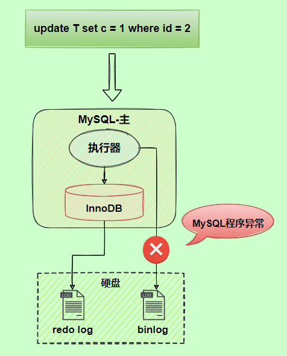

## Java基础

### 多态

#### 是什么

多态就是指**程序中定义的引用变量所指向的具体类型和通过该引用变量发出的方法调用在编程时并不确定，而是在程序运行期间才确定**，即一个引用变量倒底会指向哪个类的实例对象，该引用变量发出的方法调用到底是哪个类中实现的方法，必须在由程序运行期间才能决定。

#### 多态存在的的三个必要条件：

1.  要有继承（两个类之间存在继承关系，子类继承父类）；
2.  要有重写（在子类里面重写从父类继承下来的方法）；
3.  父类引用指向子类对象

#### 多态有哪些具体实现方式

+   重载（Overload）：同一个类中拥有相同的方法名，参数和返回值不相同。（静态/编译时多态）
+   重写（Override）：子类继承父类，覆盖父类方法，方法名和参数都要相同。（运行时多态）
    +   **方法重写和向上转型在编译时是不能判断调用哪个方法的**。
    +   向上转型中，对象调用的方法涉及到了方法重写（向上转型说明有继承，继承就可以重写父类的方法）。
    +   向上转型的方法调用的判断机制简单来说是，先根据调用的方法的方法签名到父类中找到这个方法，再看子类中是否重写了这个方法，如果子类重写了，就调用子类的，没有重写就还是调用父类的。

#### 为什么说重载和重写是多态的实现


### 自动拆箱和装箱

+   自动拆箱和装箱是在jdk1.5以后才有的

+   装箱：将基本类型用包装器类型包装起来

+   拆箱：将包装类型转换成基本类型

+   自动装箱时会（自动）调用xxx.valueOf()

    +   Integer.valueOf()

    +   ```java
        /*
        Byte,Short,Integer,Long 这 4 种包装类默认创建了数值 [-128，127] 的相应类型的缓存数据，Character 创建了数值在 [0,127] 范围的缓存数据，Boolean 直接返回 True or False。
        Float、Double并没有实现缓存机制。
        */
        
        public static Integer valueOf(int i) {
            if (i >= IntegerCache.low && i <= IntegerCache.high)
                return IntegerCache.cache[i + (-IntegerCache.low)];
            return new Integer(i); 
        }
        
        public static Boolean valueOf(boolean b) {
            return (b ? TRUE : FALSE);
        }
        ```

+   自动拆箱时会（自动）调用xxxValue()

    +   new Integer(1).intValue()

### String的不可变性

#### String为什么是不可变的

[如何理解String的不可变]: https://www.zhihu.com/question/20618891/answer/114125846

```java
public final class String implements java.io.Serializable, Comparable<String>, CharSequence {
    private final char value[];//private的私有访问权限的作用都比final大
	//...
}
```

##### 原因

+   `String`的底层是`char`类型数组（java9将char[]改为byte[]，见补充），该数组被**final修饰**且为**私有（private）**，并且`String`类没有提供/暴露改变这个数组元素的方法/代码。
+   设计师很小心地把整个`String`设成`final`禁止继承，避免被子类继承后破坏。

##### 补充

+   新版的 `String `其实支持两个编码方案： Latin-1 和 UTF-16。如果字符串中包含的汉字没有超过 Latin-1 可表示范围内的字符，那就会使用 Latin-1 作为编码方案。Latin-1 编码方案下，`byte` 占一个字节(8 位)，`char` 占用 2 个字节（16），`byte` 相较 `char` 节省一半的内存空间。JDK 官方就说了绝大部分字符串对象只包含 Latin-1 可表示的字符。

+   `String`类里的`value`用`final`修饰，只是说栈里面这个叫`value`的引用地址不可变，并不是说堆中数组本身的数据不可变。

    ```java
    final int[] value = {1,2,3};
    int[] another = {4,5,6};
    value = another;//编译器报错，因为final不可变
    ```

    ``` java
    final int[] value = {1,2,3};
    value[0] = 5;//value里面的值已变成{5,2,3}
    ```

#### String不可变的好处

+   线程安全

    +   `String`不可变性天生具备线程安全，可以在多个线程中安全的使用

+   字符串常量池优化

    +   字面量创建的字符串对象，会在字符串常量池中进行缓存，如果下次创建同样的对象，会直接返回缓存中的引用。这样在大量使用字符串的情况下，可以节省内存空间，提高效率

    +   ```java
        String one = "abc";
        String two = "abc";
        ```

        

+   可以缓存`hash`值

    +   因为`String`的`hash`值经常被使用，如`String`常作为`HashMap`的`key`。不可变的特性可以使`hash`值不变，因此只需要计算一次。

    +   ```java
        /*
        把变量sb3指向sb1的地址，再改变sb3的值，因为StringBuilderi没有不可变性的保护，sb3直接在原先"aaa"的地址上改。导致sb1的值也变了。
        这时候，HashSet上就出现了两个相等的键值"aaabbb"，破坏了HashSet键值的唯一性。
        所以千万不要用可变类型做HashMap和HashSet键值。
        */
        public static void main(String[] args) {
            HashSet<StringBuilder> set = new HashSet<>();
            StringBuilder sb1 = new StringBuilder("aaa");
            StringBuilder sb2 = new StringBuilder("aaabbb");
            set.add(sb1);
            set.add(sb2);
        
            StringBuilder sb3 = sb1;
            sb3.append("bbb");
            System.out.println(sb1);//aaabbb
            System.out.println(set);//[aaabbb, aaabbb]
        }
        ```

### String、StringBuilder、StringBuffer的区别

|               | 是否可变 |   是否线程安全   | 性能 |
| :-----------: | :------: | :--------------: | :--: |
|    String     |  不可变  | 是（对象不可变） |  低  |
| StringBuilder |   可变   |        否        |  高  |
| StringBuffer  |   可变   |   是（加了锁）   | 较高 |

+   操作少量的数据: 适用 `String`
+   单线程操作字符串缓冲区下操作大量数据: 适用 `StringBuilder`
+   多线程操作字符串缓冲区下操作大量数据: 适用 `StringBuffer`

### StringBuilder为什么比String拼接字符串速度要快?

[StringBuilder的append方法原理]: https://blog.csdn.net/m0_60256757/article/details/124194421

#### 结论

`StringBuilder`的`append`方法的复杂度是O(n)，`String`类的 + 拼接方法复杂度是O(n+m)

#### 用append进行字符串拼接

`StirngBuilder`的`append()`调用了`System.arrayCopy()`，这是一个本地方法，具体作用就是从源数组`src`取元素，范围为下标`srcPos`到`srcPos+length-1`，取出共`length`个元素，存放到目标数组中，存放位置为下标`destPos`到`destPos+length-1`，简单来说就是数组复制。

所以我们可以知道`StringBuilder`类的`append`方法底层是调用了`System.arraycopy()`完成字符串的拼接，其复杂度是O(n)，n是要拼接字符串的长度。

#### 用+号进行字符串拼接

假如现在有这样一条语句 `str1+=str2`；我们编译器在遇到这条语句时会调用`new StringBuilder(str1)`产生一个`StringBuilder`对象，然后再调用这个对象的`append(str2)`方法对字符串进行拼接，最后调用`toString()`方法返回拼接好的字符串。所以`+`号的底层原理还是`StringBuilder`的`append`方法，但它的效率却低了不少，因为调用了两次`append`方法，还有一次是`new StringBuilder(str1)`这里调用了一次``append(str1)``方法。

```java
public StringBuilder(String str) {
    super(str.length() + 16);
    append(str);
}
```

### 为什么不建议在for循环中使用 + 进行字符串拼接

+   纠正自己以前的错误理解
+   
+   字符串对象通过`+`的字符串拼接方式，实际上每次循环都先`new`一个`StringBuilder`对象，通过 `StringBuilder` 调用 `append()` 方法实现的，拼接完成之后调用 `toString()` 得到一个 `String` 对象 。
+   频繁的新建对象要耗费很多时间，还会造成内存资源的浪费。
+   但是，要强调的是：
    +   如果不是在循环体中进行字符串拼接的话，直接使用 `+` 就好了。（最好不要，看上一条）
    +   如果在并发场景中进行字符串拼接的话，要使用`StringBuffer`来代替`StringBuilder`。

###  intern 方法有什么作用?

`String.intern()` 是一个 native（本地）方法，其作用是将指定的字符串对象的引用保存在字符串常量池中，可以简单分为两种情况：

-   如果字符串常量池中保存了对应的字符串对象的引用，就直接返回该引用。
-   如果字符串常量池中没有保存了对应的字符串对象的引用，那就在常量池中创建一个指向该字符串对象的引用并返回。

+   ```java
    // 在堆中创建字符串对象”Java“
    // 将字符串对象”Java“的引用保存在字符串常量池中
    String s1 = "Java";
    // 直接返回字符串常量池中字符串对象”Java“对应的引用
    String s2 = s1.intern();
    // 会在堆中在单独创建一个字符串对象
    String s3 = new String("Java");
    // 直接返回字符串常量池中字符串对象”Java“对应的引用
    String s4 = s3.intern();
    // s1 和 s2 指向的是堆中的同一个对象
    System.out.println(s1 == s2); // true
    // s3 和 s4 指向的是堆中不同的对象
    System.out.println(s3 == s4); // false
    // s1 和 s4 指向的是堆中的同一个对象
    System.out.println(s1 == s4); //true
    ```

### String的equals方法（TODO）

对char数组每个元素比较

```java
public boolean equals(Object anObject) {
    if (this == anObject) {
        return true;
    }
    if (anObject instanceof String) {
        String anotherString = (String)anObject;
        int n = value.length;
        if (n == anotherString.value.length) {
            char v1[] = value;
            char v2[] = anotherString.value;
            int i = 0;
            while (n-- != 0) {
                if (v1[i] != v2[i])
                    return false;
                i++;
            }
            return true;
        }
    }
    return false;
}
```


### Object常见方法

+   getClass()、hashCode()、equals()、clone()浅拷贝、toString()、wait()、notify()、notifyAll()、finalize()

###  == 和 equals() 的区别

+   **`==`** 对于基本类型和引用类型的作用效果是不同的：

    -   对于基本数据类型来说，`==` 比较的是值。

    -   对于引用数据类型来说，`==` 比较的是对象的内存地址。

    +   因为 Java 只有值传递，所以，对于 == 来说，不管是比较基本数据类型，还是引用数据类型的变量，其本质比较的都是值，只是引用类型变量存的值是对象的地址。

+   `equals()` 方法存在两种使用情况：

    -   **类没有重写 `equals()`方法** ：通过`equals()`比较该类的两个对象时，等价于通过“==”比较这两个对象，使用的默认是 `Object`类`equals()`方法。
    -   **类重写了 `equals()`方法** ：一般我们都重写 `equals()`方法来比较两个对象中的属性是否相等；若它们的属性相等，则返回 true(即，认为这两个对象相等)。

+ ```java
  public boolean equals(Object obj) {
       return (this == obj);
  }
  ```
  

### 以 HashSet如何检查重复 为例子来说明为什么要有 hashCode

>   当你把对象加入 `HashSet` 时，`HashSet` 会先计算对象的 `hashCode` 值来判断对象加入的位置，同时也会与其他已经加入的对象的 `hashCode` 值作比较，如果没有相符的 `hashCode`，`HashSet` 会假设对象没有重复出现。但是如果发现有相同 `hashCode` 值的对象，这时会调用 `equals()` 方法来检查 `hashCode` 相等的对象是否真的相同。如果两者相同，`HashSet` 就不会让其加入操作成功。如果不同的话，就会重新散列到其他位置。这样我们就大大减少了 `equals` 的次数，相应就大大提高了执行速度。

### hashCode() 和 equals() 的关系

[hashCode() 和 equals()的若干问题解答]: https://www.cnblogs.com/skywang12345/p/3324958.html

+   **第一种 不会创建“类对应的散列表”**
    +   这里所说的“不会创建类对应的散列表”是说：我们不会在HashSet, Hashtable, HashMap等等这些本质是散列表的数据结构中，用到该类。例如，不会创建该类的HashSet集合。
    +   在这种情况下，该类的“hashCode() 和 equals() ”没有半毛钱关系
    +   这种情况下，equals() 用来比较该类的两个对象是否相等。而hashCode() 则根本没有任何作用，所以，不用理会hashCode()。
+   **第二种 会创建“类对应的散列表”**
    +   这里所说的“会创建类对应的散列表”是说：我们会在HashSet, Hashtable, HashMap等等这些本质是散列表的数据结构中，用到该类。例如，会创建该类的HashSet集合。
    +   在这种情况下，该类的“hashCode() 和 equals() ”是有关系的：
        +   如果两个对象相等，那么它们的hashCode()值一定相同。这里的相等是指，通过equals()比较两个对象时返回true。
        +   如果两个对象hashCode()相等，它们并不一定相等。因为在散列表中，hashCode()相等，即两个键值对的哈希值相等。然而哈希值相等，并不一定能得出键值对相等。补充说一句：“两个不同的键值对，哈希值相等”，这就是哈希冲突。
        +   此外，在这种情况下。若要判断两个对象是否相等，除了要覆盖equals()之外，也要覆盖hashCode()函数。否则，equals()无效。例如，创建Person类的HashSet集合，必须同时覆盖Person类的equals() 和 hashCode()方法。如果单单只是覆盖equals()方法。我们会发现，equals()方法没有达到我们想要的效果。
+   只重写equals()
    +   HashSet中仍会有重复元素，这是因为**两个内容相同的对象p1、p2，他们的hashCode仍可能不等（因为是new出来的不同对象，hashCode自然不同）**，根据HashSet存放元素的原理来看，HashSet就会认为这两个对象不等，因此HashSet中会出现很多重复元素。
+   只重写hashCode()
    +   会发现明明是内容不同的元素，却无法都存入HashSet，这是因为出现了**哈希碰撞**，两个对象有相同的 `hashCode` 值，他们也不一定是相等的。

### 常见哈希散列算法  

+   拉链法：数组+链表。先调用这个元素的 hashCode 方法，然后根据所得到的值计算出元素应该在数组的位置，如果这个位置上没有元素，那么直接将它存储在这个位置上；如果这个位置上已经有元素了，那么调用它的equals方法与新元素进行比较：相同的话就不存了，否则，将其存在这个位置对应的链表中
+   开放地址法：使用散列函数计算位置，冲突时顺位到下一个位置。

### static块初始化顺序

+   静态变量和静态语句块优先于实例变量和普通语句块，静态变量和静态语句块的初始化顺序取决于它们在代码中的顺序。如果存在继承关系的话，初始化顺序为**父类中的静态变量和静态代码块一一子类中的静态变量和静态代码块一一父类中的实例变量和普通代码块一一父类的构造函数一一子类的实例变量和普通代码块一一子类的构造函数**

### 面向对象和面向过程的区别

两者的主要区别在于解决问题的方式不同：

-   面向过程把解决问题的过程拆成一个个方法，通过一个个方法的执行解决问题。
-   面向对象会先抽象出对象，然后用对象执行方法的方式解决问题。

另外，面向对象开发的程序一般更易维护、易复用、易扩展。

### 面向对象五大基本原则

+   单一职责、开放封闭、里式替换、依赖倒置、接口隔离  （单开你一姐）

### 接口和抽象类有什么共同点和区别？

**共同点** 

-   都不能被实例化。

-   都可以包含抽象方法。

-   都可以有默认实现的方法（Java8中接口中引入**默认方法**（default）和**静态方法**）

    ```java
    interface Animal {
        int a = 0;
        default void fun() {
            System.out.println("fun");
        }
        static void function() {
            System.out.println("function");
            return;
        }
    }
    ```

**区别** 

-   接口主要用于对类的行为进行约束，你实现了某个接口就具有了对应的行为。抽象类主要用于代码复用，强调的是所属关系。
-   一个类只能继承一个类，但是可以实现多个接口。
-   接口中的成员变量只能是 `public static final` 类型的，不能被修改且必须有初始值，而抽象类的成员变量默认 default，可在子类中被重新定义，也可被重新赋值。

### 深拷贝和浅拷贝

+   **浅拷贝**：浅拷贝会在堆上创建一个新的对象（区别于引用拷贝的一点），不过，如果原对象内部的属性是引用类型的话，浅拷贝会直接复制内部对象的引用地址，也就是说拷贝对象和原对象共用同一个内部对象。

+   **深拷贝** ：深拷贝会完全复制整个对象，包括这个对象所包含的内部对象。

+   

+   ```java
    class Address{
        private String name; 
    }
    class Person{
        private Address address;
    }
    ```

### IO（TODO）

### 异常

#### 异常类结构图

+   

#### Checked Exception 和 Unchecked Exception

+   **Checked Exception** (非运行时异常)即 **受检查异常** ，Java 代码在编译过程中，如果受检查异常没有被 `catch`或者`throws` 关键字处理的话，就没办法通过编译。
+   **Unchecked Exception**(`RuntimeException`) 即 **不受检查异常** ，Java 代码在编译过程中 ，我们即使不处理不受检查异常也可以正常通过编译。

---


## Java集合

### 集合框架（TODO记牢）

+   
+   
+   集合主要是由两大接口派生而来：一个是 `Collection`接口，主要用于存放单一元素，下面有三个主要的子接口：`List`、`Set` 和 `Queue`；另一个是 `Map` 接口，主要用于存放键值对。

###  集合底层数据结构

**TODO：说底层结构的时候要具体，如链表--->双向链表**

#### List

-   `ArrayList`： `Object[]` 数组
-   `Vector`：`Object[]` 数组
-   `LinkedList`： 双向链表(JDK1.6 之前为循环链表，JDK1.7 取消了循环)

#### Set

-   `HashSet`(无序，唯一): 基于 `HashMap` 实现的，底层采用 `HashMap` 来保存元素
-   `LinkedHashSet`: `LinkedHashSet` 是 `HashSet` 的子类，并且其内部是通过 `LinkedHashMap` 来实现的
-   `TreeSet`(有序，唯一): 红黑树(自平衡的排序二叉树)

#### Queue（单端队列）

-   `PriorityQueue`: `Object[]` 数组来实现二叉堆
-   `ArrayQueue`: `Object[]` 数组 + 双指针
-   `Deque`:双端队列

#### Map

-   `HashMap`： JDK1.8 之前 `HashMap` 由**数组+链表**组成的，数组是 `HashMap` 的主体，链表则是主要为了解决哈希冲突而存在的（“拉链法”解决冲突）。JDK1.8 以后为**数组+链表/红黑树**在解决哈希冲突时有了较大的变化，当**链表长度大于阈值（默认为 8）**（将链表转换成红黑树前会判断`treeifyBin()`，如果当前数组的长度小于 64，那么会选择先进行数组扩容，而不是转换为红黑树）时，将链表转化为红黑树，以减少搜索时间；当**长度小于6时**，从红黑树转为链表
-   `LinkedHashMap`： `LinkedHashMap` 继承自 `HashMap`，所以它的底层仍然是基于拉链式散列结构即由数组和链表或红黑树组成。另外，`LinkedHashMap` 在上面结构的基础上，增加了一条双向链表，使得上面的结构可以保持键值对的插入顺序。同时通过对链表进行相应的操作，实现了访问顺序相关逻辑。详细查看：[《LinkedHashMap 源码详细分析（JDK1.8）》open in new window](https://www.imooc.com/article/22931)
-   `Hashtable`： 数组+链表组成的，数组是 `Hashtable` 的主体，链表则是主要为了解决哈希冲突而存在的
-   `TreeMap`： 红黑树（自平衡的排序二叉树）

### 线程安全问题

#### 线程安全的集合

+   `Vector`、`Stack`、`HashTable`、`ConcurrentHashMap`

#### 线程不安全的集合

+   `Hashmap`、`Arraylist`、`LinkedList`、`HashSet`、`TreeSet`、`TreeMap`

### 怎么确保一个集合不能被修改？

+   可以使用 **Collections. unmodifiableCollection(Collection c) **方法来创建一个只读集合，这样改变集合的任何操作都会抛出 `Java. lang. UnsupportedOperationException` 异常。

+   ```java
    List list = new ArrayList<>();
    list.add("x");
    Collection clist = Collections.unmodifiableCollection(list);
    clist.add("y"); // 运行时此行报错
    ```

### fast-fail机制

[什么是fail-fast]: https://www.cnblogs.com/54chensongxia/p/12470446.html

#### fast-fail是什么

+   首先，`fast-fail`机制并不是Java集合中特有的，它是一个通用的系统设计思想。是一种错误检测机制，一旦检测到可能发生的错误，就立马抛出异常，程序不继续往下执行。

    ```java
    //开发中常用
    public UserDomain queryUserById(String userId){
        if(userId == null || "".equals(userId)){
            throw new RuntimeException("error params...");
        }
        //do something
    }
    ```

#### fast-fail在集合中的应用

+   当多个线程同时对集合中的内容进行修改时，可能就会抛出`ConcurrentModificationException`异常。其实不仅仅是在多线程状态下，在单线程中用增强`for`循环中一边遍历集合一边**修改集合的元素**也会抛出`ConcurrentModificationException`异常。

##### 单线程

+   ```java
    ArrayList<Integer> list = new ArrayList<>();
    list.add(1);list.add(2);list.add(3);list.add(4);list.add(5);
    for (Integer integer : list) {
        list.remove(integer);
    }
    
    Exception in thread "main" java.util.ConcurrentModificationException
    	at java.util.ArrayList$Itr.checkForComodification(ArrayList.java:901)
    	at java.util.ArrayList$Itr.next(ArrayList.java:851)
    	at com.hcy.a.main(ListNode.java:114)
        
    List<String> userNames = new ArrayList<String>() {{
        add("Hollis");
        add("hollis");
        add("HollisChuang");
        add("H");
    }};
    for (String userName : userNames) {
        if (userName.equals("Hollis")) {
            userNames.remove(userName);
        }
    }
    System.out.println(userNames);
    
    ```

    以上代码，使用增强`for`循环删除`list`中的元素，就会抛出`ConcurrentModificationException`异常（虽然本例中没有出现多线程并发）。

+   **异常产生的原因**：

    ```java
    /*
    增强for循环是Java提供的一个语法糖，将代码反编译后可以看到增强for循环其实是用的是Iterator迭代器。
    
    同样，在增强for循环中使用add方法添加元素，结果也会同样抛出该异常。
    */
    
    public static void main(String[] args) {
        // 使用ImmutableList初始化一个List
        List<String> userNames = new ArrayList<String>() {{
            add("Hollis");
            add("hollis");
            add("HollisChuang");
            add("H");
        }};
    
        Iterator iterator = userNames.iterator();
        do
        {
            if(!iterator.hasNext())
                break;
            String userName = (String)iterator.next();
            if(userName.equals("Hollis"))
                userNames.remove(userName);
        } while(true);
        System.out.println(userNames);
    }
    ```

    异常是由`iterator.next()`调用`checkForComodification()`而产生的，每次迭代都会比较`modCount`和`expectedModCount`的值是否相等

    ```java
    final void checkForComodification() {
        if (modCount != expectedModCount)
            throw new ConcurrentModificationException();
    }
    ```

    在该方法中对`modCount`和`expectedModCount`进行了比较，如果二者不相等，则抛出`CMException`。
    
+   **那么，modCount和expectedModCount是什么？是什么原因导致他们的值不相等的呢？**
    
    +   `modCount`是`AbstractList`中的一个成员变量。它表示该集合实际被修改的次数。
    +   `expectedModCount `是 `ArrayList`中的一个内部类——`Itr`中的成员变量。`expectedModCount`表示这个迭代器预期该集合被修改的次数。其值随着`Itr`被创建而初始化，只有通过迭代器对集合进行操作，该值才会改变。
    + `list.remove(Object o)`中调用了`fastRemove(int index)`
    
        ```java
        private void fastRemove(int index) {
            modCount++;
            int numMoved = size - index - 1;
            if (numMoved > 0)
                System.arraycopy(elementData, index+1, elementData, index,
                                 numMoved);
            elementData[--size] = null; // clear to let GC do its work
        }
        ```
    
        可以看到只修改了`modCount`，没有对`exceptedModCount`做任何操作。
    
        **所以导致产生异常的原因是：**`remove`和`add`操作会导致`modCount`和迭代器中的`expectedModCount`不一致。
    

##### 多线程

+   多线程的情况下即使用了迭代器调用`remove()`方法，还是会报`ConcurrentModificationException`异常。这又是为什么呢？
+   还是要从`expectedModCount`和`modcount`这两个变量入手分析，刚刚说了`modCount`在`AbstractList`类中定义，而`expectedModCount`在`ArrayList`内部类`Itr`中定义，所以`modcount`是个共享变量而`expectedModcount`是属于线程各自的。
+   简单说，线程1更新了`modcount`和属于自己的`expectedModCount`，而在线程2看来只有`modCount`更新了，`expectedModCount`并未更新，所以会抛出`ConcurrentModificationException`异常。

#### 异常解决方法

+   **直接使用`Iterator`进行操作**

    ```java
    while (iterator.hasNext()) {
        if (iterator.next().equals("Hollis")) {
            iterator.remove();
        }
    }
    
    ListIterator<Integer> iterator = list.listIterator();
    	while (iterator.hasNext()) {
        	iterator.next();
        	iterator.add(2);
    	}
    ```

    `Iterator`提供的`remove`方法：

    ```java
    public void remove() {
    	if (lastRet < 0)
    		throw new IllegalStateException();
    		checkForComodification();
    	try {
    		ArrayList.this.remove(lastRet);
    		cursor = lastRet;
    		lastRet = -1;
    		expectedModCount = modCount;//保证了modCount和expectedModCount一致
    	} catch (IndexOutOfBoundsException ex) {
    		throw new ConcurrentModificationException();
    	}
    }
    ```

+   **直接使用fail-safe的集合类**

    在Java中，除了一些普通的集合类以外，还有一些采用了fail-safe机制的集合类。这样的集合容器在遍历时不是直接在集合内容上访问的，而是先复制原有集合内容，在拷贝的集合上进行遍历。

    由于迭代时是对原集合的拷贝进行遍历，所以在遍历过程中对原集合所作的修改并不能被迭代器检测到，所以不会触发`ConcurrentModificationException`。

    **即，使用`CopyOnWriteArrayList`替换`ArrayList`**
    
    CopyOnWriteArrayList特点：**在对其实例进行修改操作（add/remove等）会新建一个数组并修改，修改完毕之后，再将原来的引用指向新的数组**

#### 补充

+   `ArrayList`中的`remove()`方法有重载形式，根据循环变量是否为包装类来选择使用哪个方法。
+   `public E remove(int index)`
    +   普通`for`循环---`for(int i = 0; i < loop; i++){}`，循环变量是`int`基本数据类型
+   ``public boolean remove(Object o)`
    +   普通`for`循环---`for(Integer i = 0; i < loop; i++){}`，循环变量是`Integer`包装类型
    +   增强`for`循环---`for(Integer i : list){}`，循环变量是`Integer`包装类型
    
+   ```java
    public static void main(String[] args) {
    	List<Integer> list = new ArrayList<>();
    	list.add(1);
    	list.add(2);
    	list.add(3);
    	Iterator<Integer> it = list.iterator();
    	while (it.hasNext()) {
        //如果没有调用next()来使迭代器进展到下一个元素，则该方法将抛出IllegalStateException
        //remove()会对lastRet进行判断，小于0则抛出异常，而lastRet成员变量初始值为-1，在next()中被重新赋值
    	it.remove();
    	}
    }
    ```


### fail-safe机制

+   采用安全失败机制的集合容器，在遍历时不是直接在集合内容上访问的，而是**先复制原有集合内容，在拷贝的集合上进行遍历**。所以在遍历过程中对原集合所作的修改并不能被迭代器检测到，所以不会抛出`ConcurrentModificationException`异常。
+   缺点是迭代器遍历的是开始遍历那一刻拿到的集合拷贝，在遍历期间原集合发生了修改，迭代器是无法访问到修改后的内容.
+   `java.util.concurrent`包下的容器都是安全失败，可以在多线程下并发使用。

### Array和ArrayList有何区别

+   `Array`可以包含基本类型和对象类型，`ArrayList`只能包含对象类型
+   `Array`大小是固定的，`ArrayList`的大小是动态变化的。(`ArrayList`的扩容)
+   相比于`Array`，`ArrayList`有着更多的`API`
+   对于基本类型数据，`ArrayList`使用自动装箱来减少编码工作量；而当处理固定大小的基本数据类型的时候，这种方式相对比较慢，这时候应该使用`Array`。（主要前三点）

### 对于List的三种遍历方式该如何选择？

+   在Java集合框架中，提供了一个`RandomAccess`接口，该接口没有方法，只是一个标记。通常用来标记`List`的实现是否支持`RandomAccess`（只要List集合实现这个接口，就能支持快速随机访问）。所以在遍历时，可以先判断是否支持`RandomAccess(List instance of RandomAccess)`，如果支持可用for循环遍历，否则建议用`Iterator`或`foreach`遍历。
+   `ArrayList`基于数组实现，天然带下标，可以实现常量级的随机访问，复杂度为O(1)
+   `LinkedList`基于链表实现，随机访问需要依靠遍历实现，复杂度为O(n)

### Comparable 和 Comparator的区别？

+   `Comparable `接口实际上是出自`java.lang`包，它有一个 `compareTo(Object obj)`方法用来排序

+   `Comparator`接口实际上是出自 `java.util` 包，它有一个`compare(Object obj1, Object obj2)`方法用来排序

+   `Comparable`是排序接口，若一个类实现了`Comparable`接口，就意味着“该类支持排序”，像`Integer`、`String`等 ，所以可以直接调用`Collections.sort()`

+   而`Comparator`是比较器，通过一个类实现这个接口来作为一个比较器来进行排序。

+   `Comparable`相当于“内部比较器”，而`Comparator`相当于“外部比较器”。

+   各自的优劣

    +   用`Comparable `简单， 只要实现`Comparable `接口的对象直接就成为一个可以比较的对象，但是需要修改源代码。
    +   用`Comparator `的好处是不需要修改源代码， 而是另外实现一个比较器， 当某个自定义的对象需要作比较的时候，把比较器和对象一起传递过去就可以比大小了， 并且在`Comparator `里面用户可以自己实现复杂的可以通用的逻辑，使其可以匹配一些比较简单的对象，那样就可以节省很多重复劳动了。

+   ```java
    //数组排序
    String[] str = new String[5];
    Arrays.sort(str, new Comparator<String>() {
        @Override
        public int compare(String o1, String o2) {
            // TODO Auto-generated method stub
            return 0;
        }
    });
    //List集合排序
    ArrayList<String> list = new ArrayList<String>();
    Collections.sort(list, new Comparator<String>() {
        @Override
        public int compare(String o1, String o2) {
            // TODO Auto-generated method stub
            return 0;
        }
    });
    /*
    Collections.sort()
    1、要求传入的待排序容器中存放的对象必须实现 Comparable 接口，该接口提供了比较元素的compareTo()方法，当插入元素时会调用该方法比较元素的大小
    2、可以传入集合中的元素没有实现Comparable接口的对象，但是要求传入第二个参数，参数是Comparator 接口的子类型（需要重写 compare 方法实现元素的比较），也就是你需要定义一个比较器，然后sort()方法比较实际上就是调用这个比较器的 compare 方法来进行比较
    */
    List<Dog> list = new ArrayList<>();
    	list.add(new Dog(1));
    	list.add(new Dog(2));
    	Collections.sort(list, new Comparator<Dog>() {
        	@Override
        	public int compare(Dog o1, Dog o2) {
            	return 0;
        	}
    	});
    
    class Dog {
        private int age;
        
        public Dog() {
        }
        
        public Dog(int age) {
            this.age = age;
        }
        
        @Override
        public boolean equals(Object o) {
            if (this == o) return true;
            if (o == null || getClass() != o.getClass()) return false;
            Dog dog = (Dog) o;
            return age == dog.age;
        }
        
        @Override
        public int hashCode() {
            return Objects.hash(age);
        }
    }
    
    /*
    现在假如上面的Dog类没有实现Comparable接口，该如何比较大小呢？
    我们可以新建一个类，让其实现Comparator接口，从而构造一个“比较器"。
    */
    
    public class PersonCompartor implements Comparator<Person>
    {
        @Override
        public int compare(Dog o1, Dog o2){
            return o1.getAge()-o2.getAge();
        }
    }
    ```

### ArrayList扩容机制

[一步一步分析ArrayList扩容机制]: https://javaguide.cn/java/collection/arraylist-source-code.html

+   扩容是一种懒加载（无参构造时），当add()的时候才会进行一个初始化容量分配

+   ArrayList的默认初始容量为10，扩容时对是旧的容量值加上旧的容量数值进行右移一位（位运算，相当于除以2，位运算的效率更高），所以每次扩容都是旧的容量的1.5倍。

+   以无参数构造方法创建 `ArrayList` 时，实际上初始化赋值的是一个空数组。当真正对数组进行添加元素操作时，才真正分配容量。即向数组中添加第一个元素时（`minCapacity = Math.max(DEFAULT_CAPACITY, minCapacity);`），数组容量扩为 10。

+   如果使用的是指定大小的构造器，则初始elementData容量为指定大小（必须是非负数，0相当于无参构造，负数抛异常），如果需要扩容，则直接扩容为elementData的1.5倍

+   当一次性的增长值超过新的容量时（且未超过最大容量），就会把**增长值+原容量**作为新容量。

    ```java
    private void grow(int minCapacity) {//minCapacity为
            // overflow-conscious code
            int oldCapacity = elementData.length;
            int newCapacity = oldCapacity + (oldCapacity >> 1);
            if (newCapacity - minCapacity < 0)
                newCapacity = minCapacity;//一次性的增长值超过新的容量newCapacity时的情况
            if (newCapacity - MAX_ARRAY_SIZE > 0)//最新容量（注意是最新）大于最大容量的情况
                newCapacity = hugeCapacity(minCapacity);
            // minCapacity is usually close to size, so this is a win:
            elementData = Arrays.copyOf(elementData, newCapacity);
        }
    ```

    

### System.arraycopy() 和 Arrays.copyOf()

**联系：**

看两者源代码可以发现 `Arrays.copyOf()`内部实际调用了 `System.arraycopy()` 方法

**区别：**

`System.arraycopy()` 需要目标数组，将原数组拷贝到自己定义的数组里或者原数组，而且可以选择拷贝的起点和长度以及放入新数组中的位置。 `Arrays.copyOf()` 是系统自动在内部新建一个数组，并返回该数组。

### Set

#### HashSet实现原理

+   `HashSet`底层是`HashMap`，默认构造函数是构建一个初始容量为16，负载因子为0.75的`HashMap`。
+   `HashSet`的值存放于`HashMap`的`key`上，`HashMap`的`value`统一为`Object对象PRESENT`。

#### HashSet如何检查重复

+   见上面**以 HashSet如何检查重复 为例子来说明为什么要有 hashCode**

#### HashSet和HashMap的区别

+   

### Map

[HashMap实现原理及扩容机制详解]: https://blog.csdn.net/lkforce/article/details/89521318

[JDK1.7中HashMap在多线程环境的并发问题源码分析]: https://blog.csdn.net/Guyui233/article/details/125326512

头插法带来的死链

#### HashMap的k,v都可以为null

HashTable不可以

```java
new HashMap().put(null,null);
public V put(K key, V value) {
    return putVal(hash(key), key, value, false, true);
}

static final int hash(Object key) {
    int h;
    return (key == null) ? 0 : (h = key.hashCode()) ^ (h >>> 16);
}
```

#### jdk1.8中并发问题

+   元素覆盖
    +   

#### HashMap求桶的位置

##### HashMap求桶的位置一共分为三个过程（1.8）

+   1、求key的hashcode

+   2、调用hash函数得到hash值，将hashcode的高16位和低16位进行异或操作。

    ```java
    static final int hash(Object key) {
        int h;
        return (key == null) ? 0 : (h = key.hashCode()) ^ (h >>> 16);
    }
    ```

+  3、通过(length- 1) & hash ，将hash值与length-1进行与操作，求桶的位置（其中hash值是上面hash函数得到的值，length是table数组的长度）
   
    ```java
    if ((p = tab[i = (n - 1) & hash]) == null)
    	tab[i] = newNode(hash, key, value, null);
    ```
    
    注意：不是得到hash值就知道把元素存在数组中的哪个位置，而是还要经过(length- 1) & hash之后才可以得到数组的位置，这样是为了减少hash冲突

#### 为什么HashMap使用高16位异或低16位计算Hash值？

[为什么HashMap使用高16位异或低16位计算Hash值]: https://zhuanlan.zhihu.com/p/458305988

##### 原因

hash值是一个int类型，二进制为32位。HashMap的table数组初始化size为16，取余操作为`hashCode & 15 ---> hashCode & 1111`。

这样就会存在一个问题，**1111只会与hashCode的低四位进行与操作**，也就是说hashcode的高位并没有参与运算，会**导致很多hash值低位相同而高位不同的数，最后算出来的索引是一样的**。

##### 举例

假设hashCode为1111110001，那么`1111110001 & 1111 = 0001`，高位发生变化时`1011110001 & 1111 = 0001`，

`1000110001 & 1111 = 0001`，尽管hash值不同（高位不同），但最后算出来的索引都一样，就会导致很多数据被放到同一个数组位置上，造成性能退化。

因此，为了避免这种情况，**HashMap将高16位与低16位进行异或，这样可以保证高位的数据也参与进来，以增加索引的散列程度，让数据分布得更均匀**。

>为什么用异或，不用 & 或者 | 操作，因为异或可以保证两个数值的特性，
>
>& 运算使得结果向0靠近，| 运算使得结果向1靠近

##### 结论

保留高位与低位的数据特性，增大散列程度。

#### HashMap在JDK1.7和1.8有什么不同

+   

+   hash函数：Java 1.7 做了四次移位和五次异或，但Java 1.8 只做了一次移位和一次异或。

+   底层结构：1.7为数组+链表；1.8为数组+链表/红黑树，为了防止链表过长，将时间复杂度由O(n)降为O(logn)

+   链表的插入方式：1.7为头插法，1.8为尾插法。
    +   简单来说，就是插入时，如果数据位置上已经有元素，1.7将新元素放到数组中，原始节点作为新节点的后继节点。

    +   1.8遍历链表，将元素放置到链表的最后。

    +   1.7头插法扩容时，头插法会使链表发生反转，多线程并发下会产生环，产生死链。

+   扩容的时候：
    +   1.7中是只要大于阈值就直接扩容2倍；而1.8的扩容策略会更优化，如果某个桶中的链表长度大于等于8了，则会判断当前的hashmap的容量是否大于64，如果小于64，则会进行2倍扩容；如果大于64，则将链表转为红黑树。

    +   Java 1.7 需要对原数组中的元素进行重新 hash 定位在新数组的位置。Java 1.8 采用更简单的判断逻辑，位置不变或索引+旧容量大小；

    +   ```java
        //JDK1.7的计算下标方法
        static int indexFor(int h, int length) {
        	// assert Integer.bitCount(length) == 1 : "length must be a non-zero power of 2";
        	return h & (length-1);
        }
        //使用length-1的意义在于，length是2的倍数，所以length-1在二进制来说每位都是1，这样可以保证最大的程度的散列hash值，否则，当有一位是0时，不管hash值对应位是1还是0，按位与后的结果都是0，会造成散列结果的重复。
        ```
    
+   在插入时
    +   Java 1.7 先判断是否需要扩容，再插入。

    +   Java 1.8先进行插入，插入完成再判断是否需要扩容。

    +   在1.7的时候是先扩容后插入的，这样就会导致无论这一次插入是不是发生hash冲突都需要进行扩容，如果这次插入的并没有发生Hash冲突的话，那么就会造成一次无效扩容，但是在1.8的时候是先插入再扩容的，优点其实是因为为了减少这一次无效的扩容，原因就是如果这次插入没有发生Hash冲突的话，那么其实就不会造成扩容，但是在1.7的时候就会造成扩容。


#### HashMap在JDK1.8前后对解决冲突的区别

+   1.8之前
    +   JDK1.8 之前 HashMap 底层是 **数组和链表** 结合在一起使用也就是 **链表散列**。
    +   `HashMap `通过 `key ` 的 `hashCode `经过扰动函数处理过后得到 `hash `值，然后通过 `(n - 1) & hash` 判断当前元素存放的位置（这里的 n 指的是数组的长度），如果当前位置存在元素的话，就判断该元素与要存入的元素的 `hash `值以及 `key `是否相同，如果相同的话，直接覆盖，不相同就通过拉链法解决冲突。
+   1.8之后
    +   当链表长度大于阈值（默认为 8）时，会首先调用 `treeifyBin()`方法。这个方法会根据 `HashMap `数组来决定是否转换为红黑树。只有当数组长度大于或者等于 64 的情况下，才会执行转换红黑树操作，以减少搜索时间。否则，就是只是执行 `resize()` 方法对数组扩容。
+   **为什么要这么改？**
    +   我们知道链表的查找效率为O(n)，而红黑树的查找效率为O（logn），查找效率变高了。
    
+   **为什么不直接用红黑树？**
    +   因为红黑树的节点所占的空间是普通链表节点的两倍，但查找的时间复杂度低，所以只有当节点特别多时，红黑树的优点才能体现出来。
    +   因为红黑树的查找效率虽然变高了，但是插入效率变低了，如果从一开始就用红黑树并不合适。从概率学的角度选了一个合适的临界值为8。

#### 通常hash冲突的四种解决方法

+   链地址法：将哈希表的每个单元作为链表的头结点，所有哈希地址为 i 的元素构成一个同义词链表。即发生冲突时就把该关键字链在以该单元为头结点的链表的尾部。
+   开放定址法：发生冲突时，去寻找下一个空的哈希地址，只要哈希表足够大，总能找到空的哈希地址
+   再哈希法：发生冲突时，由其他的函数再去计算一次哈希值
+   建立公共溢出区：将哈希表分为基本表和溢出表，发生冲突时，将冲突的元素放入溢出表。

#### HashMap是怎么解决哈希冲突的？

+   哈希冲突：hashMap在存储元素时会先计算key的hash值来确定存储位置，因为key的hash值计算最后有个对数组长度取余的操作，所以即使不同的key也可能计算出相同的hash值，这样就引起了hash冲突。
+   HashMap中的哈希冲突解决方式可以主要从三方面考虑（以JDK1.8为背景）
    +   拉链法
        +   HasMap中的数据结构为数组+链表/红黑树，当不同的key计算出的hash值相同时，就用链表的形
            式将Node结点（冲突的key及key对应的value)挂在数组后面。
    +   hash函数
        +   key的hash值经过两次扰动，key的hashCode值与key的hashcode值的右移16位进行异或，然后对数组的长度取余（实际为了提高性能用的是位运算，但目的和取余一样），这样做可以让hashCode取值出的高位也参与运算，进一步降低hash冲突的概率，使得数据分布更平均。
    +   红黑树
        +   在拉链法中，如果hash冲突特别严重，则会导致数组上挂的裢表长度过长，性能变差，因此在链表长度大于8时，将链表转化为红黑树，可以提高遍历链表的速度。

#### 为什么选用红黑树，而不是二叉树、二叉搜索树或其他

之所以选择红黑树就是为了解决二叉搜索树的缺陷，二叉搜索树（左树小于根，右树大于根）在特殊情况下会变成一条线性结构（这就和链表一样了，会导致树很深），遍历查找会很慢。

而红黑树是一个自平衡二叉树，红黑树在插入新数据后可能需要通过左旋，右旋，变色这些操作来保持平衡，引入红黑树就是为了查找数据快，解决链表查询深度的问题。虽然红黑树为了保持平衡是需要付出代价的，但该代价锁损耗的资源要比遍历线性链表要少。

所以当长度大于8的时候，会使用红黑树，如果链表长度很短的话，根本不需要引入红黑树，引入反而会带来空间负担（红黑树的结点大小是一般的2倍），且速度没有明显改善。

#### HashMap 的长度为什么是 2 的幂次方

+   总结：1、为了采用`hash&(length-1)`这一优化后的公式    2、长度为偶数时采用公式会使得更散列
+   为了能让 HashMap 存取高效，尽量较少碰撞，也就是要尽量把数据分配均匀。我们上面也讲到了过了，Hash 值的范围值-2147483648 到 2147483647，前后加起来大概 40 亿的映射空间，只要哈希函数映射得比较均匀松散，一般应用是很难出现碰撞的。但问题是一个 40 亿长度的数组，内存是放不下的。所以这个散列值是不能直接拿来用的。用之前还要先做对数组的长度取模运算，得到的余数才能用来要存放的位置也就是对应的数组下标。这个数组下标的计算方法是“ `(n - 1) & hash`”。（n 代表数组长度）。这也就解释了 HashMap 的长度为什么是 2 的幂次方。
+   我们首先可能会想到采用%取余的操作来实现。但是，重点来了：**“取余(%)操作中如果除数是 2 的幂次则等价于与其除数减一的与(&)操作（也就是说 hash%length==hash&(length-1)的前提是 length 是 2 的 n 次方；）。”** 并且 **采用二进制位操作 &，相对于%能够提高运算效率**，这就解释了 HashMap 的长度为什么是 2 的幂次方。
+   假设现在数组的长度 length 可能是偶数也可能是奇数
   +   length 为偶数时，length-1 为奇数，奇数的二进制最后一位是 1，这样便保证了 hash &(length-1) 的最后一位可能为 0，也可能为 1（这取决于 h 的值），即 & 运算后的结果可能为偶数，也可能为奇数，这样便可以保证散列的均匀性
        +   例如 length = 4，length - 1 = 3, 3 的 二进制是 11
            若此时的 hash 是 2，也就是 10，那么 10 & 11 = 10（偶数位置）
            hash = 3，即 11 & 11 = 11 （奇数位置）
    +   如果 length 为奇数的话，很明显 length-1 为偶数，它的最后一位是 0，这样 hash & (length-1) 的最后一位肯定为 0，即只能为偶数，这样任何 hash 值都只会被散列到数组的偶数下标位置上，这便浪费了近一半的空间
       +   length = 3， 3 - 1 = 2，他的二进制是 10
           10 无论与什么树进行 & 运算，结果都是偶数
   +   因此，length 取 2 的整数次幂，是为了使不同 hash 值发生碰撞的概率较小，这样就能使元素在哈希表中均匀地散列
   

#### 为什么HashMap中String、Integer这样的包装类适合作为Key?

+   这些包装类都是final修饰，是不可变性的，保证了key的不可更改性，不会出现放入和获取时哈希值不同的情况，且它们内部已经重写过`hashCode()`，`equals()`等方法。

#### 为什么说java包装类是不可变的

[为什么java包装类是不可变的？]: https://java.dovov.com/11437/%E4%B8%BA%E4%BB%80%E4%B9%88java%E5%8C%85%E8%A3%85%E7%B1%BB%E6%98%AF%E4%B8%8D%E5%8F%AF%E5%8F%98%E7%9A%84%EF%BC%9F.html

```java
    public static void main(String[] args) {
        Integer i = new Integer(20); //initialize a object of Integer class with value as 20.
        System.out.println(i);
        operate(i);// method to change value of object.
        System.out.println(i); //value doesn't change shows that object is immutable.
    }
    
    private static void operate(Integer i) {
        i = i + 1;
    }
//20
//20
```

#### **loadFactor 加载因子**

+   loadFactor 加载因子是**控制数组存放数据的疏密程度**，loadFactor 越趋近于 1，那么 数组中存放的数据(entry)也就越多，也就越密，也就是会让链表的长度增加，loadFactor 越小，也就是趋近于 0，数组中存放的数据(entry)也就越少，也就越稀疏。

+   **loadFactor 太大导致查找元素效率低，太小导致数组的利用率低，存放的数据会很分散。loadFactor 的默认值为 0.75f 是官方给出的一个比较好的临界值**。

+   给定的默认容量为 16，负载因子为 0.75。Map 在使用过程中不断的往里面存放数据，当数量达到了 `16 * 0.75 = 12` 就需要将当前 16 的容量进行扩容，而扩容这个过程涉及到 rehash、复制数据等操作，所以非常消耗性能。

#### put方法

+   1.7
    
    +   
    
+   1.8
    +   HashMap 只提供了 put 用于添加元素，putVal 方法只是给 put 方法调用的一个方法，并没有提供给用户使用。
    +   **对 putVal 方法添加元素的分析如下：**
        +   如果定位到的数组位置没有元素 就直接插入。
        +   如果定位到的数组位置有元素就和要插入的 key 比较，如果 key 相同就直接覆盖，如果 key 不相同，就判断 p 是否是一个树节点，如果是就调用`e = ((TreeNode<K,V>)p).putTreeVal(this, tab, hash, key, value)`将元素添加进入。如果不是就遍历链表插入(插入的是链表尾部)。

+   ①判断数组table是否为空或length=0，是的话就执行resize()进行扩容；

    ②根据键值key计算hash值得到插入的数组索引i，如果table[i]==null，直接新建节点添加，转向⑥，如果table[i]不为空，转向③

    ③判断table[i]的首个元素是否和key一样，如果相同直接覆盖value，否则转向④，这里的相同指的是hashCode以及equals；

    ④判断table[i] 是否为treeNode，即table[i] 是否是红黑树，如果是红黑树，则直接在树中插入键值对，否则转向⑤；

    ⑤遍历table[i]，判断链表长度是否大于8，大于8的话把链表转换为红黑树，在红黑树中 执行插入操作，否则进行链表的插入操作；遍历过程中若发现key已经存在直接覆盖value 即可；

    ⑥插入成功后，判断实际存在的键值对数量size是否超多了最大容量threshold，如果超过，进行扩容。
    

#### HashMap的put流程

>   获取key并且通过hash扰动函数计算出hash值
>
>   通过hash和数组长度减一做与运算得到下标值，判断数组下标的位置是否为空
>
>   -   如果为空，就直接放入
>   -   对于JDK7来说，会先判断是否需要扩容，如果需要扩容就会先扩容，不需要扩容判断当前key是否存在，如果存在就更新value值，不存在就使用头插法插入当前的链表中
>   -   对于JDK8来说，会首先判断节点类型是链表还是红黑树
>       -   如果是红黑树，就会将节点放入红黑树中，存在key就更新节点
>       -   如果是链表节点，会将key和value封装成链表节点使⽤尾插法插⼊到当前槽位的链表中，在遍 历的过程中会判断当前key是否存在，如果存在就会更新value，当数组⻓度达到64以及链表⻓ 度达到8，链表会变为红⿊树来提升查询效率
>       -   最后判断是否需要扩容，如果需要扩容就进⾏扩容

#### HashMap扩容操作

##### JDK1.7扩容

当HashMap中的元素超过 `数组大小（length） * loadFactor`时，就会进行数组扩容（扩大一倍），然后重新计算每个元素在数组中的位置。

一次扩容可划分为两个步骤：

+   resize()：创建一个新的Entry空数组，长度是原数组的2倍
+   transfer()：旧数组中元素往新数组中迁移（头插法）

Java 1.7 需要对原数组中的元素进行重新 hash ，定位在新数组的位置。

```java
//JDK1.7的计算下标方法
static int indexFor(int h, int length) {
	// assert Integer.bitCount(length) == 1 : "length must be a non-zero power of 2";
	return h & (length-1);
}
```

##### JDK1.8扩容

[1.8扩容]: https://blog.csdn.net/lkforce/article/details/89521318

懒加载，并不是一开始就把容量为16的数组创建好，而是调用put，添加元素时才会创建数组。

论是JDK7还是JDK8，HashMap的扩容都是每次扩容为原来的两倍，即会产生一个新的数组newtable，JDK1.8和1.7的扩容其实差不多，只是把原来数组中的元素全部放到新的数组，只不过元素**求桶的位置**的方法不太一样。

当链表中只有一个元素的时候，直接将e放入新table，e.hash & (newCap - 1)计算e在新table中的位置，和JDK1.7中的indexFor()方法一回事。

`e.hash & oldCap`（oldCap，记录了原table的长度），只要其结果是0，则新散列下标就等于原散列下标，否则新散列坐标要在原散列坐标的基础上加上原table长度。

#### 如何决定使用 HashMap 还是 TreeMap？

##### 介绍

+   `TreeMap<K,V>`的`Key`值是要求实现`java.lang.Comparable`，所以迭代的时候`TreeMap`默认是按照`Key`值升序排序的；TreeMap的实现是基于红黑树结构。适用于按自然顺序或自定义顺序遍历键（`key`）。
+   `HashMap<K,V>`的`Key`值实现散列`hashCode()`，分布是散列的、均匀的，不支持排序；数据结构主要是桶(数组)，链表或红黑树。适用于在`Map`中插入、删除和定位元素。

##### 结论

+   如果需要保持`map`中的数据有序，那就用`TreeMap`，其他时候用`HashMap`，因为它的插入、删除等操作性能更高

## 计网

### GET和POST区别

+   作用

    +   GET用于获取资源，POST用于传输实体主体

+  参数位置
    +   GET的参数放在URL中，POST的参数存储在实体主体中，并且GET方法提交的请求的URL中的数据做多是2048字节，POST请求没有大小限制。
+ 安全性
    +   GET方法因为参数放在URL中，安全性相对于POST较差一些
    
+   幂等性
     +   GET方法是具有幂等性的，而POST方法不具有幂等性。这里幂等性指客户连续发出多次请求，收到的结果都是一样的
     +   GET方法用于获取资源，不应有副作用，所以是幂等的。比如: GET http://www.bank.comlaccount123456，不会改变资源的状态，不论调用一次还是N次都没有副作用。请注意，**这里强调的是一次和N次具有相同的副作用，而不是每次GET的结果相同**。GEThttp://www.news.comlatest-news。**这个HTTP请求可能会每次得到不同的结果，但它本身并没有产生任何副作用，因而是满足幂等性的**


### 在浏览器输入url地址到页面显示的过程

+   对输入到浏览器的URL进行DNS解析，将域名转换为IP地址。

+   和目的服务器建立TCP连接

+   向目的服务器发送HTTP请求

+   服务器处理请求并返回HTTP报文

+   浏览器解析并渲染页面

+   ---

    DNS解析，就是寻找哪台机器上有你需要的资源的过程，会首先从缓存中去寻找，浏览器缓存、系统缓存、路由器缓存等。如果没有就依此去本地域名服务器、根域名服务器、顶级域名服务器查找，并把结果缓存到本地

+   TCP连接，通过三次握手建立连接
+   发送Http请求，报文包含三个部份，请求行，请求头和请求正文；请求行包括请求方法，请求的url和Http协议以及版本，例如 `POST /index.html http/1.1`。请求头里面存放客户端向服务端传递请求的附加信息，比如常用的Accept、Accept-Charset、Authorization、Cookie等。请求体放请求的参数，比如使用POST、PUT方法的时候，就需要向服务端传递参数
+   服务端处理请求并返回HTTP报文，主要由三部分组成：状态码，响应报头和响应报文；状态码由三位数组成，主要用来表示响应的状态。响应报头和请求头类似添加一些附加信息；响应报文，服务器响应给浏览器的文本信息，通常HTML、CSS、JS、图片等就放在这一部分
+   浏览器渲染解析界面
+   TCP通过四次挥手断开连接

### TCP连接三次握手（TODO）

+   客户端发起，向服务器发送的报文SYN=1，ACK=0，然后选择了一个初始序号：seq=x。

    +   SYN是干什么用的？

    +   在链接的时候创建一个同步序号，当SYN=1同时ACK=0的时候，表明这是一个连接请求的报文段。如果对方有意链接，返回的报文里面SYN=1，ACK=1,。从这个意义上来说，SYN=1的时候，就表明这是一个‘请求’或者‘接受请求’的报文。SYN=1的报文段不能携带数据，但是要消耗掉一个序号

    +   ACK是干什么用的？

    +   仅当ACK=1的时候，确认字号（期望收到对方下一个报文段的第一个数据字节的编号）才有效。因此，TCP规定，当链接建立之后，所有往来的报文里面的ACK都应该是1（事实上，也只有客户端发起的链接请求报文的ACK没有置1）。

    现在的状态：客户端进入SYN-SEND状态；

+    服务器接收到了SYN=1，ACK=0的请求报文之后，返回一个SYN=1，ACK=1的确认报文。同时，确认号ack=x+1，同时也为自己选择一个初始序号seq=y

    现在的状态：服务器进入SYN-REVD状态；

+   客户端接收到了服务器的返回信息之后，还要给服务器返回最后一条确认，ACK=1，确认号ack=y+1；

    现在的状态：客户端进入ESTABLISHED状态。

### HTTP和HTTPS

+   **端口 **：HTTP的URL由`http://`起始且默认使⽤端⼝**80**，⽽HTTPS的URL由`https://`起始且默认使⽤端⼝**443**。

+   **安全性和资源消耗：** HTTP协议运行在TCP之上，所有传输的内容都是明⽂，客户端和服务器端都无法验证对方的身份。HTTPS是运⾏在SSL/TLS之上的HTTP协议，SSL/TLS 运行在TCP之上。所有传输的内容都经过加密，加密采用对称加密，但对称加密的密钥用服务器方的证书进行了非对称加密。所以说，HTTP 安全性没有 HTTPS高，但是 HTTPS 比HTTP耗费更多服务器资源。
    +   对称加密：密钥只有⼀个，加密解密为同一个密码，且加解密速度快，典型的对称加密算法有DES、AES等；
    +   非对称加密：密钥成对出现（且根据公钥⽆法推知私钥，根据私钥也⽆法推知公钥），加密解密使用不同密钥（公钥加密需要私钥解密，私钥加密需要公钥解密），相对对称加密速度较慢，典型的非对称加密算法有RSA、DSA等。

## MySQL

### 数据库三大范式是什么？

+   第一范式：确保每列的原子性，每个列都不可以再拆分。
+   第二范式：在第一范式的基础上，属性完全依赖于主键，而不能是依赖于主键的一部分。
+   第三范式：在第二范式的基础上，属性不依赖于其它非主属性，属性直接依赖于主键，
+   第三范式确保没有传递函数依赖关系，也就是消除传递依赖，数据不能存在传递关系，即每个属性都跟主键有直接关系而不是间接关系

### MySQL常用引擎有哪些？区别？


### MySQL提供的两种日期类型

+   DATETIME
    +   能够**保存从 1001 年到 9999 年**的日期和时间，精度为秒，使用 **8 字节**的存储空间。
    +   **与时区无关**。
+   TIMESTAMP
    +   保存从 1970 年 1 月 1 日午夜(格林威治时间)以来的秒数，使用 **4 字节**，**只能表示从 1970 年 到 2038 年**。
    +   **和时区有关**，也就是说一个时间戳在不同的时区所代表的具体时间是不同的。

### 索引

索引是一种用于快速查询和检索的数据结构，其本质可以看成是一种排序好的数据结构。

#### 索引的优缺点

+   优点

    +   使用索引可以大大加快数据检索的速度（将随机IO变为了顺序IO，b+树的叶子结点是双向链表）
    +   创建唯一性索引可以保证，数据库表中每一行数据的唯一性
    +   补充：磁盘IO时间 = 寻道时间 + 旋转延迟 + 传输时间
        +   寻道：磁臂移动到指定磁道
        +   旋转：磁盘转速
        +   传输：将数据读出或写入，与前面相比，可忽略
        +   考虑到磁盘IO是非常高昂的操作，计算机操作系统做了一些优化，**当一次IO时，不光把当前磁盘地址的数据，而是把相邻的数据也都读取到内存缓冲区内**，因为局部预读性原理告诉我们，当计算机访问一个地址的数据的时候，与其相邻的数据也会很快被访问到。每一次IO读取的数据我们称之为一页(page)。具体一页有多大数据跟操作系统有关，一般为4k或8k，也就是我们读取一页内的数据时候，实际上才发生了一次IO

+   缺点

    +   索引需要使用物理文件存储，会占用一定的空间
    +   创建和维护索引都需要花费时间。如对表中数据进行增删改查的时候，若数据有索引，索引也需要动态的修改，降低SQL执行效率。
    +   并不是创建了索引，就一定会加快检索速度，若表中数据本身不多，则使用索引可能比不使用更慢/没多少提升

#### 索引的数据结构

##### 为什么不使用哈希索引

+   Hash索引若进行范围查找，时间复杂度会退化为O(n)，而树形的有序特性，仍可以保持O(log2N)
+   Hash索引的数据存储是无序的，若要进行顺序查找，则Hash索引还要重新排序

##### B 树& B+树两者有何异同呢？

-   1、B 树的所有节点既存放键(key) 也存放 数据(data)，而 B+树只有叶子节点存放 key 和 data，其他内节点只存放 key。
-   2、B 树的叶子节点都是独立的；B+树的叶子节点有一条引用链指向与它相邻的叶子节点（双向链表）。
-   3、B 树的检索的过程相当于对范围内的每个节点的关键字做二分查找，可能还没有到达叶子节点，检索就结束了。而 B+树的检索效率就很稳定了，任何查找都是从根节点到叶子节点的过程，叶子节点的顺序检索很明显。
-   概括：
    -   B+树查询效率更稳定（见3）
    -   B+树更矮胖（见1）
    -   在范围查找上，B+树效率更高（见2，双向链表+递增数据，而B树需要中序遍历）

##### 为什么不使用红黑树

+   红黑树基本都是存储在内存中才会使用的数据结构。在**大规模数据存储**的时候，**红黑树往往出现由于树的深度过大而造成磁盘IO读写过于频繁**，进而导致效率低下的情况。
+   B+树的高度一般为2~4，也就是说在最坏的条件下，也最多进行1到3次磁盘IO（根结点常驻内存），这在实际中性能时非常不错的
+   补充：首先,红黑树是一种近似平衡二叉树（不完全平衡），结点非黑即红的树,它的树高最高不会超过 2*log(n),因此查找的时间复杂度为 O(log(n))，无论是增删改查,它的性能都十分稳定； 但是，**红黑树本质还是二叉树**,在数据量非常大时，需要访问+判断的节点数还是会比较多，同时数据是存在磁盘上的,访问需要进行磁盘IO，导致效率较低； 而B+树是多叉的，可以有效减少磁盘IO次数；同时B+树增加了叶子结点间的连接,能保证范围查询时找到起点和终点后快速取出需要的数据

#### 索引覆盖

如果一个索引包含（或者说覆盖）所有需要查询的字段的值，我们就称之为“覆盖索引”。

我在 InnoDB 存储引擎中，如果不是主键索引，叶子节点存储的是主键+列值。最终还是要“回表”，也就是要通过主键再查找一次。这样就会比较慢，覆盖索引就是把要查询出的列和索引是对应的，不做回表操作

#### 联合索引

+   联合索引指在多个字段上创建的索引，只有在**查询条件中使用了创建索引时的第一个字段**，索引才会被使用。使用联合索引时**遵循最左前缀原则**。
+   **联合索引的最左匹配原则，在遇到范围查询（如 >、<）的时候，就会停止匹配，也就是范围查询的字段可以用到联合索引，但是在范围查询字段后面的字段无法用到联合索引。但是，对于 >=、<=、BETWEEN、like 前缀匹配**这四种范围查询，并不会停止匹配。

#### 最左匹配原则

[最左匹配原则]: https://mp.weixin.qq.com/s/8qemhRg5MgXs1So5YCv0fQ

最左前缀匹配原则指的是，在**使用联合索引**时，MySQL 会根据联合索引中的字段顺序，从左到右依次到查询条件中去匹配，如果**查询条件中存在与联合索引中最左侧字段相匹配的字段**，则就会**使用该字段过滤一批数据**，直至联合索引中全部字段匹配完成，或者在执行过程中遇到范围查询（如 **`>`**、**`<`**）才会停止匹配。对于 **`>=`**、**`<=`**、**`BETWEEN`**、**`like`** 前缀匹配的范围查询，并不会停止匹配。所以，我们在使用联合索引时，**可以将区分度高的字段放在最左边**，这也可以过滤更多数据。

#### 索引下推/索引条件下推

+   新版本的MySQL（5.6以上）中引入了索引下推的机制：可以在索引遍历过程中，对索引中包含的字段先做判断，直接过滤掉不满足条件的记录，减少回表次数。

+   例如例如一个包含了用户姓名和年龄的的数据表，假设主键是用户ID，针对表中的(name, age)做联合索引，正常情况下的查询逻辑：
    +   通过name找到对应的主键ID
    +   根据id记录的列匹配age条件
+   这种做法会导致很多不必要的回表，例如表中存在(张三, 10)和(张三, 15)两条记录，此刻要查询(张三, 20)的记录。查询时先通过张三定位到所有符合条件的主键ID，然后在聚簇索引中遍历满足条件的行，看是否有符合age = 20的记录。实际情况是没有满足条件的记录的，这个回表过程也相当于是在做无用之功。

+   索引下推的主要功能就是改善这一点，**在联合索引中，先通过姓名和年龄过滤掉不用回表的记录，然后再回表查询索引，减少回表次数。**

#### 索引失效

[]: https://cloud.tencent.com/developer/article/1992920


### 事务

#### 事物的四大特性(ACID)介绍一下?

+   原子性： 事务是最小的执行单位，不允许分割。事务的原子性确保动作要么全部完成，要么完全不起作用（通过**undo log**来实现的）
+   一致性： 执行事务前后，数据完整性保持一致，例如转账业务中，无论事务是否成功，转账者和收款人的总额应该是不变的
+   隔离性： 并发访问数据库时，一个用户的事务不被其他事务所干扰，各并发事务之间数据库是独立的（**锁机制、MVCC**）
+   持久性： 一个事务被提交之后。它对数据库中数据的改变是持久的，即使数据库发生故障也不应该对其有任何影响（**redo log**）
+   补充：**只有保证了事务的持久性、原子性、隔离性之后，一致性才能得到保障。也就是说 A、I、D 是手段，C 是目的！** 

#### 原子性实现原理

#### 数据并发问题

脏写、脏读、不可重复读（强调不能重复读到同一数据）、幻读（读到了之前没读到的数据）

#### 四种隔离级别

+   读未提交
+   读已提交
+   可重复读
+   可串行化

### MVCC（重点）

[乐观锁、悲观锁、MVCC]: https://blog.csdn.net/cmm0401/article/details/115816459

#### 什么是MVCC

+   MVCC，即多版本并发控制
+   MVCC在MySQL InnoDB中的实现主要是为了提高数据库的并发能力，用更好的方式去处理读-写冲突，做到即使有读写冲突的时候，也能不加锁，非阻塞并发读

#### 快照读和当前读

+   若执行以下语句，就是当前读（锁定读）
    +   `select ... lock in share mode`
    +   `select ... for update`
    +   `insert`、`update`、`delete` 操作
    +   在当前读下，读取到的是数据的最新版本，当前读会对读取到的记录加锁
        +   `select ... lock in share mode`：对记录加S锁，其他事务也可加S锁，若加X锁则会被阻塞
        +   `select ... for update`、`update`、`insert`、`delete`：对记录加X锁，且其他事务不能加锁
+   快照读。像不加锁的`select`操作就是快照读，即不加锁的非阻塞读；
+   说白了**MVCC就是为了实现读-写冲突不加锁**，而这个读指的就是**快照读**, 而非当前读，**当前读实际上是一种加锁的操作，是悲观锁的实现**。

#### 当前读、快照读和MVCC之间的关系

+   MVCC多版本并发控制指的是”维持一个数据的多个版本，是的读写操作没有冲突“这样一个概念（理想概念）
+   在MySQL中要实现这么一个理想概念，需要MySQL提供具体的功能去实现它，快照读就是MySQL为实现MVCC的其中一个具体的非阻塞功能。

#### MVCC的好处

MVCC是一种用来**解决读-写冲突**（通过当前读）的无锁并发控制，也就是为事务分配单向增长的时间戳，为每个修改保存一个版本，版本与事务时间戳关联，**读操作只读该事务前的数据库的快照**。这样在  读操作的时候不用阻塞写操作，写操作不用阻塞读操作  的同时，避免了脏读和不可重复读，但不能解决更新丢失问题（应该是指写-写冲突，可以结合乐观锁并发控制来解决写-写冲突）。

##### 小结

总之，MVCC就是因为大牛们，不满意只让数据库采用悲观锁这样性能不佳的形式去解决读-写冲突问题，而提出的解决方案，所以在数据库中，因为有了MVCC，所以我们可以形成两个组合：

-   **MVCC + 悲观锁** ，MVCC解决读写冲突，悲观锁解决写写冲突
-   **MVCC + 乐观锁** ，MVCC解决读写冲突，乐观锁解决写写冲突

这种组合的方式就可以最大程度的提高数据库并发性能，并解决读写冲突，和写写冲突导致的问题

#### MVCC实现原理

##### 概况

MVCC实现原理主要依赖  **表记录中的3（或4，delete flag）个隐式字段、undo日志、read view**来实现的

##### 隐式字段

+   DB_ROW_ID：隐含的自增ID，若没有设置主键且没有唯一非空索引时，InnoDB会使用该id来生成聚簇索引
+   DB_TRX_ID：表示最后一次（最近）插入（创建）/修改该行的事务id。
+   DB_ROLL_PTR：回滚指针，指向该行的 undo log / 指向这条记录的上一个版本（存储于rollback segment里）
+   

+   如上图，DB_ROW_ID是数据库默认为该行记录生成的唯一隐式主键；DB_TRX_ID是当前操作该记录的事务ID； 而DB_ROLL_PTR是一个回滚指针，用于配合undo日志，指向上一个旧版本；delete flag没有展示出来。

##### undo日志

undo log主要有两个作用：

+   当事务回滚时用于将数据恢复到修改前的样子
+   另一个作用是`MVCC`，当读取记录时，若该记录被其他事务占用或当前版本对该事务不可见，则可以通过`undo log`读取之前的版本数据，以此实现快照读

注意：由于`select`操作不会修改任何用户记录，所以在`select`操作执行时，并不需要记录相应的`undo log`.

``undo log ``主要分3种：

+   Insert undo log：插入一条记录时，至少把这条记录的主键值记下来，之后回滚的时候只需要把这个主键值对应的记录删除就好了。
+   Update undo log：修改一条记录时，至少把**这条记录前的旧值都记录下来**，之后回滚的时候把这条记录更新为旧值即可。
+   Delete undo log：删除一条记录时，至少把这条记录的内容都记下来，之后回滚的时候再把这些内容组成的记录插入表中即可。

对MVCC有帮助的实质是**update undo log** ，undo log实际上就是存在rollback segment中旧记录链，它的执行流程如下：

[MVCC-undo log]: https://www.pdai.tech/md/db/sql-mysql/sql-mysql-mvcc.html#undo%E6%97%A5%E5%BF%97

##### read view

主要是用来做可见性判断（**看看这个快照读能读到哪个版本的数据**），里面保存了 “**系统中当前不应该被本事务看到的其他事务 ID 列表**”。**当某个事务执行快照读的时候，对该记录创建一个`Read View`读视图**

Read View遵循一个可见性算法，主要是将要被修改的数据的最新记录中的`DB_TRX_ID`（即最新修改该行的事务的ID）取出来，与系统当前其他活跃事务的ID去对比（由Read View维护），如果`DB_TRX_ID`跟Read View的属性做了某些比较，不符合可见性，那就通过DB_ROLL_PTR回滚指针去取出Undo Log中的DB_TRX_ID再比较，即遍历链表的DB_TRX_ID（从链首到链尾，即从最近的一次修改查起），直到找到满足特定条件的DB_TRX_ID, 那么这个DB_TRX_ID所在的旧记录就是当前事务能看见的最新老版本

+   `m_low_limit_id`：**目前出现过的最大的事务 ID+1，即下一个将被分配的事务 ID**。**大于等于**这个 ID 的数据版本均**不可见**
+   `m_up_limit_id`：**活跃事务列表 `m_ids` 中最小的事务 ID**，如果 `m_ids` 为空，则 `m_up_limit_id` 为 `m_low_limit_id`。**小于**这个 ID 的数据版本均**可见**
+   `m_ids`：**`Read View` 创建时其他未提交的活跃事务 ID 列表**。创建 `Read View`时，将当前未提交事务 ID 记录下来，后续即使它们修改了记录行的值，对于当前事务也是不可见的。`m_ids` 不包括当前事务自己和已提交的事务（正在内存中）
+   `m_creator_trx_id`：创建该 `Read View` 的事务 ID

###### 可见性判断流程：

+   1、首先比较DB_TRX_ID < up_limit_id, 如果小于，则表明最新修改该行的事务（DB_TRX_ID）在当前事务创建快照之前就提交了，所以该记录行的值对当前事务（即DB_TRX_ID）是可见的，如果大于等于进入下一个判断
+   2、接下来判断 DB_TRX_ID 是否大于等于 low_limit_id , 如果大于等于则代表DB_TRX_ID 所在的记录在Read View生成后才出现的，那对当前事务肯定不可见，如果小于则进入下一个判断
+   3、m_ids 为空，则表明在当前事务创建快照之前，修改该行的事务就已经提交了，所以该记录行的值对当前事务是可见的
+   4、如果 m_up_limit_id <= DB_TRX_ID < m_low_limit_id，表明最新修改该行的事务（DB_TRX_ID）在当前事务创建快照的时候可能处于“活动状态”或者“已提交状态”；所以就要对活跃事务列表 m_ids 进行查找（源码中是用的二分查找，因为是有序的）
    -   如果在活跃事务列表 m_ids 中能找到 DB_TRX_ID，表明：① 在当前事务创建快照前，该记录行的值被事务 ID 为 DB_TRX_ID 的事务修改了，但没有提交；或者 ② 在当前事务创建快照后，该记录行的值被事务 ID 为 DB_TRX_ID 的事务修改了。这些情况下，这个记录行的值对当前事务都是不可见的。跳到步骤 5
    -   **在活跃事务列表中找不到**，则表明“id 为 trx_id 的事务”在修改“该记录行的值”后，在“当前事务”创建快照前就已经提交了，所以记录行对当前事务**可见**
+   5、在该记录行的 DB_ROLL_PTR 指针所指向的 `undo log` 取出快照记录，用快照记录的 DB_TRX_ID 跳到步骤 1 重新开始判断，直到找到满足的快照版本或返回空
+   

###### 举例

当事务2对某行数据执行了快照读，数据库为该行数据生成一个Read View读视图，假设当前事务ID为2，此时还有事务1和事务3在活跃中，事务4在事务2快照读前一刻提交更新了，所以Read View记录了系统当前活跃事务1，3的ID，维护在一个列表上，假设我们称为trx_list


Read View不仅仅会通过一个列表trx_list来维护事务2执行快照读那刻系统正活跃的事务ID，还会有两个属性up_limit_id（记录trx_list列表中事务ID最小的ID），low_limit_id(记录trx_list列表中下一个事务ID，也就是目前已出现过的事务ID的最大值+1)；所以在这里例子中up_limit_id就是1，low_limit_id就是4 + 1 = 5，trx_list集合的值是1,3，Read View如下图


我们的例子中，只有事务4修改过该行记录，并在事务2执行快照读前，就提交了事务，所以当前该行当前数据的undo log如下图所示；我们的事务2在快照读该行记录的时候，就会拿该行记录的DB_TRX_ID去跟up_limit_id,low_limit_id和活跃事务ID列表(trx_list)进行比较，判断当前事务2能看到该记录的版本是哪个。


所以先拿该记录DB_TRX_ID字段记录的事务ID 4去跟Read View的的up_limit_id比较，看4是否小于up_limit_id(1)，所以不符合条件，继续判断 4 是否大于等于 low_limit_id(5)，也不符合条件，最后判断4是否处于trx_list中的活跃事务, 最后发现事务ID为4的事务不在当前活跃事务列表中, 符合可见性条件，所以事务4修改后提交的最新结果对事务2快照读时是可见的，所以事务2能读到的最新数据记录是事务4所提交的版本，而事务4提交的版本也是全局角度上最新的版本

#### RC 和 RR 隔离级别下 MVCC 的差异（`RR`在`RC`基础上可以解决不可重复读的原因）

在事务隔离级别 `RC` 和 `RR` （InnoDB 存储引擎的默认事务隔离级别）下，`InnoDB` 存储引擎使用 `MVCC`，但它们生成 `Read View` 的时机却不同。

+   `RR` ：只在**事务开始后在第一次执行查询语句（第一个快照读）**时生成一个 `ReadView` ，之后的查询就不会重复生成了， 之后的快照读获取的都是同一个`ReadView`。这也是`RR`在`RC`基础上可以解决不可重复读的原因
+   `RC` ：每次读取数据（每个快照读）前都生成一个`ReadView`。

#### RR下是如何防止幻读的

`InnoDB`在`RR`级别下通过`MVCC`+`Next-key Lock`（前开后闭）来解决幻读

在 `RR `隔离级别下，`MVCC `解决了在快照读的情况下的幻读，而当前读下的幻读需要`Next-key Lock`来解决

+   1、执行普通`select`，此时会以`MVCC`快照读的方式读取数据
    +   在快照读的情况下，`RR`级别只会在事务开启后的第一次查询生成 `Read View`，并使用，直至事务提交。所以在生成 `Read View`之后其他事务所做的更新、插入对当前事务并不可见，由此防止了幻读。
+   2、执行`select ... for udpate`、`select ... lock in share mode`、`insert`、`update`、`delete`等当前读操作
    +   在当前读下，读取的都是最新的数据，如果其它事务有插入新的记录，并且刚好在当前事务查询范围内，就会产生幻
        读。`InnoDB`使用`Next-key Lock`来防止这种情况。当执行当前读时，会锁定读取到的记录的同时，锁定它们的间
        隙，防止其它事务在查询范围内插入数据。只要我不让你插入，就不会发生幻读

#### MVCC解决了什么

+   解决读-写冲突的**无锁并发**控制（通过快照读，可以做到读操作不阻塞写操作，同时写操作也不会阻塞读操作），需要配合乐观锁解决写-写冲突的**无锁并发**控制
+   解决了`RR`级别下，快照读下的幻读，需要配合`Next-key Lock`解决当前读下的幻读
+   `RR`级别下，通过`MVCC`解决了不可重复读（快照读）

#### Next-key Locks

+   Records Locks

    +   锁定一个记录上的索引，而不是记录本身
    +   如果表没有设置索引，`InnoDB`会自动在主键上创建聚簇索引，`Records Locks`仍可以用

+   Gap Locks

    +   锁定索引之间的间隙，但是不包含索引本身。例如当一个事务执行以下语句，其它事务就不能在 t.c 中插入 15。

    +   ```sql
        #事务1
        set autocommit = off;
        begin
        SELECT * FROM aaatest WHERE id BETWEEN 10 and 20 FOR UPDATE;
        
        #事务2
        set autocommit = off;
        begin;
        INSERT into aaatest values(11,11,11,11);#阻塞
        ```

+   Next-key Locks

    +   [MySQL next-key lock 加锁范围是什么？]: https://segmentfault.com/a/1190000040129107	"还有相关文章，共三篇"

    +   `Record Lock+Gap Lock`，**锁定一个范围，包含记录本身**，主要目的是为了解决幻读问题。记录锁只能锁住已经存在的记录，为了避免插入新记录，需要依赖间隙锁。

    +   在 `InnoDB `默认的隔离级别 `RR `下，行锁默认使用的是 `Next-Key Lock`。但是，如果操作的索引是唯一索引或主键，`InnoDB `会对 `Next-Key Lock` 进行优化，将其降级为 `Record Lock`，即仅锁住索引本身，而不是范围。

#### MySQL 的隔离级别是基于锁实现的吗？

`MySQL` 的隔离级别基于锁和 `MVCC `机制共同实现的。

`ERIALIZABLE `隔离级别是通过锁来实现的，`READ-COMMITTED` 和 `REPEATABLE-READ` 隔离级别是基于 `MVCC `实现的。不过， `SERIALIZABLE `之外的其他隔离级别可能也需要用到锁机制，就比如 `REPEATABLE-READ` 在当前读情况下需要使用加锁读来保证不会出现幻读。

### 锁

#### 分类

+   从数据操作的类型划分：读锁、写锁
+   从数据操作的粒度划分：表锁、行锁、页级锁（InnoDB不支持）
    +   表锁：S锁、X锁、意向锁（IS，IX）（意向锁之间相互兼容）
    +   行锁：记录锁、间隙锁、临键锁

#### select for update加了行锁还是表锁

[select for update]: https://blog.csdn.net/BASK2311/article/details/128640197

##### **在RC隔离级别下**

-   如果查询条件是**唯一索引**，会加**`IX`意向排他锁**（表级别的锁，不影响插入）、**两把`X`排他锁**（行锁，**分别对应唯一索引，主键索引**）
-   如果查询条件是**主键**，会加**`IX`意向排他锁**（表级别的锁，不影响插入）、一把**对应主键的`X`排他锁**（行锁，会锁住主键索引那一行）。
-   如果查询条件是**普通索引**，**如果查询命中记录**，会加**`IX`意向排他锁**（表锁）、**两把`X`排他锁**（行锁，**分别对应普通索引的`X`锁，对应主键的`X`锁**）;**如果没有命中数据库表的记录**，只加了**一把`IX`意向排他锁**（表锁，不影响插入）
-   如果查询条件是**无索引**，会加两把锁，**IX意向排他锁**（表锁）、一把**X排他锁**（行锁，**对应主键**的X锁）。

>   查询条件是无索引，为什么不锁表呢？MySQL会走聚簇(主键)索引进行全表扫描过滤。每条记录都会加上X锁。但是，为了效率考虑，MySQL在这方面进行了改进，在扫描过程中，若记录不满足过滤条件，会进行解锁操作。同时优化违背了2PL原则。

##### **在RR隔离级别**

-   如果查询条件是**唯一索引**，命中数据库表记录时，一共会加三把锁：一把**IX意向排他锁** （表锁，不影响插入），一把**对应主键的X排他锁**（行锁），一把**对应唯一索引的X排他锁 **（行锁）。
-   如果查询条件是**主键**，会加**`IX`意向排他锁**（表级别的锁，不影响插入）、一把**对应主键的`X`排他锁**（行锁，会锁住主键索引那一行）。
-   如果查询条件是**普通索引**，命中查询记录的话，除了会加**X锁**（行锁），**IX锁**（表锁，不影响插入），还会加**Gap 锁**（间隙锁，会影响插入）。
-   如果查询条件是**无索引**，会加**一个IX锁**（表锁，不影响插入），**每一行实际记录行的X锁**，还有对应于supremum pseudo-record的**虚拟全表行锁**（**相当于比索引中所有值都大，但却不存在索引中，相当于最后一行之后的间隙锁**。我理解就是如果查询条件有索引的话，类似于一个（索引最大值，+无穷）的虚拟间隙锁）。这种场景，通俗点讲，其实就是锁表了。

#### RR隔离级别下的加锁规则是怎么样的？

首先MySQL的版本，是`5.x 系列 <=5.7.24，8.0 系列 <=8.0.13`。加锁规则一共包括：两个原则、两个优化和一个bug。

-   原则1：加锁的基本单位都是`next-key lock`。next-key lock（临键锁）是前开后闭区间。
-   原则2：查找过程中访问到的对象才会加锁。
-   优化1：索引上的等值查询，给唯一索引加锁的时候，`next-key lock`退化为行锁`（Record lock）`。
-   优化 2：索引上的等值查询（如：**select * from t_student where teacher_id = 1**，等值查询存在多结果），向右遍历时且最后一个值不满足等值条件的时候，`next-key lock`退化为间隙锁`（Gap lock）`。
-   一个 bug：唯一索引上的范围查询会访问到不满足条件的第一个值为止。

### 日志

[Buffer Pool及三大日志]: https://www.pdai.tech/md/db/sql-mysql/sql-mysql-execute.html#buffer-pool

#### Buffer Pool

作用类似于`Redis`。`MySQL`的数据最终是存储在磁盘中的，如果没有这个缓冲池，那么每次数据库请求都会在磁盘中查找，这样必然会存在`IO`操作。但有了缓冲池，在第一次查询的时候，会从硬盘把一页的数据加载出来，加载出来的数据叫数据页，会存到缓冲池中，后面再有请求就会先从缓冲池中去查询，如果没有再去磁盘中查找，然后再放到缓冲池中。

`SQL `语句的执行步骤大致是这样子的

-   `innodb `存储引擎会在缓冲池中查找 id=1 的这条数据是否存在
-   发现不存在，那么就会去磁盘中加载，并将其存放在缓冲池中
-   该条记录会被加上一个独占锁（总不能你在修改的时候别人也在修改）

#### undo日志（记录文件被修改前的样子）

上文（`Buffer Pool`）中提到，在准备更新一条记录的时候，该记录已经被加载到`Buffer Pool`中了，实际上，在该记录加载到`Buffer Pool`中的时候会往`undo`日志中插入一条日志，也就是将id = 1这条记录原来的值记录下来。  

**这样做的目的是什么？**

Innodb 存储引擎的最大特点就是支持事务，如果本次更新失败，也就是事务提交失败，那么该事务中的所有的操作都必须回滚到执行前的样子，也就是说当事务失败的时候，也不会对原始数据有影响


到这一步，我们的执行的 SQL 语句已经被加载到 Buffer Pool 中了，然后开始更新这条语句，更新的操作实际是在Buffer Pool中执行的，那问题来了，按照我们平时开发的一套理论缓冲池中的数据和数据库中的数据不一致时候，我们就认为缓存中的数据是脏数据，那此时 Buffer Pool 中的数据岂不是成了脏数据？没错，目前这条数据就是脏数据，Buffer Pool 中的记录是 小强 ，数据库中的记录是 旺财 ，这种情况 MySQL是怎么处理的呢，继续往下看。

#### redo日志（记录数据被修改后的样子）（InnoDB特有的）

##### 介绍

它让`MySQL`拥有了崩溃恢复能力，比如 `MySQL` 实例挂了或宕机了，重启时，`InnoDB`存储引擎会使用`redo log`恢复数据，保证数据的持久性与完整性。

**redo记录的是数据修改之后的值，不管事务是否提交都会记录下来**，例如，此时将要做的是`update students set stuName = '小强' where id = 1;`那么这条记录就会被记录到**`redo log buffer`**中（MySQL为了提高效率，将这些操作都先放到内存中去完成，然后会在某个时机将其持久化到磁盘中）。


##### 	目前为止的SQL执行流程（1）：

+   准备更新一条 SQL 语句
+   `MySQL`（`Innodb`）会先去`BufferPool`中去查找这条数据，没找到就会去磁盘中查找，如果查找到就会将这条数据加载到`BufferPool`中
+   在加载到 `Buffer Pool` 的同时，会将这条数据的原始记录保存到 undo 日志文件中
+   `Innodb `会在 `Buffer Pool `中执行更新操作
+   更新后的数据会记录在 `redo log buffer` 中

此时，如果 MySQL 宕机了，那么没关系的，因为**MySQL 会认为本次事务是失败的，所以数据依旧是更新前的样子**，并不会有任何的影响。

语句也更新好了，那么需要将更新的值提交，也就是需要提交本次的事务了，因为只要事务成功提交了，才会将最后的变更保存到数据库，**在提交事务前**仍然会具有相关的其他操作。

将 `redo Log Buffer` 中的数据持久化到磁盘中，就是**将 `redo log buffer` 中的数据写入到 `redo log` 磁盘文件**中，一般情况下，`redo log Buffer` 数据写入磁盘的策略是**立即刷入磁盘**。

##### redo刷盘策略

redo刷盘策略相关`innodb_flush_log_at_trx_commit` 参数：

+   **0** ：设置为 0 的时候，表示每次事务提交时不进行刷盘操作（因为是1s刷盘一次，如果`MySQL`挂了或宕机可能会有`1`秒数据的丢失。）
+   **1** ：设置为 1 的时候，表示每次事务提交时都将进行刷盘操作（默认值，只要事务提交成功，`redo log`记录就一定在硬盘里，不会有任何数据丢失。）
+   **2** ：设置为 2 的时候，表示每次事务提交时都**只**把 `redo log buffer` 内容写入 `page cache`（只要事务提交成功，`redo log buffer`中的内容只写入文件系统缓存（`page cache`），如果仅仅只是`MySQL`挂了不会有任何数据丢失，但是宕机可能会有`1`秒数据的丢失）
+   默认情况下，当事务提交时会调用 `fsync` 对`redo log `进行刷盘
+   `InnoDB` 存储引擎有一个后台线程，每隔`1` 秒，就会把 `redo log buffer` 中的内容写到文件系统缓存（`page cache`），然后调用 `fsync` 刷盘，也就是说，**一个没有提交事务的`redo log` 记录，也可能会刷盘**
+   


若`redo log buffer`刷入磁盘后，数据库**服务器** 宕机了，此时更新的数据是在内存中的，岂不是会丢失？

答案是否定的，因为`redo log buffer`中的数据已经被写入到磁盘了（持久化），下次重启的时候`MySQL`会将`redo`日志文件的内容恢复到`Buffer Pool`中。

##### 目前为止的SQL执行流程（2）：

+   准备更新一条 SQL 语句

+   MySQL（innodb）会先去缓冲池（BufferPool）中去查找这条数据，没找到就会去磁盘中查找，如果查找到就会将这条数据加载到缓冲池（BufferPool）中

+   在加载到 Buffer Pool 的同时，会将这条数据的原始记录保存到 undo 日志文件中

+   innodb 会在 Buffer Pool 中执行更新操作

+   更新后的数据会记录在 redo log buffer 中

+   MySQL 提交事务的时候，会将 redo log buffer 中的数据写入到 redo 日志文件中 刷磁盘可以通过 innodb_flush_log_at_trx_commit 参数来设置 

    -   值为 0 表示不刷入磁盘

    -   值为 1 表示立即刷入磁盘

    -   值为 2 表示先刷到 os page cache

+   myslq 重启的时候会将 redo 日志恢复到缓冲池中

##### 补充

[日志文件组]: https://javaguide.cn/database/mysql/mysql-logs.html#%E6%97%A5%E5%BF%97%E6%96%87%E4%BB%B6%E7%BB%84

##### 思考

 只要每次把修改后的**数据页**直接刷盘不就好了，还有 `redo log` 什么事？


#### bin log日志（记录整个操作过程）

`binlog`会记录所有涉及更新数据的逻辑操作，并且是顺序写。

##### 与redo log的对比

+   redo log是 InnoDB 特有的日志文件，而bin log属于是 MySQL 级别的日志。
+   redo log是物理日志，如：“在某个数据页上做了什么修改”。bin log记录内容是语句的原始逻辑的，类似于：“对 students 表中的 id 为 1 的记录做了更新操作” 
+   

##### bin log日志格式

-   **STATMENT**

    -   基于 SQL 语句的复制，**每一条会修改数据的 SQL 语句会记录到 bin log 中**

    -   优点：不需要记录每一行的变化，减少了 bin log 日志量，节约了 IO , 从而提高了性能

    -   缺点：在某些情况下会导致主从数据不一致，比如`update T set update_time=now() where id=1`，记录内容如下

        同步数据时，会执行记录的`SQL`语句，`update_time=now()`这里会获取当前系统时间，直接执行会导致与原库的数据不一致。因此需要指定为 **ROW**

-   **ROW**

    -   记录的内容不再是简单的`SQL`语句了，还包含操作的具体数据

    -   

        `row`格式记录的内容看不到详细信息，要通过`mysqlbinlog`工具解析出来。

        `update_time=now()`变成了具体的时间`update_time=1627112756247`，条件后面的@1、@2、@3 都是该行数据第 1 个~3 个字段的原始值（**假设这张表只有 3 个字段**）。

        这样就能保证同步数据的一致性，**通常情况下都是指定为`row`**，这样可以为数据库的恢复与同步带来更好的可靠性。

    -   优点：不会出现某些特定情况下的存储过程、或 function、或 trigger 的调用和触发无法被正确复制的问题

    -   缺点：会产生大量的日志，恢复与同步时会更消耗`IO`资源

-   **MIXED**
    -   基于 STATMENT 和 ROW 两种模式的混合复制，一般的复制使用 STATEMENT 模式保存 bin log ，对于 STATEMENT 模式无法复制的操作使用 ROW 模式保存 bin log。**`MySQL`会判断这条`SQL`语句是否可能引起数据不一致，如果是，就用`row`格式，否则就用`statement`格式。**

##### bin log写入机制

**事务执行过程中，先把日志写入binlog cache，事务提交的时候，再把binlog cache写的到binlog文件中。**

（因为一个事务的`binlog`不能被拆开，无论这个事务有多大，都要确保一次性写入，所以系统会给每个线程分配给一块内存--`binlog cache`）


+   `write`，指把日志写入到文件系统的`page cache`中，并没有持久化到磁盘，速度较快
+   `fsync`，把数据持久化到磁盘
+   `write`和`fsync`的时机，可以由参数`sync_binlog`控制，默认是`0`。
    +   0，每次提交事务都只write，由系统自行判断什么时候执行fsync。机器宕机会丢失binlog
    +   1，每次提交都执行fsync，和redo log一样
    +   N（N>1），表示每次提交事务都`write`，但累积`N`个事务后才`fsync`。机器宕机，会丢失最近`N`个事务的`binlog`日志

##### 两阶段提交

在执行更新语句过程，会记录`redo log`与`binlog`两块日志，以基本的事务为单位，`redo log`在事务执行过程中可以不断写入（有后台线程，每隔一秒进行操作），而`binlog`只有在提交事务时才写入，所以`redo log`与`binlog`的写入时机不一样。

###### 存在问题

而正因为`redo log`与`binlog`的写入时机不一样，导致了两份日志的逻辑不一致，在主从MySQL间会出现问题。**如下**：

以`update`语句为例，假设`id=2`的记录，字段`c`值是`0`，把字段`c`值更新成`1`，`SQL`语句为`update T set c=1 where id=2`。

假设执行过程中写完`redo log`日志后（已刷盘），`binlog`日志写期间发生了异常，会出现什么情况呢？



由于`binlog`没写完就异常，这时候`binlog`里面没有对应的修改记录。因此，之后用`binlog`日志恢复数据时，就会少这一次更新，恢复出来的这一行`c`值是`0`，而原库因为`redo log`日志恢复，这一行`c`值是`1`，最终数据不一致。


###### 解决方案

为了解决两份日志之间的逻辑一致问题，`InnoDB`存储引擎使用**两阶段提交**方案。

**将`redo log`的写入**拆成了两个步骤`prepare`和`commit`，这就是**两阶段提交**。

###### 两阶段提交如何保证数据一致性：

+   情况一：一阶段提交之后崩溃了，即 写入 redo log，处于 prepare 状态 的时候崩溃了，此时：由于 binlog 还没写，redo log 处于 prepare 状态还没提交，所以崩溃恢复的时候，这个事务会回滚，此时 binlog 还没写，所以也不会传到备库。
+   情况二：假设写完 binlog 之后崩溃了，此时：redo log 中的日志是不完整的，处于 prepare 状态，还没有提交，那么恢复的时候，首先检查 binlog 中的事务是否存在并且完整，如果存在且完整，则直接提交事务，如果不存在或者不完整，则回滚事务。
+   情况三：假设 redo log 处于 commit 状态的时候崩溃了，那么重启后的处理方案同情况二。


## Redis

### Redis优缺点

#### 优点

+   Redis 存储的是 KV 键值对数据（特点）
+   Redis 的数据是存在内存中的，读写速度非常快
+   支持数据持久化，AOF、RDB
+   支持事务，Redis的所有操作都是原子性的，同时Redis还支持对几个操作合并后的原子性执行
+   数据结构丰富，string、list、hash、set、zset
+   支持主从复制，主机会自动将数据同步到从机，可以进行读写分离

#### 缺点

+   容量受内存的限制，不能作海量数据的高性能读写
+   不具备自动容错和恢复功能，主机从机的宕机都会导致前端部分读写请求失败，需要等待机器重启或者手动切换前端的IP才能恢复

### Redis数据结构及其应用场景

+   String
    +   需要存储常规数据的场景
        +   缓存token、图片地址、序列化后的对象（相较于Hash存储更节省内存）
    +   需要计数的场景
        +   用户单位时间的请求数（简单限流可以用到）、生成全局唯一ID
    +   分布式锁（TODO）
        +   setnx key value实现一个简易的分布式锁（存在缺陷）
+   List
    +   信息流展示
        +   最新文章、最新动态
    +   消息队列（Redis5新增的Stream更适合一些，但仍和专业的消息队列有很大差距）
+   Hash
    +   用户信息、商品信息、购物车信息......
+   Set
    +   需要存放的数据不能重复的场景
        +   网站UV统计（数据量巨大时使用HyperLogLog）、点赞
        +   `SCARD`（获取集合数量）
    +   需要获取多个数据源交集、并集和差集的场景
        +   共同好友(交集)、共同粉丝(交集)、共同关注(交集)、好友推荐（差集）、音乐推荐（差集） 、订阅号推荐（差集+交集） 等场景。
        +   `SINTER`、`SINTERSTORE`、`SUNION`、`SUNIONSTORE`、`SDIFF`、`SDIFFSTORE`
        +   `SINTER key1 key2 ...`（获取给定所有集合的交集）
        +   `SINTERSTORE destination key1 key2 ...` （将给定所有集合的交集存储在 destination 中）
    +   需要随机获取数据源中的元素的场景
        +   抽奖系统、随机
        +   `SPOP`（随机获取集合中的元素并移除，适合不允许重复中奖的场景）、`SRANDMEMBER`（随机获取集合中的元素，适合允许重复中奖的场景）
        +   `SPOP key count`（随机移除并获取指定集合中一个或多个元素）
        +   `SRANDMEMBER key count`（随机获取指定集合中指定数量的元素）
+   Sorted Set
    +   需要随机获取数据源中的元素根据某个权重进行排序的场景
        +   各种排行榜
        +   `ZRANGE` (从小到大排序) 、 `ZREVRANGE` （从大到小排序）、`ZREVRANK` (指定元素排名)。
    +   需要存储的数据有优先级或者重要程度的场景
        +   优先级任务队列
        +   `ZRANGE` (从小到大排序) 、 `ZREVRANGE` （从大到小排序）、`ZREVRANK` (指定元素排名)。

### Redis底层数据结构

简单动态字符串（SDS）、LinkedList（双向链表）、Hash Table（哈希表）、SkipList（跳跃表）、Intset（整数集合）、ZipList（压缩列表）、QuickList（快速列表）


### String 还是 Hash 存储对象数据更好呢？

-   看实际需求
-   String 存储的是序列化后的对象数据，存放的是整个对象。Hash 是对对象的每个字段单独存储，可以获取部分字段的信息，也可以修改或者添加部分字段，节省网络流量。**如果对象中某些字段需要经常变动或者经常需要单独查询对象中的个别字段信息，Hash 就非常适合**。
-   String 存储相对来说更加节省内存，**缓存相同数量的对象数据，String 消耗的内存约是 Hash 的一半**。并且，**存储具有多层嵌套的对象时也方便很多**。如果系统对性能和资源消耗非常敏感的话，String 就非常适合。

在绝大部分情况，我们建议使用 String 来存储对象数据即可

### setnx实现分布式锁存在的问题

[Redis使用setnx实现分布式锁及其问题、优化]: https://blog.csdn.net/Raven_csdn/article/details/110358734

### Map做缓存

ConcurrentHashMap+Timer做本地缓存

### Redis为什么这么快

+   完全基于内存。Redis 绝大部分请求是纯粹的内存操作，非常快速。数据存在内存中，类似于 HashMap，查找和操作的时间复杂度都是 O(1)
+   数据结构简单，Redis中的数据结构是经过优化后的实现，性能非常高
+   Redis是单线程的（redis6后引入了多线程）。省去了很多上下文切换线程的时间，不用去考虑各种锁的问题
    +   单线程并不只是说redis只有一个线程，单线程是指**所有的执行命令在一个线程中进行**，它还存在其他后台线程，如关闭文件后台线程、AOF日志同步写回后台线程、惰性删除执行内存释放后台线程。

+   采用了IO多路复用技术，可以处理并发的连接。非阻塞IO内部实现采用epoll，采用了epoll+自己实现的简单的事件框架。epoll中的读、写、关闭、连接都转化成了时间，然后利用epoll的多路复用特性，不在IO上浪费一点时间。
+   Redis 的瓶颈主要**受限于内存和网络**

### IO多路复用

[Redis 高性能之 IO 多路复用]: https://zhuanlan.zhihu.com/p/504949067

`select`-->`poll`-->`epoll`

windows操作系统上只支持`select`，这就是为啥window发挥不出redis的最大性能的一个原因。

简单理解就是：一个服务端进程可以同时处理多个套接字描述符

+   多路：多个客户端连接（连接就是套接字描述符）
+   复用：使用单进程就能够实现同时处理多个客户端的连接

### Redis6.0之后为什么引入了多线程

**Redis6.0** **引⼊多线程主要是为了提高网络** **IO** **读写性能**，因为这个算是 Redis 中的⼀个性能瓶颈（Redis 的瓶颈主要受限于内存和⽹络）

Redis6.0 引⼊了多线程，但是 Redis 的多线程只是在网络数据的读写这类耗时操作上使用了， 执行命令仍然是单线程顺序执⾏

### Redis内存管理

#### 过期数据的删除策略

假设设置了一批key只能存活一分钟，那么一分钟后，Redis是怎么对这批key进行删除的？

常用的过期数据删除策略：

+   **惰性删除**（异步删除）
    +   只会在**取出key的时候才会对数据进行过期检查**。但是可能会造成很多过期key没有被删除
+   **定期删除**
    +   **每隔一段时间抽取一批key执行删除过期key操作**。并且redis底层会通过限制删除操作的执行时长和频率来减少删除操作对CPU时间的影响。

两者各有千秋，故redis采用的是 **定期删除+惰性/懒汉式删除**

但是，仅仅通过给key设置过期时间还是会有问题的。因为可能存在定期删除和惰性删除漏掉很多过期key的情况，这样就导致大量过期的key堆积在内存里，最后OOM。

如何解决呢？**Redis内存淘汰机制**

#### 如何保证Redis中的数据都是热点数据

可以使用Redis的内存淘汰策略来实现，可以使用**`allkeys-lru`**淘汰策略，该策略是 当内存不⾜以容纳新写⼊数据时，从Redis的数据中挑选最近最少使用的数据删除，这样频繁被访问的数据就保留下来了。

#### Redis内存淘汰策略

Redis 提供 6 种数据淘汰策略：

1.   **volatile-lru**（`least recently used`）：从已设置过期时间的数据集（server.db[i].expires）中挑选最近最少使⽤的数据淘汰

2.   **volatile-ttl**：从已设置过期时间的数据集（`server.db[i].expires`）中挑选将要过期的数据淘汰

3.   **volatile-random**：从已设置过期时间的数据集（`server.db[i].expires`）中任意选择数据淘汰

4.   **allkeys-lru**（`least recently used`）：当内存不⾜以容纳新写⼊数据时，在键空间中，移除最近最少使⽤的 key（**最常用**）

5.   **allkeys-random**：从数据集（`server.db[i].dict`）中任意选择数据淘汰

6.   **no-eviction**：禁止驱逐数据，也就是说当内存不⾜以容纳新写⼊数据时，新写⼊操作会报错。这个应该没⼈使⽤吧！

4.0 版本后增加以下两种：

7.   **volatile-lfu**（`least frequently used`）：从已设置过期时间的数据集(server.db[i].expires)中挑选最不经常使⽤的数据淘汰

8.   **allkeys-lfu**（`least frequently used`）：当内存不足以容纳新写⼊数据时，在键空间中，移除最不经常使⽤的 key

### Redis持久化机制

[Redis持久化之写时复制技术的应用]: https://blog.csdn.net/weixin_48380416/article/details/124308809

#### RDB（快照）

##### 什么是RDB？

RDB持久化是**把当前进程数据生成快照保存到磁盘上的过程**，由于是某一时刻的快照，那么快照中的值要早于或者等于内存中的值。

Redis创建快照后，可以对快照进行备份，可以将快照复制到其他服务器从而创建具有相同数据的服务器副本（Redis主从结构），还可以将快照留在原地以便重启Redis实例的时候使用。

RDB是Redis默认采用的持久化方式。

dump.rdb

##### 触发方式

+   手动触发
    +   手动执行save、bgsave命令
    +   `save`：阻塞当前Redis服务器，这个过程中其他命令都会被阻塞，直到RDB完成为止。
    +   `bdsave`：Redis主进程执行fork操作创建子进程，RDB由子进程负责，完成后自动结束。阻塞只发生在`fork`阶段。流程如下
        +   `redis`客户端执行`bgsave`命令或自动触发`bgsave`命令
        +   主进程判断当前是否已经存在正在执行的子进程，如果存在，主进程直接返回
        +   如果不存在正在执行的子进程，则`fork`一个新的子进程进行`RDB`操作，`fork`完成后主进程即可执行其他操作
        +   子进程先将数据写入到临时的`rdb`文件中，将快照数据写入完成后再**原子替换**旧的`rdb`文件。
        +   与此同时发送信号给主进程，通知`rdb`持久化完成，主进程更新相关统计信息。
+   自动触发
    +   `redis.conf`中配置`save m n`，即在m秒内有n此修改时，自动触发bgsave生成rdb文件
    +   主从复制时，从结点要从主节点进行**全量复制时**会触发bgsave，生成当时的快照发送到从结点
    +   重新加载redis / redis停机 / 执行shutdown命令 时，也会触发bgsave

##### RDB原理

核心思路是Copy-On-Write。子进程刚产生时，和父进程共享内存里面的代码段和数据段，也就是说，父子进程的虚拟空间不同，但对应的物理空间（内存区）是同一个。

如果主进程需要修改某块数据，那么**这块数据就会被复制一份到内存，生成该数据的副本**，**主进程在该副本上进行修改操作**。所以即使对某个数据进行了修改，**Redis持久化到RDB中的数据也是未修改的数据**，这也是把RDB文件称为“快照”的原因，子进程锁看到的数据在它被创建的一瞬间就固定下来，父进程修改的某个数据只是该数据的复制品。（待修改完成后，RDB持久化结束后，该复制品会覆盖原数据，等下次RDB的时候再持久化）


**深入**：Redis内存中的全量数据由一个个的"数据段页面"组成，每个数据段页面的大小为4K，客户端要修改的数据在哪个页面中，就会复制一份这个页面到内存中，这个复制的过程称为"**页面分离**”，在持久化过程中，随着分离出的页面越来越多，内存就会持续增长，但是不会超过原内存的2倍，因为在一次持久化的过程中，几乎不会出现所有的页面都会分离的情况，读写请求针对的只是原数据中的小部分，大部分Redis数据还是"冷数据"。
	正因为修改的部分数据会被额外的复制一份，所以会占用额外的内存，当在进行RDB持久化操作的过程中，与此同时如果持续往
Redis中写入的数据量越多，就会导致占用的额外内存消耗越大。

##### **在进行快照操作的这段时间，如果发生服务崩溃怎么办**？

很简单，在没有将数据全部写入到磁盘前，这次快照操作都不算成功。如果出现了服务崩溃的情况，将**以上一次完整的RDB快照文件作为恢复内存数据的参考**。也就是说，在快照操作过程中不能影响上一次的备份数据。Redis服务会在磁盘上创建一个临时文件进行数据操作，待操作成功后才会用这个临时文件替换掉上一次的备份。

##### 优缺点

+   优点
    +   RDB文件默认使用LZF算法进行压缩，压缩后的文件体积远远小于内存大小，适用于备份、全量复制等
    +   Redis加载RDB文件恢复数据要远远快于AOF
+   缺点
    +   RDB方式实时性不够，无法做到秒级的持久化
    +   每次调用bgsave都需要fork子进程，fork子进程属于重量级操作，频繁执行成本较高
    +   RDB文件是二进制的，没有可读性，AOF文件在了解其结构的情况下可以手动修改或补全
    +   版本兼容RDB文件问题

#### AOF（Append Only File只追加文件）

##### 特点

+   AOF采用**写后日志**，即**先写内存，后写日志**
+   主线程写日志
+   AOF日志记录Redis的**每个写命令**
+   默认关闭（appendonly no）

##### 为什么采用写后日志

+   Redis要求高性能
+   **避免了额外的检查开销**：Redis在向AOF里面记录日志的时候，并不会先对这些命令进行语法检查。所以，若是先记日志再执行命令的话，日志中就有可能记录了错误的命令，Redis在使用日志恢复数据时，就可能会出错。（MySQL有两阶段提交）
+   **不会阻塞当前的写操作**

##### 写后日志风险

+   如果命令执行完成，写日志的时候 / 之前宕机，会丢失数据
+   主线程写磁盘压力大，导致写盘慢，阻塞后续操作

##### 如何实现AOF

AOF日志记录Redis的**每个写命令**，步骤分为：命令追加（append）、文件写入（write）和文件同步（sync）

+   命令追加：服务器执行完一个写命令后，会以协议格式将被执行的写命令追加到服务器的`aof_buf`缓冲区
+   文件写入和同步：将`aof_buf`缓冲区中的内容写入`aof`文件，有三种策略
    +   `Always`：同步写回，每个写命令执行完，立马同步地将日志写回磁盘；
    +   `Everysec`：每秒写回，每个写命令执行完，只是先把日志写到AOF文件的内存缓冲区，每隔一秒把缓冲区中的内容写入磁盘；
    +   `No`：操作系统控制的写回，每个写命令执行完，只是先把日志写到AOF文件的内存缓冲区，由操作系统决定何时将缓冲区内容写回磁盘。

##### AOF重写

因为是记录写命令，AOF会比RDB文件大很多。而且**AOF会记录对同一个key的多次写操作，但只有最后一次写操作才有意义**。

通过`bgrewriteaof`命令，可以让AOF文件执行重写功能，用最少的命令达到相同效果


如图，AOF原本有三个命令，但是`set num 123 和 set num 666`都是对num的操作，第二次会覆盖第一次的值，因此第一个命令记录下来没有意义。

所以重写命令后，AOF文件内容就是：`mset name jack num 666`

-   **AOF重写会阻塞吗**？

`AOF`重写过程是由后台进程`bgrewriteaof`来完成的。主线程`fork`出后台的`bgrewriteaof`子进程，`fork`会把主线程的内存拷贝（**写时复制**）一份给`bgrewriteaof`子进程，这里面就包含了数据库的最新数据。然后，`bgrewriteaof`子进程就可以在不影响主线程的情况下，逐一把拷贝的数据写成操作，记入重写日志。

所以`AOF`在重写时，在`fork`进程时是会阻塞住主线程的。

+   **AOF重写大致过程**

在执行 `BGREWRITEAOF` 命令时，Redis 服务器会维护一个 **AOF 重写缓冲区**，该缓冲区会在**子进程创建新 AOF 文件期间，记录服务器执行的所有写命令**。当子进程完成创建新 AOF 文件的工作之后，服务器会将重写缓冲区中的所有内容追加到**新** AOF 文件的末尾，使得新的 AOF 文件保存的数据库状态与现有的数据库状态一致。最后，服务器用新的 AOF 文件替换旧的 AOF 文件，以此来完成 AOF 文件重写操作。（**旧的日志文件：主线程使用的日志文件，新的日志文件：bgrewriteaof进程使用的日志文件**）

在AOF重写日志期间发生宕机的话，因为日志文件还没切换，所以恢复数据时，用的还是旧的日志文件。

##### 从持久化中恢复数据优先使用AOF

### 主从复制

### 哨兵机制

### 缓存

#### 缓存穿透

+   简单点就是大量请求的 key 是不合理的，**根本不存在于缓存中，也不存在于数据库中** 。这就导致这些请求直接到了数据库上，根本没有经过缓存这一层，对数据库造成了巨大的压力，可能直接就被这么多请求弄宕机了。

+   解决方法

    +   缓存空值（要设置过期时间）

        +   额外内存消耗
        +   短期内的数据不一致

    +   布隆过滤器

        +   实现复杂

        +   存在误判，**布隆过滤器说某个元素存在，小概率会误判。说某个元素不在，那么这个元素一定不在**

#### 布隆过滤器

+   [布隆过滤器原理]: https://javaguide.cn/cs-basics/data-structure/bloom-filter.html

+ 当一个元素加入布隆过滤器中的时候：

    +   1、使用布隆过滤器中的哈希函数对元素值进行计算，得到哈希值（有几个哈希函数得到几个哈希值）
    +   2、根据得到的哈希值，在位数组中把对应下标的值置为1

+ 当需要判断一个元素是否存在于布隆过滤器时：

    +   1、对给定的元素再次进行相同哈希计算

    +   2、得到值之后判断位数组中的每个元素是否都为1，如果值都为1，那么说明这个值在布隆过滤器中，如果存在一个值不为1，说明不在。

+ 由于不同元素可能哈希出的位置相同（哈希碰撞），因此布隆过滤器说某元素存在可能会有误判


​            

#### 缓存击穿

+   缓存击穿中，请求的 key 对应的是 **热点数据** ，该数据 **存在于数据库中，但不存在于缓存中（通常是因为缓存中的那份数据已经过期）** 。这就可能会导致瞬时大量的请求直接打到了数据库上，对数据库造成了巨大的压力，可能直接就被这么多请求弄宕机了。
+   解决方法
    +   请求数据库写数据到缓存之前，先获取**互斥锁**，保证只有一个请求会落到数据库上，减少数据库的压力。
    +   设置热点数据永不过期或者过期时间比较长。
    +   针对热点数据提前预热，将其存入缓存中并设置合理的过期时间，比如秒杀场景下的数据在秒杀结束之前不过期。
    +   逻辑过期（）
    +   接口限流（redis令牌桶防刷）与熔断，降级

#### 缓存雪崩

+   缓存在同一时间大面积的失效，导致大量的请求都直接落到了数据库上，对数据库造成了巨大的压力。
+   解决方法
    +   给不同的Key的TTL添加随机值
    +   利用Redis集群提高服务的可用性
    +   给缓存业务添加降级限流策略
    +   给业务添加多级缓存

#### 缓存穿透和缓存击穿有什么区别？

+   缓存穿透中，请求的 key 既不存在于缓存中，也不存在于数据库中。

+   缓存击穿中，请求的 key 对应的是 **热点数据** ，该数据 **存在于数据库中，但不存在于缓存中（通常是因为缓存中的那份数据已经过期）** 

#### 缓存一致性问题

[缓存和数据库一致性问题，看这篇就够了]: https://mp.weixin.qq.com/s?__biz=MzIyOTYxNDI5OA==&amp;mid=2247487312&amp;idx=1&amp;sn=fa19566f5729d6598155b5c676eee62d&amp;chksm=e8beb8e5dfc931f3e35655da9da0b61c79f2843101c130cf38996446975014f958a6481aacf1&amp;scene=178&amp;cur_album_id=1699766580538032128#rd

+   若是体量小，对数据一致性要求不高的业务场景，直接全量数据刷到缓存中（缓存利用率低，不经常使用的数据还一直留在缓存中）
    +   数据库的数据，全量刷入缓存（不设置失效时间）
    +   写请求只更新数据库，不更新缓存
    +   启动定时任务，定时把数据库的数据更新到缓存中
+   “先更新数据库，后更新缓存“、”在更新缓存，后更新数据库“，无论是从并发的角度考虑还是第一步成功第二步失败的（操作失败）角度考虑，都是存在问题的，且频繁更新缓存，而缓存且不一定立即被读，因此缓存利用率也不高
+   于是考虑“先删除缓存，后更新数据库“、”先更新数据库，后删除缓存”，**从操作失败的角度考虑，但凡第二步失败，都会导致数据不一致**。重点看（读写）并发场景下，“**先更新数据库 + 再删除缓存**”的方案，由于出错概率极低，所以可以认为是能保证数据一致性的。因此我们应该采用这种方案。
+   解决了并发，继续看操作失败问题。可以采用重试==>**异步重试（把重试请求放到消息队列中）**或**订阅数据库变更日志（binlog），再操作缓存**。
+   订阅数据库变更日志：拿 MySQL 举例，当一条数据发生修改时，MySQL 就会产生一条变更日志（Binlog），我们可以订阅这个日志，拿到具体操作的数据，然后再根据这条数据，去删除对应的缓存。可以使用中间件Cancel。
+   在「**先更新数据库，再删除缓存**」方案下，**「读写分离 + 主从库延迟」其实也会导致不一致**：
    +   线程 A 更新主库 X = 2（原值 X = 1）
    +   线程 A 删除缓存
    +   线程 B 查询缓存，没有命中，查询「从库」得到旧值（从库 X = 1）
    +   从库「同步」完成（主从库 X = 2）
    +   线程 B 将「旧值」写入缓存（X = 1）
+   **采用延迟双删**
    +   线程 A 可以生成一条「延时消息」，写到消息队列中，消费者延时「删除」缓存。
    +   延迟时间要大于线程 B 读取数据库 + 写入缓存的时间
    +   即等线程B将「旧值」写入缓存后，消费者再删除缓存
+   总结：
    +   想要提高应用的性能，可以引入「缓存」来解决
    +   引入缓存后，需要考虑缓存和数据库一致性问题，可选的方案有：「更新数据库 + 更新缓存」、「更新数据库 + 删除缓存」
    +   更新数据库 + 更新缓存方案，在「并发」场景下无法保证缓存和数据一致性，且存在「缓存资源浪费」和「机器性能浪费」的情况发生
    +   **在更新数据库 + 删除缓存的方案中，「先删除缓存，再更新数据库」在「并发」场景下依旧有数据不一致问题，解决方案是「延迟双删」，但这个延迟时间很难评估，所以推荐用「先更新数据库，再删除缓存」的方案**
    +   **在「先更新数据库，再删除缓存」方案下，为了保证两步都成功执行，需配合「消息队列」或「订阅变更日志」的方案来做，本质是通过「重试」的方式保证数据一致性**
    +   **在「先更新数据库，再删除缓存」方案下，「读写分离 + 主从库延迟」也会导致缓存和数据库不一致，缓解此问题的方案是「延迟双删」，凭借经验发送「延迟消息」到队列中，延迟删除缓存，同时也要控制主从库延迟，尽可能降低不一致发生的概率**

### Feed流

+   Timeline
    +   

+   智能排序

先存在MySQL中，再在Redis中使用Zset存入博文的id（节省空间）

考虑到要进行分页查询，且Feed流中的数据会不断变化，所以数据的角标也在变化，因此不能采用传统的分页（page,size）来查询，应该使用滚动分页（lastID，size）。

List只能根据角标查询，故不支持滚动分页，而Zset可以根据score进行范围查询（从大到小），每次都记住最小的score，下次查询就从该score开始。


## ThreadLocal

[ThreadLocal的介绍+经典应用场景]: https://juejin.cn/post/7042211997743579144

### 谈谈对ThreadLocal的理解

+   访问`ThreadLocal`变量的每个线程都会有这个**变量的本地副本**。各线程可以用`get()`和`set()`方法来获取默认值或将其值改为当前线程所存的副本的值，从而避免了线程安全问题
+   `ThreadLocal`可以实现**资源对象的线程隔离**，实现**线程内的资源共享**，避免争用引发线程安全问题
+   `ThreadLocal `内部维护的是⼀个类似 `Map `的 `ThreadLocalMap `数据结构， key 为当前对象的 `Thread `对象，值为 `Object `对象

### ThreadLocal原理

#### 为什么一个单独的ThreadLocal对象可以实现多线程的隔离

因为每个线程内都有一个`ThreadLocalMap`类型的成员变量，用来存储资源对象

+   调用`set`方法，就是以`ThreadLocal`自己作为`key`，资源对象作为`value`，放入当前线程的`ThreadLocalMap`集合中
+   调用`get`方法，就是以`ThreadLocal`自己作为`key`，到当前线程中查找关联的资源值
+   调用`remove`方法，就是以`ThreadLocal`自己作为`key`，移除当前线程关联的资源值

```java
public class Thread implements Runnable {
    //...
    //与此线程有关的ThreadLocal值。由ThreadLocal类维护
    ThreadLocal.ThreadLocalMap threadLocals = null;
	
    //与此线程有关的InheritableThreadLocal值。由InheritableThreadLocal类维护
    ThreadLocal.ThreadLocalMap inheritableThreadLocals = null;
    //...
}
```


#### 为什么ThreadLocal会发生内存泄露（TODO）

`ThreadLocalMap `中使⽤的 `key `为 `ThreadLocal `的弱引⽤,而 value 是强引用。所以，如果`ThreadLocal `没有被外部强引用的情况下，在垃圾回收的时候，`key `会被清理掉，而 `value `不会被清理掉。这样⼀来， `ThreadLocalMap `中就会出现 `key `为 `null`的 `Entry`。假如我们不做任何措施的话，`value `永远无法被 `GC `回收，这个时候就可能会产生内存泄露。

`ThreadLocalMap `实现中已经考虑了这种情况，**在调⽤ set() 、 get() 、 remove() 方法的时候，会清理掉 key 为 null的记录**。使用完 `ThreadLocal `方法后 最好⼿动调用 `remove()` 方法

#### 如何解决内存泄露（TODO）

#### 为什么要将key设置为强引用（TODO）

### 项目中哪里用到了ThreadLocal

**Spring中的单例bean的线程安全问题**

+   大部分时候我们并没有在系统中使⽤多线程，所以很少有⼈会关注这个问题。单例 bean 存在线程问题，主要是因为当多个线程操作同⼀个对象的时候，对这个对象的非静态成员变量的写操作会存在线程安全问题。

+   常见的有两种解决办法：
    +   在Bean对象中尽量避免定义可变的成员变量（不太现实）。
    +   在类中定义⼀个ThreadLocal成员变量，将需要的可变成员变量保存在 ThreadLocal 中（推荐的⼀种方式）。
+   用方法2来检测登录状态，显示登录信息，为啥不用session来存储User信息呢？因为服务器是要同时处理多个浏览器的请求的所有服务器会对不同的浏览器创建不同的线程，假如每个线程也就是浏览器都使用同一个bean那么就会产生问题。所以我门应该为一个线程创建一个bean。

## JVM

### JVM主要组成

JVM主要由**运行时数据区、类加载子系统、执行引擎、本地库接口**等部分组成，其中运行时数据区就是JVM的内存

**运行时数据区**主要由**方法区**、**堆**、**虚拟机栈**、**本地方法栈**、**程序计数器**组成。

+   方法区：用于存储已被虚拟机加载的类信息、常量、静态变量、即时编译后的代码等数据。**方法区主要存放的是 Class**
+   堆：Java虚拟机中内存最大的一块，是被所有线程共享的，几乎所有的对象实例都在这里分配内存
+   虚拟机栈：用于存储一个个的栈帧，栈帧中有局部变量表、操作数栈、动态链接、方法出口等信息
+   本地方法栈：与虚拟机栈的作用是一样的，只不过虚拟机栈是服务Java方法的，而本地方法栈是为虚拟机调用Native方法服务的
+   程序计数器：
    +   当前线程所执行的字节码的行号指示器，字节码解析器的工作是通过改变这个计数器的值，来选取下一条需要执行的字节码指令，分支、循环、跳转、异常处理、线程恢复等基础功能，都需要依赖这个计数器来完成
    +   多线程下，程序计数器用于记录当前线程的执行位置，从而当线程切换回来的时候能够知道上次运行到哪了


-   **线程私有**：程序计数器、虚拟机栈、本地方法区
-   **线程共享**：堆、方法区

### 类加载机制

#### 类加载过程/类的生命周期


##### 加载

+   通过一个类的全限定名来获取此类的二进制字节流
+   将这个字节流所代表的静态存储结构转化为方法区的运行时数据结构
+   **在堆中生成一个代表这个类的java.lang.Class对象**，作为方法区这个类的各种数据的访问入口
+   **加载阶段完成后，虚拟机外部的 二进制字节流 就按照虚拟机所需的格式存储在方法区之中，而且在Java堆中也创建一个`java.lang.Class`类的对象，这样便可以通过该对象访问方法区中的这些数据。**

##### 链接

+   **验证**：**确保Class文件的字节流中包含的信息符合当前虚拟机的要求，并且不会危害虚拟机自身的安全**
+   **准备**：为**类的静态变量**分配内存（在方法区中分配内存），并将其初始化为默认值（数据类型默认的零值，而不是代码中显式赋予的值）
    +   进行内存分配的仅包括类变量（`static`），而实例变量会在对象实例化时随着对象一块分配在java堆中
    +   假设一个类变量的定义为: `public static int value = 3`；那么变量value在准备阶段过后的初始值为`0`，而不是`3`，因为这时候尚未开始执行任何Java方法，而把value赋值为3的`put static`指令是在程序编译后，存放于类构造器`<clinit>()`方法之中的，所以把value赋值为3的动作将在初始化阶段才会执行
+   **解析**：**把类中的符号引用转换为直接引用**

##### 初始化

初始化阶段就是执行类构造器方法`<clinit>()`的过程。为类的静态变量赋予正确的初始值（static int a = 5），JVM负责对类进行初始化，主要对类变量进行初始化。若该类具有父类，JVM会保证子类的`<clinit>()`执行前，父类的`<clinit>()`已经执行完毕

在Java中对类变量进行初始值设定有两种方式:

-   声明类变量时指定初始值
-   使用静态代码块为类变量指定初始值

类的初始化时机（TODO）

**注意：**类加载的几个阶段都只针对类变量，所以类变量以外的变量赋值不会在类加载过程中体现

##### 使用

类访问方法区内的数据结构的接口， 对象是Heap区的数据。

##### 卸载

GC 将无用对象从内存中卸载

### 类加载器

#### 分类

+   从JVM的角度来看，只存在两种不同的类加载器
    +   启动类加载器`Bootstrap ClassLoader`
    +   所有的其他类加载器/自定义类加载器：都继承自抽象类`java.lang.ClassLoader`，这些类加载器需要由启动类加载器加载到内存中之后才能去加载其他的类。
+   从开发人员的角度来看
    +   启动类加载器：`Bootstrap ClassLoader`
    +   扩展类加载器：`Extension ClassLoader`
    +   应用程序类加载器：`Application ClassLoader`
    +   自定义的类加载器：通过继承抽象类`java.lang.ClassLoader`类的方式，实现自己的类加载器

#### 双亲委派机制

 如果一个类加载器收到了类加载的请求，它首先不会自己去尝试加载这个类，而是把请求委托给父加载器去完成，依次向上，因此，所有的类加载请求最终都应该被传递到顶层的启动类加载器中，只有当父加载器在它的搜索范围中没有找到所需的类时，即无法完成该加载，子加载器才会尝试自己去加载该类。

#### **双亲委派机制过程？**

+   当`AppClassLoader`加载一个`class`时，它首先不会自己去尝试加载这个类，而是把类加载请求委派给父类加载器ExtClassLoader去完成。
+   当`ExtClassLoader`加载一个`class`时，它首先也不会自己去尝试加载这个类，而是把类加载请求委派给`BootStrapClassLoader`去完成。
+   如果`BootStrapClassLoader`加载失败(例如在`$JAVA_HOME/jre/lib`里未查找到该class)，会使用`ExtClassLoader`来尝试加载；
+   若`ExtClassLoader`也加载失败，则会使用`AppClassLoader`来加载，如果`AppClassLoader`也加载失败，则会报出异常`ClassNotFoundException`。

#### 双亲委派机制优势

+   避免类的重复加载

	例如类java.lang.Object，它存放在rt.jar之中，无论哪个类加载器要加载这个类，最终都是委派给启动类加载器加载（用双亲委派模型的话任何类就只会有一个类加载器来进行加载，因为他会先向上委派，再向下委派，直到找到唯一的类加载器来进行加载这个类），因此Object类在程序的各种类加载器环境中都是同一个类。

+   保护程序安全，防止核心API被随意篡改

    - 自定义类：自定义java.lang.String 没有被加载。

    - 自定义类：java.lang.ShkStart（报错：阻止创建 java.lang开头的类）

#### 如何判断两个class对象是否相同？

在JVM中表示两个class对象是否为同一个类存在两个必要条件：

1.  **类的完整类名必须一致，包括包名**
2.  **加载这个类的ClassLoader（指ClassLoader实例对象）必须相同**
3.  换句话说，在JVM中，即使这两个类对象（class对象）来源同一个Class文件，被同一个虚拟机所加载，但只要加载它们的ClassLoader实例对象不同，那么这两个类对象也是不相等的

### JVM内存区域

#### JDK1.8之前


永久代是一片连续的堆空间

#### JDK1.8之后


### 内存溢出

+   OOM
    +   堆内存	耗尽：对象越来越多且一直在使用，不能被GC
    +   方法区内存耗尽：加载的类越来越多，框架会在运行期间动态产生新的类，代理类
    +   虚拟机栈累积：每个线程最多会占用1M内存，线程越来越多，且长时间运行不销毁时
+   SOF
    +   虚拟机栈内部：方法调用次数过多，递归没有出口

| 位置                                        | 是否有Error | 是否存在GC |
| ------------------------------------------- | ----------- | ---------- |
| PC计数器                                    | 无          | 不存在     |
| 虚拟机栈                                    | 有，SOF     | 不存在     |
| 本地方法栈(在HotSpot的实现中和虚拟机栈一样) |             |            |
| 堆                                          | 有，OOM     | 存在       |
| 方法区                                      | 有          | 存在       |

### 内存泄漏

内存泄漏是指不再被使用的对象或者变量一直被占据在内存中。 **严格来说，只有对象不会再被程序用到了，但是GC又不能回收他们的情况，才叫内存泄漏。**

理论上来说，Java是有GC垃圾回收机制的，也就是说，不再被使用的对象，会被GC自动回收掉，自动从内存中清除。

但是，即使这样，Java也还是存在着内存泄漏的情况，java导致内存泄露的原因很明确：**长生命周期的对象持有短生命周期对象的引用就很可能发生内存泄露，尽管短生命周期对象已经不再需要，但是因为长生命周期对象持有它的引用而导致不能被回收**

### 方法区、永久代、元空间

+   永久代和元空间是对方法区的不同实现
+   方法区是JVM规范中定义的一块内存区域，用来存储元数据、方法字节码、即时编译器需要的信息等
+   永久代是Hotspot虚拟机对JVM规范的实现（1.8之前）
+   元空间是Hotspot虚拟机对JVM规范的实现（1.8以后），使用本地内存作为这些信息的存储空间

### 字符串常量池和运行时常量池是在堆还是在方法区？

[]: https://blog.csdn.net/weixin_44556968/article/details/109468386

在JDK1.8中，使用元空间代替永久代来实现方法区，但是方法区并没有改变，所谓"Your father will always be your father"，变动的只是方法区中内容的物理存放位置。正如上面所说，**类型信息（元数据信息）等其他信息被移动到了元空间中**；但是**运行时常量池和字符串常量池被移动到了堆中**。**但是不论它们物理上如何存放，逻辑上还是属于方法区的**。

JDK1.8中字符串常量池和运行时常量池**逻辑上属于方法区**，但是**实际存放在堆内存中**，因此既可以说两者存放在堆中，也可以说两则存在于方法区中，这就是造成误解的地方。

### 运行时常量池和常量池

1.  方法区，内部包含了运行时常量池
2.  字节码文件，内部包含了常量池。

+   常量池
    +   一个有效的字节码文件中除了包含类的版本信息、字段、方法以及接口等描述符信息外。还包含一项信息就是**常量池表**（**Constant Pool Table**），包括各种字面量和对类型、域和方法的符号引用。
    +   字面量： 10 ， “我是某某”这种数字和字符串都是字面量
    +   **常量池中有啥？**数量值、字符串值、类引用、字段引用、方法引用
+   运行时常量池
    +   运行时常量池（Runtime Constant Pool）是方法区的一部分。
    +   常量池表（Constant Pool Table）是Class字节码文件的一部分，用于存放编译期生成的各种字面量与符号引用，**这部分内容将在类加载后存放到方法区的运行时常量池中**。（**运行时常量池就是常量池在程序运行时的称呼**）

### 栈帧

### 堆

Java 虚拟机所管理的内存中最大的⼀块，Java 堆是所有线程共享的⼀块内存区域，在虚拟机启动时创建。**此内存区域的唯⼀⽬的就是存放对象实例，几乎所有的对象实例以及数组都在这里分配内存。**

随着JIT编译期的发展与**逃逸分析**技术逐渐成熟，**栈上分配、标量替换**优化技术将会导致⼀些微妙的变化，所有的对象都分配到堆上也渐渐变得不那么“绝对”了。**从jdk 1.7开始已经默认开启逃逸分析，如果某些方法中的对象引用没有被返回或者未被外面使用（也就是未逃逸出去），那么对象可以直接在栈上分配内存。**

#### 内存划分


+   **新生代**：又分为Eden空间、Survivor0空间和Survivor1空间（有时也叫做from区、to区）默认比例是`8:1:1`
    +   从内存模型而不是垃圾回收的角度，对 Eden 区域继续进行划分，JVM 为每个线程分配了一个私有缓存区域，它包含在 Eden 空间内

+   **老年代**：被长时间使用的对象，老年代的内存空间应该要比新生代更大
+   元空间（JDK1.8 之前叫永久代）：JDK1.8 之前是占用 JVM 内存，JDK1.8 之后直接使用物理内存
+   几乎所有的Java对象都是在Eden区被new出来的。
+   绝大部分的Java对象的销毁都在新生代进行了（**有些大的对象在Eden区无法存储时候，将直接进入老年代**），IBM公司的专门研究表明，新生代中80%的对象都是“朝生夕死”的。

#### 堆内存中对象的内存分配的基本策略

**基本策略**


#### 对象在堆中的生命周期

+   当创建一个对象时，对象会被优先分配到新生代的 Eden 区 。当 Eden 区没有足够空间进行分配时，虚拟机将发起一次 Minor GC（Young GC）
    -   此时 JVM 会给对象定义一个**对象年轻计数器**（`-XX:MaxTenuringThreshold`）
+   当 Eden 空间不足时，JVM 将执行新生代的垃圾回收（Minor GC） 
    +   JVM 会把存活的对象转移到 Survivor 中，并且对象年龄 +1
    +   对象在 Survivor 中同样也会经历 Minor GC，每经历一次 Minor GC，对象年龄都会+1


+   如果分配的对象超过了`-XX:PetenureSizeThreshold`，对象会**直接被分配到老年代**

大部分情况，对象都会首先在 `Eden `区域分配。如果对象在 `Eden `出生并经过第一次 `Minor GC` 后仍然能够存活，并且能被 `Survivor `容纳的话，将被移动到 `Survivor `空间（s0 或者 s1）中，并将对象年龄设为 1(`Eden `区->`Survivor `区后对象的初始年龄变为 1)。

对象**在 `Survivor `中每熬过一次 `MinorGC`,年龄就增加 1 岁**，当它的年龄增加到一定程度（默认为 15 岁），就会被晋升到老年代中。对象晋升到老年代的年龄阈值，可以通过参数 `-XX:MaxTenuringThreshold` 来设置。

补充：**动态年龄计算**：一次YGC完毕之后且计算完新的年龄了，`Hotspot `遍历所有对象，按照年龄从小到大对其所占用的大小进行累积，当累积的某个年龄大小超过了 `survivor `区的 50% 时（默认值是 50%，可以通过 `-XX:TargetSurvivorRatio=percent` 来设置 ），**取这个年龄和 MaxTenuringThreshold 中更小的一个值，作为新的晋升年龄阈值**。


#### **堆的垃圾回收方式**

针对 HotSpot VM 的实现，它里面的 GC 其实准确分类只有两大种：

部分收集 (Partial GC)：

-   新生代收集（Minor GC / Young GC）：只对新生代进行垃圾收集；
-   老年代收集（Major GC / Old GC）：只对老年代进行垃圾收集。需要注意的是 Major GC 在有的语境中也用于指代整堆收集；
-   混合收集（Mixed GC）：对整个新生代和部分老年代进行垃圾收集。

整堆收集 (Full GC)：收集整个 Java 堆和方法区。

#### 空间分配担保

在发生Minor GC之前，虚拟机会检查**老年代最大可用的连续空间是否大于新生代所有对象的总空间**。

*   如果大于，则此次Minor GC是安全的
*   如果小于，则虚拟机会查看**-XX:HandlePromotionFailure**设置值是否允担保失败。
    *   如果HandlePromotionFailure=true，那么会继续检查**老年代最大可用连续空间是否大于历次晋升到老年代的对象的平均大小**。
        *   如果大于，则尝试进行一次Minor GC，但这次Minor GC依然是有风险的；
        *   如果小于，则进行一次Full GC。
    *   如果HandlePromotionFailure=false，则进行一次Full GC。

#### 为什么要进行空间担保？

是因为新生代采用**复制收集算法**，假如大量对象在Minor GC后仍然存活（最极端情况为内存回收后新生代中所有对象均存活），而Survivor空间是比较小的，这时就需要老年代进行分配担保，**把Survivor无法容纳的对象放到老年代**。

#### 为什么Eden区要有两个Survivor？

[]: https://blog.csdn.net/antony9118/article/details/51425581

##### **为什么要有Survivor区**

假设没有survivor，eden区每进行一次Minor GC，存活的对象就会被送到老年代，老年代很快就被填满，触发major GC, (major GC一般伴随着Minor GC,可以看做触发Full GC)老年代的内存空间远大于新生代，Full GC消耗的时间比Minor GC长得多，频发的Full GC消耗的时间是非常可观的，这会影响大型程序的执行和响应速度，更不要说某些连接会因为超时发生连接错误了。

##### **为什么要设置两个Survivor区**

设置两个Survivor区最大的好处就是解决了碎片化，下面我们来分析一下为什么一个Survivor区不行？

第一部分中，我们知道了必须设置Survivor区。假设现在只有一个survivor区，我们来模拟一下流程：

刚刚新建的对象在Eden中，一旦Eden满了，触发一次Minor GC，Eden中的存活对象就会被移动到Survivor区。这样继续循环下去，下一次Eden满了的时候，问题来了，此时进行Minor GC，Eden和Survivor各有一些存活对象，如果此时把Eden区的存活对象硬放到Survivor区，很明显这两部分对象所占有的内存是不连续的，也就导致了内存碎片化。

#### TLAB

##### 什么是TLAB？

+   从内存模型的角度，对Eden区域继续进行划分，**JVM为每个线程分配了一小块私有缓存区域，它包含在Eden空间内**。
+   多线程同时分配内存时，使用TLAB可以避免一系列的非线程安全问题，同时还能够提升内存分配的吞吐量（因为避免了加锁同步操作）

##### 为什么有TLAB？

+   堆区是线程共享区域，任何线程都可以访问到堆区中的共享数据
+   由于对象实例的创建在JVM中非常频繁，因此在并发环境下从堆区中划分内存空间是线程不安全的
+   为避免多个线程操作同一地址，需要使用**加锁等机制**，但会影响分配速度。（TLAB分配失败后会采用CAS+失败重试来保证操作的原子性）

####  死亡对象判断方法

#####  引用计数法

给对象中添加一个引用计数器：

-   每当有一个地方引用它，计数器就加 1；
-   当引用失效，计数器就减 1；
-   任何时候计数器为 0 的对象就是不可能再被使用的。

该方法很难解决对象之间相互循环引用的问题。除了对象 `objA` 和 `objB` 相互引用着对方之外，这两个对象之间再无任何引用

```java
public class ReferenceCountingGc {
    Object instance = null;
    public static void main(String[] args) {
        ReferenceCountingGc objA = new ReferenceCountingGc();
        ReferenceCountingGc objB = new ReferenceCountingGc();
        objA.instance = objB;
        objB.instance = objA;
        objA = null;
        objB = null;
    }
}
```

##### 可达性分析算法

基本思想就是通过⼀系列的称为 “GC Roots” 的对象作为起点，从这些节点开始向下搜索，节点所⾛过的路径称为引⽤链，当⼀个对象到 GC Roots 没有任何引⽤链相连的话，则证明此对象是不可⽤的

**哪些对象可以作为 GC Roots 呢？**

- 虚拟机栈(栈帧中的本地变量表)中引用的对象（局部变量引用的对象）
- 本地方法栈(Native 方法)中引用的对象
- 方法区中类静态属性引用的对象（static）
- 方法区中常量引用的对象
- 所有被同步锁持有的对象

#### GC算法

+   标记清除
    +   该算法分为两个阶段，**标记和清除**。标记阶段标记所有需要回收的对象，清除阶段回收被标记的对象所占用的空间
    +   **优点**：实现简单，不需要对象进行移动。
    +   **缺点**：标记、清除过程效率低，产生大量不连续的内存碎片
+   标记整理（老年代）
    +   标记无用对象，让所有存活的对象都向一端移动，然后直接清除掉端边界以外的内存。
    +   标记后不是清理对象，而是将存活对象移向内存的一端。然后清除端边界外的对象。
    +   **优点**：解决了标记-清理算法存在的内存碎片问题。
    +   **缺点**：仍需要进行局部对象移动，一定程度上降低了效率。
+   复制（新生代）
    +   按内存容量将内存划分为等大小的两块。每次只使用其中一块，当这一块内存满后将尚存活的对象复制到另一块上去，把已使用的内存清掉。
    +   **优点**：按顺序分配内存即可，实现简单、运行高效，不用考虑内存碎片。
    +   **缺点**：可用的内存大小缩小为原来的一半，对象存活率高时会频繁进行复制。
+   分代回收
    +   比如在新生代中，每次收集都会有大量对象死去，所以可以选择复制算法，只需要付出少量对象的复制成本就可以完成每次垃圾收集。而老年代的对象存活几率是比较高的，而且没有额外的空间对它进行分配担保，所以我们必须选择标记-清除或标记-整理算法进行垃圾收集。


#### HotSpot 为什么要分为新生代和老年代？

因为有的对象寿命长，有的对象寿命短。应该将寿命长的对象放在一个区，寿命短的对象放在一个区。不同的区采用不同的垃圾收集算法。寿命短的区清理频次高一点，寿命长的区清理频次低一点。提高效率。

#### 常用垃圾回收器


### Java对象创建过程

-   **类加载检查**

    -   JVM遇到new指令时，首先去检查这个指令的参数是否能在常量池中定位到这个类的符号引用，并且检查这个符号引用代表的类是否已被加载、解析和初始化过。如果没有，那必须先执行相应的类加载过程

-   **分配内存**

    -   接下来JVM将为新生对象分配内存。对象所需的内存大小在类加载完成后便可确定，对象分配空间的任务等同于把一块确定大小的内存从堆中划分出来。分配方式有**指针碰撞**和**空闲列表**。
    -   内存分配方式：
    -   如果**内存规整：采用指针碰撞分配内存**
        *   如果内存是规整的，那么虚拟机将采用的是指针碰撞法（Bump The Point）来为对象分配内存。
        *   **指针碰撞法**：意思是所有用过的内存在一边，空闲的内存放另外一边，中间放着一个指针作为分界点的指示器，分配内存就仅仅是**把指针往空闲内存那边挪动一段与对象大小相等的距离**罢了。
        *   如果垃圾收集器选择的是**Serial ，ParNew**这种基于压缩算法的，虚拟机采用这种分配方式。一般使用带整理过程的收集器时，使用指针碰撞。
        *   标记压缩（整理）算法会整理内存碎片，堆内存一边存对象，另一边为空闲区域
    -   如果**内存不规整：采用空闲列表**
        *   **空闲列表**：意思是虚拟机维护了一个列表，记录上哪些内存块是可用的，再分配的时候从列表中找到一块足够大的空间划分给对象实例，并更新列表上的内容。这种分配方式成为了 “空闲列表”
        *   CMS

    +   选择以上两种方式中的哪一种，取决于 Java 堆内存是否规整。而 Java 堆内存是否规整，取决于 GC 收集器的算法是"标记-清除"（标记清除算法清理过后的堆内存，会存在很多内存碎片），还是"标记-整理"（也称作"标记-压缩"），值得注意的是，复制算法内存也是规整的
    +   内存分配并发问题
        +   **CAS+失败重试**：CAS（compare and swap）是乐观锁的一种实现方式。所谓乐观锁，即每次不加锁而是假设没有冲突，去完成某项操作，如果因为冲突而失败就重试，直到成功为止。JVM采用CAS+失败重试保证更新操作的原子性
        +   **TLAB**：为每个线程预先在Eden区分配一小块内存，JVM在给线程中的对象分配内存时，首先在TLAB分配，当对象大于TLAB中的剩余内存或TLAB的内存已用尽时，在采用CAS+失败重试进行分配

-   **初始化零值**（注意区分 类加载中的初始化和准备）

    -   给成员变量赋默认值

-   **设置对象头**

    -   **虚拟机要对对象进行必要的设置**，例如这个对象是哪个类的实例、如何才能找到类的元数据信息、对象的哈希码、对象的 GC 分代年龄等信息

-   **执行`init`方法**

    -   执行`init`⽅法，把对象按照程序员的意愿进行初始化，这样⼀个真正可用的对象才算完全产生出来。
    -   `init`方法中的执行顺序（与 `static`块初始化顺序 相联系）
        -   父类变量初始化
        -   父类语句块（普通代码块）
        -   父类构造函数
        -   子类变量初始化
        -   子类语句块
        -   子类构造函数

### 对象内存布局


### 四种引用（TODO）

## 项目

### 幂等性

#### 方案

+   按钮不可点击

+   token：
    +   ① 服务端提供获取 Token 的接口，该 Token 可以是一个序列号，也可以是一个分布式 ID 或者 UUID 串。
    +   ② 客户端调用接口获取 Token，这时候服务端会生成一个 Token 串。
    +   ③ 然后将该串存入 Redis 数据库中，以该 Token 作为 Redis 的键（注意设置过期时间）。
    +   ④ 将 Token 返回到客户端，客户端拿到后应存到表单隐藏域中。
    +   ⑤ 客户端在执行提交表单时，把 Token 存入到 Headers 中，执行业务请求带上该 Headers。
    +   ⑥ 服务端接收到请求后从 Headers 中拿到 Token，然后根据 Token 到 Redis 中查找该 key 是否存在。
    +   ⑦ 服务端根据 Redis 中是否存该 key 进行判断，如果存在就将该 key 删除，然后正常执行业务逻辑。如果不存在就抛异常，返回重复提交的错误信息。
    +   

+   悲观锁

+   乐观锁：指的是用乐观锁的原理去实现，为数据字段增加一个version字段，当数据需要更新时，先去数据库里获取此时的version版本号。更新数据时首先和版本号作对比，如果不相等说明已经有其他的请求去更新数据了，提示更新失败。

+   唯一索引

+   分布式锁

#### 总结

-   对于下单等存在唯一主键的，可以使用“唯一主键/分布式锁方案”的方式实现。
-   对于更新订单状态等相关的更新场景操作，使用“乐观锁方案”实现更为简单。
-   类似于前端重复提交、重复下单、没有唯一ID号的场景，可以通过 Token 与 Redis 配合的“防重 Token 方案”实现更为快捷。

### 准备项目难点

+   一人一单：唯一索引-->直接`synchronized`锁-->分布式锁

    +   并发下，唯一索引可能会导致死锁  https://www.jianshu.com/p/1dc4250c6f6f

        举例：

        +   事务1 的SQL

            ```sql
            update user set status = 1 where name = 'hhh'
            #事务 1 获得的锁：X lock on (669,13359,1176) index_name
            #事务 1 等待的锁：X lock on (669,937,136) primary
            ```

         +   事务 2 的SQL
        
             ```sql
             update user set name = 'hhh' where id = 1
             #事务 2 获得的锁：X lock on (669,937,136) primary
             #事务 2 等待的锁：X lock on (669,13359,1176) index_name
             ```
        
         +   导致这种情况的SQL执行说明：
        
             +   事务1 的update语句正常执行步骤为：
        
                 +   1、由于用到了非聚簇索引，首先需要获取index_name上的行级锁
                 +   2、紧接着根据主键进行更新，所以需要获取primary上的行级锁
                 +   3、更新完毕后，提交事务，释放所有的锁
        
             +   若步骤1和2之间突然插入事务2 的SQL，这条SQL会先锁住聚簇索引，然后由于其更新的字段name有非聚簇索引，所以这条语句需要锁住index_name
        
             +   此时：事务1 获取了index_name上的锁，等待primary上的锁；
        
                 ​           事务2获取了primary上的锁，等待index_name上的锁，这样就出现了死锁。
        
         +   解决方案：
        
             +   1、先获取需要更新的记录的主键
        
                 ```sql
                 select id from user where name = 'hhh'
                 ```
        
             +   开启一个事务，逐条更新
        
                 ```java
                 for(Integer id : ids) {
                 	updateStatusById(id,1);
                 }
                 ```
        
             +   这样每一次更新操作都是针对单条记录先获取primary上的锁，再获取index_name上的锁，避免了由于在获取行锁的时候，锁住索引的顺序不一致造成的死锁。

+   `Feed`流：（体验感更好、更沉浸式）

    +   [使用 Redis 实现 Feed 流]: https://blog.csdn.net/dearKundy/article/details/103216433

    +   `feed`流的分页不能使用传统的分页来查询，会出现数据重复现象。应该始终从`LastId`的下一个元素作为下次分页的开始坐标，查询`size`条消息。使用滚动分页`ZREVRANGEBYSCORE WITHSCORES`（降序）

    +   考虑时间戳（`score`）相同的情况：

        +   假设现在有5条数据，时间戳分别是 5 5 5 5 4 3 3 2 ，`pageSize`是2

            第一次查询 5,5    `LastId `= 5，`size `= 2  （LastId 即 score）
            第二次查询 4,3    `LastId `= 4，`size `= 2
            显然发生了漏读，因此针对这种情况，我们还需要设置一个偏移量，它的值就是本次查询中最小的时间戳出现的次数。

        + 第一次查询 5,5     `LastId `= 5，`size `= 2，`offset `= 2 因为查询结果 5,5 里面最小的时间戳就是5 出现了2次

        + 第二次查询，**从第1个5开始**(包含第一个5)往后走`offset`个位置的下一个位置就是本次分页的起始位置。

        + 引入了`offset`以后，就解决了滚动分页查询中时间戳相同导致出漏读问题。

    +   关于这个滚动分页中的`reverseRangeByScoreWithScores(key, 0, max, offset, 3)`代码的解释

        +   `ZREVRANGEBYSCORE `key名称 最大分数 最小分数 偏移量 取元素的个数

        +   0是最小值，也就是发布最早的动态，`max`记录的是上一次分页查询时查询到的最后的一条动态

        +   因此下面的`redis`命令实际上的意思就是，从`max`开始往后查(查询比`max`时间戳更早的博文)，查询范围是(0, max)

        +   (0, max) 表示的就是还没有查询到的博文,

        +   `offset `是在`max`的基础上向后再跳过几条记录，主要的目的是防止有多个时间戳一样的记录，假设有3个时间

            戳为1的，而上一次查询到第一个时间戳为1的

        +   那么如果不加`offset`的话，那么这几条就漏掉了，

        +   最后一个参数3就是`pageSize`，一次取三条记录


### MySQL和ES同步方案


内存结构、GC算法、类加载过程

自我介绍：简单说说

布隆过滤器

常用注解、AOP、IOC

拦截器先后顺序

HTTP和HTTPS

redis数据一致性

