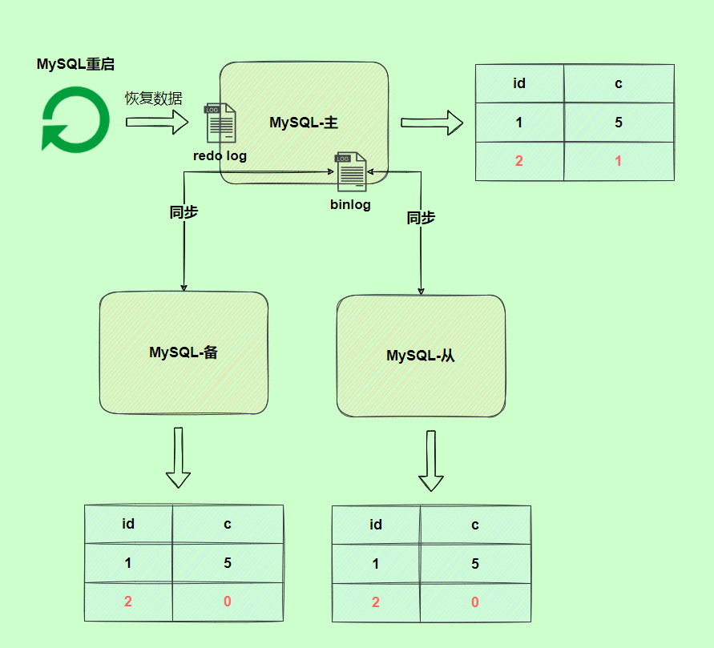

## Java基础

### 自动拆箱和装箱

+   自动拆箱和装箱是在jdk1.5以后才有的

+   装箱：将基本类型用包装器类型包装起来

+   拆箱：将包装类型转换成基本类型

+   自动装箱时会（自动）调用xxx.valueOf()

    +   Integer.valueOf()

    +   ```java
        /*
        Byte,Short,Integer,Long 这 4 种包装类默认创建了数值 [-128，127] 的相应类型的缓存数据，Character 创建了数值在 [0,127] 范围的缓存数据，Boolean 直接返回 True or False。
        Float、Double并没有实现缓存机制。
        */
        
        public static Integer valueOf(int i) {
            if (i >= IntegerCache.low && i <= IntegerCache.high)
                return IntegerCache.cache[i + (-IntegerCache.low)];
            return new Integer(i); 
        }
        
        public static Boolean valueOf(boolean b) {
            return (b ? TRUE : FALSE);
        }
        ```

+   自动拆箱时会（自动）调用xxxValue()

    +   new Integer(1).intValue()

### String的不可变性

#### String为什么是不可变的

[如何理解String的不可变]: https://www.zhihu.com/question/20618891/answer/114125846

```java
public final class String implements java.io.Serializable, Comparable<String>, CharSequence {
    private final char value[];//private的私有访问权限的作用都比final大
	//...
}
```

##### 原因

+   `String`的底层是`char`类型数组（java9将char[]改为byte[]，见补充），该数组被**final修饰**且为**私有（private）**，并且`String`类没有提供/暴露改变这个数组元素的方法/代码。
+   设计师很小心地把整个`String`设成`final`禁止继承，避免被子类继承后破坏。

##### 补充

+   新版的 `String `其实支持两个编码方案： Latin-1 和 UTF-16。如果字符串中包含的汉字没有超过 Latin-1 可表示范围内的字符，那就会使用 Latin-1 作为编码方案。Latin-1 编码方案下，`byte` 占一个字节(8 位)，`char` 占用 2 个字节（16），`byte` 相较 `char` 节省一半的内存空间。JDK 官方就说了绝大部分字符串对象只包含 Latin-1 可表示的字符。

+   `String`类里的`value`用`final`修饰，只是说栈里面这个叫`value`的引用地址不可变，并不是说堆中数组本身的数据不可变。

    ```java
    final int[] value = {1,2,3};
    int[] another = {4,5,6};
    value = another;//编译器报错，因为final不可变
    ```

    ``` java
    final int[] value = {1,2,3};
    value[0] = 5;//value里面的值已变成{5,2,3}
    ```

#### String不可变的好处

+   线程安全

    +   `String`不可变性天生具备线程安全，可以在多个线程中安全的使用

+   字符串常量池优化

    +   字面量创建的字符串对象，会在字符串常量池中进行缓存，如果下次创建同样的对象，会直接返回缓存中的引用。这样在大量使用字符串的情况下，可以节省内存空间，提高效率

    +   ```java
        String one = "abc";
        String two = "abc";
        ```

        

+   可以缓存`hash`值

    +   因为`String`的`hash`值经常被使用，如`String`常作为`HashMap`的`key`。不可变的特性可以使`hash`值不变，因此只需要计算一次。

    +   ```java
        /*
        把变量sb3指向sb1的地址，再改变sb3的值，因为StringBuilderi没有不可变性的保护，sb3直接在原先"aaa"的地址上改。导致sb1的值也变了。
        这时候，HashSet上就出现了两个相等的键值"aaabbb"，破坏了HashSet键值的唯一性。
        所以千万不要用可变类型做HashMap和HashSet键值。
        */
        public static void main(String[] args) {
            HashSet<StringBuilder> set = new HashSet<>();
            StringBuilder sb1 = new StringBuilder("aaa");
            StringBuilder sb2 = new StringBuilder("aaabbb");
            set.add(sb1);
            set.add(sb2);
        
            StringBuilder sb3 = sb1;
            sb3.append("bbb");
            System.out.println(sb1);//aaabbb
            System.out.println(set);//[aaabbb, aaabbb]
        }
        ```

### String、StringBuilder、StringBuffer的区别

|               | 是否可变 |   是否线程安全   | 性能 |
| :-----------: | :------: | :--------------: | :--: |
|    String     |  不可变  | 是（对象不可变） |  低  |
| StringBuilder |   可变   |        否        |  高  |
| StringBuffer  |   可变   |   是（加了锁）   | 较高 |

+   操作少量的数据: 适用 `String`
+   单线程操作字符串缓冲区下操作大量数据: 适用 `StringBuilder`
+   多线程操作字符串缓冲区下操作大量数据: 适用 `StringBuffer`

### StringBuilder为什么比String拼接字符串速度要快?

[StringBuilder的append方法原理]: https://blog.csdn.net/m0_60256757/article/details/124194421

#### 结论

`StringBuilder`的`append`方法的复杂度是O(n)，`String`类的 + 拼接方法复杂度是O(n+m)

#### 用append进行字符串拼接

`StirngBuilder`的`append()`调用了`System.arrayCopy()`，这是一个本地方法，具体作用就是从源数组`src`取元素，范围为下标`srcPos`到`srcPos+length-1`，取出共`length`个元素，存放到目标数组中，存放位置为下标`destPos`到`destPos+length-1`，简单来说就是数组复制。

所以我们可以知道`StringBuilder`类的`append`方法底层是调用了`System.arraycopy()`完成字符串的拼接，其复杂度是O(n)，n是要拼接字符串的长度。

#### 用+号进行字符串拼接

假如现在有这样一条语句 `str1+=str2`；我们编译器在遇到这条语句时会调用`new StringBuilder(str1)`产生一个`StringBuilder`对象，然后再调用这个对象的`append(str2)`方法对字符串进行拼接，最后调用`toString()`方法返回拼接好的字符串。所以`+`号的底层原理还是`StringBuilder`的`append`方法，但它的效率却低了不少，因为调用了两次`append`方法，还有一次是`new StringBuilder(str1)`这里调用了一次``append(str1)``方法。

```java
public StringBuilder(String str) {
    super(str.length() + 16);
    append(str);
}
```

### 为什么不建议在for循环中使用 + 进行字符串拼接

+   纠正自己以前的错误理解
+   
+   字符串对象通过`+`的字符串拼接方式，实际上每次循环都先`new`一个`StringBuilder`对象，通过 `StringBuilder` 调用 `append()` 方法实现的，拼接完成之后调用 `toString()` 得到一个 `String` 对象 。
+   频繁的新建对象要耗费很多时间，还会造成内存资源的浪费。
+   但是，要强调的是：
    +   如果不是在循环体中进行字符串拼接的话，直接使用 `+` 就好了。（最好不要，看上一条）
    +   如果在并发场景中进行字符串拼接的话，要使用`StringBuffer`来代替`StringBuilder`。

###  intern 方法有什么作用?

`String.intern()` 是一个 native（本地）方法，其作用是将指定的字符串对象的引用保存在字符串常量池中，可以简单分为两种情况：

-   如果字符串常量池中保存了对应的字符串对象的引用，就直接返回该引用。
-   如果字符串常量池中没有保存了对应的字符串对象的引用，那就在常量池中创建一个指向该字符串对象的引用并返回。

+   ```java
    // 在堆中创建字符串对象”Java“
    // 将字符串对象”Java“的引用保存在字符串常量池中
    String s1 = "Java";
    // 直接返回字符串常量池中字符串对象”Java“对应的引用
    String s2 = s1.intern();
    // 会在堆中在单独创建一个字符串对象
    String s3 = new String("Java");
    // 直接返回字符串常量池中字符串对象”Java“对应的引用
    String s4 = s3.intern();
    // s1 和 s2 指向的是堆中的同一个对象
    System.out.println(s1 == s2); // true
    // s3 和 s4 指向的是堆中不同的对象
    System.out.println(s3 == s4); // false
    // s1 和 s4 指向的是堆中的同一个对象
    System.out.println(s1 == s4); //true
    ```

### Object常见方法

+   getClass()、hashCode()、equals()、clone()浅拷贝、toString()、wait()、notify()、notifyAll()、finalize()

###  == 和 equals() 的区别

+   **`==`** 对于基本类型和引用类型的作用效果是不同的：

    -   对于基本数据类型来说，`==` 比较的是值。

    -   对于引用数据类型来说，`==` 比较的是对象的内存地址。

    +   因为 Java 只有值传递，所以，对于 == 来说，不管是比较基本数据类型，还是引用数据类型的变量，其本质比较的都是值，只是引用类型变量存的值是对象的地址。

+   `equals()` 方法存在两种使用情况：

    -   **类没有重写 `equals()`方法** ：通过`equals()`比较该类的两个对象时，等价于通过“==”比较这两个对象，使用的默认是 `Object`类`equals()`方法。
    -   **类重写了 `equals()`方法** ：一般我们都重写 `equals()`方法来比较两个对象中的属性是否相等；若它们的属性相等，则返回 true(即，认为这两个对象相等)。

+ ```java
  public boolean equals(Object obj) {
       return (this == obj);
  }
  ```
  

### 以 HashSet如何检查重复 为例子来说明为什么要有 hashCode

>   当你把对象加入 `HashSet` 时，`HashSet` 会先计算对象的 `hashCode` 值来判断对象加入的位置，同时也会与其他已经加入的对象的 `hashCode` 值作比较，如果没有相符的 `hashCode`，`HashSet` 会假设对象没有重复出现。但是如果发现有相同 `hashCode` 值的对象，这时会调用 `equals()` 方法来检查 `hashCode` 相等的对象是否真的相同。如果两者相同，`HashSet` 就不会让其加入操作成功。如果不同的话，就会重新散列到其他位置。这样我们就大大减少了 `equals` 的次数，相应就大大提高了执行速度。

### hashCode() 和 equals() 的关系

[hashCode() 和 equals()的若干问题解答]: https://www.cnblogs.com/skywang12345/p/3324958.html

+   **第一种 不会创建“类对应的散列表”**
    +   这里所说的“不会创建类对应的散列表”是说：我们不会在HashSet, Hashtable, HashMap等等这些本质是散列表的数据结构中，用到该类。例如，不会创建该类的HashSet集合。
    +   在这种情况下，该类的“hashCode() 和 equals() ”没有半毛钱关系
    +   这种情况下，equals() 用来比较该类的两个对象是否相等。而hashCode() 则根本没有任何作用，所以，不用理会hashCode()。
+   **第二种 会创建“类对应的散列表”**
    +   这里所说的“会创建类对应的散列表”是说：我们会在HashSet, Hashtable, HashMap等等这些本质是散列表的数据结构中，用到该类。例如，会创建该类的HashSet集合。
    +   在这种情况下，该类的“hashCode() 和 equals() ”是有关系的：
        +   如果两个对象相等，那么它们的hashCode()值一定相同。这里的相等是指，通过equals()比较两个对象时返回true。
        +   如果两个对象hashCode()相等，它们并不一定相等。因为在散列表中，hashCode()相等，即两个键值对的哈希值相等。然而哈希值相等，并不一定能得出键值对相等。补充说一句：“两个不同的键值对，哈希值相等”，这就是哈希冲突。
        +   此外，在这种情况下。若要判断两个对象是否相等，除了要覆盖equals()之外，也要覆盖hashCode()函数。否则，equals()无效。例如，创建Person类的HashSet集合，必须同时覆盖Person类的equals() 和 hashCode()方法。如果单单只是覆盖equals()方法。我们会发现，equals()方法没有达到我们想要的效果。
+   只重写equals()
    +   HashSet中仍会有重复元素，这是因为**两个内容相同的对象p1、p2，他们的hashCode仍可能不等（因为是new出来的不同对象，hashCode自然不同）**，根据HashSet存放元素的原理来看，HashSet就会认为这两个对象不等，因此HashSet中会出现很多重复元素。
+   只重写hashCode()
    +   会发现明明是内容不同的元素，却无法都存入HashSet，这是因为出现了**哈希碰撞**，两个对象有相同的 `hashCode` 值，他们也不一定是相等的。

### 常见哈希散列算法  

+   拉链法：数组+链表。先调用这个元素的 hashCode 方法，然后根据所得到的值计算出元素应该在数组的位置，如果这个位置上没有元素，那么直接将它存储在这个位置上；如果这个位置上已经有元素了，那么调用它的equals方法与新元素进行比较：相同的话就不存了，否则，将其存在这个位置对应的链表中
+   开放地址法：使用散列函数计算位置，冲突时顺位到下一个位置。

### static块初始化顺序

+   静态变量和静态语句块优先于实例变量和普通语句块，静态变量和静态语句块的初始化顺序取决于它们在代码中的顺序。如果存在继承关系的话，初始化顺序为**父类中的静态变量和静态代码块一一子类中的静态变量和静态代码块一一父类中的实例变量和普通代码块一一父类的构造函数一一子类的实例变量和普通代码块一一子类的构造函数**

### 面向对象和面向过程的区别

两者的主要区别在于解决问题的方式不同：

-   面向过程把解决问题的过程拆成一个个方法，通过一个个方法的执行解决问题。
-   面向对象会先抽象出对象，然后用对象执行方法的方式解决问题。

另外，面向对象开发的程序一般更易维护、易复用、易扩展。

### 面向对象五大基本原则

+   单一职责、开放封闭、里式替换、依赖倒置、接口隔离  （单开你一姐）

### 接口和抽象类有什么共同点和区别？

**共同点** 

-   都不能被实例化。

-   都可以包含抽象方法。

-   都可以有默认实现的方法（Java8中接口中引入**默认方法**（default）和**静态方法**）

    ```java
    interface Animal {
        int a = 0;
        default void fun() {
            System.out.println("fun");
        }
        static void function() {
            return;
        }
    }
    ```

**区别** 

-   接口主要用于对类的行为进行约束，你实现了某个接口就具有了对应的行为。抽象类主要用于代码复用，强调的是所属关系。
-   一个类只能继承一个类，但是可以实现多个接口。
-   接口中的成员变量只能是 `public static final` 类型的，不能被修改且必须有初始值，而抽象类的成员变量默认 default，可在子类中被重新定义，也可被重新赋值。

### 深拷贝和浅拷贝

+   **浅拷贝**：浅拷贝会在堆上创建一个新的对象（区别于引用拷贝的一点），不过，如果原对象内部的属性是引用类型的话，浅拷贝会直接复制内部对象的引用地址，也就是说拷贝对象和原对象共用同一个内部对象。

+   **深拷贝** ：深拷贝会完全复制整个对象，包括这个对象所包含的内部对象。

+   

+   ```java
    class Address{
        private String name; 
    }
    class Person{
        private Address address;
    }
    ```

### 异常

#### 异常类结构图

+   
+   

​    

#### Checked Exception 和 Unchecked Exception

+   **Checked Exception** 即 **受检查异常** ，Java 代码在编译过程中，如果受检查异常没有被 `catch`或者`throws` 关键字处理的话，就没办法通过编译。
+   **Unchecked Exception** 即 **不受检查异常** ，Java 代码在编译过程中 ，我们即使不处理不受检查异常也可以正常通过编译。

---


## Java集合

### 集合框架

+   
+   
+   集合主要是由两大接口派生而来：一个是 `Collection`接口，主要用于存放单一元素，下面有三个主要的子接口：`List`、`Set` 和 `Queue`；另一个是 `Map` 接口，主要用于存放键值对。

###  集合底层数据结构

#### List

-   `ArrayList`： `Object[]` 数组
-   `Vector`：`Object[]` 数组
-   `LinkedList`： 双向链表(JDK1.6 之前为循环链表，JDK1.7 取消了循环)

#### Set

-   `HashSet`(无序，唯一): 基于 `HashMap` 实现的，底层采用 `HashMap` 来保存元素
-   `LinkedHashSet`: `LinkedHashSet` 是 `HashSet` 的子类，并且其内部是通过 `LinkedHashMap` 来实现的。
-   `TreeSet`(有序，唯一): 红黑树(自平衡的排序二叉树)

#### Queue（单端队列）

-   `PriorityQueue`: `Object[]` 数组来实现二叉堆
-   `ArrayQueue`: `Object[]` 数组 + 双指针
-   `Deque`:双端队列

#### Map

-   `HashMap`： JDK1.8 之前 `HashMap` 由**数组+链表**组成的，数组是 `HashMap` 的主体，链表则是主要为了解决哈希冲突而存在的（“拉链法”解决冲突）。JDK1.8 以后为**数组+链表/红黑树**在解决哈希冲突时有了较大的变化，当**链表长度大于阈值（默认为 8）**（将链表转换成红黑树前会判断`treeifyBin()`，如果当前数组的长度小于 64，那么会选择先进行数组扩容，而不是转换为红黑树）时，将链表转化为红黑树，以减少搜索时间；当**长度小于6时**，从红黑树转为链表
-   `LinkedHashMap`： `LinkedHashMap` 继承自 `HashMap`，所以它的底层仍然是基于拉链式散列结构即由数组和链表或红黑树组成。另外，`LinkedHashMap` 在上面结构的基础上，增加了一条双向链表，使得上面的结构可以保持键值对的插入顺序。同时通过对链表进行相应的操作，实现了访问顺序相关逻辑。详细查看：[《LinkedHashMap 源码详细分析（JDK1.8）》open in new window](https://www.imooc.com/article/22931)
-   `Hashtable`： 数组+链表组成的，数组是 `Hashtable` 的主体，链表则是主要为了解决哈希冲突而存在的
-   `TreeMap`： 红黑树（自平衡的排序二叉树）

### 线程安全问题

#### 线程安全的集合

+   `Vector`、`Stack`、`HashTable`、`ConcurrentHashMap`

#### 线程不安全的集合

+   `Hashmap`、`Arraylist`、`LinkedList`、`HashSet`、`TreeSet`、`TreeMap`

### 怎么确保一个集合不能被修改？

+   可以使用 **Collections. unmodifiableCollection(Collection c) **方法来创建一个只读集合，这样改变集合的任何操作都会抛出 `Java. lang. UnsupportedOperationException` 异常。

+   ```java
    List list = new ArrayList<>();
    list.add("x");
    Collection clist = Collections.unmodifiableCollection(list);
    clist.add("y"); // 运行时此行报错
    ```

### fast-fail机制

[什么是fail-fast]: https://www.cnblogs.com/54chensongxia/p/12470446.html

#### fast-fail是什么

+   首先，`fast-fail`机制并不是Java集合中特有的，它是一个通用的系统设计思想。是一种错误检测机制，一旦检测到可能发生的错误，就立马抛出异常，程序不继续往下执行。

    ```java
    //开发中常用
    public UserDomain queryUserById(String userId){
        if(userId == null || "".equals(userId)){
            throw new RuntimeException("error params...");
        }
        //do something
    }
    ```

#### fast-fail在集合中的应用

+   当多个线程同时对集合中的内容进行修改时，可能就会抛出`ConcurrentModificationException`异常。其实不仅仅是在多线程状态下，在单线程中用增强`for`循环中一边遍历集合一边**修改集合的元素**也会抛出`ConcurrentModificationException`异常。

##### 单线程

+   ```java
    ArrayList<Integer> list = new ArrayList<>();
    list.add(1);list.add(2);list.add(3);list.add(4);list.add(5);
    for (Integer integer : list) {
        list.remove(integer);
    }
    
    Exception in thread "main" java.util.ConcurrentModificationException
    	at java.util.ArrayList$Itr.checkForComodification(ArrayList.java:901)
    	at java.util.ArrayList$Itr.next(ArrayList.java:851)
    	at com.hcy.a.main(ListNode.java:114)
        
    List<String> userNames = new ArrayList<String>() {{
        add("Hollis");
        add("hollis");
        add("HollisChuang");
        add("H");
    }};
    for (String userName : userNames) {
        if (userName.equals("Hollis")) {
            userNames.remove(userName);
        }
    }
    System.out.println(userNames);
    
    ```

    以上代码，使用增强`for`循环删除`list`中的元素，就会抛出`ConcurrentModificationException`异常（虽然本例中没有出现多线程并发）。

+   **异常产生的原因**：

    ```java
    /*
    增强for循环是Java提供的一个语法糖，将代码反编译后可以看到增强for循环其实是用的是Iterator迭代器。
    
    同样，在增强for循环中使用add方法添加元素，结果也会同样抛出该异常。
    */
    
    public static void main(String[] args) {
        // 使用ImmutableList初始化一个List
        List<String> userNames = new ArrayList<String>() {{
            add("Hollis");
            add("hollis");
            add("HollisChuang");
            add("H");
        }};
    
        Iterator iterator = userNames.iterator();
        do
        {
            if(!iterator.hasNext())
                break;
            String userName = (String)iterator.next();
            if(userName.equals("Hollis"))
                userNames.remove(userName);
        } while(true);
        System.out.println(userNames);
    }
    ```

    异常是由`iterator.next()`调用`checkForComodification()`而产生的，每次迭代都会比较`modCount`和`expectedModCount`的值是否相等

    ```java
    final void checkForComodification() {
        if (modCount != expectedModCount)
            throw new ConcurrentModificationException();
    }
    ```

    在该方法中对`modCount`和`expectedModCount`进行了比较，如果二者不相等，则抛出`CMException`。
    
+   **那么，modCount和expectedModCount是什么？是什么原因导致他们的值不相等的呢？**
    
    +   `modCount`是`AbstractList`中的一个成员变量。它表示该集合实际被修改的次数。
    +   `expectedModCount `是 `ArrayList`中的一个内部类——`Itr`中的成员变量。`expectedModCount`表示这个迭代器预期该集合被修改的次数。其值随着`Itr`被创建而初始化，只有通过迭代器对集合进行操作，该值才会改变。
    + `list.remove(Object o)`中调用了`fastRemove(int index)`
    
        ```java
        private void fastRemove(int index) {
            modCount++;
            int numMoved = size - index - 1;
            if (numMoved > 0)
                System.arraycopy(elementData, index+1, elementData, index,
                                 numMoved);
            elementData[--size] = null; // clear to let GC do its work
        }
        ```
    
        可以看到只修改了`modCount`，没有对`exceptedModCount`做任何操作。
    
        **所以导致产生异常的原因是：**`remove`和`add`操作会导致`modCount`和迭代器中的`expectedModCount`不一致。
    

##### 多线程

+   多线程的情况下即使用了迭代器调用`remove()`方法，还是会报`ConcurrentModificationException`异常。这又是为什么呢？
+   还是要从`expectedModCount`和`modcount`这两个变量入手分析，刚刚说了`modCount`在`AbstractList`类中定义，而`expectedModCount`在`ArrayList`内部类`Itr`中定义，所以`modcount`是个共享变量而`expectedModcount`是属于线程各自的。
+   简单说，线程1更新了`modcount`和属于自己的`expectedModCount`，而在线程2看来只有`modCount`更新了，`expectedModCount`并未更新，所以会抛出`ConcurrentModificationException`异常。

#### 异常解决方法

+   **直接使用`Iterator`进行操作**

    ```java
    while (iterator.hasNext()) {
        if (iterator.next().equals("Hollis")) {
            iterator.remove();
        }
    }
    ```

    `Iterator`提供的`remove`方法：

    ```java
    public void remove() {
    	if (lastRet < 0)
    		throw new IllegalStateException();
    		checkForComodification();
    	try {
    		ArrayList.this.remove(lastRet);
    		cursor = lastRet;
    		lastRet = -1;
    		expectedModCount = modCount;//保证了modCount和expectedModCount一致
    	} catch (IndexOutOfBoundsException ex) {
    		throw new ConcurrentModificationException();
    	}
    }
    ```

+   **直接使用fail-safe的集合类**

    在Java中，除了一些普通的集合类以外，还有一些采用了fail-safe机制的集合类。这样的集合容器在遍历时不是直接在集合内容上访问的，而是先复制原有集合内容，在拷贝的集合上进行遍历。

    由于迭代时是对原集合的拷贝进行遍历，所以在遍历过程中对原集合所作的修改并不能被迭代器检测到，所以不会触发`ConcurrentModificationException`。

    **即，使用`CopyOnWriteArrayList`替换`ArrayList`**

#### 补充

+   `ArrayList`中的`remove()`方法有重载形式，根据循环变量是否为包装类来选择使用哪个方法。
+   `public E remove(int index)`
    +   普通`for`循环---`for(int i = 0; i < loop; i++){}`，循环变量是`int`基本数据类型
+   ``public boolean remove(Object o)`
    +   普通`for`循环---`for(Integer i = 0; i < loop; i++){}`，循环变量是`Integer`包装类型
    +   增强`for`循环---`for(Integer i : list){}`，循环变量是`Integer`包装类型
    
+   ```java
    public static void main(String[] args) {
    	List<Integer> list = new ArrayList<>();
    	list.add(1);
    	list.add(2);
    	list.add(3);
    	Iterator<Integer> it = list.iterator();
    	while (it.hasNext()) {
        //如果没有调用next()来使迭代器进展到下一个元素，则该方法将抛出IllegalStateException
        //remove()会对lastRet进行判断，小于0则抛出异常，而lastRet成员变量初始值为-1，在next()中被重新赋值
    	it.remove();
    	}
    }
    ```

    

### fail-safe机制

+   采用安全失败机制的集合容器，在遍历时不是直接在集合内容上访问的，而是**先复制原有集合内容，在拷贝的集合上进行遍历**。所以在遍历过程中对原集合所作的修改并不能被迭代器检测到，所以不会抛出`ConcurrentModificationException`异常。
+   缺点是迭代器遍历的是开始遍历那一刻拿到的集合拷贝，在遍历期间原集合发生了修改，迭代器是无法访问到修改后的内容.
+   `java.util.concurrent`包下的容器都是安全失败，可以在多线程下并发使用。

### Array和ArrayList有何区别

+   `Array`可以包含基本类型和对象类型，`ArrayList`只能包含对象类型
+   `Array`大小是固定的，`ArrayList`的大小是动态变化的。(`ArrayList`的扩容)
+   相比于`Array`，`ArrayList`有着更多的`API`
+   对于基本类型数据，`ArrayList`使用自动装箱来减少编码工作量；而当处理固定大小的基本数据类型的时候，这种方式相对比较慢，这时候应该使用`Array`。（主要前三点）

### 对于List的三种遍历方式该如何选择？

+   在Java集合框架中，提供了一个`RandomAccess`接口，该接口没有方法，只是一个标记。通常用来标记`List`的实现是否支持`RandomAccess`（只要List集合实现这个接口，就能支持快速随机访问）。所以在遍历时，可以先判断是否支持`RandomAccess(List instance of RandomAccess)`，如果支持可用for循环遍历，否则建议用`Iterator`或`foreach`遍历。
+   `ArrayList`基于数组实现，天然带下标，可以实现常量级的随机访问，复杂度为O(1)
+   `LinkedList`基于链表实现，随机访问需要依靠遍历实现，复杂度为O(n)

### Comparable 和 Comparator的区别？

+   `Comparable `接口实际上是出自`java.lang`包，它有一个 `compareTo(Object obj)`方法用来排序

+   `Comparator`接口实际上是出自 `java.util` 包，它有一个`compare(Object obj1, Object obj2)`方法用来排序

+   `Comparable`是排序接口，若一个类实现了`Comparable`接口，就意味着“该类支持排序”，像`Integer`、`String`等 ，所以可以直接调用`Collections.sort()`

+   而`Comparator`是比较器，通过一个类实现这个接口来作为一个比较器来进行排序。

+   `Comparable`相当于“内部比较器”，而`Comparator`相当于“外部比较器”。

+   各自的优劣

    +   用`Comparable `简单， 只要实现`Comparable `接口的对象直接就成为一个可以比较的对象，但是需要修改源代码。
    +   用`Comparator `的好处是不需要修改源代码， 而是另外实现一个比较器， 当某个自定义的对象需要作比较的时候，把比较器和对象一起传递过去就可以比大小了， 并且在`Comparator `里面用户可以自己实现复杂的可以通用的逻辑，使其可以匹配一些比较简单的对象，那样就可以节省很多重复劳动了。

+   ```java
    //数组排序
    String[] str = new String[5];
    Arrays.sort(str, new Comparator<String>() {
        @Override
        public int compare(String o1, String o2) {
            // TODO Auto-generated method stub
            return 0;
        }
    });
    //List集合排序
    ArrayList<String> list = new ArrayList<String>();
    Collections.sort(list, new Comparator<String>() {
        @Override
        public int compare(String o1, String o2) {
            // TODO Auto-generated method stub
            return 0;
        }
    });
    /*
    Collections.sort()
    1、要求传入的待排序容器中存放的对象必须实现 Comparable 接口，该接口提供了比较元素的compareTo()方法，当插入元素时会调用该方法比较元素的大小
    2、可以传入集合中的元素没有实现Comparable接口的对象，但是要求传入第二个参数，参数是Comparator 接口的子类型（需要重写 compare 方法实现元素的比较），也就是你需要定义一个比较器，然后sort()方法比较实际上就是调用这个比较器的 compare 方法来进行比较
    */
    List<Dog> list = new ArrayList<>();
    	list.add(new Dog(1));
    	list.add(new Dog(2));
    	Collections.sort(list, new Comparator<Dog>() {
        	@Override
        	public int compare(Dog o1, Dog o2) {
            	return 0;
        	}
    	});
    
    class Dog {
        private int age;
        
        public Dog() {
        }
        
        public Dog(int age) {
            this.age = age;
        }
        
        @Override
        public boolean equals(Object o) {
            if (this == o) return true;
            if (o == null || getClass() != o.getClass()) return false;
            Dog dog = (Dog) o;
            return age == dog.age;
        }
        
        @Override
        public int hashCode() {
            return Objects.hash(age);
        }
    }
    ```

### ArrayList扩容机制

[一步一步分析ArrayList扩容机制]: https://javaguide.cn/java/collection/arraylist-source-code.html

+   ArrayList的默认初始容量为10，扩容时对是旧的容量值加上旧的容量数值进行右移一位（位运算，相当于除以2，位运算的效率更高），所以每次扩容都是旧的容量的1.5倍。

+   以无参数构造方法创建 `ArrayList` 时，实际上初始化赋值的是一个空数组。当真正对数组进行添加元素操作时，才真正分配容量。即向数组中添加第一个元素时（`minCapacity = Math.max(DEFAULT_CAPACITY, minCapacity);`），数组容量扩为 10。

+   当一次性的增长值超过新的容量时（且未超过最大容量），就会把**增长值+原容量**作为新容量。

    ```java
    private void grow(int minCapacity) {//minCapacity为
            // overflow-conscious code
            int oldCapacity = elementData.length;
            int newCapacity = oldCapacity + (oldCapacity >> 1);
            if (newCapacity - minCapacity < 0)
                newCapacity = minCapacity;//一次性的增长值超过新的容量newCapacity时的情况
            if (newCapacity - MAX_ARRAY_SIZE > 0)//最新容量（注意是最新）大于最大容量的情况
                newCapacity = hugeCapacity(minCapacity);
            // minCapacity is usually close to size, so this is a win:
            elementData = Arrays.copyOf(elementData, newCapacity);
        }
    ```

    

### System.arraycopy() 和 Arrays.copyOf()

**联系：**

看两者源代码可以发现 `Arrays.copyOf()`内部实际调用了 `System.arraycopy()` 方法

**区别：**

`System.arraycopy()` 需要目标数组，将原数组拷贝到自己定义的数组里或者原数组，而且可以选择拷贝的起点和长度以及放入新数组中的位置。 `Arrays.copyOf()` 是系统自动在内部新建一个数组，并返回该数组。

### Set

#### HashSet实现原理

+   `HashSet`底层是`HashMap`，默认构造函数是构建一个初始容量为16，负载因子为0.75的`HashMap`。
+   `HashSet`的值存放于`HashMap`的`key`上，`HashMap`的`value`统一为`Object对象PRESENT`。

#### HashSet如何检查重复

+   见上面**以 HashSet如何检查重复 为例子来说明为什么要有 hashCode**

#### HashSet和HashMap的区别

+   

### Map

[Hashmap实现原理及扩容机制详解]: https://blog.csdn.net/lkforce/article/details/89521318

[JDK1.7中HashMap在多线程环境的并发问题源码分析]: https://blog.csdn.net/Guyui233/article/details/125326512

头插法带来的死链

#### jdk1.8中并发问题

+   元素覆盖
    +   

#### HashMap求桶的位置

##### HashMap求桶的位置一共分为三个过程

+   1、求key的hashcode

+   2、调用hash函数得到hash值，将hashcode的高16位和低16位进行异或操作。

    ```java
    static final int hash(Object key) {
        int h;
        return (key == null) ? 0 : (h = key.hashCode()) ^ (h >>> 16);
    }
    ```

+  3、通过(length- 1) & hash ，将hash值与length-1进行与操作，求桶的位置（其中hash值是上面hash函数得到的值，length是table数组的长度）
   
    ```java
    if ((p = tab[i = (n - 1) & hash]) == null)
    	tab[i] = newNode(hash, key, value, null);
    ```
    
    注意：不是得到hash值就知道把元素存在数组中的哪个位置，而是还要经过(length- 1) & hash之后才可以得到数组的位置，这样是为了减少hash冲突

+   **无论是JDK7还是JDK8，HashMap的扩容都是每次扩容为原来的两倍**，即会产生一个新的数组newtable，JDK1.8和1.7的扩容其实差不多，只是把原来数组中的元素全部放到新的**只不过元素求桶的位置的方法不太一样**。

+   在JDK7中就是按照上述写的三个步骤重新对元素求桶的位置，但是第三步与的值是新的数组的长度-1，也就是newCap-1。
    +   如果与oldCap与的结果是0，那么就代表当前元素的桶位置不变。
    +   如果结果为1，那么桶的位置就是原位置+原数组长度（oldCap）

```java
if (e.next == null)
    newTab[e.hash & (newCap - 1)] = e;//插入新值
```

+   但是JDK8中就不是和newCap，而是直接与oldCap，**也就是将hash值与旧数组的长度（oldCap）进行与操作。**

```java
if ((e.hash & oldCap) == 0) {
    newTab[j] = loHead;
} else {
    newTab[j + oldCap] = hiHead;
}
```


#### HashMap在JDK1.7和1.8有什么不同

+   

+   也有说1.7为4次扰动，1.8为1次

#### HashMap在JDK1.8前后对解决冲突的区别

+   1.8之前
    +   JDK1.8 之前 HashMap 底层是 **数组和链表** 结合在一起使用也就是 **链表散列**。
    +   `HashMap `通过 `key ` 的 `hashCode `经过扰动函数处理过后得到 `hash `值，然后通过 `(n - 1) & hash` 判断当前元素存放的位置（这里的 n 指的是数组的长度），如果当前位置存在元素的话，就判断该元素与要存入的元素的 `hash `值以及 `key `是否相同，如果相同的话，直接覆盖，不相同就通过拉链法解决冲突。
+   1.8之后
    +   当链表长度大于阈值（默认为 8）时，会首先调用 `treeifyBin()`方法。这个方法会根据 `HashMap `数组来决定是否转换为红黑树。只有当数组长度大于或者等于 64 的情况下，才会执行转换红黑树操作，以减少搜索时间。否则，就是只是执行 `resize()` 方法对数组扩容。
+   **为什么要这么改？**
    +   我们知道链表的查找效率为O(n)，而红黑树的查找效率为O（logn），查找效率变高了。
    
+   **为什么不直接用红黑树？**
    +   因为红黑树的节点所占的空间是普通链表节点的两倍，但查找的时间复杂度低，所以只有当节点特别多时，红黑树的优点才能体现出来。
    +   因为红黑树的查找效率虽然变高了，但是插入效率变低了，如果从一开始就用红黑树并不合适。从概率学的角度选了一个合适的临界值为8。


#### HashMap 的长度为什么是 2 的幂次方

+   为了能让 HashMap 存取高效，尽量较少碰撞，也就是要尽量把数据分配均匀。我们上面也讲到了过了，Hash 值的范围值-2147483648 到 2147483647，前后加起来大概 40 亿的映射空间，只要哈希函数映射得比较均匀松散，一般应用是很难出现碰撞的。但问题是一个 40 亿长度的数组，内存是放不下的。所以这个散列值是不能直接拿来用的。用之前还要先做对数组的长度取模运算，得到的余数才能用来要存放的位置也就是对应的数组下标。这个数组下标的计算方法是“ `(n - 1) & hash`”。（n 代表数组长度）。这也就解释了 HashMap 的长度为什么是 2 的幂次方。
+   我们首先可能会想到采用%取余的操作来实现。但是，重点来了：**“取余(%)操作中如果除数是 2 的幂次则等价于与其除数减一的与(&)操作（也就是说 hash%length==hash&(length-1)的前提是 length 是 2 的 n 次方；）。”** 并且 **采用二进制位操作 &，相对于%能够提高运算效率**，这就解释了 HashMap 的长度为什么是 2 的幂次方。

#### 为什么HashMap中String、Integer这样的包装类适合作为Key?

+   这些包装类都是final修饰，是不可变性的，保证了key的不可更改性，不会出现放入和获取时哈希值不同的情况，且它们内部已经重写过`hashCode()`，`equals()`等方法。

#### 为什么说java包装类是不可变的

[为什么java包装类是不可变的？]: https://java.dovov.com/11437/%E4%B8%BA%E4%BB%80%E4%B9%88java%E5%8C%85%E8%A3%85%E7%B1%BB%E6%98%AF%E4%B8%8D%E5%8F%AF%E5%8F%98%E7%9A%84%EF%BC%9F.html

```java
    public static void main(String[] args) {
        Integer i = new Integer(20); //initialize a object of Integer class with value as 20.
        System.out.println(i);
        operate(i);// method to change value of object.
        System.out.println(i); //value doesn't change shows that object is immutable.
    }
    
    private static void operate(Integer i) {
        i = i + 1;
    }
//20
//20
```

#### **loadFactor 加载因子**

+   loadFactor 加载因子是**控制数组存放数据的疏密程度**，loadFactor 越趋近于 1，那么 数组中存放的数据(entry)也就越多，也就越密，也就是会让链表的长度增加，loadFactor 越小，也就是趋近于 0，数组中存放的数据(entry)也就越少，也就越稀疏。

+   **loadFactor 太大导致查找元素效率低，太小导致数组的利用率低，存放的数据会很分散。loadFactor 的默认值为 0.75f 是官方给出的一个比较好的临界值**。

+   给定的默认容量为 16，负载因子为 0.75。Map 在使用过程中不断的往里面存放数据，当数量达到了 16 * 0.75 = 12 就需要将当前 16 的容量进行扩容，而扩容这个过程涉及到 rehash、复制数据等操作，所以非常消耗性能。

#### Put方法

+   1.7
    +   

+   1.8
    +   HashMap 只提供了 put 用于添加元素，putVal 方法只是给 put 方法调用的一个方法，并没有提供给用户使用。
    +   **对 putVal 方法添加元素的分析如下：**
        +   如果定位到的数组位置没有元素 就直接插入。
        +   如果定位到的数组位置有元素就和要插入的 key 比较，如果 key 相同就直接覆盖，如果 key 不相同，就判断 p 是否是一个树节点，如果是就调用`e = ((TreeNode<K,V>)p).putTreeVal(this, tab, hash, key, value)`将元素添加进入。如果不是就遍历链表插入(插入的是链表尾部)。

    +   


#### 如何决定使用 HashMap 还是 TreeMap？

##### 介绍

+   `TreeMap<K,V>`的`Key`值是要求实现`java.lang.Comparable`，所以迭代的时候`TreeMap`默认是按照`Key`值升序排序的；TreeMap的实现是基于红黑树结构。适用于按自然顺序或自定义顺序遍历键（`key`）。
+   `HashMap<K,V>`的`Key`值实现散列`hashCode()`，分布是散列的、均匀的，不支持排序；数据结构主要是桶(数组)，链表或红黑树。适用于在`Map`中插入、删除和定位元素。

##### 结论

+   如果需要保持`map`中的数据有序，那就用`TreeMap`，其他时候用`HashMap`，因为它的插入、删除等操作性能更高

#### HashMap是怎么解决哈希冲突的？

+   哈希冲突：hashMap在存储元素时会先计算key的hash值来确定存储位置，因为key的hash值计算最后有个对数组长度取余的操作，所以即使不同的key也可能计算出相同的hash值，这样就引起了hash冲突。
+   HashMap中的哈希冲突解决方式可以主要从三方面考虑（以JDK1.8为背景）
    +   拉链法
        +   HasMap中的数据结构为数组+链表/红黑树，当不同的key计算出的hash值相同时，就用链表的形
            式将Node结点（冲突的key及key对应的value)挂在数组后面。
    +   hash函数
        +   key的hash值经过两次扰动，key的hashCode值与key的hashcode值的右移16位进行异或，然后对数组的长度取余（实际为了提高性能用的是位运算，但目的和取余一样），这样做可以让hashCode取值出的高位也参与运算，进一步降低hash冲突的概率，使得数据分布更平均。
    +   红黑树
        +   在拉链法中，如果hash冲突特别严重，则会导致数组上挂的裢表长度过长，性能变差，因此在链表长度大于8时，将链表转化为红黑树，可以提高遍历链表的速度。

### 计网

#### GET和POST区别

+   作用

    +   GET用于获取资源，POST用于传输实体主体

+  参数位置
    +   GET的参数放在URL中，POST的参数存储在实体主体中，并且GET方法提交的请求的URL中的数据做多是2048字节，POST请求没有大小限制。
+ 安全性
        +   GET方法因为参数放在URL中，安全性相对于POST较差一些
    
+   幂等性
     +   GET方法是具有幂等性的，而POST方法不具有幂等性。这里幂等性指客户连续发出多次请求，收到的结果都是一样的
     +   GET方法用于获取资源，不应有副作用，所以是幂等的。比如: GET htp:/www.bank.comlaccount123456，不会改变资源的状态，不论调用一次还是N次都没有副作用。请注意，**这里强调的是一次和N次具有相同的副作用，而不是每次GET的结果相同**。GEThttp://www.news.comlatest-news。**这个HTTP请求可能会每次得到不同的结果，但它本身并没有产生任何副作用，因而是满足幂等性的**


#### 在浏览器输入url地址到页面显示的过程

+   对输入到浏览器的URL进行DNS解析，将域名转换为IP地址。
+   和目的服务器建立TCP连接
+   向目的服务器发送HTTP请求
+   服务器处理请求并返回HTTP报文
+   浏览器解析并渲染页面

## MySQL

### 数据库三大范式是什么？

+   第一范式：确保每列的原子性，每个列都不可以再拆分。
+   第二范式：在第一范式的基础上，属性完全依赖于主键，而不能是依赖于主键的一部分。
+   第三范式：在第二范式的基础上，属性不依赖于其它非主属性，属性直接依赖于主键，
+   第三范式确保没有传递函数依赖关系，也就是消除传递依赖，数据不能存在传递关系，即每个属性都跟主键有直接关系而不是间接关系

### MySQL常用引擎有哪些？区别？


### MySQL提供的两种日期类型

+   DATETIME
    +   能够**保存从 1001 年到 9999 年**的日期和时间，精度为秒，使用 **8 字节**的存储空间。
    +   **与时区无关**。
+   TIMESTAMP
    +   保存从 1970 年 1 月 1 日午夜(格林威治时间)以来的秒数，使用 **4 字节**，**只能表示从 1970 年 到 2038 年**。
    +   **和时区有关**，也就是说一个时间戳在不同的时区所代表的具体时间是不同的。

### 索引

索引是一种用于快速查询和检索的数据结构，其本质可以看成是一种排序好的数据结构。

#### 索引的优缺点

+   优点

    +   使用索引可以大大加快数据检索的速度（将随机IO变为了顺序IO，b+树的叶子结点是双向链表）
    +   创建唯一性索引可以保证，数据库表中每一行数据的唯一性
    +   补充：磁盘IO时间 = 寻道时间 + 旋转延迟 + 传输时间
        +   寻道：磁臂移动到指定磁道
        +   旋转：磁盘转速
        +   传输：将数据读出或写入，与前面相比，可忽略
        +   考虑到磁盘IO是非常高昂的操作，计算机操作系统做了一些优化，**当一次IO时，不光把当前磁盘地址的数据，而是把相邻的数据也都读取到内存缓冲区内**，因为局部预读性原理告诉我们，当计算机访问一个地址的数据的时候，与其相邻的数据也会很快被访问到。每一次IO读取的数据我们称之为一页(page)。具体一页有多大数据跟操作系统有关，一般为4k或8k，也就是我们读取一页内的数据时候，实际上才发生了一次IO

+   缺点

    +   索引需要使用物理文件存储，会占用一定的空间
    +   创建和维护索引都需要花费时间。如对表中数据进行增删改查的时候，若数据有索引，索引也需要动态的修改，降低SQL执行效率。
    +   并不是创建了索引，就一定会加快检索速度，若表中数据本身不多，则使用索引可能比不使用更慢/没多少提升

#### 索引的数据结构

##### 为什么不使用哈希索引

+   Hash索引若进行范围查找，时间复杂度会退化为O(n)，而树形的有序特性，仍可以保持O(log2N)
+   Hash索引的数据存储是无序的，若要进行顺序查找，则Hash索引还要重新排序

##### B 树& B+树两者有何异同呢？

-   1、B 树的所有节点既存放键(key) 也存放 数据(data)，而 B+树只有叶子节点存放 key 和 data，其他内节点只存放 key。
-   2、B 树的叶子节点都是独立的；B+树的叶子节点有一条引用链指向与它相邻的叶子节点（双向链表）。
-   3、B 树的检索的过程相当于对范围内的每个节点的关键字做二分查找，可能还没有到达叶子节点，检索就结束了。而 B+树的检索效率就很稳定了，任何查找都是从根节点到叶子节点的过程，叶子节点的顺序检索很明显。
-   概括：
    -   B+树查询效率更稳定（见3）
    -   B+树更矮胖（见1）
    -   在范围查找上，B+树效率更高（见2，双向链表+递增数据，而B树需要中序遍历）

##### 为什么不使用红黑树

+   红黑树基本都是存储在内存中才会使用的数据结构。在**大规模数据存储**的时候，**红黑树往往出现由于树的深度过大而造成磁盘IO读写过于频繁**，进而导致效率低下的情况。
+   B+树的高度一般为2~4，也就是说在最坏的条件下，也最多进行1到3次磁盘IO（根结点常驻内存），这在实际中性能时非常不错的
+   补充：首先,红黑树是一种近似平衡二叉树（不完全平衡）,结点非黑即红的树,它的树高最高不会超过 2*log(n),因此查找的时间复杂度为 O(log(n)),无论是增删改查,它的性能都十分稳定； 但是,**红黑树本质还是二叉树**,在数据量非常大时,需要访问+判断的节点数还是会比较多,同时数据是存在磁盘上的,访问需要进行磁盘IO,导致效率较低； 而B+树是多叉的,可以有效减少磁盘IO次数；同时B+树增加了叶子结点间的连接,能保证范围查询时找到起点和终点后快速取出需要的数据

#### 索引覆盖

如果一个索引包含（或者说覆盖）所有需要查询的字段的值，我们就称之为“覆盖索引”。

我在 InnoDB 存储引擎中，如果不是主键索引，叶子节点存储的是主键+列值。最终还是要“回表”，也就是要通过主键再查找一次。这样就会比较慢，覆盖索引就是把要查询出的列和索引是对应的，不做回表操作

#### 联合索引

+   联合索引指在多个字段上创建的索引，只有在**查询条件中使用了创建索引时的第一个字段**，索引才会被使用。使用联合索引时**遵循最左前缀原则**。
+   **联合索引的最左匹配原则，在遇到范围查询（如 >、<）的时候，就会停止匹配，也就是范围查询的字段可以用到联合索引，但是在范围查询字段后面的字段无法用到联合索引。但是，对于 >=、<=、BETWEEN、like 前缀匹配**这四种范围查询，并不会停止匹配。

#### 最左匹配原则

[最左匹配原则]: https://mp.weixin.qq.com/s/8qemhRg5MgXs1So5YCv0fQ

最左前缀匹配原则指的是，在**使用联合索引**时，MySQL 会根据联合索引中的字段顺序，从左到右依次到查询条件中去匹配，如果**查询条件中存在与联合索引中最左侧字段相匹配的字段**，则就会**使用该字段过滤一批数据**，直至联合索引中全部字段匹配完成，或者在执行过程中遇到范围查询（如 **`>`**、**`<`**）才会停止匹配。对于 **`>=`**、**`<=`**、**`BETWEEN`**、**`like`** 前缀匹配的范围查询，并不会停止匹配。所以，我们在使用联合索引时，**可以将区分度高的字段放在最左边**，这也可以过滤更多数据。

#### 索引下推/索引条件下推

+   新版本的MySQL（5.6以上）中引入了索引下推的机制：可以在索引遍历过程中，对索引中包含的字段先做判断，直接过滤掉不满足条件的记录，减少回表次数。

+   例如例如一个包含了用户姓名和年龄的的数据表，假设主键是用户ID，针对表中的(name, age)做联合索引，正常情况下的查询逻辑：
    +   通过name找到对应的主键ID
    +   根据id记录的列匹配age条件
+   这种做法会导致很多不必要的回表，例如表中存在(张三, 10)和(张三, 15)两条记录，此刻要查询(张三, 20)的记录。查询时先通过张三定位到所有符合条件的主键ID，然后在聚簇索引中遍历满足条件的行，看是否有符合age = 20的记录。实际情况是没有满足条件的记录的，这个回表过程也相当于是在做无用之功。

+   索引下推的主要功能就是改善这一点，**在联合索引中，先通过姓名和年龄过滤掉不用回表的记录，然后再回表查询索引，减少回表次数。**

#### 索引失效


### 事务

#### 事物的四大特性(ACID)介绍一下?

+   原子性： 事务是最小的执行单位，不允许分割。事务的原子性确保动作要么全部完成，要么完全不起作用（通过**undo log**来实现的）
+   一致性： 执行事务前后，数据完整性保持一致，例如转账业务中，无论事务是否成功，转账者和收款人的总额应该是不变的
+   隔离性： 并发访问数据库时，一个用户的事务不被其他事务所干扰，各并发事务之间数据库是独立的（**锁机制、MVCC**）
+   持久性： 一个事务被提交之后。它对数据库中数据的改变是持久的，即使数据库发生故障也不应该对其有任何影响（**redo log**）
+   补充：**只有保证了事务的持久性、原子性、隔离性之后，一致性才能得到保障。也就是说 A、I、D 是手段，C 是目的！** 

#### 原子性实现原理

#### 数据并发问题

脏写、脏读、不可重复读（强调不能重复读到同一数据）、幻读（读到了之前没读到的数据）

#### 四种隔离级别

+   读未提交
+   读已提交
+   可重复读
+   可串行化

### MVCC（重点）

[乐观锁、悲观锁、MVCC]: https://blog.csdn.net/cmm0401/article/details/115816459

#### 什么是MVCC

+   MVCC，即多版本并发控制
+   MVCC在MySQL InnoDB中的实现主要是为了提高数据库的并发能力，用更好的方式去处理读-写冲突，做到即使有读写冲突的时候，也能不加锁，非阻塞并发读

#### 快照读和当前读

+   若执行以下语句，就是当前读（锁定读）
    +   `select ... lock in share mode`
    +   `select ... for update`
    +   `insert`、`update`、`delete` 操作
    +   在当前读下，读取到的是数据的最新版本，当前读会对读取到的记录加锁
        +   `select ... lock in share mode`：对记录加S锁，其他事务也可加S锁，若加X锁则会被阻塞
        +   `select ... for update`、`update`、`insert`、`delete`：对记录加X锁，且其他事务不能加锁
+   快照读。像不加锁的`select`操作就是快照读，即不加锁的非阻塞读；
+   说白了**MVCC就是为了实现读-写冲突不加锁**，而这个读指的就是**快照读**, 而非当前读，**当前读实际上是一种加锁的操作，是悲观锁的实现**。

#### 当前读、快照读和MVCC之间的关系

+   MVCC多版本并发控制指的是”维持一个数据的多个版本，是的读写操作没有冲突“这样一个概念（理想概念）
+   在MySQL中要实现这么一个理想概念，需要MySQL提供具体的功能去实现它，快照读就是MySQL为实现MVCC的其中一个具体的非阻塞功能。

#### MVCC的好处

MVCC是一种用来**解决读-写冲突**（通过当前读）的无锁并发控制，也就是为事务分配单向增长的时间戳，为每个修改保存一个版本，版本与事务时间戳关联，**读操作只读该事务前的数据库的快照**。这样在  读操作的时候不用阻塞写操作，写操作不用阻塞读操作  的同时，避免了脏读和不可重复读，但不能解决更新丢失问题（应该是指写-写冲突，可以结合乐观锁并发控制来解决写-写冲突）。

##### 小结

总之，MVCC就是因为大牛们，不满意只让数据库采用悲观锁这样性能不佳的形式去解决读-写冲突问题，而提出的解决方案，所以在数据库中，因为有了MVCC，所以我们可以形成两个组合：

-   **MVCC + 悲观锁** ，MVCC解决读写冲突，悲观锁解决写写冲突
-   **MVCC + 乐观锁** ，MVCC解决读写冲突，乐观锁解决写写冲突

这种组合的方式就可以最大程度的提高数据库并发性能，并解决读写冲突，和写写冲突导致的问题

#### MVCC实现原理

##### 概况

MVCC实现原理主要依赖  **表记录中的3（或4，delete flag）个隐式字段、undo日志、read view**来实现的

##### 隐式字段

+   DB_ROW_ID：隐含的自增ID，若没有设置主键且没有唯一非空索引时，InnoDB会使用该id来生成聚簇索引
+   DB_TRX_ID：表示最后一次（最近）插入（创建）/修改该行的事务id。
+   DB_ROLL_PTR：回滚指针，指向该行的 undo log / 指向这条记录的上一个版本（存储于rollback segment里）
+   

+   如上图，DB_ROW_ID是数据库默认为该行记录生成的唯一隐式主键；DB_TRX_ID是当前操作该记录的事务ID； 而DB_ROLL_PTR是一个回滚指针，用于配合undo日志，指向上一个旧版本；delete flag没有展示出来。

##### undo日志

undo log主要有两个作用：

+   当事务回滚时用于将数据恢复到修改前的样子
+   另一个作用是`MVCC`，当读取记录时，若该记录被其他事务占用或当前版本对该事务不可见，则可以通过`undo log`读取之前的版本数据，以此实现快照读

注意：由于`select`操作不会修改任何用户记录，所以在`select`操作执行时，并不需要记录相应的`undo log`.

``undo log ``主要分3种：

+   Insert undo log：插入一条记录时，至少把这条记录的主键值记下来，之后回滚的时候只需要把这个主键值对应的记录删除就好了。
+   Update undo log：修改一条记录时，至少把**这条记录前的旧值都记录下来**，之后回滚的时候把这条记录更新为旧值即可。
+   Delete undo log：删除一条记录时，至少把这条记录的内容都记下来，之后回滚的时候再把这些内容组成的记录插入表中即可。

对MVCC有帮助的实质是**update undo log** ，undo log实际上就是存在rollback segment中旧记录链，它的执行流程如下：

[MVCC-undo log]: https://www.pdai.tech/md/db/sql-mysql/sql-mysql-mvcc.html#undo%E6%97%A5%E5%BF%97

##### read view

主要是用来做可见性判断（**看看这个快照读能读到哪个版本的数据**），里面保存了 “**系统中当前不应该被本事务看到的其他事务 ID 列表**”。**当某个事务执行快照读的时候，对该记录创建一个`Read View`读视图**

Read View遵循一个可见性算法，主要是将要被修改的数据的最新记录中的`DB_TRX_ID`（即最新修改该行的事务的ID）取出来，与系统当前其他活跃事务的ID去对比（由Read View维护），如果`DB_TRX_ID`跟Read View的属性做了某些比较，不符合可见性，那就通过DB_ROLL_PTR回滚指针去取出Undo Log中的DB_TRX_ID再比较，即遍历链表的DB_TRX_ID（从链首到链尾，即从最近的一次修改查起），直到找到满足特定条件的DB_TRX_ID, 那么这个DB_TRX_ID所在的旧记录就是当前事务能看见的最新老版本

+   `m_low_limit_id`：**目前出现过的最大的事务 ID+1，即下一个将被分配的事务 ID**。**大于等于**这个 ID 的数据版本均**不可见**
+   `m_up_limit_id`：**活跃事务列表 `m_ids` 中最小的事务 ID**，如果 `m_ids` 为空，则 `m_up_limit_id` 为 `m_low_limit_id`。**小于**这个 ID 的数据版本均**可见**
+   `m_ids`：**`Read View` 创建时其他未提交的活跃事务 ID 列表**。创建 `Read View`时，将当前未提交事务 ID 记录下来，后续即使它们修改了记录行的值，对于当前事务也是不可见的。`m_ids` 不包括当前事务自己和已提交的事务（正在内存中）
+   `m_creator_trx_id`：创建该 `Read View` 的事务 ID

###### 可见性判断流程：

+   1、首先比较DB_TRX_ID < up_limit_id, 如果小于，则表明最新修改该行的事务（DB_TRX_ID）在当前事务创建快照之前就提交了，所以该记录行的值对当前事务（即DB_TRX_ID）是可见的，如果大于等于进入下一个判断
+   2、接下来判断 DB_TRX_ID 是否大于等于 low_limit_id , 如果大于等于则代表DB_TRX_ID 所在的记录在Read View生成后才出现的，那对当前事务肯定不可见，如果小于则进入下一个判断
+   3、m_ids 为空，则表明在当前事务创建快照之前，修改该行的事务就已经提交了，所以该记录行的值对当前事务是可见的
+   4、如果 m_up_limit_id <= DB_TRX_ID < m_low_limit_id，表明最新修改该行的事务（DB_TRX_ID）在当前事务创建快照的时候可能处于“活动状态”或者“已提交状态”；所以就要对活跃事务列表 m_ids 进行查找（源码中是用的二分查找，因为是有序的）
    -   如果在活跃事务列表 m_ids 中能找到 DB_TRX_ID，表明：① 在当前事务创建快照前，该记录行的值被事务 ID 为 DB_TRX_ID 的事务修改了，但没有提交；或者 ② 在当前事务创建快照后，该记录行的值被事务 ID 为 DB_TRX_ID 的事务修改了。这些情况下，这个记录行的值对当前事务都是不可见的。跳到步骤 5
    -   **在活跃事务列表中找不到**，则表明“id 为 trx_id 的事务”在修改“该记录行的值”后，在“当前事务”创建快照前就已经提交了，所以记录行对当前事务**可见**
+   5、在该记录行的 DB_ROLL_PTR 指针所指向的 `undo log` 取出快照记录，用快照记录的 DB_TRX_ID 跳到步骤 1 重新开始判断，直到找到满足的快照版本或返回空
+   

###### 举例

当事务2对某行数据执行了快照读，数据库为该行数据生成一个Read View读视图，假设当前事务ID为2，此时还有事务1和事务3在活跃中，事务4在事务2快照读前一刻提交更新了，所以Read View记录了系统当前活跃事务1，3的ID，维护在一个列表上，假设我们称为trx_list


Read View不仅仅会通过一个列表trx_list来维护事务2执行快照读那刻系统正活跃的事务ID，还会有两个属性up_limit_id（记录trx_list列表中事务ID最小的ID），low_limit_id(记录trx_list列表中下一个事务ID，也就是目前已出现过的事务ID的最大值+1)；所以在这里例子中up_limit_id就是1，low_limit_id就是4 + 1 = 5，trx_list集合的值是1,3，Read View如下图


我们的例子中，只有事务4修改过该行记录，并在事务2执行快照读前，就提交了事务，所以当前该行当前数据的undo log如下图所示；我们的事务2在快照读该行记录的时候，就会拿该行记录的DB_TRX_ID去跟up_limit_id,low_limit_id和活跃事务ID列表(trx_list)进行比较，判断当前事务2能看到该记录的版本是哪个。


所以先拿该记录DB_TRX_ID字段记录的事务ID 4去跟Read View的的up_limit_id比较，看4是否小于up_limit_id(1)，所以不符合条件，继续判断 4 是否大于等于 low_limit_id(5)，也不符合条件，最后判断4是否处于trx_list中的活跃事务, 最后发现事务ID为4的事务不在当前活跃事务列表中, 符合可见性条件，所以事务4修改后提交的最新结果对事务2快照读时是可见的，所以事务2能读到的最新数据记录是事务4所提交的版本，而事务4提交的版本也是全局角度上最新的版本

#### RC 和 RR 隔离级别下 MVCC 的差异

在事务隔离级别 `RC` 和 `RR` （InnoDB 存储引擎的默认事务隔离级别）下，`InnoDB` 存储引擎使用 `MVCC`，但它们生成 `Read View` 的时机却不同。

+   `RR` ：只在**事务开始后在第一次执行查询语句（第一个快照读）**时生成一个 `ReadView` ，之后的查询就不会重复生成了， 之后的快照读获取的都是同一个`ReadView`。这也是`RR`在`RC`基础上可以解决不可重复读的原因
+   `RC` ：每次读取数据（每个快照读）前都生成一个`ReadView`。

#### RR下是如何防止幻读的

`InnoDB`在`RR`级别下通过`MVCC`+`Next-key Lock`（前开后闭）来解决幻读

在 `RR `隔离级别下，`MVCC `解决了在快照读的情况下的幻读，而当前读下的幻读需要`Next-key Lock`来解决

+   1、执行普通`select`，此时会以`MVCC`快照读的方式读取数据
    +   在快照读的情况下，`RR`级别只会在事务开启后的第一次查询生成 `Read View`，并使用，直至事务提交。所以在生成 `Read View`之后其他事务所做的更新、插入对当前事务并不可见，由此防止了幻读。
+   2、执行`select ... for udpate`、`select ... lock in share mode`、`insert`、`update`、`delete`等当前读操作
    +   在当前读下，读取的都是最新的数据，如果其它事务有插入新的记录，并且刚好在当前事务查询范围内，就会产生幻
        读。`InnoDB`使用`Next-key Lock`来防止这种情况。当执行当前读时，会锁定读取到的记录的同时，锁定它们的间
        隙，防止其它事务在查询范围内插入数据。只要我不让你插入，就不会发生幻读

#### MVCC解决了什么

+   解决读-写冲突的**无锁并发**控制（通过快照读，可以做到读操作不阻塞写操作，同时写操作也不会阻塞读操作），需要配合乐观锁解决写-写冲突的**无锁并发**控制
+   解决了`RR`级别下，快照读下的幻读，需要配合`Next-key Lock`解决当前读下的幻读
+   `RR`级别下，通过`MVCC`解决了不可重复读（快照读）

#### Next-key Locks

+   Records Locks

    +   锁定一个记录上的索引，而不是记录本身
    +   如果表没有设置索引，`InnoDB`会自动在主键上创建聚簇索引，`Records Locks`仍可以用

+   Gap Locks

    +   锁定索引之间的间隙，但是不包含索引本身。例如当一个事务执行以下语句，其它事务就不能在 t.c 中插入 15。

    +   ```sql
        #事务1
        set autocommit = off;
        begin
        SELECT * FROM aaatest WHERE id BETWEEN 10 and 20 FOR UPDATE;
        
        #事务2
        set autocommit = off;
        begin;
        INSERT into aaatest values(11,11,11,11);#阻塞
        ```

+   Next-key Locks

    +   [MySQL next-key lock 加锁范围是什么？]: https://segmentfault.com/a/1190000040129107	"还有相关文章，共三篇"

    +   `Record Lock+Gap Lock`，**锁定一个范围，包含记录本身**，主要目的是为了解决幻读问题。记录锁只能锁住已经存在的记录，为了避免插入新记录，需要依赖间隙锁。

    +   在 `InnoDB `默认的隔离级别 `RR `下，行锁默认使用的是 `Next-Key Lock`。但是，如果操作的索引是唯一索引或主键，`InnoDB `会对 `Next-Key Lock` 进行优化，将其降级为 `Record Lock`，即仅锁住索引本身，而不是范围。

#### MySQL 的隔离级别是基于锁实现的吗？

`MySQL` 的隔离级别基于锁和 `MVCC `机制共同实现的。

`ERIALIZABLE `隔离级别是通过锁来实现的，`READ-COMMITTED` 和 `REPEATABLE-READ` 隔离级别是基于 `MVCC `实现的。不过， `SERIALIZABLE `之外的其他隔离级别可能也需要用到锁机制，就比如 `REPEATABLE-READ` 在当前读情况下需要使用加锁读来保证不会出现幻读。

### 锁

#### 分类

+   从数据操作的类型划分：读锁、写锁
+   从数据操作的粒度划分：表锁、行锁、页级锁（InnoDB不支持）
    +   表锁：S锁、X锁、意向锁（IS，IX）（意向锁之间相互兼容）
    +   行锁：记录锁、间隙锁、临键锁

#### select for update加了行锁还是表锁

[select for update]: https://blog.csdn.net/BASK2311/article/details/128640197

##### **在RC隔离级别下**

-   如果查询条件是**唯一索引**，会加**`IX`意向排他锁**（表级别的锁，不影响插入）、**两把`X`排他锁**（行锁，**分别对应唯一索引，主键索引**）
-   如果查询条件是**主键**，会加**`IX`意向排他锁**（表级别的锁，不影响插入）、一把**对应主键的`X`排他锁**（行锁，会锁住主键索引那一行）。
-   如果查询条件是**普通索引**，**如果查询命中记录**，会加**`IX`意向排他锁**（表锁）、**两把`X`排他锁**（行锁，**分别对应普通索引的`X`锁，对应主键的`X`锁**）;**如果没有命中数据库表的记录**，只加了**一把`IX`意向排他锁**（表锁，不影响插入）
-   如果查询条件是**无索引**，会加两把锁，**IX意向排他锁**（表锁）、一把**X排他锁**（行锁，**对应主键**的X锁）。

>   查询条件是无索引，为什么不锁表呢？MySQL会走聚簇(主键)索引进行全表扫描过滤。每条记录都会加上X锁。但是，为了效率考虑，MySQL在这方面进行了改进，在扫描过程中，若记录不满足过滤条件，会进行解锁操作。同时优化违背了2PL原则。

##### **在RR隔离级别**

-   如果查询条件是**唯一索引**，命中数据库表记录时，一共会加三把锁：一把**IX意向排他锁** （表锁，不影响插入），一把**对应主键的X排他锁**（行锁），一把**对应唯一索引的X排他锁 **（行锁）。
-   如果查询条件是**主键**，会加**`IX`意向排他锁**（表级别的锁，不影响插入）、一把**对应主键的`X`排他锁**（行锁，会锁住主键索引那一行）。
-   如果查询条件是**普通索引**，命中查询记录的话，除了会加**X锁**（行锁），**IX锁**（表锁，不影响插入），还会加**Gap 锁**（间隙锁，会影响插入）。
-   如果查询条件是**无索引**，会加**一个IX锁**（表锁，不影响插入），**每一行实际记录行的X锁**，还有对应于supremum pseudo-record的**虚拟全表行锁**（**相当于比索引中所有值都大，但却不存在索引中，相当于最后一行之后的间隙锁**。我理解就是如果查询条件有索引的话，类似于一个（索引最大值，+无穷）的虚拟间隙锁）。这种场景，通俗点讲，其实就是锁表了。

#### RR隔离级别下的加锁规则是怎么样的？

首先MySQL的版本，是`5.x 系列 <=5.7.24，8.0 系列 <=8.0.13`。加锁规则一共包括：两个原则、两个优化和一个bug。

-   原则1：加锁的基本单位都是`next-key lock`。next-key lock（临键锁）是前开后闭区间。
-   原则2：查找过程中访问到的对象才会加锁。
-   优化1：索引上的等值查询，给唯一索引加锁的时候，`next-key lock`退化为行锁`（Record lock）`。
-   优化 2：索引上的等值查询（如：**select * from t_student where teacher_id = 1**，等值查询存在多结果），向右遍历时且最后一个值不满足等值条件的时候，`next-key lock`退化为间隙锁`（Gap lock）`。
-   一个 bug：唯一索引上的范围查询会访问到不满足条件的第一个值为止。

### 日志

[Buffer Pool及三大日志]: https://www.pdai.tech/md/db/sql-mysql/sql-mysql-execute.html#buffer-pool

#### Buffer Pool

作用类似于`Redis`。`MySQL`的数据最终是存储在磁盘中的，如果没有这个缓冲池，那么每次数据库请求都会在磁盘中查找，这样必然会存在`IO`操作。但有了缓冲池，在第一次查询的时候，会从硬盘把一页的数据加载出来，加载出来的数据叫数据页，会存到缓冲池中，后面再有请求就会先从缓冲池中去查询，如果没有再去磁盘中查找，然后再放到缓冲池中。

`SQL `语句的执行步骤大致是这样子的

-   `innodb `存储引擎会在缓冲池中查找 id=1 的这条数据是否存在
-   发现不存在，那么就会去磁盘中加载，并将其存放在缓冲池中
-   该条记录会被加上一个独占锁（总不能你在修改的时候别人也在修改）

#### undo日志（记录文件被修改前的样子）

上文（`Buffer Pool`）中提到，在准备更新一条记录的时候，该记录已经被加载到`Buffer Pool`中了，实际上，在该记录加载到`Buffer Pool`中的时候会往`undo`日志中插入一条日志，也就是将id = 1这条记录原来的值记录下来。  

**这样做的目的是什么？**

Innodb 存储引擎的最大特点就是支持事务，如果本次更新失败，也就是事务提交失败，那么该事务中的所有的操作都必须回滚到执行前的样子，也就是说当事务失败的时候，也不会对原始数据有影响


到这一步，我们的执行的 SQL 语句已经被加载到 Buffer Pool 中了，然后开始更新这条语句，更新的操作实际是在Buffer Pool中执行的，那问题来了，按照我们平时开发的一套理论缓冲池中的数据和数据库中的数据不一致时候，我们就认为缓存中的数据是脏数据，那此时 Buffer Pool 中的数据岂不是成了脏数据？没错，目前这条数据就是脏数据，Buffer Pool 中的记录是 小强 ，数据库中的记录是 旺财 ，这种情况 MySQL是怎么处理的呢，继续往下看。

#### redo日志（记录数据被修改后的样子）（InnoDB特有的）

##### 介绍

它让`MySQL`拥有了崩溃恢复能力，比如 `MySQL` 实例挂了或宕机了，重启时，`InnoDB`存储引擎会使用`redo log`恢复数据，保证数据的持久性与完整性。

**redo记录的是数据修改之后的值，不管事务是否提交都会记录下来**，例如，此时将要做的是`update students set stuName = '小强' where id = 1;`那么这条记录就会被记录到**`redo log buffer`**中（MySQL为了提高效率，将这些操作都先放到内存中去完成，然后会在某个时机将其持久化到磁盘中）。


##### 	目前为止的SQL执行流程（1）：

+   准备更新一条 SQL 语句
+   `MySQL`（`Innodb`）会先去`BufferPool`中去查找这条数据，没找到就会去磁盘中查找，如果查找到就会将这条数据加载到`BufferPool`中
+   在加载到 `Buffer Pool` 的同时，会将这条数据的原始记录保存到 undo 日志文件中
+   `Innodb `会在 `Buffer Pool `中执行更新操作
+   更新后的数据会记录在 `redo log buffer` 中

此时，如果 MySQL 宕机了，那么没关系的，因为**MySQL 会认为本次事务是失败的，所以数据依旧是更新前的样子**，并不会有任何的影响。

语句也更新好了，那么需要将更新的值提交，也就是需要提交本次的事务了，因为只要事务成功提交了，才会将最后的变更保存到数据库，**在提交事务前**仍然会具有相关的其他操作。

将 `redo Log Buffer` 中的数据持久化到磁盘中，就是**将 `redo log buffer` 中的数据写入到 `redo log` 磁盘文件**中，一般情况下，`redo log Buffer` 数据写入磁盘的策略是**立即刷入磁盘**。

##### redo刷盘策略

redo刷盘策略相关`innodb_flush_log_at_trx_commit` 参数：

+   **0** ：设置为 0 的时候，表示每次事务提交时不进行刷盘操作（因为是1s刷盘一次，如果`MySQL`挂了或宕机可能会有`1`秒数据的丢失。）
+   **1** ：设置为 1 的时候，表示每次事务提交时都将进行刷盘操作（默认值，只要事务提交成功，`redo log`记录就一定在硬盘里，不会有任何数据丢失。）
+   **2** ：设置为 2 的时候，表示每次事务提交时都**只**把 `redo log buffer` 内容写入 `page cache`（只要事务提交成功，`redo log buffer`中的内容只写入文件系统缓存（`page cache`），如果仅仅只是`MySQL`挂了不会有任何数据丢失，但是宕机可能会有`1`秒数据的丢失）
+   默认情况下，当事务提交时会调用 `fsync` 对`redo log `进行刷盘
+   `InnoDB` 存储引擎有一个后台线程，每隔`1` 秒，就会把 `redo log buffer` 中的内容写到文件系统缓存（`page cache`），然后调用 `fsync` 刷盘，也就是说，**一个没有提交事务的`redo log` 记录，也可能会刷盘**
+   


若`redo log buffer`刷入磁盘后，数据库**服务器** 宕机了，此时更新的数据是在内存中的，岂不是会丢失？

答案是否定的，因为`redo log buffer`中的数据已经被写入到磁盘了（持久化），下次重启的时候`MySQL`会将`redo`日志文件的内容恢复到`Buffer Pool`中。

##### 目前为止的SQL执行流程（2）：

+   准备更新一条 SQL 语句

+   MySQL（innodb）会先去缓冲池（BufferPool）中去查找这条数据，没找到就会去磁盘中查找，如果查找到就会将这条数据加载到缓冲池（BufferPool）中

+   在加载到 Buffer Pool 的同时，会将这条数据的原始记录保存到 undo 日志文件中

+   innodb 会在 Buffer Pool 中执行更新操作

+   更新后的数据会记录在 redo log buffer 中

+   MySQL 提交事务的时候，会将 redo log buffer 中的数据写入到 redo 日志文件中 刷磁盘可以通过 innodb_flush_log_at_trx_commit 参数来设置 

    -   值为 0 表示不刷入磁盘

    -   值为 1 表示立即刷入磁盘

    -   值为 2 表示先刷到 os page cache

+   myslq 重启的时候会将 redo 日志恢复到缓冲池中

##### 补充

[日志文件组]: https://javaguide.cn/database/mysql/mysql-logs.html#%E6%97%A5%E5%BF%97%E6%96%87%E4%BB%B6%E7%BB%84

##### 思考

 只要每次把修改后的**数据页**直接刷盘不就好了，还有 `redo log` 什么事？


#### bin log日志（记录整个操作过程）

`binlog`会记录所有涉及更新数据的逻辑操作，并且是顺序写。

##### 与redo log的对比

+   redo log是 InnoDB 特有的日志文件，而bin log属于是 MySQL 级别的日志。
+   redo log是物理日志，如：“在某个数据页上做了什么修改”。bin log记录内容是语句的原始逻辑的，类似于：“对 students 表中的 id 为 1 的记录做了更新操作” 
+   

##### bin log日志格式

-   **STATMENT**

    -   基于 SQL 语句的复制，**每一条会修改数据的 SQL 语句会记录到 bin log 中**

    -   优点：不需要记录每一行的变化，减少了 bin log 日志量，节约了 IO , 从而提高了性能

    -   缺点：在某些情况下会导致主从数据不一致，比如`update T set update_time=now() where id=1`，记录内容如下

        同步数据时，会执行记录的`SQL`语句，`update_time=now()`这里会获取当前系统时间，直接执行会导致与原库的数据不一致。因此需要指定为 **ROW**

-   **ROW**

    -   记录的内容不再是简单的`SQL`语句了，还包含操作的具体数据

    -   

        `row`格式记录的内容看不到详细信息，要通过`mysqlbinlog`工具解析出来。

        `update_time=now()`变成了具体的时间`update_time=1627112756247`，条件后面的@1、@2、@3 都是该行数据第 1 个~3 个字段的原始值（**假设这张表只有 3 个字段**）。

        这样就能保证同步数据的一致性，**通常情况下都是指定为`row`**，这样可以为数据库的恢复与同步带来更好的可靠性。

    -   优点：不会出现某些特定情况下的存储过程、或 function、或 trigger 的调用和触发无法被正确复制的问题

    -   缺点：会产生大量的日志，恢复与同步时会更消耗`IO`资源

-   **MIXED**
    -   基于 STATMENT 和 ROW 两种模式的混合复制，一般的复制使用 STATEMENT 模式保存 bin log ，对于 STATEMENT 模式无法复制的操作使用 ROW 模式保存 bin log。**`MySQL`会判断这条`SQL`语句是否可能引起数据不一致，如果是，就用`row`格式，否则就用`statement`格式。**

##### bin log写入机制

**事务执行过程中，先把日志写入binlog cache，事务提交的时候，再把binlog cache写的到binlog文件中。**

（因为一个事务的`binlog`不能被拆开，无论这个事务有多大，都要确保一次性写入，所以系统会给每个线程分配给一块内存--`binlog cache`）


+   `write`，指把日志写入到文件系统的`page cache`中，并没有持久化到磁盘，速度较快
+   `fsync`，把数据持久化到磁盘
+   `write`和`fsync`的时机，可以由参数`sync_binlog`控制，默认是`0`。
    +   0，每次提交事务都只write，由系统自行判断什么时候执行fsync。机器宕机会丢失binlog
    +   1，每次提交都执行fsync，和redo log一样
    +   N（N>1），表示每次提交事务都`write`，但累积`N`个事务后才`fsync`。机器宕机，会丢失最近`N`个事务的`binlog`日志

##### 两阶段提交

在执行更新语句过程，会记录`redo log`与`binlog`两块日志，以基本的事务为单位，`redo log`在事务执行过程中可以不断写入（有后台线程，每隔一秒进行操作），而`binlog`只有在提交事务时才写入，所以`redo log`与`binlog`的写入时机不一样。

###### 存在问题

而正因为`redo log`与`binlog`的写入时机不一样，导致了两份日志的逻辑不一致在，在主从MySQL间会出现问题。**如下**：

以`update`语句为例，假设`id=2`的记录，字段`c`值是`0`，把字段`c`值更新成`1`，`SQL`语句为`update T set c=1 where id=2`。

假设执行过程中写完`redo log`日志后（已刷盘），`binlog`日志写期间发生了异常，会出现什么情况呢？


由于`binlog`没写完就异常，这时候`binlog`里面没有对应的修改记录。因此，之后用`binlog`日志恢复数据时，就会少这一次更新，恢复出来的这一行`c`值是`0`，而原库因为`redo log`日志恢复，这一行`c`值是`1`，最终数据不一致。



###### 解决方案

为了解决两份日志之间的逻辑一致问题，`InnoDB`存储引擎使用**两阶段提交**方案。

**将`redo log`的写入**拆成了两个步骤`prepare`和`commit`，这就是**两阶段提交**。

###### 两阶段提交如何保证数据一致性：

+   情况一：一阶段提交之后崩溃了，即 写入 redo log，处于 prepare 状态 的时候崩溃了，此时：由于 binlog 还没写，redo log 处于 prepare 状态还没提交，所以崩溃恢复的时候，这个事务会回滚，此时 binlog 还没写，所以也不会传到备库。
+   情况二：假设写完 binlog 之后崩溃了，此时：redo log 中的日志是不完整的，处于 prepare 状态，还没有提交，那么恢复的时候，首先检查 binlog 中的事务是否存在并且完整，如果存在且完整，则直接提交事务，如果不存在或者不完整，则回滚事务。
+   情况三：假设 redo log 处于 commit 状态的时候崩溃了，那么重启后的处理方案同情况二。
